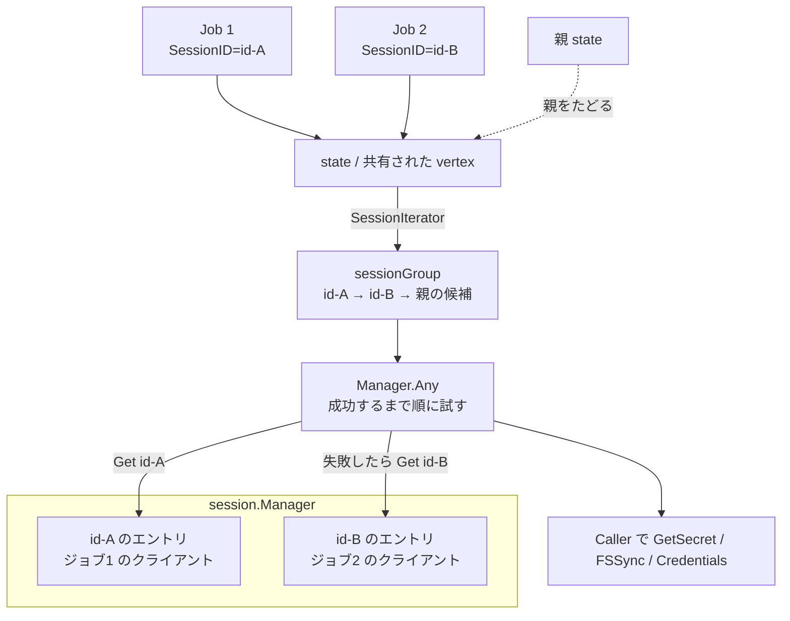

## 何を学んだか

デーモンは複数のクライアントセッションを同時に抱える。そして solver は vertex を複数ジョブ間で共有する ([ジョブ間の vertex 共有](../job-sharing/))。この 2 つが噛み合うと「この vertex はどのクライアントに問い合わせるべきか」が一意に決まらなくなる。

BuildKit の答えは、**答えを一意にしない**ことだ。ソースや ExecOp に渡されるのは `session.Caller` ではなく `session.Group` — セッション ID を順に吐くイテレータで、`Manager.Any` が「成功するものが出るまで順に試す」。同じ状態を共有するジョブが増えれば候補も増え、片方のクライアントが切断してももう片方で続行できる。

## ソースコードのどこか

### Manager が持つのは ID → 接続の表だけ

```go title="session/manager.go"
// Manager is a controller for accessing currently active sessions
type Manager struct {
	sessions        map[string]*client
	mu              sync.Mutex
	updateCondition *sync.Cond
}
```

([session/manager.go L29](https://github.com/moby/buildkit/blob/ca4838f8ddbd3612bca94bcb8a938d8a326110a3/session/manager.go#L29))

`client` は `Session` を埋め込んだうえで、デーモン側から見た gRPC クライアント接続と「クライアントが実装しているメソッドの集合」を持つ。

```go title="session/manager.go"
type client struct {
	Session
	cc        *grpc.ClientConn
	supported map[string]struct{}
}
```

外に公開されるのはこの `client` を `Caller` インターフェースで包んだもの:

```go title="session/manager.go"
// Caller can invoke requests on the session
type Caller interface {
	Context(context.Context) context.Context
	Supports(method string) bool
	Conn() *grpc.ClientConn
	SharedKey() string
}
```

([session/manager.go L15](https://github.com/moby/buildkit/blob/ca4838f8ddbd3612bca94bcb8a938d8a326110a3/session/manager.go#L15))

### 登録は `HandleConn`、解除は defer

`Controller.Session` が `grpchijack.Hijack` で得た `net.Conn` をそのまま渡してくる ([control/control.go L627](https://github.com/moby/buildkit/blob/ca4838f8ddbd3612bca94bcb8a938d8a326110a3/control/control.go#L627))。実体は非公開の `handleConn` で、ロックの受け渡しが少し変わっている。

```go title="session/manager.go"
// HandleConn handles an incoming raw connection
func (sm *Manager) HandleConn(ctx context.Context, conn net.Conn, opts map[string][]string) error {
	sm.mu.Lock()
	return sm.handleConn(ctx, conn, opts)
}

// caller needs to take lock, this function will release it
func (sm *Manager) handleConn(ctx context.Context, conn net.Conn, opts map[string][]string) error {
```

([session/manager.go L94](https://github.com/moby/buildkit/blob/ca4838f8ddbd3612bca94bcb8a938d8a326110a3/session/manager.go#L94))

呼び出し元がロックを取り、`handleConn` が解放する。もう 1 つの入口である `HandleHTTPRequest` が「ID の重複チェック → HTTP のプロトコルアップグレード → 登録」を 1 つの critical section でやりたいためだ。

`handleConn` は、ヘッダから ID と shared key を取り出し、`grpcClientConn` で逆向きの gRPC 接続を作り、`supported` を埋めてマップに入れる。

```go title="session/manager.go"
	for _, m := range opts[headerSessionMethod] {
		c.supported[strings.ToLower(m)] = struct{}{}
	}
	sm.sessions[id] = c
	sm.updateCondition.Broadcast()
	sm.mu.Unlock()

	defer func() {
		sm.mu.Lock()
		delete(sm.sessions, id)
		sm.mu.Unlock()
	}()

	<-c.ctx.Done()
	conn.Close()
	close(c.done)
```

([session/manager.go L129](https://github.com/moby/buildkit/blob/ca4838f8ddbd3612bca94bcb8a938d8a326110a3/session/manager.go#L129))

`handleConn` はセッションが死ぬまでブロックし続ける関数で、`Controller.Session` の RPC ハンドラがそのまま生存期間になっている。RPC が終わればマップからも消える。

### `Get` は「まだ来ていないセッション」を待つ

```go title="session/manager.go"
// Get returns a session by ID
func (sm *Manager) Get(ctx context.Context, id string, noWait bool) (Caller, error) {
	// session prefix is used to identify vertexes with different contexts so
	// they would not collide, but for lookup we don't need the prefix
	if p := strings.SplitN(id, ":", 2); len(p) == 2 && len(p[1]) > 0 {
		id = p[1]
	}
	// ...
	sm.mu.Lock()
	for {
		select {
		case <-ctx.Done():
			sm.mu.Unlock()
			return nil, errors.Wrapf(context.Cause(ctx), "no active session for %s", id)
		default:
		}
		var ok bool
		c, ok = sm.sessions[id]
		if (!ok || c.closed()) && !noWait {
			sm.updateCondition.Wait()
			continue
		}
		sm.mu.Unlock()
		break
	}
```

([session/manager.go L149](https://github.com/moby/buildkit/blob/ca4838f8ddbd3612bca94bcb8a938d8a326110a3/session/manager.go#L149))

2 つ読み取れることがある。

1 つめは `sync.Cond` による待ち。ビルドは「セッション確立」と「solve リクエスト」が別 RPC で走るので、solve が先に進んで local ソースに到達したときにまだセッションが登録されていない、という順序があり得る。`Get` はそれを ID 不一致エラーにせず、context がタイムアウトするまで待つ。`Any` の側は 5 秒の期限を切っている。

context のキャンセルを `Cond` に伝えるために、待機に入る前にゴルーチンを 1 つ立てて `<-ctx.Done()` で `Broadcast()` する仕掛けが入っている ([manager.go L160](https://github.com/moby/buildkit/blob/ca4838f8ddbd3612bca94bcb8a938d8a326110a3/session/manager.go#L160))。`sync.Cond` は context に対応していないので、これが定石になる。

2 つめは先頭のコメントにある `prefix:id` 形式。LLB の local ソースは `local.SessionID` にこの形式を許していて、`AttrLocalSessionID` を読むときに前半を名前のプレフィックスに、後半をセッション ID に分ける ([source/local/source.go L59](https://github.com/moby/buildkit/blob/ca4838f8ddbd3612bca94bcb8a938d8a326110a3/source/local/source.go#L59))。「同じディレクトリ名だが別のコンテキスト」を持つ vertex がキャッシュキー上で衝突しないようにするための細工で、ルックアップの段ではプレフィックスを捨てる。

### Attachable — クライアントが何を差し出すか

クライアント側で 1 つのセッションに機能を足す口はこれだけだ。

```go title="session/session.go"
// Attachable defines a feature that can be exposed on a session
type Attachable interface {
	Register(*grpc.Server)
}

// ...

// Allow enables a given service to be reachable through the grpc session
func (s *Session) Allow(a Attachable) {
	a.Register(s.grpcServer)
}
```

([session/session.go L33](https://github.com/moby/buildkit/blob/ca4838f8ddbd3612bca94bcb8a938d8a326110a3/session/session.go#L33))

`filesync.NewFSSyncProvider` / `secretsprovider.NewSecretProvider` / `sshprovider.NewSSHAgentProvider` / `authprovider.NewDockerAuthProvider` はすべて `session.Attachable` を返す。追加された gRPC サービスは `Session.Run` の中で `GetServiceInfo()` から自動的に列挙され、メソッド一覧としてデーモンに申告される。新しい機能を足すのに、能力ネゴシエーションのコードを別途書く必要がない。

### Group — 「どのセッションか」を後回しにする

```go title="session/group.go"
type Group interface {
	SessionIterator() Iterator
}
type Iterator interface {
	NextSession() string
}

func NewGroup(ids ...string) Group {
	return &group{ids: ids}
}
```

([session/group.go L14](https://github.com/moby/buildkit/blob/ca4838f8ddbd3612bca94bcb8a938d8a326110a3/session/group.go#L14))

そして消費側は `Manager.Any` を通す。

```go title="session/group.go"
func (sm *Manager) Any(ctx context.Context, g Group, f func(context.Context, string, Caller) error) error {
	// ...
	var lastErr error
	for {
		id := iter.NextSession()
		if id == "" {
			if lastErr != nil {
				return lastErr
			}
			return errors.WithStack(ErrNoActiveSessions)
		}

		timeoutCtx, cancel := context.WithCancelCause(ctx)
		timeoutCtx, _ = context.WithTimeoutCause(timeoutCtx, 5*time.Second, errors.WithStack(context.DeadlineExceeded))
		defer func() { cancel(errors.WithStack(context.Canceled)) }()
		c, err := sm.Get(timeoutCtx, id, false)
		if err != nil {
			lastErr = err
			continue
		}
		if err := f(c.Context(ctx), id, c); err != nil {
			lastErr = err
			continue
		}
		return nil
	}
}
```

([session/group.go L59](https://github.com/moby/buildkit/blob/ca4838f8ddbd3612bca94bcb8a938d8a326110a3/session/group.go#L59))

「候補を順に試し、最初に成功したところで止める。全部だめなら最後のエラーを返す。候補が 0 個なら `ErrNoActiveSessions`」というだけの関数だが、これが secret 取得・SSH 転送・レジストリ認証・local ファイル転送のすべての入口になっている。

`ErrNoActiveSessions` を専用のエラー値にしているのは、呼び出し側で「セッションが無い」と「セッションはあるが失敗した」を区別したいからだ。レジストリ認証は前者を「認証情報なし = 匿名アクセス」として無視する ([util/resolver/authorizer.go L198](https://github.com/moby/buildkit/blob/ca4838f8ddbd3612bca94bcb8a938d8a326110a3/util/resolver/authorizer.go#L198))。

### 候補集合はどこから来るか

`session.NewGroup(id)` を使う場所は「クライアントが 1 人に決まっている」ケース (エクスポータ、gateway フロントエンドの解決) だ。solver の内部では、候補が動的に決まる。

```go title="solver/jobs.go"
func (s *state) SessionIterator() session.Iterator {
	return s.sessionIterator()
}

func (s *state) sessionIterator() *sessionGroup {
	return &sessionGroup{state: s, visited: map[string]struct{}{}}
}
```

([solver/jobs.go L134](https://github.com/moby/buildkit/blob/ca4838f8ddbd3612bca94bcb8a938d8a326110a3/solver/jobs.go#L134))

`state` は「1 つの vertex ダイジェストに対応する共有状態」で、それ自身が `session.Group` になっている。イテレータは 3 段階で候補を出す。

```go title="solver/jobs.go"
func (g *sessionGroup) NextSession() string {
	if g.mode == 0 {
		g.mu.Lock()
		for j := range g.jobs {
			if j.SessionID != "" {
				if _, ok := g.visited[j.SessionID]; ok {
					continue
				}
				g.visited[j.SessionID] = struct{}{}
				g.mu.Unlock()
				return j.SessionID
			}
		}
		g.mu.Unlock()
		g.mode = 1
	}
	if g.mode == 1 {
		// ... g.state.parents を辿って親 state のイテレータを積む
		g.mode = 2
	}

	for {
		if len(g.parents) == 0 {
			return ""
		}
		p := g.parents[0]
		id := p.NextSession()
		if id != "" {
			return id
		}
		g.parents = g.parents[1:]
	}
}
```

([solver/jobs.go L149](https://github.com/moby/buildkit/blob/ca4838f8ddbd3612bca94bcb8a938d8a326110a3/solver/jobs.go#L149))

- `mode == 0`: この state に現在ぶら下がっている**すべてのジョブ**のセッション ID
- `mode == 1`: 親 state (この vertex を入力として使っている vertex) のイテレータを集める
- `mode == 2`: 親のイテレータを順に消費する

`visited` マップは親と共有される (`gg.visited = g.visited`) ので、同じセッション ID が 2 度返ることはない。



`job-sharing` で見たとおり、同じ内容の vertex は 1 つの `state` に集約される。その `state` がそのままセッション候補の集合になっているので、「ジョブが増える = 候補が増える」が自動的に成り立つ。

### セッションが切れたとき

切断の扱いは 2 段構えになっている。

第 1 段は `contextWithCaller`。`Caller.Context(ctx)` は、リクエストの context とセッションの context の**どちらかが終わったら終わる** context を返す。

```go title="session/context.go"
// contextWithCaller returns a context that is canceled when either the request
// context is done or the session context is closed.
func contextWithCaller(ctx context.Context, callerCtx context.Context) context.Context {
	ctx, cancel := context.WithCancelCause(ctx)
	context.AfterFunc(callerCtx, func() {
		cause := context.Cause(callerCtx)
		if cause == nil {
			cause = context.Canceled
		}
		cancel(cause)
	})
	return ctx
}
```

([session/context.go L7](https://github.com/moby/buildkit/blob/ca4838f8ddbd3612bca94bcb8a938d8a326110a3/session/context.go#L7))

クライアントが Ctrl-C で消えると、進行中の `FSSync` や `GetSecret` は即座にキャンセルされる。

第 2 段は `Any` のループそのもの。`f` がエラーを返せば次の候補に進むので、候補のうち 1 つが死んでいてももう 1 つで完了できる。`Get` の中で `c.closed()` を見ているのも同じ狙いで、マップにはまだ残っているが context が終わっているセッションは「無い」ものとして扱い、次の登録を待つ。

ただし SSH マウントだけは事情が違う。ソケットが生き続ける必要があるため、途中で切れた場合は candidate をずらすのではなく exec ごとやり直す前提になっている。

```go title="solver/llbsolver/mounts/mount.go"
	// because ssh socket remains active, to actually handle session disconnecting ssh error
	// should restart the whole exec with new session
	return &sshMount{mount: m, caller: caller, idmap: mm.cm.IdentityMapping()}, nil
```

([solver/llbsolver/mounts/mount.go L177](https://github.com/moby/buildkit/blob/ca4838f8ddbd3612bca94bcb8a938d8a326110a3/solver/llbsolver/mounts/mount.go#L177))

### `Caller` はキャッシュされないが、その結果はされる

`Manager` は毎回マップから引くだけで、`Caller` 自体をキャッシュする層はない。キャッシュがあるのは 1 つ上、レジストリ認証の側だ。

```go title="util/resolver/authorizer.go"
func (a *authHandlerNS) set(host, session string, f *authFetcher) {
	a.fetchers[host+"/"+session] = f
}
```

([util/resolver/authorizer.go L107](https://github.com/moby/buildkit/blob/ca4838f8ddbd3612bca94bcb8a938d8a326110a3/util/resolver/authorizer.go#L107))

キーが `host + "/" + sessionID` になっている点が肝で、「レジストリ X に対する認証状態」はセッションごとに分けて持たれる。クライアント A の認証情報で取ったトークンをクライアント B が使い回すことはない。同時に、同じホストの別セッション用エントリが既にあれば `VerifyTokenAuthority` で「同じ認証主体か」を確かめて使い回す経路も用意されている ([authorizer.go L85](https://github.com/moby/buildkit/blob/ca4838f8ddbd3612bca94bcb8a938d8a326110a3/util/resolver/authorizer.go#L85))。この判定については [認証情報はクライアントから出ない](../auth-delegation/) で扱う。

## なぜそうなっているか

vertex は共有されるがセッションは共有されない。この非対称性が設計を決めている。

同じ `RUN --mount=type=secret,id=token ...` を 2 つのビルドが同時に走らせたとき、solver は片方しか実行しない。実行される側は「どちらのクライアントの token を使うか」を選ばなければならない。ここで最初にジョブを登録した方に固定してしまうと、そのクライアントが Ctrl-C で消えた瞬間、生き残っている方のビルドも巻き添えで失敗する。

`Group` を渡す形にすれば、この問題が「順に試す」に還元される。しかも `Any` の中で `Get` が `sync.Cond` で待つので、「まだ繋がっていないセッション」も候補として機能する。

副作用として、**どのクライアントの secret が使われたかは非決定的になる**。これは意図的に受け入れられている設計上のトレードオフで、だからこそ secret の値はキャッシュキーに一切入らない ([secret が snapshot に残らない理由](../secrets-and-ssh/))。値がキーに入っていたら、候補の選択順が変わるだけでキャッシュヒットが変わってしまう。

`Attachable` が `Register(*grpc.Server)` の 1 メソッドしかないのも同じ思想だ。「セッションで提供できる機能」の一覧をどこかに列挙するのではなく、gRPC サーバに登録された事実そのものを能力の申告にする。`GetServiceInfo()` が使えるので、列挙は grpc-go に任せられる。

## どう活かすか

- **「どのバックエンドか」が一意に決まらないなら、決めずにイテレータを渡す。** `Caller` ではなく `Group` を引数にしただけで、切断耐性と複数クライアント対応が同時に手に入っている。呼び出し側は `Any` を通すだけで、順序も再試行も意識しない。
- **「無い」と「失敗した」を別のエラーにする。** `ErrNoActiveSessions` があるおかげで、レジストリ認証は「認証情報を持つクライアントが誰もいない = 匿名で行く」を正しく判断できる。両方を同じエラーにすると、この分岐を書く場所がなくなる。
- **`sync.Cond` を使うなら、context キャンセル用の `Broadcast` ゴルーチンを必ず添える。** `Cond.Wait()` は context を見ないので、待機に入る前に `go func() { <-ctx.Done(); cond.Broadcast() }()` を立てるのが定石になる。
- **能力ネゴシエーションは既存のレジストリから導出する。** 対応メソッド一覧を手書きで管理せず、gRPC サーバの `GetServiceInfo()` から生成すれば、機能追加時に更新漏れが起きない。
- **キャッシュのキーに「誰の権限で取ったか」を含める。** `host + "/" + sessionID` という素朴なキーが、認証情報のクライアント間漏洩を構造的に防いでいる。
