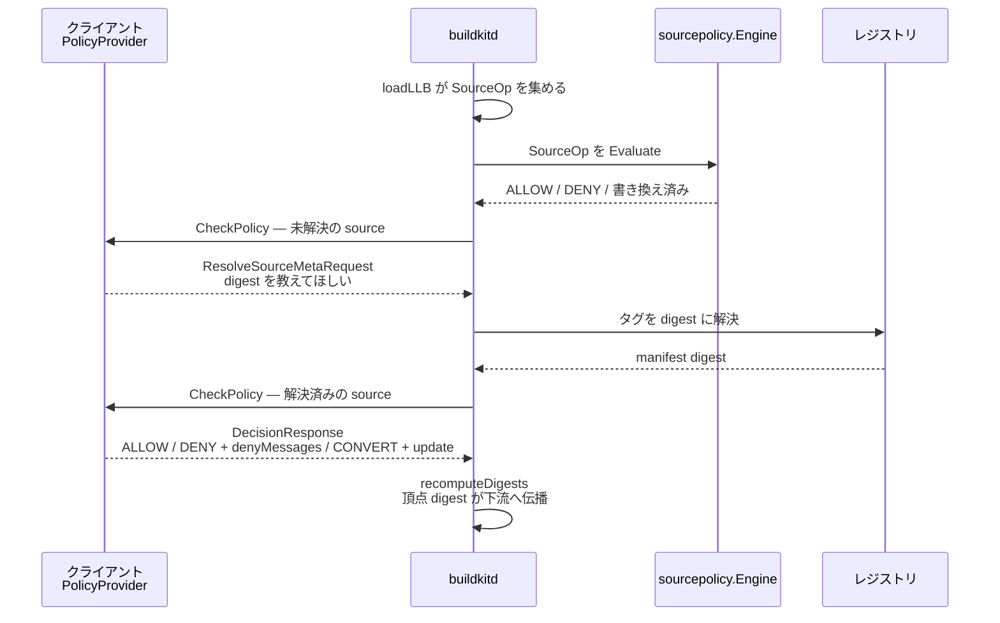

## 何を学んだか

`sourcepolicy` は、ビルド定義に含まれる**ソース参照だけ**を対象にした小さなルールエンジンだ。`docker.io/library/alpine:latest` を拒否する、`docker.io/*` を社内ミラーに書き換える、`git://` を特定ホストに限る、といった運用がこれで書ける。

面白いのは適用のタイミングと場所だ。ポリシーは実行時のフックではなく、**LLB を solver にロードする瞬間**に適用される。書き換えは `pb.SourceOp` の中身を直接いじり、そのあと頂点 digest が再計算されて DAG 全体に伝播する。だから書き換えの結果は、キャッシュキーにもプロベナンスにも自動的に反映される。ポリシー適用を「実行の直前に差し込む横断的関心事」ではなく「定義の変換」として置いたことで、後段が何も知らなくてよくなっている。

## ルールの形

ポリシーは proto で定義された `Rule` の並びで、JSON として `buildctl --source-policy-file` から渡す。

```proto title="sourcepolicy/pb/policy.proto"
// Rule defines the action(s) to take when a source is matched
message Rule {
	PolicyAction action = 1;
	Selector selector = 2;
	Update updates = 3;
}

// Update contains updates to the matched build step after rule is applied
message Update {
	string identifier = 1;
	map<string, string> attrs = 2;
}

// Selector identifies a source to match a policy to
message Selector {
	string identifier = 1;
	// MatchType is the type of match to perform on the source identifier
	MatchType match_type = 2;
	repeated AttrConstraint constraints = 3;
}
```

([sourcepolicy/pb/policy.proto](https://github.com/moby/buildkit/blob/ca4838f8ddbd3612bca94bcb8a938d8a326110a3/sourcepolicy/pb/policy.proto))

`PolicyAction` は `ALLOW` / `DENY` / `CONVERT` の 3 つ。`MatchType` は `WILDCARD` (既定) / `EXACT` / `REGEX`、属性の照合条件 `AttrMatch` は `EQUAL` / `NOTEQUAL` / `MATCHES` だ。

`identifier` は `docker-image://docker.io/library/alpine:latest` のようなスキーム付きの文字列で、[LLB の SourceOp](../llb-definition/) がそのまま持っている値と同じ形をしている。`attrs` は同じ SourceOp の属性 — `image.recordtype`、`git.keepgitdir` などが入る。

エンジンは `Selector` を `MatchType + Identifier` でキャッシュし、コンパイル済みの regex / wildcard を使い回す。

```go title="sourcepolicy/engine.go"
func (e *Engine) selectorCache(src *spb.Selector) *selectorCache {
	key := src.MatchType.String() + " " + src.Identifier
	// ...
}
```

([sourcepolicy/engine.go L43-L55](https://github.com/moby/buildkit/blob/ca4838f8ddbd3612bca94bcb8a938d8a326110a3/sourcepolicy/engine.go#L43-L55))

## マッチは制約が先、識別子が後

`match` はまず `AttrConstraint` を全部見て、1 つでも外れたらマッチしないと判断する。制約は AND だ。

```go title="sourcepolicy/matcher.go"
	for _, c := range constraints {
		// ...
		switch c.Condition {
		case spb.AttrMatch_EQUAL:
			if attrs[c.Key] != c.Value {
				return false, nil
			}
		// NOTEQUAL / MATCHES も同様に、外れたら即 false
		}
	}
```

([sourcepolicy/matcher.go L11-L36](https://github.com/moby/buildkit/blob/ca4838f8ddbd3612bca94bcb8a938d8a326110a3/sourcepolicy/matcher.go#L11-L36))

そのあと識別子を見る。ここで先に**完全一致を試す**のがポイントで、`MatchType` が何であろうと文字列が一致すればマッチ扱いになる。

```go title="sourcepolicy/matcher.go"
	if src.Identifier == ref {
		return true, nil
	}

	switch src.MatchType {
	case spb.MatchType_EXACT:
		return false, nil
	case spb.MatchType_REGEX:
		// ...
	case spb.MatchType_WILDCARD:
		// ...
	}
```

([sourcepolicy/matcher.go L38-L57](https://github.com/moby/buildkit/blob/ca4838f8ddbd3612bca94bcb8a938d8a326110a3/sourcepolicy/matcher.go#L38-L57))

proto のコメントもそう書いている — `WILDCARD` は「まず完全一致を試し、次にワイルドカード一致を試す」。これは `CONVERT` の停止条件と直結する。書き換え先の identifier が selector に完全一致していれば、再評価したときにまた同じ規則にマッチしてしまうが、`mutate` 側で「変化がなければ mutated=false」と判定されるのでループにならない。

## 書き換えとマッチグループ

`CONVERT` の実体は `mutate` にある。`Updates.Identifier` が空なら selector の identifier をそのまま使い、`selector.Format` に通してから代入する。

```go title="sourcepolicy/mutate.go"
	dest := rule.Updates.Identifier
	if dest == "" {
		dest = rule.Selector.Identifier
	}
	dest, err := selector.Format(ref, dest)
	// ...
	var mutated bool
	if op.Identifier != dest && dest != "" {
		mutated = true
		op.Identifier = dest
	}
```

([sourcepolicy/mutate.go L19-L34](https://github.com/moby/buildkit/blob/ca4838f8ddbd3612bca94bcb8a938d8a326110a3/sourcepolicy/mutate.go#L19-L34))

`Format` が `MatchType` ごとに違う置換を行う。ワイルドカードなら `${1}` で捕捉部分を参照でき、regex なら `ReplaceAllString` の記法がそのまま使える。

```go title="sourcepolicy/formatter.go"
// Format formats the provided ref according to the match/type of the source.
//
// For example, if the source is a wildcard, the ref will be formatted with the wildcard in the source replacing the parameters in the destination.
//
//	matcher: wildcard source: "docker.io/library/golang:*"  match: "docker.io/library/golang:1.19" format: "docker.io/library/golang:${1}-alpine" result: "docker.io/library/golang:1.19-alpine"
func (s *selectorCache) Format(match, format string) (string, error) {
```

([sourcepolicy/formatter.go L34-L39](https://github.com/moby/buildkit/blob/ca4838f8ddbd3612bca94bcb8a938d8a326110a3/sourcepolicy/formatter.go#L34-L39))

`attrs` の更新も同じ関数で行われる。`image.recordtype` や `http.checksum` のような属性を後付けできるので、「pin されていないタグを許すが、必ず digest を記録させる」といった使い方ができる。

## 評価順序と停止条件

`evaluatePolicy` の規則が独特だ。ALLOW / DENY は**最後にマッチしたものが勝つ**。

```go title="sourcepolicy/engine.go"
// evaluatePolicy evaluates a single policy against a source operation.
// If the source is mutated the policy is short-circuited and `true` is returned.
// If the source is denied, an error will be returned.
//
// For Allow/Deny rules, the last matching rule wins.
// E.g. `ALLOW foo; DENY foo` will deny `foo`, `DENY foo; ALLOW foo` will allow `foo`.
```

([sourcepolicy/engine.go L109-L114](https://github.com/moby/buildkit/blob/ca4838f8ddbd3612bca94bcb8a938d8a326110a3/sourcepolicy/engine.go#L109-L114))

ループの中では `deny` フラグを立てたり下ろしたりするだけで、判定はループを抜けてから行う。一方 `CONVERT` は違って、実際に書き換えが起きた時点で**そのポリシーの評価を打ち切って呼び出し元に戻る**。

```go title="sourcepolicy/engine.go"
		case spb.PolicyAction_CONVERT:
			mut, err := mutate(ctx, srcOp, rule, selector, ident)
			if err != nil || mut {
				return mut, errors.Wrap(err, "error mutating source policy")
			}
```

([sourcepolicy/engine.go L146-L150](https://github.com/moby/buildkit/blob/ca4838f8ddbd3612bca94bcb8a938d8a326110a3/sourcepolicy/engine.go#L146-L150))

戻った先の `Evaluate` が、書き換え後の identifier でポリシーを**最初から**評価し直す。書き換えた結果が別の規則の対象になることを認めているわけで、ミラーへの書き換えとタグの固定を別々の規則として書ける。当然無限ループの危険があるので、回数の上限が置かれている。

```go title="sourcepolicy/engine.go"
	var mutated bool
	const maxIterr = 20

	for i := 0; ; i++ {
		if i > maxIterr {
			return mutated, errors.Wrapf(ErrTooManyOps, "too many mutations on a single source")
		}
```

([sourcepolicy/engine.go L69-L75](https://github.com/moby/buildkit/blob/ca4838f8ddbd3612bca94bcb8a938d8a326110a3/sourcepolicy/engine.go#L69-L75))

拒否は `ErrSourceDenied`、反復の打ち切りは `ErrTooManyOps` ([sourcepolicy/engine.go L14-L20](https://github.com/moby/buildkit/blob/ca4838f8ddbd3612bca94bcb8a938d8a326110a3/sourcepolicy/engine.go#L14-L20))。

## 適用点は LLB のロード時

適用は `loadLLB` の中にある。定義をパースしながら SourceOp を持つ頂点だけを集めておき、それらに対してだけ並列にポリシーを評価する。

```go title="solver/llbsolver/vertex.go"
	if polEngine != nil && len(sources) > 0 {
		var eg errgroup.Group
		for dgst := range sources {
			eg.Go(func() error {
				op := allOps[dgst]
				if _, err := polEngine.Evaluate(ctx, op.Op); err != nil {
					return errors.Wrap(err, "error evaluating the source policy")
				}
				return nil
			})
		}
		if err := eg.Wait(); err != nil {
			return solver.Edge{}, err
		}
	}
```

([solver/llbsolver/vertex.go L396-L409](https://github.com/moby/buildkit/blob/ca4838f8ddbd3612bca94bcb8a938d8a326110a3/solver/llbsolver/vertex.go#L396-L409))

`op.Op` はポインタなので、`Evaluate` が書き換えた内容はそのまま `allOps` に残る。そして直後に `recomputeDigests` が走る。

```go title="solver/llbsolver/vertex.go"
	dt, err := op.Marshal()
	// ...
	newDgst := digest.FromBytes(dt)
	if newDgst != dgst {
		all[newDgst] = op
		delete(all, dgst)
	}
	visited[dgst] = newDgst
	return newDgst, nil
```

([solver/llbsolver/vertex.go L329-L343](https://github.com/moby/buildkit/blob/ca4838f8ddbd3612bca94bcb8a938d8a326110a3/solver/llbsolver/vertex.go#L329-L343))

再帰的に入力の digest を先に確定させてから自分を再 marshal するので、書き換えられたソース頂点の digest が変わると、それを入力に持つ頂点の digest も連鎖的に変わる。[LLB の digest がそのまま頂点 ID](../llb-definition/) であり、[fast cache のキーが定義から決まる](../fast-slow-cache/)以上、**書き換え後の identifier がキャッシュキーに入る**。ミラーへ書き換えたビルドと書き換えないビルドがキャッシュを共有することはない。

適用前に identifier を正規化しているのも重要な細部だ。ワーカーの `ParseSource` を通して `docker-image://docker.io/library/alpine:latest` のような正規形に直してからマッチにかける。

```go title="solver/llbsolver/policy.go"
func normalizedSourceIdentifier(w worker.Worker, op *pb.SourceOp) string {
	if w == nil {
		return op.GetIdentifier()
	}
	id, err := w.ParseSource(op, nil)
	if err != nil {
		return op.GetIdentifier()
	}
	return id.String()
}
```

([solver/llbsolver/policy.go L36-L45](https://github.com/moby/buildkit/blob/ca4838f8ddbd3612bca94bcb8a938d8a326110a3/solver/llbsolver/policy.go#L36-L45))

これがないと `alpine` と `docker.io/library/alpine:latest` を別のものとして扱ってしまい、ポリシーの穴になる。

適用箇所はもう 1 つあって、フロントエンドが `ResolveImageConfig` でイメージを解決するときにも同じエンジンを通す ([solver/llbsolver/bridge.go L282-L303](https://github.com/moby/buildkit/blob/ca4838f8ddbd3612bca94bcb8a938d8a326110a3/solver/llbsolver/bridge.go#L282-L303))。Dockerfile の `FROM` は LLB になる前にまずタグを digest へ解決するので、そこを塞がないと拒否したはずのイメージの config を読めてしまう。

ポリシーはジョブの値として保存され、`EachValue` で集められる。[ジョブが共有された](../job-sharing/)ときは全ジョブのポリシーが連結されて評価される。

([solver/llbsolver/policy.go L254-L273](https://github.com/moby/buildkit/blob/ca4838f8ddbd3612bca94bcb8a938d8a326110a3/solver/llbsolver/policy.go#L254-L273))

## 判定をクライアントに投げ返す

固定ルールでは書けないポリシー — 脆弱性データベースに問い合わせる、署名を検証する — のために、判定そのものをセッション越しに委譲する経路がある。

```proto title="sourcepolicy/policysession/policysession.proto"
service PolicyVerifier {
	rpc CheckPolicy(CheckPolicyRequest) returns (CheckPolicyResponse);
}

message CheckPolicyResponse {
	oneof result {
		DecisionResponse decision = 1;
		moby.buildkit.v1.frontend.ResolveSourceMetaRequest request = 2;
	}
}
```

([sourcepolicy/policysession/policysession.proto](https://github.com/moby/buildkit/blob/ca4838f8ddbd3612bca94bcb8a938d8a326110a3/sourcepolicy/policysession/policysession.proto))

サーバはデーモンではなくクライアント側にいる。[セッションの逆向き gRPC](../grpchijack/) を使って、デーモンがクライアントの `PolicyVerifier` を呼ぶ。

レスポンスが `oneof` になっているのが設計の中心だ。検証側は「判定した」だけでなく「判定するのに情報が足りない、これを解決してくれ」と返せる。デーモンは要求されたメタデータ解決 (タグ → digest、git ref → commit、HTTP のチェックサム) を実行して、結果を添えてもう一度聞き直す。

```go title="solver/llbsolver/policy.go"
		metareq := resp.GetRequest()
		if metareq != nil {
			// ...
			resp, err := p.resolveSourceMetadata(ctx, metareq.Source, op, false)
			if err != nil {
				return false, errors.Wrap(err, "error resolving source metadata from policy request")
			}
			req.Source = gateway.ToPBResolveSourceMetaResponse(resp)
			continue
		}
```

([solver/llbsolver/policy.go L96-L155](https://github.com/moby/buildkit/blob/ca4838f8ddbd3612bca94bcb8a938d8a326110a3/solver/llbsolver/policy.go#L96-L155))

このやり取りには**別の上限**が置かれている。エンジン内の `maxIterr = 20` とは独立に、セッション往復は 10 回までだ。

```go title="solver/llbsolver/policy.go"
func (p *policyEvaluator) Evaluate(ctx context.Context, op *pb.Op) (bool, error) {
	return p.evaluate(ctx, op, 10)
}
```

([solver/llbsolver/policy.go L47-L49](https://github.com/moby/buildkit/blob/ca4838f8ddbd3612bca94bcb8a938d8a326110a3/solver/llbsolver/policy.go#L47-L49))

さらに、検証側が解決を要求するときに identifier や attrs をこっそりすり替えられないよう、リクエストの内容が元と一致するかを毎回検査する。

```go title="solver/llbsolver/policy.go"
			if metareq.Source.Identifier != source.Identifier {
				return false, errors.Errorf("policy requested different source identifier: %q != %q", metareq.Source.Identifier, source.Identifier)
			}
			if err := mapsEqual(source.Attrs, metareq.Source.Attrs); err != nil {
				return false, errors.Wrap(err, "policy requested different source attrs")
			}
```

([solver/llbsolver/policy.go L101-L106](https://github.com/moby/buildkit/blob/ca4838f8ddbd3612bca94bcb8a938d8a326110a3/solver/llbsolver/policy.go#L101-L106))

拒否のときは理由の文字列を複数返せて、[typed error](../grpc-errors/) に載ってクライアントまで届く。

```go title="sourcepolicy/policysession/denyerror.go"
// WrapDenyMessages adds deny messages to an error when available.
func WrapDenyMessages(err error, msgs []*DenyMessage) error {
	if err == nil || len(msgs) == 0 {
		return err
	}
	return &DenyMessagesError{Messages: msgs, error: err}
}
```

([sourcepolicy/policysession/denyerror.go L32-L38](https://github.com/moby/buildkit/blob/ca4838f8ddbd3612bca94bcb8a938d8a326110a3/sourcepolicy/policysession/denyerror.go#L32-L38))



`CapSourcePolicy` と `CapSourcePolicySession` はどちらも [apicaps](../apicaps/) 上で `CapStatusExperimental` として登録されている ([solver/pb/caps.go L636-L646](https://github.com/moby/buildkit/blob/ca4838f8ddbd3612bca94bcb8a938d8a326110a3/solver/pb/caps.go#L636-L646))。

## プロベナンスとの関係

ポリシーの適用結果は、`SourceOp` を書き換えることで [provenance](../provenance/) に反映される。provenance のソース収集は各 source の `identifier` から行われる (`source/containerimage/identifier.go`、`source/git/identifier.go` の `Capture`) ので、記録されるのは**書き換え後**の値だ。ミラーに向けたビルドの provenance には、元の `docker.io/...` ではなくミラーの URL が載る。

一方、「どの規則が適用されたか」を provenance に記録する仕組みは実装されていない。ポリシーの適用は定義の変換として吸収されており、変換の履歴は残らない。監査で「なぜこのソースになったか」を追う必要があるなら、ポリシー自体をバージョン管理して別途保存する側に責任がある。

## なぜそうなっているか

ポリシーを「実行の直前に拒否するフック」ではなく「定義の変換」として置いたことで、後段のすべてが素直になる。

- **キャッシュ**は何も変えなくてよい。書き換えは digest を変え、digest はキャッシュキーになるので、ポリシーごとにキャッシュが自然に分離する。もし実行直前に書き換えていたら、同じキャッシュキーで違う実体を指す結果が生まれる。
- **provenance** も何も変えなくてよい。書き換え後の定義だけを見ればよい。
- **拒否**はロードが失敗するだけなので、部分的に実行が進んでから止まる、という状態が存在しない。

`CONVERT` の後に再評価する設計は、規則を小さく分けて書けるようにするためだ。「レジストリを差し替える」規則と「タグを固定する」規則を独立に書いて、両方が順に適用される。その代償が停止性の喪失で、だから 20 回という上限が置かれている。安全側に倒すなら不動点計算を諦めて 1 回だけ適用する手もあるが、それだと規則の合成ができない。

セッション経由の検証で `oneof` を使い、デーモン側にメタデータ解決を代行させているのは、クライアントにレジストリ資格情報やネットワーク到達性を要求しないためだ。[認証情報の委譲](../auth-delegation/)と同じで、「デーモンが持っている能力をクライアントに貸す」形になっている。そのうえで identifier と attrs の一致検査を入れているのは、この貸し出しがデーモンを踏み台にした任意のレジストリアクセスにならないようにするためだ。

## どう活かすか

- **ポリシーは「実行を止める」より「入力を書き換える」方が扱いやすい。** 拒否は運用者に対応を強いるが、書き換えはビルドが通ったまま目的を達する。ミラー強制、タグの digest 固定、プロキシ経由の強制はどれも書き換えで表現できる。
- **書き換えた結果がキーに入る位置で書き換える。** 実行の直前ではなく定義の段階で変換すれば、キャッシュ・監査・再現性が勝手についてくる。逆に、キーの計算より後で入力を変える設計は、いつか必ずキャッシュの不整合として表面化する。
- **マッチ対象は必ず正規化してからマッチする。** `alpine` と `docker.io/library/alpine:latest` が同じものだと知っているのはドメイン側のパーサだけだ。文字列一致でポリシーを書くなら、正規化を通すのを構造的に強制する。
- **規則の合成を認めるなら反復回数の上限を置く。** 「書き換えた結果を再評価する」は表現力を上げるが停止しなくなる。上限とその上限に達したときの専用エラーをセットで用意する。
- **判定の委譲は `oneof` で「まだ判定できない」を表現できるようにする。** 単純な「判定を返す RPC」にすると、呼ばれた側は自力で情報を集めるしかなく、権限とネットワークを二重に持つことになる。追加情報の要求を返せる形にすれば、能力は呼ぶ側に置いたままにできる。
