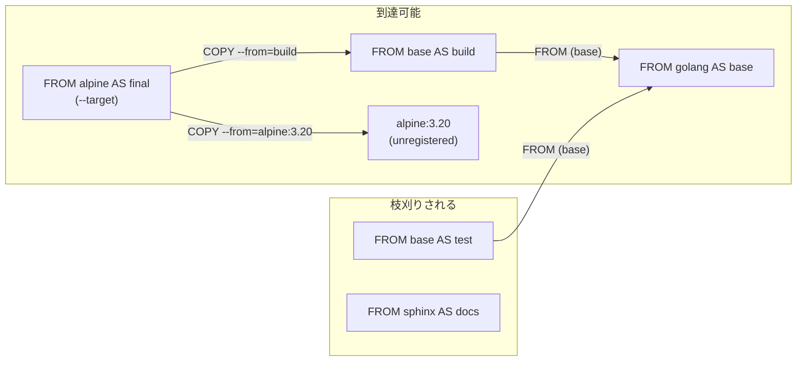

## 何を学んだか

BuildKit は Dockerfile のステージ列を、まず**ステージを頂点とするグラフ**に変換する。辺は 3 種類しかない。`FROM <stage>` (ベース)、`COPY --from=<stage>`、`RUN --mount=from=<stage>` だ。

そのうえで、`--target` で指定されたステージから**到達できる頂点だけ**を処理する。到達不能なステージは、命令が dispatch されないだけでなく、**ベースイメージのマニフェストすら引かれない**。存在しないイメージを `FROM` に書いたステージが Dockerfile に混ざっていても、そのステージを使わない限りビルドは通る。

到達判定は 2 か所で使われる。DFS で辺を逆にたどらず、素直に「ターゲットから出る辺」を再帰的にたどるだけの 12 行の関数だ。

## ソースコードのどこか

### 辺の張り方 — toCommand が sources を返す

グラフの構築はフェーズ 6 (`buildStageDependencyGraph`) で行われる。各ステージの各命令を `toCommand` に通し、返ってきた `sources` を `deps` に登録する。

```go title="frontend/dockerfile/dockerfile2llb/convert.go"
func (dctx *dispatchContext) buildStageDependencyGraph() error {
	for _, d := range dctx.allDispatchStates.states {
		d.commands = make([]command, len(d.stage.Commands))
		for i, cmd := range d.stage.Commands {
			newCmd, err := toCommand(cmd, dctx.allDispatchStates, dctx.shlex)
			// ...
			d.commands[i] = newCmd
			for _, src := range newCmd.sources {
				if src != nil {
					d.deps[src] = cmd
					if src.unregistered {
						dctx.allDispatchStates.addState(src)
					}
				}
			}
		}
	}

	if err := validateCircularDependency(dctx.allDispatchStates.states); err != nil {
		return err
	}
	// ...
}
```

([convert.go L518-L546](https://github.com/moby/buildkit/blob/ca4838f8ddbd3612bca94bcb8a938d8a326110a3/frontend/dockerfile/dockerfile2llb/convert.go#L518-L546))

`FROM <stage>` の辺は、ここではなく `dispatchStates.addState` の中で張られている。ステージを登録するとき、そのベース名が既に登録済みのステージ名と一致したら `base` フィールドに刺す。

```go title="frontend/dockerfile/dockerfile2llb/convert.go"
func (dss *dispatchStates) addState(ds *dispatchState) {
	dss.states = append(dss.states, ds)

	if d, ok := dss.statesByName[ds.stage.BaseName]; ok {
		ds.base = d
		ds.outline = d.outline.clone()
	}
	if ds.stage.Name != "" {
		dss.statesByName[strings.ToLower(ds.stage.Name)] = ds
	}
}
```

([convert.go L1249](https://github.com/moby/buildkit/blob/ca4838f8ddbd3612bca94bcb8a938d8a326110a3/frontend/dockerfile/dockerfile2llb/convert.go#L1249))

`statesByName` のキーは `strings.ToLower` されている。**ステージ名は大文字小文字を区別しない。**そして登録は自分を追加した後に行われるので、`FROM x AS x` のような自己参照はこの時点では解決されない (直前までに同名のステージがなければ、外部イメージ `x` として扱われる)。

`COPY --from=` は `toCommand` が処理する。数値なら添字、そうでなければ名前で引く。

```go title="frontend/dockerfile/dockerfile2llb/convert.go"
		var stn *dispatchState
		index, err := strconv.Atoi(c.From)
		if err != nil {
			stn, ok = allDispatchStates.findStateByName(c.From)
			if !ok {
				stn = &dispatchState{
					stage:        instructions.Stage{BaseName: c.From, Location: c.Location()},
					// ...
					unregistered: true,
				}
			}
		} else {
			stn, err = allDispatchStates.findStateByIndex(index)
			// ...
		}
		cmd.sources = []*dispatchState{stn}
```

([convert.go L953-L971](https://github.com/moby/buildkit/blob/ca4838f8ddbd3612bca94bcb8a938d8a326110a3/frontend/dockerfile/dockerfile2llb/convert.go#L953-L971))

名前が既存ステージに当たらなかった場合は、`unregistered: true` の `dispatchState` がその場で作られる。`COPY --from=alpine:3.20 /bin/busybox /` のような**外部イメージからの COPY** は、内部的には「Dockerfile に書かれていない匿名ステージ」として表現される。これが `buildStageDependencyGraph` の中で `addState` され、以降は普通のステージと同じ扱いになる。

`--from` の値には**変数展開が効かない**ことが明示的にエラーになっている。

```go title="frontend/dockerfile/dockerfile2llb/convert.go"
			if res.Result != c.From {
				return command{}, errors.Errorf("variable expansion is not supported for --from, define a new stage with FROM using ARG from global scope as a workaround")
			}
```

([convert.go L950](https://github.com/moby/buildkit/blob/ca4838f8ddbd3612bca94bcb8a938d8a326110a3/frontend/dockerfile/dockerfile2llb/convert.go#L950))

エラーメッセージ自体が回避策 (グローバル `ARG` を使って `FROM` で新しいステージを定義する) を教えている。展開を許すと、依存グラフの形がステージのローカル環境変数に依存することになり、フェーズ 6 の時点でグラフを確定できなくなる。

`RUN --mount=from=` は `detectRunMount` が扱う ([convert_runmount.go L16](https://github.com/moby/buildkit/blob/ca4838f8ddbd3612bca94bcb8a938d8a326110a3/frontend/dockerfile/dockerfile2llb/convert_runmount.go#L16))。`from` が空のマウントは `scratch` を指すものとして扱われる。コメントが「tmpfs のように実体のあるソースを持たない型もあるので正確ではないが、sources マップを作るだけなので問題ない」と断っているのが面白い。`mount.Type` を見て分岐しないのは、**型の値も変数かもしれない**からだ。



### 到達判定 — allReachableStages

到達判定はグラフの前向き DFS で、`base` の辺と `deps` の辺を同じに扱う。

```go title="frontend/dockerfile/dockerfile2llb/convert.go"
func addReachableStages(s *dispatchState, stages map[*dispatchState]struct{}) {
	if _, ok := stages[s]; ok {
		return
	}
	stages[s] = struct{}{}
	if s.base != nil {
		addReachableStages(s.base, stages)
	}
	for d := range s.deps {
		addReachableStages(d, stages)
	}
}
```

([convert.go L1836](https://github.com/moby/buildkit/blob/ca4838f8ddbd3612bca94bcb8a938d8a326110a3/frontend/dockerfile/dockerfile2llb/convert.go#L1836))

この集合が 2 か所で効く。1 つはフェーズ 7 のベースイメージ解決で、`reachable` フラグが `false` のステージは `resolveBaseImage` の中で**レジストリ問い合わせをスキップする**。

```go title="frontend/dockerfile/dockerfile2llb/convert.go"
		if d.base == nil && !d.dispatched && !d.resolved {
			d.resolved = reachable // avoid re-resolving if called again after onbuild
			// ...
			eg.Go(func() error {
				return dctx.resolveBaseImage(ctx, d, reachable)
			})
		}
```

([convert.go L596-L609](https://github.com/moby/buildkit/blob/ca4838f8ddbd3612bca94bcb8a938d8a326110a3/frontend/dockerfile/dockerfile2llb/convert.go#L596-L609))

`resolveBaseImage` は `if reachable { ... }` のブロック全体をスキップして、末尾の `llb.Image(d.stage.BaseName, ...)` だけを実行する。つまり**到達不能なステージにも `llb.State` は作られるが、その config は空**だ。そのぶん `d.image` は使われないので問題にならない。

もう 1 つはフェーズ 8 で、到達不能なステージは命令の dispatch ごと飛ばされる。

```go title="frontend/dockerfile/dockerfile2llb/convert.go"
	for _, d := range dctx.allDispatchStates.states {
		if !dctx.opt.AllStages {
			if _, ok := allReachable[d]; !ok || d.dispatched {
				continue
			}
		}
```

([convert.go L778-L783](https://github.com/moby/buildkit/blob/ca4838f8ddbd3612bca94bcb8a938d8a326110a3/frontend/dockerfile/dockerfile2llb/convert.go#L778-L783))

`AllStages` は lint とアウトラインのためのフラグだ。`DockerfileLint` は `--target` 未指定のとき `opt.AllStages = true` を立てる。lint は到達しないステージも検査したいが、ビルドは到達するものだけ作りたい、という要求の差がここに出ている。

到達判定は `Dockerfile2LLB` の出口でも使われる。SBOM のスキャン対象ステージを集めるとき、`allReachableStages(ds)` を回して `scanStage` が立っているものを拾う ([convert.go L106](https://github.com/moby/buildkit/blob/ca4838f8ddbd3612bca94bcb8a938d8a326110a3/frontend/dockerfile/dockerfile2llb/convert.go#L106))。

### 循環検出

循環検出は `validateCircularDependency` にある。DFS で `visited` (再訪防止) と `path` (現在のスタック) の 2 つの集合を持つ、教科書どおりの実装だ。

```go title="frontend/dockerfile/dockerfile2llb/validations.go"
	visit = func(state *dispatchState, current []instructions.Command) []instructions.Command {
		_, ok := visited[state]
		if ok {
			return nil
		}
		visited[state] = struct{}{}
		path[state] = struct{}{}
		for dep, c := range state.deps {
			next := append(current, c)
			if _, ok := path[dep]; ok {
				return next
			}
			if c := visit(dep, next); c != nil {
				return c
			}
		}
		delete(path, state)
		return nil
	}
```

([validations.go L82-L119](https://github.com/moby/buildkit/blob/ca4838f8ddbd3612bca94bcb8a938d8a326110a3/frontend/dockerfile/dockerfile2llb/validations.go#L82-L119))

戻り値が `bool` ではなく `[]instructions.Command` になっているのがポイントで、**循環を構成した命令の列**をそのまま返す。呼び出し側はそれを全部エラーの位置情報に積む。

```go title="frontend/dockerfile/dockerfile2llb/validations.go"
		err := errors.Errorf("circular dependency detected on stage: %s", state.stageName)
		for _, c := range cmds {
			err = parser.WithLocation(err, c.Location())
		}
```

結果として、ユーザーには「循環が起きている」だけでなく「どの `COPY --from=` 行がその循環を作ったか」が全部提示される。

なお、この関数が走査するのは `deps` だけで、`base` の辺は見ていない。`FROM` の循環は `addState` の登録順によって構造的に作れない — ベース名の解決は自分より前に登録されたステージだけを見るからだ。

## なぜそうなっているか

到達不能ステージの枝刈りは、**性能ではなく正しさの問題**でもある。`--target` を使う典型的なパターンは、1 本の Dockerfile に開発用・テスト用・本番用のステージを同居させることだ。

```dockerfile
FROM golang AS build
RUN go build ./...

FROM build AS test
RUN go test ./...

FROM internal.registry/company/base AS prod
COPY --from=build /app /app
```

`--target=test` でビルドする CI が、社内レジストリへの認証情報を持っていないことは普通にある。到達不能ステージのマニフェストを引かない設計なら、これは通る。全ステージを先に解決する設計なら、`prod` の `FROM` で認証エラーになって落ちる。

同じ理由で、`resolveBaseImage` の中の `validateBaseImagePlatform` (ベースイメージの platform がリクエストと合っているかの lint) も `if reachable` の中にある。使わないステージについて platform の警告を出しても意味がない。

`d.resolved` フラグにある `// avoid re-resolving if called again after onbuild` というコメントは、フェーズ 7 が ONBUILD のためにループを回すことを前提にしている。1 周目で解決したステージを 2 周目で引き直さないための記録だ。

## どう活かすか

- **参照の解決結果を「匿名の頂点」として同じ集合に入れる。** `COPY --from=alpine:3.20` を特別扱いせず、`unregistered` な `dispatchState` を作って通常のステージと同じ配列に入れることで、以降のフェーズ (到達判定、循環検出、ベースイメージ解決、dispatch) が分岐なしで書ける。外部参照を内部表現に持ち上げると、下流のコードが減る。
- **グラフの形をローカルスコープに依存させない。** `--from` に変数展開を許さないのは実装の手抜きではなく、「グラフはローカル環境変数を評価する前に確定していなければならない」という順序制約から来ている。DAG を早く確定させたいなら、辺を決める入力は早いスコープに限る。
- **循環検出は `bool` を返すな。** 検出したパスを返せば、そのままエラーメッセージの位置情報になる。実装コストはほぼ変わらない。
- **「到達可能」の定義は 1 か所に置いて使い回す。** 到達判定 (`allReachableStages`) はベースイメージ解決・dispatch・SBOM 収集の 3 箇所で使われている。定義がずれると「dispatch されたのに SBOM が出ない」ような不整合になる。

命令それぞれがどう Op に落ちるかは [RUN / COPY / FROM がどの Op になるか](../instructions-to-ops/) を、ステージ名を外から乗っ取る仕組みは [named context](../named-context/) を参照。
