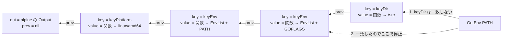

## 何を学んだか

`llb.State` は LLB を組み立てるための Go の API だが、内部はグラフでもビルダーでもない。**キーと値を 1 つずつ持つノードを後ろに積んでいく不変な連結リスト**だ。値は `any` ではなく `func(context.Context, *Constraints) (any, error)` として持たれ、`Marshal` されるまで評価されない。

この 2 つ — 不変連結リストと関数としての値 — の組み合わせで、`s.AddEnv("A", "1").Dir("/src")` のようなチェーンが、コピーもロックも要らずに書ける。同じ `State` の値を 2 か所で分岐させても互いに影響しない。

## State の 6 フィールド

```go title="client/llb/state.go"
// State represents all operations that must be done to produce a given output.
// States are immutable, and all operations return a new state linked to the previous one.
// State is the core type of the LLB API and is used to build a graph of operations.
// The graph is then marshaled into a definition that can be executed by a backend (such as buildkitd).
//
// Operations performed on a State are executed lazily after the entire state graph is marshalled and sent to the backend.
type State struct {
	out   Output
	prev  *State
	key   any
	value func(context.Context, *Constraints) (any, error)
	opts  []ConstraintsOpt
	async *asyncState
}
```

([client/llb/state.go L54-67](https://github.com/moby/buildkit/blob/ca4838f8ddbd3612bca94bcb8a938d8a326110a3/client/llb/state.go#L54-L67))

`out` が「このステートが指すファイルシステム」、`prev`/`key`/`value` が連結リストのノード 1 個分だ。ノード 1 個につきキーは 1 つしか持たない。

積むのはこれだけ。

```go title="client/llb/state.go"
func (s State) WithValue(k, v any) State {
	return s.withValue(k, func(context.Context, *Constraints) (any, error) {
		return v, nil
	})
}

func (s State) withValue(k any, v func(context.Context, *Constraints) (any, error)) State {
	return State{
		out:   s.Output(),
		prev:  &s, // doesn't need to be original pointer
		key:   k,
		value: v,
	}
}
```

([client/llb/state.go L80-93](https://github.com/moby/buildkit/blob/ca4838f8ddbd3612bca94bcb8a938d8a326110a3/client/llb/state.go#L80-L93))

`prev: &s` の `s` は値渡しされた引数のコピーだ。コメントの `doesn't need to be original pointer` はそれを言っている。`State` は不変なので、コピーのアドレスを取っても問題にならない。

引くほうも同じだけ短い。

```go title="client/llb/state.go"
func (s State) getValue(k any) func(context.Context, *Constraints) (any, error) {
	if s.key == k {
		return s.value
	}
	if s.async != nil {
		return func(ctx context.Context, c *Constraints) (any, error) {
			target, err := s.async.Do(ctx, c)
			if err != nil {
				return nil, err
			}
			return target.getValue(k)(ctx, c)
		}
	}
	if s.prev == nil {
		return nilValue
	}
	return s.prev.getValue(k)
}
```

([client/llb/state.go L103-120](https://github.com/moby/buildkit/blob/ca4838f8ddbd3612bca94bcb8a938d8a326110a3/client/llb/state.go#L103-L120))

先頭から遡って、最初に一致したキーの値関数を返す。見つからなければ `nilValue` — `(nil, nil)` を返す関数だ。

**返すのは値ではなく関数**であることに注意したい。`getValue` の中では ctx すら要らない。実際に評価するかどうかは呼び出し側が決める。



`keyEnv` が 2 回積まれていても、遡って最初に見つかるのは新しいほうだ。古いノードは残るが読まれない。

## キーは context.Context と同じ作り

```go title="client/llb/meta.go"
type contextKeyT string

var (
	keyArgs           = contextKeyT("llb.exec.args")
	keyDir            = contextKeyT("llb.exec.dir")
	keyEnv            = contextKeyT("llb.exec.env")
	keyExtraHost      = contextKeyT("llb.exec.extrahost")
	keyHostname       = contextKeyT("llb.exec.hostname")
	// ...
	keyPlatform = contextKeyT("llb.platform")
	keyNetwork  = contextKeyT("llb.network")
	keySecurity = contextKeyT("llb.security")
)
```

([client/llb/meta.go L18-34](https://github.com/moby/buildkit/blob/ca4838f8ddbd3612bca94bcb8a938d8a326110a3/client/llb/meta.go#L18-L34))

`context.Context` の `WithValue`/`Value` とほぼ同じ形だ。専用の型を定義して衝突を避けるのも同じ。違いは、`context` が「キャンセルと期限」を運ぶのに対し、`State` は「LLB を marshal するための設定」を運ぶことと、そのために値が関数になっていることだ。

`WithValue` は公開 API なので、ユーザが自分のキーで値を積むこともできる。BuildKit 自身は `keyXxx` の一群を使い、`GetEnv` / `GetDir` のような型付きアクセサを被せている。

## 値が関数である理由 — 前の値に依存する更新

`AddEnv` は「今の env に 1 つ足す」だが、「今の env」は積む時点では確定していない。

```go title="client/llb/meta.go"
func addEnvf(key, value string, replace bool, v ...any) StateOption {
	if replace {
		value = fmt.Sprintf(value, v...)
	}
	return func(s State) State {
		return s.withValue(keyEnv, func(ctx context.Context, c *Constraints) (any, error) {
			env, err := getEnv(s)(ctx, c)
			if err != nil {
				return nil, err
			}
			return env.AddOrReplace(key, value), nil
		})
	}
}
```

([client/llb/meta.go L49-62](https://github.com/moby/buildkit/blob/ca4838f8ddbd3612bca94bcb8a938d8a326110a3/client/llb/meta.go#L49-L62))

クロージャが捕まえている `s` は**新しいノードを積む前の State** だ。だから `getEnv(s)` は自分自身を飛ばして、その 1 つ前の `keyEnv` を探しに行く。値が `any` だったら、この「前の値を読んでから積む」を積む時点で評価するしかない。

`Dir` はもっと分かりやすい。相対パスを解決するには前の作業ディレクトリが要る。

```go title="client/llb/meta.go"
func dirf(value string, replace bool, v ...any) StateOption {
	// ...
	return func(s State) State {
		return s.withValue(keyDir, func(ctx context.Context, c *Constraints) (any, error) {
			if !path.IsAbs(value) {
				prev, err := getDir(s)(ctx, c)
				if err != nil {
					return nil, errors.Wrap(err, "getting dir from state")
				}
				if prev == "" {
					prev = "/"
				}
				value = path.Join(prev, value)
			}
			return value, nil
		})
	}
}
```

([client/llb/meta.go L76-95](https://github.com/moby/buildkit/blob/ca4838f8ddbd3612bca94bcb8a938d8a326110a3/client/llb/meta.go#L76-L95))

`value = path.Join(prev, value)` は捕捉した変数への代入なので、この関数は 2 回目以降の呼び出しで挙動が変わりうる。実際には 1 回目で `value` が絶対パスになるため `!path.IsAbs(value)` が偽になり、2 回目は先頭で抜ける。冪等性がガードのほうで担保されている形だ。

そして最も重要なのが `Constraints` を受け取ることだ。`getPlatform` の結果はマルチプラットフォームビルドで `Constraints` ごとに変わる。値を積む時点でプラットフォームは決まっていないので、評価を marshal 時まで遅らせる以外にない。

## Output と ToInput — もう 1 段の遅延

`out` フィールドの型はインターフェースだ。

```go title="client/llb/state.go"
type Output interface {
	ToInput(context.Context, *Constraints) (*pb.Input, error)
	Vertex(context.Context, *Constraints) Vertex
}

type Vertex interface {
	Validate(context.Context, *Constraints) error
	Marshal(context.Context, *Constraints) (digest.Digest, []byte, *pb.OpMetadata, []*SourceLocation, error)
	Output() Output
	Inputs() []Output
}
```

([client/llb/state.go L22-32](https://github.com/moby/buildkit/blob/ca4838f8ddbd3612bca94bcb8a938d8a326110a3/client/llb/state.go#L22-L32))

`ToInput` は `pb.Input{digest, index}` を返す。digest を出すには対象の頂点を marshal しなければならないので、この呼び出しの中で `Marshal` が走る。

```go title="client/llb/state.go"
func (o *output) ToInput(ctx context.Context, c *Constraints) (*pb.Input, error) {
	if o.err != nil {
		return nil, o.err
	}
	var index pb.OutputIndex
	if o.getIndex != nil {
		var err error
		index, err = o.getIndex()
		if err != nil {
			return nil, err
		}
	}
	dgst, _, _, _, err := o.vertex.Marshal(ctx, c)
	if err != nil {
		return nil, err
	}
	return &pb.Input{Digest: string(dgst), Index: int64(index)}, nil
}
```

([client/llb/state.go L509-526](https://github.com/moby/buildkit/blob/ca4838f8ddbd3612bca94bcb8a938d8a326110a3/client/llb/state.go#L509-L526))

`getIndex` も関数だ。[ExecOp](../exec-op/) で見たとおり、出力インデックスは mount がすべて確定してからでないと決まらない。`err` フィールドを持っているのも同じ理由で、`AddMount` の時点でエラーを返す先がないから、ここまで運んでいる。

つまり「LLB の DAG」と呼んでいるものは、marshal されるまでは Go の値としては存在せず、`Output` インターフェースの実装が相互に参照しあっているだけだ。実際にグラフとして歩かれるのは `State.Marshal` の中の再帰 1 か所だけになる ([Definition](../llb-definition/))。

## Async — 外部に問い合わせる State

イメージの config を解決してから env や workdir を決めたい、という場合がある。これは I/O を伴うので、値を返す関数では足りない。`Async` は「State を返す関数」を持つノードを作る。

```go title="client/llb/state.go"
func (s State) Async(f func(context.Context, State, *Constraints) (State, error)) State {
	as := &asyncState{
		f:    f,
		prev: s,
	}
	as.g.CacheError = true
	s2 := State{
		async: as,
	}
	return s2
}
```

([client/llb/state.go L122-132](https://github.com/moby/buildkit/blob/ca4838f8ddbd3612bca94bcb8a938d8a326110a3/client/llb/state.go#L122-L132))

```go title="client/llb/async.go"
type asyncState struct {
	f    func(context.Context, State, *Constraints) (State, error)
	prev State
	g    flightcontrol.CachedGroup[State]
}

func (as *asyncState) Do(ctx context.Context, c *Constraints) (State, error) {
	return as.g.Do(ctx, "", func(ctx context.Context) (State, error) {
		return as.f(ctx, as.prev, c)
	})
}
```

([client/llb/async.go L11-49](https://github.com/moby/buildkit/blob/ca4838f8ddbd3612bca94bcb8a938d8a326110a3/client/llb/async.go#L11-L49))

`asyncState` は `Output` インターフェースを実装している。`ToInput` も `Vertex` も、まず `Do` で本体の State を解決してから委譲する。`flightcontrol.CachedGroup` が重複実行を抑えるので、同じ async State が DAG の複数箇所から参照されても解決は 1 回だけだ。`CacheError = true` はエラーもキャッシュする — 失敗したイメージ解決を、参照されるたびに繰り返さない。

エラーの運び方はここでも同じで、値ではなく `Vertex` に埋める。

```go title="client/llb/async.go"
func (as *asyncState) Vertex(ctx context.Context, c *Constraints) Vertex {
	target, err := as.Do(ctx, c)
	if err != nil {
		return &errVertex{err}
	}
	// ...
}
```

([client/llb/async.go L21-31](https://github.com/moby/buildkit/blob/ca4838f8ddbd3612bca94bcb8a938d8a326110a3/client/llb/async.go#L21-L31))

`errVertex` は `Validate` も `Marshal` も同じエラーを返すだけの型だ ([client/llb/async.go L51-68](https://github.com/moby/buildkit/blob/ca4838f8ddbd3612bca94bcb8a938d8a326110a3/client/llb/async.go#L51-L68))。インターフェースを返す関数がエラーを返せないとき、エラーを返す実装を返す。

## 出力の差し替えと、鎖の付け替え

`WithOutput` は「値の鎖はそのまま、出力だけ差し替える」。

```go title="client/llb/state.go"
func (s State) WithOutput(o Output) State {
	prev := s
	s = State{
		out:  o,
		prev: &prev,
	}
	s = s.ensurePlatform()
	return s
}
```

([client/llb/state.go L239-248](https://github.com/moby/buildkit/blob/ca4838f8ddbd3612bca94bcb8a938d8a326110a3/client/llb/state.go#L239-L248))

`key` も `value` も空のノードが 1 つ積まれる。値の探索はこのノードを素通りして `prev` に落ちるので、env も workdir も引き継がれる。`Run` が返す `ExecState` の中身も `s.WithOutput(exec.Output())` だ ([client/llb/state.go L302](https://github.com/moby/buildkit/blob/ca4838f8ddbd3612bca94bcb8a938d8a326110a3/client/llb/state.go#L302))。`RUN` を実行してもコンテナの env や workdir が引き継がれるのは、この 1 行が理由になっている。[COPY --link](../merge-diff-op/) が `d.state.WithOutput(llb.Merge(...).Output())` と書けるのも同じ性質のおかげだ。

逆に `Reset` は、出力だけを保って値の鎖を別の State に付け替える。

```go title="client/llb/meta.go"
func Reset(other State) StateOption {
	return func(s State) State {
		s = NewState(s.Output())
		s.prev = &other
		return s
	}
}
```

([client/llb/meta.go L109-115](https://github.com/moby/buildkit/blob/ca4838f8ddbd3612bca94bcb8a938d8a326110a3/client/llb/meta.go#L109-L115))

不変連結リストなので、こういう付け替えがポインタ 1 本の代入で済む。既存の `State` を誰が参照していても影響しない。

## なぜそうなっているか

LLB のクライアント API が満たすべき条件は 3 つある。

1. **メソッドチェーンで書けること。** `llb.Image("alpine").AddEnv("A", "1").Dir("/src").Run(...)` と書きたい。途中で `error` を返せない
2. **同じ State から分岐できること。** マルチステージビルドでは 1 つのベースから複数のステージが伸びる。分岐先の変更が互いに影響してはいけない
3. **プラットフォームや daemon の cap によって結果が変わること。** これらは `Marshal` の引数として渡ってくるので、それより前には確定できない

1 と 2 だけなら「毎回コピーする構造体」でよい。しかしフィールドが増えるとコピーのコストが上がるし、`AddEnv` のたびに map をコピーすることになる。連結リストなら、追加はノード 1 個の割り当てだけで、共有部分はそのまま共有される。

3 が「値を関数にする」理由だ。`Constraints` は `Marshal` まで存在しないので、`Constraints` に依存する値は関数として持つしかない。そして一度関数にしてしまえば、`AddEnv` のような「前の値に依存する更新」も、`Async` のような「外部への問い合わせ」も、同じ枠に収まる。

代償は 2 つある。`Value` の探索が線形になること — ただし鎖の長さは Dockerfile の命令数程度なので実用上は問題にならない。もう 1 つは、エラーの発生位置とスタックトレースが分かりにくくなること。`AddEnv` で起きた問題が `Marshal` の中で噴出する。BuildKit は `errors.Wrap(err, "getting dir from state")` のように、遅延評価されるクロージャの中で文脈を足すことでこれを補っている。

## どう活かすか

**不変連結リストは、ビルダー API のコピーコストを消す。** 「毎回コピーして返す」形のビルダーは、フィールドが増えるほど重くなり、map やスライスを含むと深いコピーが要る。キーと値を 1 つずつ持つノードを積む形にすれば、追加は常に O(1) で、共有される部分は共有されたままだ。読むときに遡るコストは、鎖が短ければ無視できる。

**「前の値に依存する更新」を書きたければ、値を関数にする。** `s.AddEnv(...)` を積む時点で前の env を評価すると、そこで確定してしまう。クロージャに「積む前の自分」を捕まえさせておけば、評価タイミングを呼び出し側に譲れる。この 1 段の間接だけで、遅延評価も非同期解決も同じ枠に入る。

**インターフェースを返す関数がエラーを返せないなら、エラーを返す実装を返す。** `errVertex` と `&output{err: ...}` は同じパターンだ。`nil` を返して呼び出し側に nil チェックを強いるより、必ず同じエラーを返す実装を渡したほうが、エラーが消えることがない。ただしエラーの発生源と表面化の場所が離れるので、メッセージに文脈を入れるのは必須になる。

**キー付きの汎用ストアは context.Context の形をそのまま借りてよい。** `contextKeyT` のような専用型でキーを定義し、`WithValue`/`Value` を公開しつつ型付きアクセサを被せる。この形は Go 使いにとって説明が要らないという利点がある。BuildKit の `State` は、`context.Context` に「値を関数として持つ」を足しただけとも読める。
