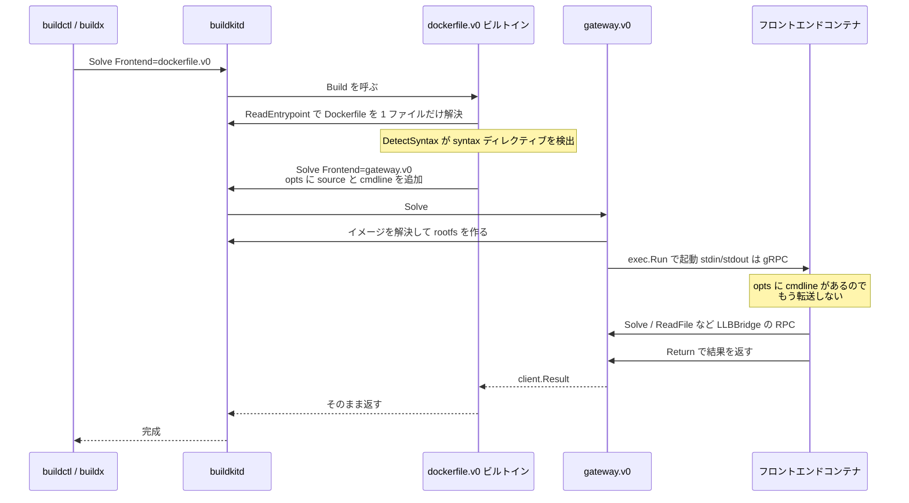

## 何を学んだか

`# syntax=docker/dockerfile:1` は「パーサのバージョン指定」ではない。**Dockerfile フロントエンドが、指定されたイメージを gateway フロントエンドとして起動し、自分が受け取ったビルドリクエストをそのまま投げ直す**という委譲である。委譲元も委譲先も同じ `client.BuildFunc` を実装した同じコードでありうるので、これは実質的に再帰呼び出しになる。再帰を止めているのは、転送時に `opts["cmdline"]` を立てておき、次段がそれを見たら転送しない、というたった 1 つのフラグだ。

さらに面白いのは、**キャパビリティのエラーが転送のために遅延される**ことだ。ビルトインのフロントエンドが知らない機能をクライアントが要求してきたとき、その要求に `+forward` が付いていれば即座には失敗せず、「`#syntax=` で新しいフロントエンドに飛べばそっちが知っているかもしれない」という理由でエラーを保留する。

## `Build` の冒頭 8 行にすべてが入っている

Dockerfile フロントエンドの入口は `Build` 関数だ。

```go title="frontend/dockerfile/builder/build.go"
const (
	// Don't forget to update frontend documentation if you add
	// a new build-arg: frontend/dockerfile/docs/reference.md
	keySyntaxArg = "build-arg:BUILDKIT_SYNTAX"
)

func Build(ctx context.Context, c client.Client) (_ *client.Result, err error) {
	c = &withResolveCache{Client: c}
	bc, err := dockerui.NewClient(c)
	// ...
	opts := bc.BuildOpts().Opts
	allowForward, capsError := validateCaps(opts["frontend.caps"])
	if !allowForward && capsError != nil {
		return nil, capsError
	}

	src, err := bc.ReadEntrypoint(ctx, "Dockerfile")
	// ...

	if _, ok := opts["cmdline"]; !ok {
		if cmdline, ok := opts[keySyntaxArg]; ok {
			p := strings.SplitN(strings.TrimSpace(cmdline), " ", 2)
			res, err := forwardGateway(ctx, c, p[0], cmdline)
			// ...
			return res, err
		} else if ref, cmdline, loc, ok := parser.DetectSyntax(src.Data); ok {
			res, err := forwardGateway(ctx, c, ref, cmdline)
			// ...
			return res, err
		}
	}

	if capsError != nil {
		return nil, capsError
	}
```

([frontend/dockerfile/builder/build.go L31-L73](https://github.com/moby/buildkit/blob/ca4838f8ddbd3612bca94bcb8a938d8a326110a3/frontend/dockerfile/builder/build.go#L31-L73))

読み取れることが 4 つある。

1. **Dockerfile は転送の前に読まれる。** `ReadEntrypoint` でビルドコンテキストから `Dockerfile` を取ってきて、その中身に対して `parser.DetectSyntax` をかける。つまりデーモンは「まずコンテキストから Dockerfile だけを引き出す」という小さなビルドを 1 回やってから、本番のフロントエンドを決める。
2. **`build-arg:BUILDKIT_SYNTAX` はファイル内のディレクティブより強い。** `else if` なので、build-arg があればファイルの `# syntax=` は見られない。ドキュメントにも「`dockerfile.v0` を渡せば `# syntax=` を無視してビルトインを使う」と書かれている ([frontend/dockerfile/docs/reference.md L2757](https://github.com/moby/buildkit/blob/ca4838f8ddbd3612bca94bcb8a938d8a326110a3/frontend/dockerfile/docs/reference.md?plain=1#L2757))。
3. **`cmdline` があれば転送しない。** これが再帰の停止条件。
4. **`capsError` は転送のあとまで持ち越される。** 転送が起きればビルトインの caps 判定はそもそも使われず、転送しなかった場合にだけエラーになる。

`DetectSyntax` 自体は `# syntax=` に限らない。`//syntax=` 形式と、ファイル全体が JSON の場合の `{"syntax": "..."}` にも落ちる ([frontend/dockerfile/parser/directives.go L117-L177](https://github.com/moby/buildkit/blob/ca4838f8ddbd3612bca94bcb8a938d8a326110a3/frontend/dockerfile/parser/directives.go#L117-L177))。Dockerfile 以外の記法のファイルにも 1 行目でフロントエンドを書けるようにするための逃げ道だ。詳しくは [parser directive](../parser-directives/) を参照。

## `forwardGateway` — opts を積み替えて gateway.v0 を呼ぶ

```go title="frontend/dockerfile/builder/build.go"
func forwardGateway(ctx context.Context, c client.Client, ref string, cmdline string) (*client.Result, error) {
	opts := c.BuildOpts().Opts
	if opts == nil {
		opts = map[string]string{}
	}
	opts["cmdline"] = cmdline
	opts["source"] = ref

	gwcaps := c.BuildOpts().Caps
	var frontendInputs map[string]*pb.Definition
	if (&gwcaps).Supports(gwpb.CapFrontendInputs) == nil {
		inputs, err := c.Inputs(ctx)
		// ... 各 State を Marshal して frontendInputs に詰める
	}

	return c.Solve(ctx, client.SolveRequest{
		Frontend:       "gateway.v0",
		FrontendOpt:    opts,
		FrontendInputs: frontendInputs,
	})
}
```

([frontend/dockerfile/builder/build.go L227-L258](https://github.com/moby/buildkit/blob/ca4838f8ddbd3612bca94bcb8a938d8a326110a3/frontend/dockerfile/builder/build.go#L227-L258))

やっていることは、自分が受け取った `opts` に 2 つのキーを足して、`gateway.v0` フロントエンドを `Solve` で呼ぶだけだ。`source` は gateway フロントエンドが起動すべきイメージ名 ([frontend/frontend.go L17-L21](https://github.com/moby/buildkit/blob/ca4838f8ddbd3612bca94bcb8a938d8a326110a3/frontend/frontend.go#L17-L21))、`cmdline` は `# syntax=` の値そのもの (イメージ名のあとに引数が続く形式も許されるので、`ref` は先頭のスペースまでを切り出したもの)。

`Inputs` の呼び出しが caps でガードされているのは、デーモンが古い場合に `Inputs` RPC が存在しないためだ。詳しくは [apicaps](../apicaps/)。

## 再帰の停止条件は環境変数を経由する

`opts` は gateway フロントエンドによって、起動するコンテナの環境変数に展開される。

```go title="frontend/gateway/gateway.go"
	i := 0
	for k, v := range opts {
		env = append(env, fmt.Sprintf("BUILDKIT_FRONTEND_OPT_%d", i)+"="+k+"="+v)
		i++
	}
```

([frontend/gateway/gateway.go L236-L240](https://github.com/moby/buildkit/blob/ca4838f8ddbd3612bca94bcb8a938d8a326110a3/frontend/gateway/gateway.go#L236-L240))

コンテナ側の SDK はこの `BUILDKIT_FRONTEND_OPT_` プレフィックスの環境変数を集めて `opts` を復元する ([frontend/gateway/grpcclient/client.go L1512-L1535](https://github.com/moby/buildkit/blob/ca4838f8ddbd3612bca94bcb8a938d8a326110a3/frontend/gateway/grpcclient/client.go#L1512-L1535))。したがって、`docker/dockerfile:1` の中身が同じ `builder.Build` であっても、そこで見える `opts` にはすでに `cmdline` が入っており、`if _, ok := opts["cmdline"]; !ok` が false になって転送は 1 回で止まる。



## デーモン側のショートカット

`# syntax=dockerfile.v0` のように、転送先がビルトインのフロントエンド名そのものだった場合、コンテナを起動しても意味がない。solver の入口にその判定が入っている。

```go title="solver/llbsolver/solver.go"
	if req.Frontend == "gateway.v0" && req.FrontendOpt[frontend.KeySource] == "dockerfile.v0" && !hasNamedDockerfileContext {
		frontendOpt := maps.Clone(req.FrontendOpt)
		delete(frontendOpt, frontend.KeySource)
		req.Frontend = "dockerfile.v0"
		req.FrontendOpt = frontendOpt
	}
```

([solver/llbsolver/solver.go L196-L208](https://github.com/moby/buildkit/blob/ca4838f8ddbd3612bca94bcb8a938d8a326110a3/solver/llbsolver/solver.go#L196-L208))

`source` を消しているのがポイントで、これによって `cmdline` だけが残る。転送されたつもりのビルトインフロントエンドは、`cmdline` があるので再転送しない。`hasNamedDockerfileContext` の除外は、`--build-context dockerfile.v0=...` で Dockerfile フロントエンド自体を差し替えている場合はショートカットしてはいけないため ([named context](../named-context/) を参照)。

デーモンがフロントエンドを 2 つしか持っていないことも確認しておく。

```go title="cmd/buildkitd/main.go"
		frontends["dockerfile.v0"] = forwarder.NewGatewayForwarder(wc.Infos(), dockerfile.Build)
		// ...
		frontends["gateway.v0"] = gwfe
```

([cmd/buildkitd/main.go L887-L894](https://github.com/moby/buildkit/blob/ca4838f8ddbd3612bca94bcb8a938d8a326110a3/cmd/buildkitd/main.go#L887-L894))

`dockerfile.v0` は `forwarder.NewGatewayForwarder` でラップされている。これは `client.BuildFunc` を `frontend.Frontend` に見せるアダプタで、gRPC もコンテナも介さずプロセス内で直接呼ぶ ([frontend/gateway/forwarder/frontend.go L14-L41](https://github.com/moby/buildkit/blob/ca4838f8ddbd3612bca94bcb8a938d8a326110a3/frontend/gateway/forwarder/frontend.go#L14-L41))。**同じ `Build` 関数が、プロセス内実行とコンテナ内実行の両方で動く**ように書かれているから、この再帰が成立する。

## `+forward` — 知らない機能のエラーを転送先に譲る

ビルトインフロントエンドが宣言する caps はハードコードされた 5 つだ。

```go title="frontend/dockerfile/builder/caps.go"
var enabledCaps = map[string]struct{}{
	"moby.buildkit.frontend.inputs":         {},
	"moby.buildkit.frontend.subrequests":    {},
	"moby.buildkit.frontend.contexts":       {},
	"moby.buildkit.frontend.gitquerystring": {},
	"moby.buildkit.frontend.contexts.zstd":  {},
}

func validateCaps(req string) (forward bool, err error) {
	if req == "" {
		return
	}
	caps := strings.SplitSeq(req, ",")
	for c := range caps {
		parts := strings.SplitN(c, "+", 2)
		if _, ok := enabledCaps[parts[0]]; !ok {
			err = stack.Enable(grpcerrors.WrapCode(errdefs.NewUnsupportedFrontendCapError(parts[0]), codes.Unimplemented))
			if strings.Contains(c, "+forward") {
				forward = true
			} else {
				return false, err
			}
		}
	}
	return
}
```

([frontend/dockerfile/builder/caps.go L12-L36](https://github.com/moby/buildkit/blob/ca4838f8ddbd3612bca94bcb8a938d8a326110a3/frontend/dockerfile/builder/caps.go#L12-L36))

クライアントが `frontend.caps` に `foo.bar+forward` と書いてきた場合、ビルトインは `foo.bar` を知らないが、エラーを返さずに `forward = true` を返す。呼び出し側は `if !allowForward && capsError != nil` で判定するので、**このケースでは転送のチャンスが 1 回与えられる**。`# syntax=` が書いてあれば新しいフロントエンドに飛び、そちらが機能を持っていればビルドは成功する。書いてなければ転送のブロックを抜けた先の `if capsError != nil` で失敗する。

つまり `+forward` は「この機能はデーモン同梱のフロントエンドにはまだ無いかもしれないが、ユーザが `#syntax=` で新しいものを指しているなら通してほしい」というクライアントからの意思表示だ。新機能を出すとき、デーモンのリリースを待たずにフロントエンドイメージのタグだけで配れる、という BuildKit の売りはここで担保されている。

## なぜそうなっているか

`# syntax=` の目的は **Dockerfile の文法の進化を、デーモンのリリースサイクルから切り離すこと**にある。デーモンは長寿命で、CI ホストや Docker Desktop に固定されて動く。一方 Dockerfile の新記法 (heredoc、`COPY --link`、`--mount=type=cache`) は毎リリース増える。文法を解釈するコードをイメージとして配れば、ユーザは Dockerfile を 1 行足すだけで最新のパーサを使える。

その配布経路として、BuildKit はすでに持っていたもの — イメージレジストリと、LLB を吐くフロントエンドという抽象 — をそのまま使った。新しいプラグイン機構も、共有ライブラリのロードも導入していない。フロントエンドの成果物は LLB という値であり、値を返すだけの相手はコンテナに閉じ込めておける ([スコープと信頼境界](../scope-and-trust/))。

再帰の停止条件が「専用のカウンタ」ではなく「転送時に立てた `cmdline` オプション」なのは、このオプションが**転送されたことの証拠として同時に必要だったから**だ。`cmdline` はフロントエンド側が「自分はどう呼ばれたか」を知るために持っており (provenance にも記録される。[provenance](../provenance/) を参照)、停止条件はそれに相乗りしている。専用の状態を増やさずに済む。

## どう活かすか

- **プラグイン機構をゼロから設計する前に、既存の抽象に乗れないか探す。** BuildKit は「フロントエンド = LLB を返すもの」という抽象をすでに持っていたので、`#syntax=` は新しい機構ではなく既存機構の再帰呼び出しで済んだ。配布はレジストリ、隔離はコンテナ、通信は既存の gRPC を流用している。
- **再帰する委譲には、渡す側が停止条件を注入する。** 委譲先が自分と同じコードでありうるとき、「何回目か」を数えるより「もう委譲済みである」というフラグを引数に混ぜるほうが単純だ。しかもそのフラグが別の用途 (自分の呼ばれ方の記録) を兼ねられるなら、状態は増えない。
- **前方互換のエラーは、遅延させる余地がないか考える。** 「知らない機能を要求された」を即エラーにするのではなく、`+forward` のように「委譲先が知っているかもしれないので保留する」という選択肢を作ると、コンポーネントのバージョンを独立に上げられるようになる。エラーを変数に入れて持ち回るだけの実装コストで済んでいる。
