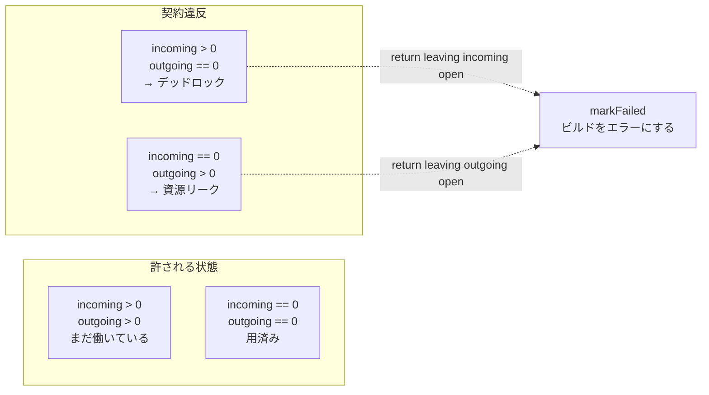

## 何を学んだか

`unpark` は edge の頭脳で、要求を読み、状態を更新し、次の要求を組み立てる。この関数が守るべき規則が、宣言のすぐ上にコメントで書かれている。

```go title="solver/edge.go"
// unpark is called by the scheduler with incoming requests and updates for
// previous calls.
// To avoid deadlocks and resource leaks this function needs to follow
// following rules:
//  1. this function needs to return unclosed outgoing requests if some incoming
//     requests were not completed
//  2. this function may not return outgoing requests if it has completed all
//     incoming requests
func (e *edge) unpark(incoming []pipeSender, updates, allPipes []pipeReceiver, f *pipeFactory) {
```

([solver/edge.go L323-L331](https://github.com/moby/buildkit/blob/ca4838f8ddbd3612bca94bcb8a938d8a326110a3/solver/edge.go#L323-L331))

言い換えるとこうだ。

1. **incoming を 1 本でも開けたまま返るなら、outgoing を最低 1 本は開けておけ。** 誰も自分を起こしてくれなくなるとデッドロックになる。
2. **incoming を全部閉じたなら、outgoing を残すな。** 結果を受け取る人がもういないのに走り続ける処理は資源リークだ。

つまり **incoming が開いていることと outgoing が開いていることは同値**でなければならない。片方が空でもう片方が空でない状態が禁じられている。



なぜ edge が自分を起こせないかというと、スケジューラは pipe の完了通知でしか `signal` を出さないからだ ([スケジューラのシングルスレッドループと pipe](../scheduler-loop/))。outgoing が 1 本も無ければ、この edge に対する `dispatch` は二度と呼ばれない。

## unpark の 4 フェーズ

```go title="solver/edge.go"
func (e *edge) unpark(incoming []pipeSender, updates, allPipes []pipeReceiver, f *pipeFactory) {
	// process all incoming changes
	e.processUpdates(updates)

	desiredState, done := e.respondToIncoming(incoming, allPipes)
	if done {
		return
	}

	cacheMapReq := false
	// set up new outgoing requests if needed
	if e.cacheMapReq == nil && (e.cacheMap == nil || len(e.cacheRecords) == 0) {
		index := e.cacheMapIndex
		e.cacheMapReq = f.NewFuncRequest(func(ctx context.Context) (any, error) {
			cm, err := e.op.CacheMap(ctx, index)
			return cm, errors.Wrap(err, "failed to load cache key")
		})
		cacheMapReq = true
	}

	// execute op
	if e.execReq == nil && desiredState == edgeStatusComplete {
		if ok := e.execIfPossible(f); ok {
			return
		}
	}

	if e.execReq == nil {
		if added := e.createInputRequests(desiredState, f, false); !added && !e.hasActiveOutgoing && !cacheMapReq {
			// ...
		}
	}
}
```

([solver/edge.go L331-L365](https://github.com/moby/buildkit/blob/ca4838f8ddbd3612bca94bcb8a938d8a326110a3/solver/edge.go#L331-L365))

35 行しかない。`docs/dev/solver.md` の説明に対応させるとこうなる。

| フェーズ | 関数                          | やること                                   |
| -------- | ----------------------------- | ------------------------------------------ |
| 1        | `processUpdates`              | outgoing から届いた値を内部状態に反映する  |
| 2        | `recalcCurrentState` (1 の中) | 変化があれば状態を計算し直す               |
| 3        | `respondToIncoming`           | incoming に返事をする。全部返せたら `done` |
| 4        | 残り                          | 足りない情報を取りに行く outgoing を作る   |

契約 2 (incoming を全部閉じたなら outgoing を残すな) は、フェーズ 3 が担当する。

```go title="solver/edge.go"
	if allIncomingCanComplete && e.hasActiveOutgoing {
		// cancel all current requests
		for _, p := range allPipes {
			p.Cancel()
		}

		// can close all but one requests
		var leaveOpen pipeSender
		for _, req := range incoming {
			if !req.Request().Canceled {
				leaveOpen = req
				break
			}
		}
		for _, req := range incoming {
			if leaveOpen == nil || leaveOpen == req {
				leaveOpen = req
				continue
			}
			e.finishIncoming(req)
		}
		return desiredState, true
	}
```

([solver/edge.go L760-L782](https://github.com/moby/buildkit/blob/ca4838f8ddbd3612bca94bcb8a938d8a326110a3/solver/edge.go#L760-L782))

全部返事できるが outgoing がまだ動いている、という場合。**outgoing を全部キャンセルしたうえで、incoming を 1 本だけ開けたまま残す。** キャンセルは非同期なので、完了通知が来るまで outgoing は「開いている」ままだ。ここで incoming を全部閉じてしまうと契約 2 を破る。だから 1 本だけ残して次の `unpark` を待つ。

キャンセルが完了して `hasActiveOutgoing` が false になれば、次はこちらに落ちる。

```go title="solver/edge.go"
	// can complete, finish and return
	if allIncomingCanComplete && !e.hasActiveOutgoing {
		for _, req := range incoming {
			e.finishIncoming(req)
		}
		return desiredState, true
	}
```

([solver/edge.go L784-L790](https://github.com/moby/buildkit/blob/ca4838f8ddbd3612bca94bcb8a938d8a326110a3/solver/edge.go#L784-L790))

契約 1 (incoming を開けたまま返るなら outgoing を持て) はフェーズ 4 が担当する。`cacheMapReq` を作るか、`execIfPossible` が実行リクエストを作るか、`createInputRequests` が入力への要求を作るか、そのどれかが必ず 1 本以上の outgoing を生む — はずだ。

## 自分のバグを疑う 1 行

その「はずだ」を信用していないのが、フェーズ 4 の末尾だ。

```go title="solver/edge.go"
		if added := e.createInputRequests(desiredState, f, false); !added && !e.hasActiveOutgoing && !cacheMapReq {
			bklog.G(context.TODO()).Errorf("buildkit scheduling error: leaving incoming open. forcing solve. Please report this with BUILDKIT_SCHEDULER_DEBUG=1")
			debugSchedulerPreUnpark(e, incoming, updates, allPipes)
			e.createInputRequests(desiredState, f, true)
		}
```

([solver/edge.go L358-L364](https://github.com/moby/buildkit/blob/ca4838f8ddbd3612bca94bcb8a938d8a326110a3/solver/edge.go#L358-L364))

「新しい要求が 1 本も作られず、動いている outgoing も無く、cacheMap も要求していない」— 契約 1 を破る状況だ。このとき、

1. エラーログを出す (再現手順つきで報告を促す)
2. デバッグダンプを強制的に吐く
3. **`force=true` で `createInputRequests` をやり直す**

`force` は `desiredStateDep` の最初の分岐に効く。

```go title="solver/edge.go"
	if e.noCacheMatchPossible || force {
		return edgeStatusComplete
	}
```

([solver/edge.go L842-L844](https://github.com/moby/buildkit/blob/ca4838f8ddbd3612bca94bcb8a938d8a326110a3/solver/edge.go#L842-L844))

全入力に `complete` を要求する。つまり **「最適化の判断が詰まったなら、最適化を諦めて全部解け」**。ログの文言が `forcing solve` なのはそういう意味だ。ビルドは遅くなるが、止まらない。この経路は `TestInputRequestDeadlock` ([solver/scheduler_test.go L3412](https://github.com/moby/buildkit/blob/ca4838f8ddbd3612bca94bcb8a938d8a326110a3/solver/scheduler_test.go#L3412)) がテスト名で名指ししている。

## スケジューラ側の検査

edge 自身の自己修復をすり抜けた場合に備えて、`dispatch` がもう一段の検査をする。

```go title="solver/scheduler.go"
	// validation to avoid deadlocks/resource leaks:
	// TODO: if these start showing up in error reports they can be changed
	// to error the edge instead. They can only appear from algorithm bugs in
	// unpark(), not for any external input.
	if len(openIncoming) > 0 && len(openOutgoing) == 0 {
		e.markFailed(pf, errors.New("buildkit scheduler error: return leaving incoming open. Please report this with BUILDKIT_SCHEDULER_DEBUG=1"))
	}
	if len(openIncoming) == 0 && len(openOutgoing) > 0 {
		e.markFailed(pf, errors.New("buildkit scheduler error: return leaving outgoing open. Please report this with BUILDKIT_SCHEDULER_DEBUG=1"))
	}
```

([solver/scheduler.go L180-L189](https://github.com/moby/buildkit/blob/ca4838f8ddbd3612bca94bcb8a938d8a326110a3/solver/scheduler.go#L180-L189))

`openIncoming` / `openOutgoing` は、`unpark` から戻った直後に数え直したものだ ([スケジューラのシングルスレッドループと pipe](../scheduler-loop/))。スケジューラは edge の中を知らないので、**pipe の本数という外から見える量だけで契約を検査している。**

コメントの `They can only appear from algorithm bugs in unpark(), not for any external input.` が、この検査の性格を言い切っている。**外部入力ではこの条件に到達しない。到達したなら実装のバグだ。** だからエラーメッセージは "Please report this with BUILDKIT_SCHEDULER_DEBUG=1" になっている。`.github/issue_reporting_guide.md` にも同じ環境変数の説明があり、「メンテナに言われたときだけ使え」と添えられている。

対処は `markFailed` だ。

```go title="solver/edge.go"
func (e *edge) markFailed(f *pipeFactory, err error) {
	e.err = err
	e.failedOnce.Do(func() {
		e.postpone(f)
	})
}
```

([solver/edge.go L374-L379](https://github.com/moby/buildkit/blob/ca4838f8ddbd3612bca94bcb8a938d8a326110a3/solver/edge.go#L374-L379))

2 行で両方の違反を同時に解消しているのが巧い。

- `e.err` を立てると `isComplete()` が true になる ([solver/edge.go L174-L176](https://github.com/moby/buildkit/blob/ca4838f8ddbd3612bca94bcb8a938d8a326110a3/solver/edge.go#L174-L176))。次の `unpark` では `respondToIncoming` の `if !e.isComplete()` が false になり、全 incoming が即座にエラー付きで閉じられる → 違反 1 が解消する。
- `postpone` は空の関数リクエストを 1 本作る ([desiredState — 必要な分だけ深く掘る](../desired-state/))。これが outgoing になるのでその場では違反 1 の条件が満たされ、しかも即完了して次の `unpark` を呼ぶ → 違反 2 も次の周回で解消する。

`failedOnce` で `postpone` が 1 回に制限されているのは、`markFailed` が繰り返し呼ばれても pipe が無限に増えないようにするためだ。

`e.err` を立てるだけでは足りないことに注意したい。エラーを持っていても、誰かが `unpark` を呼ばなければ incoming は閉じられない。**エラー処理にも「もう 1 周走らせる」経路が要る**というのが、このスケジューラの構造から出てくる帰結だ。

## panic からエラーへ

`docs/dev/solver.md` はこの検査を「panic する」と書いている。

> Failing to comply with this rule will cause the scheduler to panic as a precaution to avoid leaks and hiding errors.

([docs/dev/solver.md L255-L260](https://github.com/moby/buildkit/blob/ca4838f8ddbd3612bca94bcb8a938d8a326110a3/docs/dev/solver.md#L255-L260))

しかし現在のコードは panic しない。`git log` を辿ると `0d68543b1 "solver: mark build failed instead of panicking on scheduler error"` で置き換えられている。**ドキュメントのほうが古い。**

方針の変化としては筋が通っている。panic は buildkitd 全体を巻き込むので、無関係な他のビルドまで巻き添えになる。edge をエラーにすれば、そのビルド 1 本だけが失敗する。エラーメッセージが「報告してくれ」と言っているのは、panic が持っていた「隠さない」という性質を、クラッシュせずに引き継ぐためだ。

なお `scheduler.go` 側に残る `TODO: ... can be changed to error the edge instead` も、既に実現済みの内容を指している。

## デバッグの仕込み

このスケジューラは、状態が edge の中に閉じていて外から観測しづらい。そのため観測用のフックがコードに直接埋め込まれている。

```go title="solver/debug.go"
var (
	debugScheduler      = false // TODO: replace with logs in build trace
	debugSchedulerSteps = sync.OnceValue(parseSchedulerDebugSteps)
)

func init() {
	if os.Getenv("BUILDKIT_SCHEDULER_DEBUG") == "1" {
		debugScheduler = true
	}
}
```

([solver/debug.go L14-L23](https://github.com/moby/buildkit/blob/ca4838f8ddbd3612bca94bcb8a938d8a326110a3/solver/debug.go#L14-L23))

`solver/debug.go` は 359 行あり、`debugScheduler*` で始まる関数が 20 個ほど並んでいる。すべて同じ形だ。

```go title="solver/debug.go"
func debugSchedulerPreUnpark(e *edge, inc []pipeSender, updates, allPipes []pipeReceiver) {
	if e.debug {
		debugSchedulerPreUnparkSlow(e, inc, updates, allPipes)
	}
}
```

([solver/debug.go L110-L114](https://github.com/moby/buildkit/blob/ca4838f8ddbd3612bca94bcb8a938d8a326110a3/solver/debug.go#L110-L114))

`e.debug` は edge ごとのブール値で、生成時に一度だけ評価される。

```go title="solver/edge.go"
	e.debug = debugSchedulerCheckEdge(e)
```

([solver/edge.go L37](https://github.com/moby/buildkit/blob/ca4838f8ddbd3612bca94bcb8a938d8a326110a3/solver/edge.go#L37))

**呼び出し側は判定条件を知らず、フラグ 1 個を見るだけ。** `unpark` や `dispatch` の本文に `if debugScheduler` が散らばらないので、アルゴリズムの読みやすさが保たれている。重い文字列整形は `*Slow` 版に分離されていて、フラグが false なら実質ゼロコストになる。

ログの中身も、単なるフィールドのダンプではない。

```go title="solver/debug.go"
// debugSchedulerNoCacheMatchPossible records the moment an edge latches
// noCacheMatchPossible because a dependency exposed no probeable key
// (len(dep.keyMap)==0) once past cache-slow. When the dep nonetheless carries a
// non-empty result cache key (dep_result_keys>0 with dep_keymap==0), that is the
// stale/complete shared-dependency starvation: the key lives on the result but
// was never delivered via edgeState.keys, so probeCache/Query never ran.
func debugSchedulerNoCacheMatchPossible(e *edge, dep *dep, depHasSlowCache bool) {
```

([solver/debug.go L315-L321](https://github.com/moby/buildkit/blob/ca4838f8ddbd3612bca94bcb8a938d8a326110a3/solver/debug.go#L315-L321))

**「このログのこの組み合わせが出たら、それは既知のこの症状だ」**というところまで書かれている。過去に一度やったデバッグの診断手順が、ログ関数のコメントとして残されている。

edge 単位の絞り込みには `BUILDKIT_SCHEDULER_DEBUG_STEPS` があり、頂点名の部分一致で対象を選ぶ意図で書かれている。

```go title="solver/debug.go"
	if steps := debugSchedulerSteps(); len(steps) > 0 {
		withParents := strings.HasSuffix(steps[0], "^")
		name := strings.TrimSuffix(steps[0], "^")
		for _, v := range steps {
			if strings.Contains(name, v) {
				return true
			}
		}
		// ...
	}
```

([solver/debug.go L43-L62](https://github.com/moby/buildkit/blob/ca4838f8ddbd3612bca94bcb8a938d8a326110a3/solver/debug.go#L43-L62))

最初のループが比較しているのは `steps[0]` 由来の `name` であって、`e.edge.Vertex.Name()` ではない。`^` 付きで親を辿る側 (`withParents` のブロック) は頂点名を見ているので、対比するとこの絞り込みは意図どおりには効かず、この環境変数を設定すると全 edge が対象になる。デバッグ専用の経路なのでビルド結果には影響しないが、ソースから挙動を推測するときには注意が要る。

## なぜそうなっているか

契約が必要なのは、**スケジューラが edge の内部を一切知らない**からだ。`dispatch` にできるのは pipe の本数を数えることだけで、「この edge は次に何をすべきか」は分からない。だから外から観測できる形で不変条件を定義するしかない。

そしてこの不変条件は、書き方を間違えやすい。`unpark` の分岐は `desiredState` の梯子、`cacheRecords` の有無、`hasActiveOutgoing`、`keysDidChange` が絡み合っていて、「この経路では outgoing が 0 本になる」という組み合わせを人間が網羅するのは難しい。だから機械に数えさせる。

検査を残す判断は、コストとリターンが釣り合っている。`dispatch` の末尾でスライスの長さを 2 回比べるだけなので実行コストはゼロに近く、見返りはデッドロックの即時検出だ。しかも「バグでしか起きない」と分かっているので、検出したら遠慮なくビルドを落とせる。

## どう活かすか

**不変条件を、実装の外から観測できる量で定義する。** 「edge の内部状態が正しい」は検査できないが、「開いている pipe の本数」なら数えられる。抽象境界をまたぐ不変条件を作れれば、境界の内側を知らないコードが検査役を務められる。

**バグでしか起きない条件は、黙って回復せず記録する。** `markFailed` はビルドを落とすが、エラーメッセージに再現手順を書いている。握り潰せば動き続けるが、そのぶん不具合は永久に報告されない。

**回復パスは「安全側に倒す」1 本に絞る。** `force=true` は最適化を全部捨てて全入力を解く。遅いが確実で、しかも通常経路と同じコードを使うので、めったに通らないパス専用のコードを増やさずに済んでいる。

**デバッグ用の条件判定をフラグ 1 個に畳む。** `e.debug` を生成時に決めておけば、ホットパスに条件式が散らばらない。フォーマット処理を別関数に切り出すのと合わせて、観測性と読みやすさが両立する。

**デバッグログのコメントに、そのログの読み方を書く。** 「この値の組み合わせが出たら何が起きている」を残せば、一度やったデバッグを次の人がやり直さずに済む。
