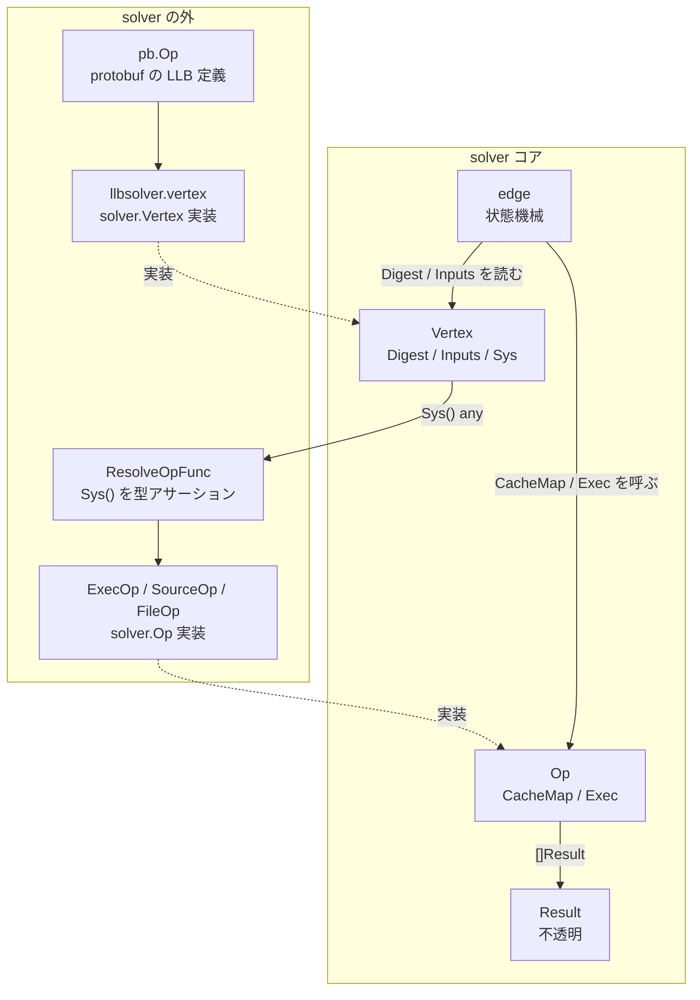

## 何を学んだか

`solver` パッケージは BuildKit の中核だが、LLB を知らない。コンテナも知らないし、スナップショットも知らない。知っているのは「ダイジェストで同一性が決まる頂点」「頂点の n 番目の出力を指す辺」「その辺を解いた結果は `Release` できる不透明な値」という 3 つだけだ。

その境界を最もはっきり見せるのが `Vertex` インターフェースで、**「この頂点を実行する」メソッドを持っていない**。実行方法は別インターフェース `Op` にあり、`Op` は `Vertex.Sys()` が返す `any` を、solver の外から注入された解決関数に渡して得る。

## Vertex — 同一性と依存だけ

```go title="solver/types.go"
// Vertex is a node in a build graph. It defines an interface for a
// content-addressable operation and its inputs.
type Vertex interface {
	Digest() digest.Digest
	Sys() any
	Options() VertexOptions
	Inputs() []Edge
	Name() string
}
```

([solver/types.go L17-L36](https://github.com/moby/buildkit/blob/ca4838f8ddbd3612bca94bcb8a938d8a326110a3/solver/types.go#L17-L36))

5 つのメソッドの役割は、はっきり分かれている。

- `Digest()` — 同一性。コメントは "a checksum of the definition up to the vertex including all of its inputs" と言っている。入力まで含めたチェックサムなので、入力が違う 2 つの頂点が同じダイジェストになることはない。
- `Inputs()` — 依存。`Edge` は「どの頂点の、何番目の出力か」の組で、頂点は 0 個以上の入力を持てる。
- `Sys()` — 実行方法へのポインタ。solver から見ると型のない `any` でしかない。
- `Options()` — 定義に含まれないメタデータ。
- `Name()` — 進捗表示用の文字列。

```go title="solver/types.go"
type Index int

type Edge struct {
	Index  Index
	Vertex Vertex
}
```

([solver/types.go L38-L47](https://github.com/moby/buildkit/blob/ca4838f8ddbd3612bca94bcb8a938d8a326110a3/solver/types.go#L38-L47))

`Index` があるのは、1 回の実行が複数の出力を返しうるからだ。`Op.Exec` は `[]Result` を返し、`Edge.Index` はその配列の添字を指す。DAG の辺は「頂点から頂点」ではなく「出力から頂点」に張られている。この違いは後の群でずっと効いてくる。solver が本当に解いているのは頂点ではなく辺だからだ ([Job / state / edge / sharedOp の 4 層](../job-state-edge/))。

`Options()` が返す `VertexOptions` に何が入っているかを見ると、境界の位置がさらにはっきりする。

```go title="solver/types.go"
// VertexOptions define optional metadata for a vertex that doesn't change the
// definition or equality check of it. These options are not contained in the
// vertex digest.
type VertexOptions struct {
	IgnoreCache  bool
	CacheSources []CacheManager
	Description  map[string]string // text values with no special meaning for solver
	ExportCache  *bool
	ProgressGroup *pb.ProgressGroup
	Metadata      VertexMetadata
}
```

([solver/types.go L49-L60](https://github.com/moby/buildkit/blob/ca4838f8ddbd3612bca94bcb8a938d8a326110a3/solver/types.go#L49-L60))

`Description` に付いた `// text values with no special meaning for solver` というコメントが象徴的だ。solver はこの map を読まない。読むのは進捗を出す側と、`Name()` を実装する LLB 側だけだ。

## Op — 実行はこちら側

```go title="solver/types.go"
// Op defines how the solver can evaluate the properties of a vertex operation.
// An op is executed in the worker, and is retrieved from the vertex by the
// value of `vertex.Sys()`. The solver is configured with a resolve function to
// convert a `vertex.Sys()` into an `Op`.
type Op interface {
	CacheMap(context.Context, JobContext, int) (*CacheMap, bool, error)
	Exec(ctx context.Context, jobCtx JobContext, inputs []Result) (outputs []Result, err error)
	Acquire(ctx context.Context) (release ReleaseFunc, err error)
}
```

([solver/types.go L169-L183](https://github.com/moby/buildkit/blob/ca4838f8ddbd3612bca94bcb8a938d8a326110a3/solver/types.go#L169-L183))

`Op` には 3 つしかない。「この操作のキャッシュキーの作り方を教えろ」「入力を渡すから実行しろ」「実行前に資源を確保しろ」だ。

`Vertex` と `Op` をつなぐのが `ResolveOpFunc` で、これは solver の外から `SolverOpt` として渡される。

```go title="solver/jobs.go"
// ResolveOpFunc finds an Op implementation for a Vertex
type ResolveOpFunc func(Vertex, Builder) (Op, error)
```

([solver/jobs.go L28-L29](https://github.com/moby/buildkit/blob/ca4838f8ddbd3612bca94bcb8a938d8a326110a3/solver/jobs.go#L28-L29))

LLB 側の配線はこうなっている。

```go title="solver/llbsolver/solver.go"
func (s *Solver) resolver() solver.ResolveOpFunc {
	return func(v solver.Vertex, b solver.Builder) (solver.Op, error) {
		w, err := s.resolveWorker()
		// ...
		return w.ResolveOp(v, br, s.sm, worker.ProxyOpt{...})
	}
}
```

([solver/llbsolver/solver.go L145-L157](https://github.com/moby/buildkit/blob/ca4838f8ddbd3612bca94bcb8a938d8a326110a3/solver/llbsolver/solver.go#L145-L157))

`ResolveOp` の中で `v.Sys()` を `*pb.Op` にキャストし、`Op_Exec` なら ExecOp、`Op_Source` なら SourceOp、と分岐する。この型アサーションは solver の外で起きている。

## LLB 側の Vertex 実装

`solver.Vertex` の LLB 実装は 30 行にも満たない。

```go title="solver/llbsolver/vertex.go"
type vertex struct {
	sys     any
	options solver.VertexOptions
	inputs  []solver.Edge
	digest  digest.Digest
	name    string
}

func (v *vertex) Sys() any { return v.sys }

func (v *vertex) Name() string {
	if name, ok := v.options.Description["llb.customname"]; ok {
		return name
	}
	return v.name
}
```

([solver/llbsolver/vertex.go L23-L51](https://github.com/moby/buildkit/blob/ca4838f8ddbd3612bca94bcb8a938d8a326110a3/solver/llbsolver/vertex.go#L23-L51))

構築は `newVertex` が行い、`sys` に `*pb.Op` (protobuf のオペレーション定義) を入れ、`inputs` に protobuf の `Inputs` を再帰的に変換したものを入れる。

```go title="solver/llbsolver/vertex.go"
vtx := &vertex{sys: op.Op, options: opt, digest: dgst, name: name}
for _, in := range op.Inputs {
	sub, err := load(digest.Digest(in.Digest))
	// ...
	vtx.inputs = append(vtx.inputs, solver.Edge{Index: solver.Index(in.Index), Vertex: sub})
}
```

([solver/llbsolver/vertex.go L295-L302](https://github.com/moby/buildkit/blob/ca4838f8ddbd3612bca94bcb8a938d8a326110a3/solver/llbsolver/vertex.go#L295-L302))

つまり LLB の `Definition` ([Op の平坦な配列が DAG になる](../llb-definition/)) から `solver.Vertex` への変換はここだけで完結していて、solver コアは protobuf を一切見ない。



## Result も不透明

実行結果も同じ扱いだ。

```go title="solver/types.go"
// Result is an abstract return value for a solve
type Result interface {
	ID() string
	Release(context.Context) error
	Sys() any
	Clone() Result
}
```

([solver/types.go L68-L74](https://github.com/moby/buildkit/blob/ca4838f8ddbd3612bca94bcb8a938d8a326110a3/solver/types.go#L68-L74))

solver は結果の中身を見ない。できるのは ID を取ること、解放すること、複製すること、そして `Sys()` で外に渡すことだけだ。LLB では `Sys()` の先にスナップショット参照 (`cache.ImmutableRef`) が入るが、solver はスナップショットという語彙を持たない。

`Release` が interface に入っているのは重要で、solver は結果のライフタイム管理には責任を持つ。実行して要らなくなった出力は捨てる:

```go title="solver/edge.go"
for i := range results {
	if i != int(index) {
		go results[i].Release(context.WithoutCancel(ctx))
	}
}
```

([solver/edge.go L989-L993](https://github.com/moby/buildkit/blob/ca4838f8ddbd3612bca94bcb8a938d8a326110a3/solver/edge.go#L989-L993))

`Op.Exec` は全出力を返すが、この辺が欲しいのは `e.edge.Index` 番目だけなので、残りはその場で解放する。`context.WithoutCancel` になっているのは、解放処理を親のキャンセルに巻き込まれないようにするためだ。

## キャッシュキーの作り方も外から教わる

`Op.CacheMap` が返す `CacheMap` は、solver がキャッシュキーを組み立てるための材料であって、キーそのものではない。

```go title="solver/types.go"
// CacheMap is a description for calculating the cache key of an operation.
type CacheMap struct {
	Digest digest.Digest

	Deps []struct {
		Selector digest.Digest
		ComputeDigestFunc ResultBasedCacheFunc
		PreprocessFunc PreprocessFunc
	}

	Opts CacheOpts
}
```

([solver/types.go L213-L247](https://github.com/moby/buildkit/blob/ca4838f8ddbd3612bca94bcb8a938d8a326110a3/solver/types.go#L213-L247))

`Digest` は「この操作そのものの識別子」で、コメントには "in LLB this digest is a manifest digest for OCI images, or commit SHA for git sources" とある。`Deps[i].ComputeDigestFunc` は「入力 i が解け終わってから、その中身を見てダイジェストを出す関数」で、これが遅いキー (slow cache) の正体だ ([fast cache と slow cache](../fast-slow-cache/))。

solver がやるのは、この `Digest` と入力のキー集合を組み合わせて `CacheKey` を作り、`CacheManager.Query` に投げること。何が「中身」かは知らない。

## なぜそうなっているか

`docs/dev/solver.md` に設計意図が書かれている。

> `Sys()` method returns an object that is used to resolve the executor for the operation. This is how a definition can pass logic to the worker that will execute the task associated with the vertex, without the solver needing to know anything about the implementation.

([docs/dev/solver.md L69-L76](https://github.com/moby/buildkit/blob/ca4838f8ddbd3612bca94bcb8a938d8a326110a3/docs/dev/solver.md#L69-L76))

「solver に実装のことを何も知らせない」ことが目的として明記されている。この境界があるので、LLB 以外の DAG を同じ solver に流すことも、worker を差し替えることも、原理的には可能になっている。

もう 1 つ、ダイジェストの有効範囲についての注意が同じドキュメントにある。

> The vertex digest can only be used for comparison while the solver is running and not between different invocations.

([docs/dev/solver.md L61-L67](https://github.com/moby/buildkit/blob/ca4838f8ddbd3612bca94bcb8a938d8a326110a3/docs/dev/solver.md#L61-L67))

`docker.io/library/alpine:latest` を含むビルドが 2 本走れば、頂点ダイジェストが一致するので pull は 1 回で済む。しかし前回のビルドで作られた成果物を「ダイジェストが同じだから使い回す」ことはできない。`latest` が指すイメージが変わっているかもしれないからだ。**頂点ダイジェストは実行時の重複排除のための ID であって、キャッシュキーではない。** キャッシュキーはあくまで `CacheMap.Digest` から作られる別物だ。この区別は [「何をキャッシュヒットとみなすか」](../what-is-a-cache-hit/) の話に直結する。

## どう活かすか

**「何であるか」と「どう実行するか」を別インターフェースに割る。** グラフを解くコードにとって必要なのは同一性と依存だけで、実行方法は要らない。`Vertex` に `Exec()` を生やしたくなる衝動を抑えて `Op` に追い出したことで、solver は 3000 行足らずでビルドシステムのドメイン語彙をゼロ個しか含まないコードになっている。

**不透明な `any` を 1 箇所に閉じ込める。** `Sys()` の型アサーションは `ResolveOpFunc` の中でしか起きない。型安全を失う場所を 1 関数に集約すれば、そこだけレビューすれば済む。ジェネリクスで縛るよりこのほうが、複数の実装を後から足すときに素直だ。

**同一性の ID と、キャッシュのキーを混ぜない。** 「同じものか」と「前回の結果を使ってよいか」は別の問いだ。BuildKit はこれを頂点ダイジェストとキャッシュキーに分けたことで、`latest` タグのような可変な参照を持つ DAG でも安全に重複排除ができている。
