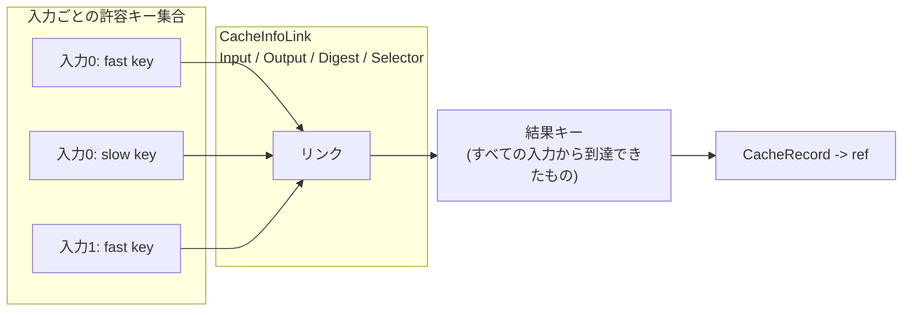

## 何を学んだか

「キャッシュヒット」は自明な概念に見えるが、BuildKit のソースを読むと**明示的に定義し直された概念**であることが分かる。定義は 3 段になっている。

1. **各 Op が「自分の同一性」を申告する** — `CacheMap.Digest`。これは実行前に計算できる。
2. **入力ごとに「許容できるキーの集合」を持つ** — `CacheKey.deps` は `[][]CacheKeyWithSelector` という二重配列で、1 つの入力に複数のキーがありうる。
3. **合成されたキーが、永続化されたリンクグラフ上で辿れるか** — 一致判定はハッシュの等値比較ではなく、`CacheInfoLink` を辺とするグラフ探索になる。

さらに、キーには「定義から決まるもの」(fast) と「入力の中身を見ないと決まらないもの」(slow) の 2 種類がある。この区別は `CacheMap` の型定義そのものに書き込まれている。

## CacheMap — Op が申告する同一性

`Op` インターフェースの `CacheMap` が返す型に、定義がすべて書いてある。

```go title="solver/types.go"
// CacheMap is a description for calculating the cache key of an operation.
type CacheMap struct {
	// Digest returns a checksum for the operation. The operation result can be
	// cached by a checksum that combines this digest and the cache keys of the
	// operation's inputs.
	//
	// For example, in LLB this digest is a manifest digest for OCI images, or
	// commit SHA for git sources.
	Digest digest.Digest

	// Deps contain optional selectors or content-based cache functions for its
	// inputs.
	Deps []struct {
		// Selector is a digest that is merged with the cache key of the input.
		// Selectors are not merged with the result of the `ComputeDigestFunc` for
		// this input.
		Selector digest.Digest

		// ComputeDigestFunc should return a digest for the input based on its return
		// value.
		//
		// For example, in LLB this is invoked to calculate the cache key based on
		// the checksum of file contents from input snapshots.
		ComputeDigestFunc ResultBasedCacheFunc

		// PreprocessFunc is a function that runs on an input before it is passed to op
		PreprocessFunc PreprocessFunc
	}
	// ...
}
```

([solver/types.go L213-L247](https://github.com/moby/buildkit/blob/ca4838f8ddbd3612bca94bcb8a938d8a326110a3/solver/types.go#L213-L247))

コメントに 3 つのことが書かれている。

**「この digest と入力のキーを組み合わせたチェックサムで結果をキャッシュできる」** — キーは頂点単体では決まらない。必ず入力のキーとの合成になる。だからキャッシュキーの計算は葉から根への伝播になる。

**「例えば OCI イメージの manifest digest、git ソースの commit SHA」** — `docker-image://alpine:3.21` という文字列ではなく、それが解決した先の manifest digest が digest になる。タグが動いたら別の digest になり、同じ digest を指す別のタグは同じキーになる。**参照の文字列ではなく、参照の指す先の内容で同一性を定義している。**

**`ComputeDigestFunc` は「入力の返り値に基づいて」digest を返す** — こちらは実行結果 (= 入力のスナップショット) を見ないと計算できない。これが slow cache key で、`COPY` の対象ファイルをハッシュする contenthash がここに入る ([fast cache と slow cache](../fast-slow-cache/))。

`Selector` と `ComputeDigestFunc` の関係についても、コメントが明示している。「Selector は `ComputeDigestFunc` の結果とは合成されない」。`COPY /out/app /app` で言えば、fast key 側は「入力全体のキー + `/out/app` というセレクタ」で作られ、slow key 側は「`/out/app` の内容ハッシュ」そのものになる。セレクタは既に内容ハッシュの計算範囲に織り込まれているので、二重に混ぜる必要がない。

## 何をキーから外すか

`ExecOp.CacheMap` は、キーを計算する前に op のコピーからフィールドを落としていく。何を落とすかが「何を同じとみなすか」の定義そのものになる。

```go title="solver/llbsolver/ops/exec.go"
func (e *ExecOp) CacheMap(ctx context.Context, jobCtx solver.JobContext, index int) (*solver.CacheMap, bool, error) {
	op := cloneExecOp(e.op)

	for i := range op.Meta.ExtraHosts {
		h := op.Meta.ExtraHosts[i]
		h.IP = ""
		op.Meta.ExtraHosts[i] = h
	}

	for i := range op.Mounts {
		m := op.Mounts[i]
		m.Selector = ""

		if checkShouldClearCacheOpts(m) {
			m.CacheOpt.ID = ""
			m.CacheOpt.Sharing = 0
		}
	}
	op.Meta.ProxyEnv = nil
	// ...
```

([solver/llbsolver/ops/exec.go L114-L132](https://github.com/moby/buildkit/blob/ca4838f8ddbd3612bca94bcb8a938d8a326110a3/solver/llbsolver/ops/exec.go#L114-L132))

`--add-host` で指定した IP アドレス、プロキシ環境変数、マウントのセレクタは、キーから外れる。「同じビルドを別のネットワーク環境で走らせても同じ結果になるはずだ」という判断が、この数行に埋まっている。何をキーに含めるかは正しさとキャッシュ効率のトレードオフで、ここが BuildKit で最も繊細な部分の 1 つになる ([ExecOp の CacheMap — 何をキーから外し、どのバグを再現し続けるか](../execop-cachemap/))。

digest 化は JSON にしてからハッシュを取る。

```go title="solver/llbsolver/ops/exec.go"
	dt, err := json.Marshal(struct {
		Type       string
		Exec       *pb.ExecOp
		OS         string
		Arch       string
		// ...
	}{
		Type: execCacheType,
		Exec: op,
		// ...
	})
	// ...
	dgst, err := cachedigest.FromBytes(dt, cachedigest.TypeJSON)
```

([solver/llbsolver/ops/exec.go L163-L187](https://github.com/moby/buildkit/blob/ca4838f8ddbd3612bca94bcb8a938d8a326110a3/solver/llbsolver/ops/exec.go#L163-L187))

`Type` フィールドが先頭にあるのは名前空間の分離で、別種の Op が偶然同じバイト列にならないようにしている。

## CacheKey — 入力ごとに「集合」を持つ

合成後のキーはこの型になる。

```go title="solver/cachekey.go"
type CacheKey struct {
	mu sync.RWMutex

	ID   string
	deps [][]CacheKeyWithSelector
	// digest is the digest returned by the CacheMap implementation of this op
	digest digest.Digest
	// vtx is the LLB digest that this op was created for
	vtx    digest.Digest
	output Index
	ids    map[*cacheManager]string

	indexIDs []string
}
```

([solver/cachekey.go L35-L48](https://github.com/moby/buildkit/blob/ca4838f8ddbd3612bca94bcb8a938d8a326110a3/solver/cachekey.go#L35-L48))

`deps` が `[][]CacheKeyWithSelector` であることが決定的だ。外側の配列は入力の番号、**内側の配列は「その入力について現時点で許容できるキーの一覧」**を表す。1 つの入力に複数のキーがあるのは、fast key と slow key が両方立ちうるからであり、また同じ結果に到達する経路が複数ありうるからでもある。

```go title="solver/cachekey.go"
// CacheKeyWithSelector combines a cache key with an optional selector digest.
// Used to limit the matches for dependency cache key.
type CacheKeyWithSelector struct {
	Selector digest.Digest
	CacheKey ExportableCacheKey
}
```

([solver/cachekey.go L22-L27](https://github.com/moby/buildkit/blob/ca4838f8ddbd3612bca94bcb8a938d8a326110a3/solver/cachekey.go#L22-L27))

`digest` と `vtx` が別フィールドなのも読みどころだ。`digest` は `CacheMap` が返したもの (= 内容ベースの同一性)、`vtx` はこのキーを作った LLB 頂点の digest (= 定義ベースの ID)。**両者は一致しない。** 同じ `docker-image://alpine:latest` を指す 2 つの LLB 頂点は `vtx` が同じでも、解決した manifest digest が変われば `digest` が変わる。逆に別の LLB 頂点でも同じイメージを指していれば `digest` は一致する。

入力を持たない頂点 (root) だけは、この合成が要らない。

```go title="solver/cachemanager.go"
func rootKey(dgst digest.Digest, output Index) digest.Digest {
	out, _ := cachedigest.FromBytes(fmt.Appendf(nil, "%s@%d", dgst, output), cachedigest.TypeString)
	if strings.HasPrefix(dgst.String(), "random:") {
		return digest.Digest("random:" + dgst.Encoded())
	}
	return out
}
```

([solver/cachemanager.go L451-L457](https://github.com/moby/buildkit/blob/ca4838f8ddbd3612bca94bcb8a938d8a326110a3/solver/cachemanager.go#L451-L457))

`random:` プレフィックスは「このキーは絶対に一致させるな」という印だ。ハッシュを取らずにそのまま返すので、毎回違うキーになる。local source のように毎回内容が変わりうるものが使う ([local source — 毎回変わるキーと SharedKey の折り合い](../local-source/))。

## 一致判定はグラフ探索

ここが最も直感に反する部分だ。キャッシュの一致は「キーを計算して map を引く」ではない。キャッシュストレージが持つのはキーからキーへの**リンク**で、リンクのラベルはこの型になっている。

```go title="solver/cachestorage.go"
// CacheInfoLink is a link between two cache keys
type CacheInfoLink struct {
	Input    Index         `json:"Input,omitempty"`
	Output   Index         `json:"Output,omitempty"`
	Digest   digest.Digest `json:"Digest,omitempty"`
	Selector digest.Digest `json:"Selector,omitempty"`
}
```

([solver/cachestorage.go L38-L44](https://github.com/moby/buildkit/blob/ca4838f8ddbd3612bca94bcb8a938d8a326110a3/solver/cachestorage.go#L38-L44))

「入力キー X から、`(何番目の入力か, 何番目の出力か, この Op の digest, セレクタ)` というラベルの辺を辿ると、結果キー Y に着く」という形で保存されている。だから `CacheManager` の探索メソッドは `Get` ではなく `Query` という名前で、コメントも「経路を探す」と言っている。

```go title="solver/types.go"
	// Query searches for cache paths from one cache key to the output of a
	// possible match.
	Query(inp []CacheKeyWithSelector, inputIndex Index, dgst digest.Digest, outputIndex Index) ([]*CacheKey, error)
```

([solver/types.go L288-L290](https://github.com/moby/buildkit/blob/ca4838f8ddbd3612bca94bcb8a938d8a326110a3/solver/types.go#L288-L290))

入力が複数ある場合、答えは**各入力からの経路の積集合**になる。この論理は solver 内のインデックスにも同じ形で現れる。

```go title="solver/index.go"
func (ei *edgeIndex) getAllMatches(k *CacheKey) []string {
	deps := k.Deps()

	if len(deps) == 0 {
		return []string{rootKey(k.Digest(), k.Output()).String()}
	}
	// ...
	for i, dd := range deps {
		if i == 0 {
			for _, d := range dd {
				ll := CacheInfoLink{Input: Index(i), Digest: k.Digest(), Output: k.Output(), Selector: d.Selector}
				// 入力 0 から辿れる先をすべて matches に入れる
			}
			continue
		}

		if len(matches) == 0 {
			break
		}

		for m := range matches {
			// 入力 i からも m に辿り着けなければ matches から落とす
		}
	}
```

([solver/index.go L174-L238](https://github.com/moby/buildkit/blob/ca4838f8ddbd3612bca94bcb8a938d8a326110a3/solver/index.go#L174-L238))

入力 0 で候補集合を作り、入力 1 以降で絞り込んでいく。**すべての入力から同じ結果キーに辿り着けたときだけ一致**、というのが BuildKit のキャッシュヒットの定義だ。



## fast と slow の 2 相

`CacheMap` の `ComputeDigestFunc` があるとき、edge はまず fast key だけで探索し、そのあと入力を実際に評価して slow key を作り、もう一度探索する。

```go title="solver/edge.go"
		if e.cacheMap.Deps[int(dep.index)].ComputeDigestFunc != nil && dgst != "" {
			k := NewCacheKey(dgst, "", -1)
			dep.slowCacheKey = &ExportableCacheKey{CacheKey: k, Exporter: &exporter{k: k}}
			slowKeyExp := CacheKeyWithSelector{CacheKey: *dep.slowCacheKey}
			// ...
			dep.slowCacheFoundKey = e.probeCache(dep, []CacheKeyWithSelector{slowKeyExp})

			// connect def key to slow key
			e.op.Cache().Query(append(defKeys, slowKeyExp), dep.index, e.cacheMap.Digest, e.edge.Index)
```

([solver/edge.go L709-L721](https://github.com/moby/buildkit/blob/ca4838f8ddbd3612bca94bcb8a938d8a326110a3/solver/edge.go#L709-L721))

`NewCacheKey(dgst, "", -1)` の第 2・第 3 引数が空と `-1` なのは、slow key が「どの頂点のものか」を持たないからだ。内容だけがキーになる。

最後の `Query` の呼び方に注目したい。返り値を使っていない。これは検索ではなく、**定義ベースのキーと内容ベースのキーの間にリンクを張る副作用**が目的だ ([Query が副作用でリンクを張る](../query-side-effects/))。次回のビルドでは、定義キーから内容キーへ 1 ホップで辿れるようになる。

## なぜそうなっているか

「キーを計算して map を引く」ではなくグラフ探索になっている理由は、**キーが「これまでに観測されたもの」の集合だから**だと読める。`COPY . /src` の slow key は、実際にファイルをハッシュするまで分からない。しかしファイルをハッシュするには、入力のスナップショットが手元になければならない。つまり「キーを全部計算してから引く」という手順が成立しない。

代わりに BuildKit は、分かっている範囲のキーで探索を進め、経路が見つかればそこで止まり、見つからなければもう一段深く評価する、という漸進的な形をとる。`CacheKey.deps` が集合であるのも、探索の途中経過を持ち歩くためだ。edge の状態機械が「下界と上界」で語られるのはこのためで ([edge の状態機械](../edge-state-machine/))、キャッシュ探索の構造が solver の構造を決めている。

リンクを bbolt に永続化して、キー値そのものは保存しない、という選択も効いている。保存されているのは「X から Y へ行ける」という関係であって、「このキーの答えはこれ」という表ではない。だから別のキーから同じ結果に到達する経路が後から増えても、既存のリンクは壊れない ([bbolt にリンクとバックリンクを永続化する](../bbolt-cache-links/))。

## どう活かすか

**キャッシュキーを「何と何が同じなら同じ結果になるか」の仕様として書く。** `CacheMap` の型定義は、実装ではなく仕様になっている。「digest は manifest digest か commit SHA」「ComputeDigestFunc は入力の中身から計算する」という記述が型のコメントにあるおかげで、新しい Op を足す人は何を返すべきかを判断できる。キャッシュを持つシステムでは、キーの意味を型かドキュメントに固定しておかないと、実装ごとに解釈がぶれて誤ヒットが出る。

**「参照の文字列」ではなく「参照の指す先」でキーを作る。** `alpine:3.21` を manifest digest に解決してからキーにする、という一手間が、タグの再push に追随できるかどうかを分ける。外部リソースをキャッシュキーに含めるとき、可変な名前をそのまま使っていないかを疑う。

**計算コストが違うキーは、型で区別して段階的に使う。** fast key (定義から即座に決まる) と slow key (入力を評価しないと決まらない) を混ぜずに `Selector` と `ComputeDigestFunc` という別のフィールドにしたことで、「安いキーで絞ってから高いキーを計算する」という戦略が自然に書ける。キャッシュ判定にコストの高い処理が要るとき、安い判定を先に置く余地がないかを見る。
