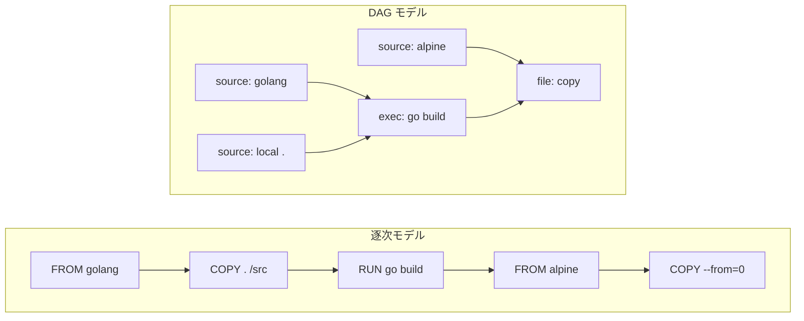

## 何を学んだか

BuildKit の README が最初に並べる Key features のうち、上位 3 つ — `Extendable frontend formats` / `Concurrent dependency resolution` / `Efficient instruction caching` — は独立した機能追加ではない。3 つとも「ビルドを 1 命令ずつ実行するのではなく、まず DAG に変換する」という 1 つの決定から出てくる。逆に言えば、逐次実行モデルのままではこの 3 つはどれも実装できない。

ソースを読むと、この構造が型のレベルで固定されているのが分かる。ビルドの中間表現である LLB は proto ファイルの先頭で「DAG である」と宣言され、solver の `Vertex` インターフェースには**実行するメソッドがない**。ビルドを表すデータ構造と、それを実行する仕組みが完全に分離されている。

## 逐次モデルで詰まる 3 か所

古典的な `docker build` は、Dockerfile の各命令を「親イメージ + 命令文字列」から新しいイメージを作る関数として扱い、その結果を次の命令の親に渡す。並びは 1 本の鎖になる。



この鎖の形が、3 つの制約をそのまま作る。

1. **並列化できない** — 鎖なので、常に直前の結果を待つ。マルチステージビルドで無関係な 2 ステージがあっても、鎖に並べた以上は順に走る。
2. **キャッシュヒットの判定材料が乏しい** — 「親イメージ ID + 命令文字列」しか持たないので、`COPY . /src` の対象ファイルが変わっていないことを判定する手段が構造として存在しない。
3. **記法を差し替えられない** — 「命令」の意味を知っているのは実行器そのものなので、Dockerfile 以外の入力を受けるにはビルダ本体を書き換えるしかない。

## DAG にすると 3 つが同時に外れる

### 並列化 — 辺のない頂点は同時に解いてよい

LLB の proto はパッケージコメントで DAG であることを名乗る。

```proto title="solver/pb/ops.proto"
// Package pb provides the protobuf definition of LLB: low-level builder instruction.
// LLB is DAG-structured; Op represents a vertex, and Definition represents a graph.
package pb;
```

([solver/pb/ops.proto L3-L5](https://github.com/moby/buildkit/blob/ca4838f8ddbd3612bca94bcb8a938d8a326110a3/solver/pb/ops.proto#L3-L5))

solver 側の `Vertex` は、この DAG の頂点をそのまま受ける。

```go title="solver/types.go"
// Vertex is a node in a build graph. It defines an interface for a
// content-addressable operation and its inputs.
type Vertex interface {
	// Digest returns a checksum of the definition up to the vertex including
	// all of its inputs.
	Digest() digest.Digest
	// ...
	// Inputs returns an array of edges the vertex depends on. An input edge is
	// a vertex and an index from the returned array of results from an executor
	// returned by Sys(). A vertex may have zero inputs.
	Inputs() []Edge

	Name() string
}
```

([solver/types.go L15-L36](https://github.com/moby/buildkit/blob/ca4838f8ddbd3612bca94bcb8a938d8a326110a3/solver/types.go#L15-L36))

「依存」は `Inputs()` にしか現れない。つまり **`Inputs()` に互いが出てこない 2 頂点は、同時に解いても定義上安全**であり、並列化は特別な機能ではなく DAG の性質から自動的に出てくる。

実際の並列実行は、スケジューラが要求を goroutine に落とすところで起きる。スケジューラのループ自体はシングルスレッドで、重い処理は必ずここを通って外に出る。

```go title="solver/scheduler.go"
// newRequestWithFunc creates a new request pipe that invokes a async function
func (s *scheduler) newRequestWithFunc(e *edge, f func(context.Context) (any, error)) pipeReceiver {
	pp, start := pipe.NewWithFunction[*edgeRequest](f)
	// ...
	s.outgoing[e] = append(s.outgoing[e], p)
	go start()
	return p.Receiver
}
```

([solver/scheduler.go L271-L286](https://github.com/moby/buildkit/blob/ca4838f8ddbd3612bca94bcb8a938d8a326110a3/solver/scheduler.go#L271-L286))

詳細は [スケジューラのシングルスレッドループと pipe](../scheduler-loop/) で扱う。

### キャッシュ — キーの計算が「実行」から切り離される

DAG の頂点は、実行する前に「実行したら何が出てくるか」を表すキーを申告できる。solver の `Op` インターフェースは、`Exec` と `CacheMap` を別のメソッドとして持つ。

```go title="solver/types.go"
type Op interface {
	// CacheMap returns structure describing how the operation is cached.
	// Currently only roots are allowed to return multiple cache maps per op.
	CacheMap(context.Context, JobContext, int) (*CacheMap, bool, error)

	// Exec runs an operation given results from previous operations.
	Exec(ctx context.Context, jobCtx JobContext, inputs []Result) (outputs []Result, err error)

	// Acquire acquires the necessary resources to execute the `Op`.
	Acquire(ctx context.Context) (release ReleaseFunc, err error)
}
```

([solver/types.go L169-L182](https://github.com/moby/buildkit/blob/ca4838f8ddbd3612bca94bcb8a938d8a326110a3/solver/types.go#L169-L182))

`CacheMap` は `Exec` を呼ばずに計算できる。逐次モデルでは「イメージ ID」という**実行結果**が次の命令のキーの材料だったのに対し、ここでは頂点の**定義**からキーが決まる。この違いが、キャッシュヒット判定を「命令文字列の一致」から解放する。詳しくは [「何をキャッシュヒットとみなすか」を定義する](../what-is-a-cache-hit/)。

### フロントエンド — DAG を吐けるものは何でもよい

Dockerfile を読む仕事は、`Frontend` という 1 メソッドのインターフェースの向こう側に押し出されている。

```go title="frontend/frontend.go"
type Frontend interface {
	Solve(ctx context.Context, llb FrontendLLBBridge, exec executor.Executor, opt map[string]string, inputs map[string]*pb.Definition, sid string, sm *session.Manager) (*Result, error)
}
```

([frontend/frontend.go L28-L30](https://github.com/moby/buildkit/blob/ca4838f8ddbd3612bca94bcb8a938d8a326110a3/frontend/frontend.go#L28-L30))

buildkitd の起動時に登録されるのはたった 2 つで、しかも片方 (`gateway.v0`) は「フロントエンドをコンテナイメージとして実行する」ためのメタなフロントエンドだ。

```go title="cmd/buildkitd/main.go"
	frontends := map[string]frontend.Frontend{}

	if cfg.Frontends.Dockerfile.Enabled == nil || *cfg.Frontends.Dockerfile.Enabled {
		frontends["dockerfile.v0"] = forwarder.NewGatewayForwarder(wc.Infos(), dockerfile.Build)
	}
	if cfg.Frontends.Gateway.Enabled == nil || *cfg.Frontends.Gateway.Enabled {
		gwfe, err := gateway.NewGatewayFrontend(wc.Infos(), cfg.Frontends.Gateway.AllowedRepositories)
		// ...
		frontends["gateway.v0"] = gwfe
	}
```

([cmd/buildkitd/main.go L884-L895](https://github.com/moby/buildkit/blob/ca4838f8ddbd3612bca94bcb8a938d8a326110a3/cmd/buildkitd/main.go#L884-L895))

Dockerfile は「組み込みのフロントエンドの 1 つ」に降格していて、solver 側は Dockerfile という語を知らない。この構造が `# syntax=` 1 行で方言を差し替えられる理由になっている ([#syntax= はフロントエンドの再帰呼び出しである](../syntax-directive/))。

## なぜそうなっているか

PROJECT.md の "Project scope" が、この分離を明文で守っている。

> - BuildKit provides the best solution for defining a build graph, executing and caching it as efficiently as possible, and exporting the result to a place where it can be used by other tools.
> - BuildKit isn't limited to only supporting features used by Docker build.

([PROJECT.md L113-L119](https://github.com/moby/buildkit/blob/ca4838f8ddbd3612bca94bcb8a938d8a326110a3/PROJECT.md#L113-L119))

「グラフを定義し、実行し、キャッシュし、エクスポートする」という 4 段の言い方が、そのままリポジトリのディレクトリ構成 (`client/llb` → `solver` → `cache` → `exporter`) になっている。同じ節には、やらないこととして「新しいフロントエンドを発明すること」が明示的に挙がっている。フロントエンドは拡張点であって本体の仕事ではない、という線が引かれている。

さらに `Vertex` インターフェースに `Exec` がないことが効いてくる。solver は頂点が何をするものかを知らず、`Sys()` が返す不透明な値を worker が `Op` に解決する ([Vertex は何も知らない — solver コアの抽象境界](../vertex-abstraction/))。この抽象境界のおかげで、solver のコードはキャッシュ探索とスケジューリングだけに専念でき、「RUN とは何か」「COPY とは何か」はすべて worker 側に閉じる。

## どう活かすか

**「実行する」を「グラフを作る」と「グラフを解く」に割ると、並列化とキャッシュとプラグイン性が同時に付いてくる。** 逐次実行のパイプラインを持っているとき、並列化だけを後から足そうとしても依存関係の情報がどこにもない、という壁に当たる。先に依存を明示したデータ構造に落とすと、並列化はスケジューラの仕事に、キャッシュは「頂点のキーを定義から計算する」問題に、拡張性は「そのデータ構造を吐く別の実装」に分解される。

**キーの計算を実行から切り離せるかを、設計の分岐点として見る。** `Op` が `CacheMap` と `Exec` を別メソッドで持つのは些細に見えて、キャッシュ設計の根幹だ。「実行してみないとキーが分からない」構造だと、キャッシュは実行後の後付けにしかならない。実行前にキーを申告できる形にできるか、できないならどこまで前倒しできるかを最初に決めておくと後が楽になる。

**「本体がやらないこと」をドキュメントに書いておくと、抽象境界が腐りにくい。** PROJECT.md の "Things that do not define BuildKit" は、コードレビューで「これは frontend 側の仕事では」と言うための共有された根拠になっている。インターフェースを 1 つ切っただけでは境界は守られず、越境の誘惑が来たときに参照できる文書が要る。
