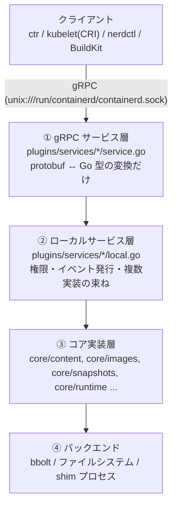

## 何を学んだか

### 4 層の積み重ね

containerd のコードは、リクエストの流れに沿って 4 段に分かれている。



`ctr images ls` が返ってくるまでの経路で言えば、① が protobuf をデコードし、② が namespace を確認してフィルタを適用し、③ が bbolt を読み、④ が実際のバイトを返す。

層ごとに責務が狭いので、1 つの機能を追うときに読むべき場所が絞れる。逆に言えば、**同じ名前のファイルが層をまたいで存在する** ので、どの層を読んでいるのかを常に意識する必要がある。

### 動くもの・置くもの・繋ぐもの

コア実装層をさらに機能で分けると、containerd は 3 種類の関心事を持っている。

| 関心事                         | 主なパッケージ                                                   | 状態の置き場                      |
| ------------------------------ | ---------------------------------------------------------------- | --------------------------------- |
| **置く** (イメージとデータ)    | `core/content`, `core/images`, `core/snapshots`, `core/metadata` | `/var/lib/containerd` + bbolt     |
| **動かす** (実行)              | `core/runtime/v2`, `core/sandbox`                                | `/run/containerd` + shim プロセス |
| **繋ぐ** (転送・イベント・API) | `core/transfer`, `core/remotes`, `core/events`, `core/streaming` | 状態を持たない                    |

「置く」は永続的でトランザクションが要る。「動かす」は揮発的でプロセスの生死が絡む。「繋ぐ」はその場限りだ。この 3 つで求められる性質が違うので、実装の様子もかなり違う。

### プロセスの外形

デーモンが listen するソケットは 3 つある。

| ソケット                                | 用途                                           |
| --------------------------------------- | ---------------------------------------------- |
| `/run/containerd/containerd.sock`       | メインの gRPC API。クライアントと CRI          |
| `/run/containerd/containerd.sock.ttrpc` | ttrpc API。主に shim からのイベント publish 用 |
| `/run/containerd/debug.sock`            | pprof と trace                                 |

ディレクトリは 2 つ。

- `/var/lib/containerd/<プラグイン URI>/` — 永続データ (content store、snapshot、bbolt)
- `/run/containerd/<プラグイン URI>/` — 揮発データ (bundle、ソケット、fifo)

**プラグインごとにディレクトリが割り当てられる** のが特徴で、`/var/lib/containerd` の下を見れば有効なプラグインが分かる。

### ctr run を 1 本追う

`ctr run docker.io/library/alpine:latest test /bin/sh` で起きることを並べると、この章全体の地図になる。

1. **クライアント側で pull** — transfer service に依頼し、レジストリから blob を取って content store へ ([イメージを取り込む](../transfer-service/))
2. **unpack** — layer を差分ごとに snapshotter へ展開し、chainID をキーに committed snapshot を作る ([ダウンロードと展開をパイプラインでつなぐ](../unpack-pipeline/))
3. **Container レコードの作成** — イメージ名、snapshot キー、runtime 名、OCI spec を bbolt に書く。まだ何も動かない
4. **Prepare** — 最上位 snapshot の上に active snapshot を作り、マウント情報 (`[]mount.Mount`) を得る ([Snapshotter インターフェース](../snapshotter-interface/))
5. **Task の作成** — bundle ディレクトリを作り、`config.json` を書き、shim バイナリを起動して ttrpc で `Create` を送る ([runtime v2](../runtime-v2-binary/))
6. **shim が runc を呼ぶ** — rootfs をマウントし、`runc create` でコンテナを created 状態にする
7. **Start** — `runc start` で execve が起き、`TaskStart` イベントが流れる

このうち **1〜4 がクライアント側の判断で駆動される** ことが containerd の特徴で、デーモンは各ステップの primitive を提供しているだけだ ([smart client model](../smart-client/))。

## ソースコードのどこか

### 層の境界がファイル名に出ている

`plugins/services/tasks/` を見ると、2 つのファイルがある。

[`plugins/services/tasks/service.go#L33-L49`](https://github.com/containerd/containerd/blob/716cbaf51212adb5e80ca1c30b644bfeb9c9d779/plugins/services/tasks/service.go#L33-L49)。

```go title="plugins/services/tasks/service.go"
func init() {
	registry.Register(&plugin.Registration{
		Type: plugins.GRPCPlugin,
		ID:   "tasks",
		Requires: []plugin.Type{
			plugins.ServicePlugin,
		},
		InitFn: func(ic *plugin.InitContext) (any, error) {
			i, err := ic.GetByID(plugins.ServicePlugin, services.TasksService)
			if err != nil {
				return nil, err
			}
			return &service{local: i.(api.TasksClient)}, nil
		},
	})
}
```

gRPC サービスは `local` を 1 つ持つだけの構造体で、各メソッドはそれを呼ぶだけだ。そして `local` の型が **`api.TasksClient`** — つまり gRPC の **クライアント** インターフェースになっている。

[`plugins/services/tasks/local.go#L63-L70`](https://github.com/containerd/containerd/blob/716cbaf51212adb5e80ca1c30b644bfeb9c9d779/plugins/services/tasks/local.go#L63-L70)。

```go title="plugins/services/tasks/local.go"
var (
	_                    = (api.TasksClient)(&local{})
```

コンパイル時に「`local` は `TasksClient` を満たす」ことを確認している。ローカル実装が **クライアントのインターフェースを実装する** というのが containerd の一貫した作法で、これによって次の 2 つが同じコードで扱える。

- 外部プロセスから gRPC で呼ぶ場合 → 本物の gRPC クライアント
- 同一プロセスのプラグインから呼ぶ場合 → `local` を直接渡す

CRI プラグインが `WithInMemoryServices` でネットワークを介さずにコアを使えるのは、この設計のおかげだ ([CRI: kubelet がランタイムに要求する輪郭](../cri-interface/))。

### サービスの名前は定数で管理される

[`plugins/services/services.go#L17-L38`](https://github.com/containerd/containerd/blob/716cbaf51212adb5e80ca1c30b644bfeb9c9d779/plugins/services/services.go#L17-L38)。

```go title="plugins/services/services.go"
const (
	// ContentService is id of content service.
	ContentService = "content-service"
	// SnapshotsService is id of snapshots service.
	SnapshotsService = "snapshots-service"
	...
	// TasksService is id of tasks service.
	TasksService = "tasks-service"
```

`io.containerd.service.v1.tasks-service` のような ID で、プラグイン同士がお互いを見つける。文字列 ID による疎結合なので、ある層の実装を別のプラグインに差し替えても、参照する側のコードは変わらない。

### API を提供するのもプラグイン

[`plugins/server/grpc/plugin.go#L60-L76`](https://github.com/containerd/containerd/blob/716cbaf51212adb5e80ca1c30b644bfeb9c9d779/plugins/server/grpc/plugin.go#L60-L76)。

```go title="plugins/server/grpc/plugin.go"
func init() {
	registry.Register(&plugin.Registration{
		Type: plugins.ServerPlugin,
		ID:   "grpc",
		Requires: []plugin.Type{
			plugins.GRPCPlugin,
			plugins.MetricsPlugin,
		},
		Config: &config{
			Address:        defaults.DefaultAddress,
			UID:            os.Geteuid(),
			GID:            os.Getegid(),
			MaxRecvMsgSize: defaults.DefaultMaxRecvMsgSize,
			MaxSendMsgSize: defaults.DefaultMaxSendMsgSize,
		},
```

「gRPC でソケットを listen する」ことそのものがプラグインになっている。`Requires: GRPCPlugin` なので、**すべての gRPC サービスプラグインの初期化が終わった後に** 初期化され、それらをまとめて登録する。

サーバプラグインだけは特別扱いされ、`Server.Start()` で起動される ([`cmd/containerd/server/server.go#L211-L219`](https://github.com/containerd/containerd/blob/716cbaf51212adb5e80ca1c30b644bfeb9c9d779/cmd/containerd/server/server.go#L211-L219))。

```go title="cmd/containerd/server/server.go"
		if p.Type == plugins.ServerPlugin {
			srv, ok := instance.(server)
			if !ok {
				log.G(ctx).WithField("id", id).Warn("plugin does not implement server interface, will not be started")
			} else {
				s.servers = append(s.servers, srv)
			}
		}
```

つまり **初期化 (プラグインのロード) と、受付開始 (listen) が分離されている**。全プラグインが揃ってからソケットを開くので、「起動途中の containerd に kubelet が繋いで空の応答を受け取る」事態を避けられる。

### 停止は初期化の逆順

[`cmd/containerd/server/server.go#L280-L296`](https://github.com/containerd/containerd/blob/716cbaf51212adb5e80ca1c30b644bfeb9c9d779/cmd/containerd/server/server.go#L280-L296)。

```go title="cmd/containerd/server/server.go"
// Stop the containerd server canceling any open connections
func (s *Server) Stop() {
	for i := len(s.plugins) - 1; i >= 0; i-- {
		p := s.plugins[i]
		...
		closer, ok := instance.(io.Closer)
		if !ok {
			continue
		}
```

依存順に初期化したのだから、閉じるのは逆順。`io.Closer` を実装しているプラグインだけが対象で、実装していなければ黙って飛ばす。**インターフェースの有無で任意の振る舞いを表現する** のは Go らしいやり方だ。

## なぜそうなっているか

### 「同じ API を 2 つの経路で使う」ための層分け

gRPC サービスとローカルサービスを分けているのは、単なる整理のためではない。containerd 自身の CRI プラグインが、containerd のクライアント API を使ってコアを呼ぶからだ。

もし gRPC サービスにビジネスロジックを書いていたら、in-process から使うために別の経路を用意する必要があった。ロジックを `local` に置き、gRPC 層を変換だけにすることで、**呼び出し経路が 2 つでも実装は 1 つ** に保てる。

### プラグイン単位のディレクトリは、責任の境界でもある

`/var/lib/containerd/io.containerd.snapshotter.v1.overlayfs/` のように、プラグインごとにディレクトリが割り当てられる。これによって、

- プラグインが他のプラグインのデータを壊せない
- プラグインを無効にしたときに消すべきものが明確
- ディスク使用量をプラグインごとに測れる

という性質が自動的に手に入る。命名にプラグイン URI をそのまま使っているので、`ctr plugins ls` の出力とディレクトリ名が 1 対 1 に対応する。

### 揮発と永続を physically に分ける

`/run` (tmpfs) と `/var/lib` を分けているのは、**ホスト再起動時の整合性** のためだ。ホストが再起動すればコンテナは消えるが、イメージは残る。前者を tmpfs に置いておけば、再起動後に「動いているはずのコンテナ」の残骸を掃除する処理が要らない。

## どう活かすか

### コードを探すときの入口

機能から実装を探すときは、次の順で辿ると速い。

1. **API 名から** — `api/services/<名前>/v1/*.proto` で RPC を確認する
2. **gRPC 層** — `plugins/services/<名前>/service.go` (ほぼ何もしていない)
3. **ローカル層** — `plugins/services/<名前>/local.go` (ここに権限チェックとイベント発行)
4. **コア** — `core/<名前>/` (インターフェース定義と、汎用のヘルパ)
5. **実装** — `plugins/<種別>/<実装名>/`

「イメージ削除で何が起きるか」を追うなら、`plugins/services/images/local.go` の `Delete` から始めて、`core/metadata/images.go`、GC へと下りていく。

### 実行中の containerd の構成を見る

```sh
# 有効なプラグインと状態
$ ctr plugins ls

# 失敗しているプラグインの理由
$ ctr plugins ls -d id==zfs

# 実効設定 (デフォルト + 設定ファイル)
$ containerd config dump
```

`ctr plugins ls` の出力は、この章で扱う登場人物のほぼ全員が並ぶ一覧でもある。手元の環境で 1 度眺めておくと、以降の話が具体的になる。
