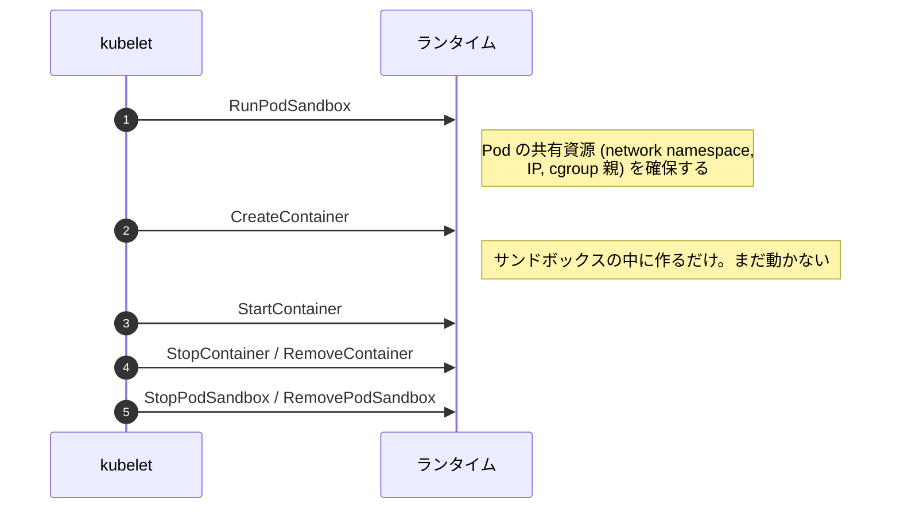

## 何を学んだか

### CRI は 2 つのサービスからなる

CRI (Container Runtime Interface) は Kubernetes が定める protobuf の gRPC インターフェースで、大きく 2 つのサービスに分かれる。

- **RuntimeService** — Pod サンドボックスとコンテナのライフサイクル、exec/attach、統計情報
- **ImageService** — イメージの pull / list / status / remove、イメージ用ファイルシステムの使用量

実装側 (containerd や CRI-O) は 1 つの Unix ソケットで両方を提供する。kubelet は `--container-runtime-endpoint=unix:///run/containerd/containerd.sock` でここに繋ぐ。

### Pod サンドボックスという中間概念

CRI の最大の特徴は、**コンテナの前に「サンドボックス」を作る** ことだ。



Pod 内の複数コンテナが同じ IP を共有し、`localhost` で互いに通信できるのは、サンドボックスが network namespace を保持しているからだ。伝統的な実装ではこれを **pause コンテナ** (何もせず眠り続ける小さなコンテナ) として実現する。namespace は「参加者が 1 人もいなくなると消える」ので、誰かが持ち続ける必要がある。

この「サンドボックス」を一般化したのが containerd の Sandbox API で、VM ベースのランタイム (Kata) もここに嵌まる ([Sandbox API: pause コンテナを一般化する](../sandbox-api/))。

### kubelet は命令し、問い合わせで同期する

CRI は宣言的 API ではない。kubelet が「作れ」「消せ」と命令し、その結果を `PodSandboxStatus` / `ContainerStatus` / `ListContainers` で確認する。宣言的な調整ループは kubelet の側にあり、ランタイムは **状態を正直に返す責任** だけを負う。

この非対称性から、ランタイム側の実装に要求される性質が決まる。

- **冪等性** — 同じ `StopContainer` が複数回来ても壊れない
- **再起動後も一貫した状態を返す** — kubelet が落ちて再接続しても、動いている Pod の一覧が正しく返る
- **孤児を作らない** — kubelet が死んでいる間に終了したコンテナも、状態として記録されている

### exec / attach はストリームを別経路にする

`Exec` の応答は「実行結果」ではなく **URL** だ。kubelet はその URL を API サーバ経由でクライアントに転送し、実際の双方向ストリームは HTTP (SPDY / WebSocket) でランタイムのストリーミングサーバに直接繋がる。gRPC の上に対話的な端末を通さないための設計になっている。

## ソースコードのどこか

### CRI の全メソッド

containerd 側の実装は [`internal/cri/instrument/instrumented_service.go`](https://github.com/containerd/containerd/blob/716cbaf51212adb5e80ca1c30b644bfeb9c9d779/internal/cri/instrument/instrumented_service.go) にラッパとして並んでいて、これを見ると CRI の全体像がつかめる。

```go title="internal/cri/instrument/instrumented_service.go"
func (in *instrumentedService) RunPodSandbox(ctx context.Context, r *runtime.RunPodSandboxRequest) (res *runtime.RunPodSandboxResponse, err error)
func (in *instrumentedService) CreateContainer(ctx context.Context, r *runtime.CreateContainerRequest) (res *runtime.CreateContainerResponse, err error)
func (in *instrumentedService) StartContainer(ctx context.Context, r *runtime.StartContainerRequest) (_ *runtime.StartContainerResponse, err error)
func (in *instrumentedService) Exec(ctx context.Context, r *runtime.ExecRequest) (res *runtime.ExecResponse, err error)
func (in *instrumentedService) PullImage(ctx context.Context, r *runtime.PullImageRequest) (res *runtime.PullImageResponse, err error)
...
```

40 個ほどのメソッドがあり、内訳は「Pod サンドボックス」「コンテナ」「イメージ」「統計とメトリクス」「ストリーミング」に分かれる。近年は `StreamContainers` / `StreamPodSandboxStats` のようなサーバストリーミング版が追加されていて、大規模ノードでのポーリングコストを下げる方向に進んでいる。

このラッパ自身は、各メソッドの前後でログとメトリクスを取り、初期化前の呼び出しを弾く。

```go title="internal/cri/instrument/instrumented_service.go"
func (in *instrumentedService) checkInitialized() error {
```

**まだ準備できていないランタイムに kubelet が繋いだ場合、エラーを返す** ことが重要になる。空のリストを返してしまうと、kubelet は「Pod が全部消えた」と判断して作り直そうとする。

### CRI は containerd のプラグインとして同居する

[`plugins/cri/runtime/plugin.go#L43-L57`](https://github.com/containerd/containerd/blob/716cbaf51212adb5e80ca1c30b644bfeb9c9d779/plugins/cri/runtime/plugin.go#L43-L57)。

```go title="plugins/cri/runtime/plugin.go"
func init() {
	config := criconfig.DefaultRuntimeConfig()

	// Base plugin that other CRI services depend on.
	registry.Register(&plugin.Registration{
		Type:   plugins.CRIServicePlugin,
		ID:     "runtime",
		Config: &config,
		Requires: []plugin.Type{
			plugins.WarningPlugin,
		},
		ConfigMigration: configMigration,
		InitFn:          initCRIRuntime,
	})
}
```

CRI は containerd の外側にあるアダプタではなく、**同じプロセスに載る 1 プラグイン** だ。だから CRI プラグインがコアの機能を使うとき、ネットワーク越しの gRPC を経由する必要がない。

### in-process のクライアント

[`plugins/cri/images/plugin.go#L105-L110`](https://github.com/containerd/containerd/blob/716cbaf51212adb5e80ca1c30b644bfeb9c9d779/plugins/cri/images/plugin.go#L105-L110)。

```go title="plugins/cri/images/plugin.go"
			ctrdCli, err := containerd.New(
				"",
				containerd.WithDefaultNamespace(constants.K8sContainerdNamespace),
				containerd.WithDefaultPlatform(platforms.Default()),
				containerd.WithInMemoryServices(ic),
			)
```

アドレスが空文字列であることに注目したい。ソケットに繋がない。[`client/services.go#L186-L226`](https://github.com/containerd/containerd/blob/716cbaf51212adb5e80ca1c30b644bfeb9c9d779/client/services.go#L186-L226) の `WithInMemoryServices` が、プラグインの初期化コンテキストから **他のプラグインのインスタンスを直接受け取って** クライアントに詰める。

```go title="client/services.go"
func WithInMemoryServices(ic *plugin.InitContext) Opt {
	return func(c *clientOpts) error {
		var opts []ServicesOpt
		for t, fn := range map[plugin.Type]func(any) ServicesOpt{
			plugins.EventPlugin: func(i any) ServicesOpt {
				return WithEventService(i.(EventService))
			},
			plugins.LeasePlugin: func(i any) ServicesOpt {
				return WithLeasesService(i.(leases.Manager))
			},
			...
```

CRI プラグインは、外部クライアントとまったく同じ Go クライアント API を使いながら、実際にはメモリ内の関数呼び出しで済ませている。**API の形は 1 つ、経路は 2 つ** という構成だ。

`k8s.io` という固定の namespace が使われることもここで分かる。`ctr` で Kubernetes のコンテナを見るときに `-n k8s.io` が要るのはこのためだ。

### containerd 側で保持する状態

[`internal/cri/server/service.go#L122-L162`](https://github.com/containerd/containerd/blob/716cbaf51212adb5e80ca1c30b644bfeb9c9d779/internal/cri/server/service.go#L122-L162)。

```go title="internal/cri/server/service.go"
type criService struct {
	...
	// sandboxStore stores all resources associated with sandboxes.
	sandboxStore *sandboxstore.Store
	// sandboxNameIndex stores all sandbox names and make sure each name
	// is unique.
	sandboxNameIndex *registrar.Registrar
	// containerStore stores all resources associated with containers.
	containerStore *containerstore.Store
	...
	// netPlugin is used to setup and teardown network when run/stop pod sandbox.
	netPlugin map[string]cni.CNI
	// client is an instance of the containerd client
	client *containerd.Client
	// streamServer is the streaming server serves container streaming request.
	streamServer streaming.Server
	// eventMonitor is the monitor monitors containerd events.
	eventMonitor *events.EventMonitor
```

CRI 層が持つのは「CRI の語彙で必要な情報」だけだ。名前の一意性 (`nameIndex`)、CNI のハンドル、ストリーミングサーバ、イベント監視。コンテナの実体もイメージも containerd コアが持っていて、CRI 層はそこへの参照と CRI 固有のメタデータを保持する。

CNI (ネットワーク) がここにあるのが象徴的で、[`SCOPE.md`](https://github.com/containerd/containerd/blob/716cbaf51212adb5e80ca1c30b644bfeb9c9d779/SCOPE.md) で out と宣言されたネットワークは、**コアではなく CRI プラグインの中** で扱われている。

## なぜそうなっているか

### ランタイムを差し替えられるようにするため

CRI 以前、kubelet は Docker を直接叩いていた (`dockershim`)。rkt を足したときにコードが分岐だらけになり、これ以上ランタイムを増やせないと分かった。そこで境界を protobuf の API として切り出したのが CRI で、2022 年に dockershim が削除されて完全に移行した。

境界が API になったことの帰結が 2 つある。

- kubelet と containerd の **リリースサイクルが独立** した。CRI のバージョンが互換性の単位になる
- ランタイム側が独自機能を出しにくくなった。Pod のアノテーションや `runtime_handler` を通す抜け道はあるが、基本的には CRI の語彙しか使えない

### サンドボックスを独立させたのは、リソースの寿命が違うから

Pod のネットワーク namespace や IP は、個々のコンテナより長く生きる必要がある。コンテナが再起動しても Pod の IP は変わってはいけない。だから「コンテナの集合」ではなく **「先に作られ、最後に消える親」** としてサンドボックスをモデル化した。

pause コンテナはこのモデルの 1 実装にすぎず、VM ベースのランタイムでは「microVM そのもの」がサンドボックスになる。この抽象を containerd 側でも一級市民にしたのが Sandbox API だ。

### 状態問い合わせ API が重いという構造的な問題

kubelet は定期的に全 Pod の状態を問い合わせる。ノードに 100 個の Pod があれば、`ListContainers` + `ContainerStatus` × N が繰り返し走る。containerd 側ではこの負荷を減らすために、イベント駆動でキャッシュを更新し、問い合わせにはキャッシュから答えるようになっている。

近年追加されたサーバストリーミング API (`StreamContainers` など) は、この構造をポーリングから push に変える試みだ。

## どう活かすか

### crictl で CRI の層だけを見る

`crictl` は CRI を直接叩く CLI で、kubelet と同じ視点を得られる。

```sh
$ crictl pods                 # Pod サンドボックスの一覧
$ crictl ps -a                # コンテナの一覧 (終了済みを含む)
$ crictl inspectp <pod-id>    # サンドボックスの詳細 (IP, namespace のパス)
$ crictl logs <container-id>
```

`ctr` との違いは視点だ。`crictl` は Pod とコンテナの関係を知っているが、snapshot や content store は見えない。逆に `ctr` は containerd のリソースを見られるが、Pod という概念を知らない。**問題がどちらの語彙で表現されているか** で使い分ける。

### 「命令 API + 状態問い合わせ」という組み合わせ

CRI の形 — 冪等な命令と、正直な状態問い合わせ — は、上位に調整ループを置く前提の API として素直だ。設計するときの要点は 3 つある。

- 命令は **何度送っても同じ結果** になるようにする。呼び出し側は失敗時に再送する
- 状態問い合わせは **推測を混ぜない**。分からないなら分からないと返す。楽観的に「成功したはず」を返すと、上位のループが壊れる
- 命令の完了と状態の反映の間に遅延があるなら、それを状態として表現する (`ContainerState` の `CREATED` / `RUNNING` / `EXITED` / `UNKNOWN`)

`UNKNOWN` という状態を持っていることが特に重要で、「分からない」を表現できない API は、異常時に必ず嘘をつくことになる。
