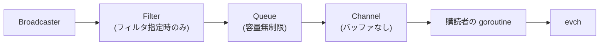

## 何を学んだか

### Envelope の 4 要素

```
Timestamp: 2026-08-29T12:34:56Z
Namespace: k8s.io
Topic:     /tasks/exit
Event:     <typeurl.Any> (TaskExit メッセージ)
```

topic はパス形式 (`/images/create`, `/tasks/start`, `/snapshot/prepare`) で、ペイロードは protobuf の `Any`。**型 URL があるので、購読者は中身をデコードできる**。

### 3 つのインターフェース

```go
var _ events.Publisher = &Exchange{}
var _ events.Forwarder = &Exchange{}
var _ events.Subscriber = &Exchange{}
```

- **Publisher** — トピックとイベントを渡す。封筒は Exchange が作る
- **Forwarder** — 既にある封筒をそのまま流す。shim から届いたイベントの中継に使う
- **Subscriber** — フィルタ式で購読する

`Publish` と `Forward` の違いは **タイムスタンプと namespace を誰が決めるか** だ。Publish は呼び出し時のコンテキストから作り、Forward は封筒の内容をそのまま使う。

### フィルタ式

```sh
$ ctr events 'topic~="/tasks/.*",namespace=="k8s.io"'
```

`pkg/filters` の式言語で、フィールドの完全一致 (`==`)、正規表現 (`~=`)、存在確認が書ける。カンマは AND。

**サーバ側でフィルタする** ので、購読者が全イベントを受け取ってから捨てる必要がない。

### 遅い購読者を待たない

購読ごとに `goevents.Queue` が挟まる。**容量無制限のキュー** なので、購読者が遅くても配信側 (`Publish`) はブロックしない。

代償は、遅い購読者がいるとメモリが増えること。containerd はこれを許容している。

## ソースコードのどこか

### Exchange は放送局のラッパ

[`core/events/exchange/exchange.go#L24-L36`](https://github.com/containerd/containerd/blob/716cbaf51212adb5e80ca1c30b644bfeb9c9d779/core/events/exchange/exchange.go#L24-L36)。

```go title="core/events/exchange/exchange.go"
// Exchange broadcasts events
type Exchange struct {
	broadcaster *goevents.Broadcaster
}

// NewExchange returns a new event Exchange
func NewExchange() *Exchange {
	return &Exchange{
		broadcaster: goevents.NewBroadcaster(),
	}
}

var _ events.Publisher = &Exchange{}
var _ events.Forwarder = &Exchange{}
var _ events.Subscriber = &Exchange{}
```

中身は `docker/go-events` の `Broadcaster` 1 つ。containerd が足しているのは **namespace の付与、トピックの検証、フィルタの接続** だけだ。

3 つの `var _ =` でインターフェースの充足をコンパイル時に確認している。

### Publish と Forward

```go title="core/events/exchange/exchange.go"
// Forward accepts an envelope to be directly distributed on the exchange.
//
// This is useful when an event is forwarded on behalf of another namespace or
// when the event is propagated on behalf of another publisher.
func (e *Exchange) Forward(ctx context.Context, envelope *events.Envelope) (err error) {
	if err := validateEnvelope(envelope); err != nil {
		return err
	}
```

「他の namespace の代理として」「他の発行者の代理として」。shim から `containerd publish` で届いたイベントがこの経路を通る ([イベントは shim から publish バイナリで戻ってくる](../event-publisher/))。

**発行者が別プロセスなので、タイムスタンプもそちらのもの** を使う。Publish で作り直すと、実際の発生時刻がずれる。

```go title="core/events/exchange/exchange.go"
// Publish packages and sends an event. The caller will be considered the
// initial publisher of the event. This means the timestamp will be calculated
// at this point and this method may read from the calling context.
func (e *Exchange) Publish(ctx context.Context, topic string, event events.Event) (err error) {
	...
	namespace, err = namespaces.NamespaceRequired(ctx)
	if err != nil {
		return fmt.Errorf("failed publishing event: %w", err)
	}
	if err := validateTopic(topic); err != nil {
		return fmt.Errorf("envelope topic %q: %w", topic, err)
	}
```

**namespace は必須**。コンテキストになければエラーになる。イベントが namespace なしで流れると、購読者が「誰のイベントか」を判定できない。

トピックの検証もある。パス形式であることと、識別子として妥当な文字列であることを確認する。

### ログの構造

```go title="core/events/exchange/exchange.go"
	defer func() {
		logger := log.G(ctx).WithFields(log.Fields{
			"topic": envelope.Topic,
			"ns":    envelope.Namespace,
			"type":  envelope.Event.GetTypeUrl(),
		})

		if err != nil {
			logger.WithError(err).Error("error forwarding event")
		} else {
			logger.Trace("event forwarded")
		}
	}()
```

成功は Trace、失敗は Error。**成功時のログレベルが極端に低い** のは、イベントが大量に流れるからだ。

デバッグ時に `--log-level trace` にすれば、全イベントがログに出る。

### 購読の組み立て

[`core/events/exchange/exchange.go#L128-L198`](https://github.com/containerd/containerd/blob/716cbaf51212adb5e80ca1c30b644bfeb9c9d779/core/events/exchange/exchange.go#L128-L198)。

```go title="core/events/exchange/exchange.go"
	var (
		evch                  = make(chan *events.Envelope)
		errq                  = make(chan error, 1)
		channel               = goevents.NewChannel(0)
		queue                 = goevents.NewQueue(channel)
		dst     goevents.Sink = queue
	)

	closeAll := func() {
		channel.Close()
		queue.Close()
		e.broadcaster.Remove(dst)
		close(errq)
	}
```

3 段のパイプラインになっている。



`NewChannel(0)` はバッファなし。その前に `Queue` (無制限) があるので、**バッファリングは Queue が担当する**。

`closeAll` で全部まとめて閉じる。閉じ忘れの経路を作らないための書き方だ。

```go title="core/events/exchange/exchange.go"
	if len(fs) > 0 {
		filter, err := filters.ParseAll(fs...)
		if err != nil {
			errq <- fmt.Errorf("failed parsing subscription filters: %w", err)
			closeAll()
			return
		}

		dst = goevents.NewFilter(queue, goevents.MatcherFunc(func(gev goevents.Event) bool {
			return filter.Match(adapt(gev))
		}))
	}
```

フィルタは **Queue の手前** に入る。マッチしないイベントはキューに入らないので、メモリも食わない。

フィルタの構文エラーは、エラーチャネルに書いてから閉じる。**関数はエラーを返さず、チャネル経由で伝える**。購読の失敗と、購読中のエラーを同じ経路で扱えるようにするためだ。

### 配信ループ

```go title="core/events/exchange/exchange.go"
	go func() {
		defer closeAll()

		var err error
	loop:
		for {
			select {
			case ev := <-channel.C:
				env, ok := ev.(*events.Envelope)
				if !ok {
					// TODO(stevvooe): For the most part, we are well protected
					// from this condition. Both Forward and Publish protect
					// from this.
					err = fmt.Errorf("invalid envelope encountered %#v; please file a bug", ev)
					break
				}

				select {
				case evch <- env:
				case <-ctx.Done():
					break loop
				}
			case <-ctx.Done():
				break loop
			}
		}
```

`select` が入れ子になっている。**イベントを受け取る待ちと、購読者へ渡す待ちの両方でキャンセルを見る**。どちらでブロックしていても、コンテキストのキャンセルで抜けられる。

型アサーションの失敗は「バグなので報告してほしい」というエラーメッセージ付き。Publish と Forward の両方で検証しているので、通常は起こらない。

```go title="core/events/exchange/exchange.go"
		if err == nil {
			if cerr := ctx.Err(); cerr != context.Canceled {
				err = cerr
			}
		}

		errq <- err
```

**正常なキャンセル (`context.Canceled`) はエラーとして報告しない**。購読者が自分で止めた場合、エラーは nil になる。タイムアウト (`DeadlineExceeded`) は報告する。

「正常な終了」と「異常な終了」を、コンテキストのエラーの種類で区別している。

## なぜそうなっているか

### 無制限キューを選ぶ

購読者ごとのキューに上限を設ける選択肢もあった。上限を超えたら古いイベントを捨てるか、購読を切る。

containerd は無制限を選んだ。理由を推測すると、

- **購読者は主に CRI プラグイン** — 自分自身の一部なので、遅くならない前提
- **イベントを落とすと状態がずれる** — CRI のキャッシュが不整合になる
- **外部の購読者は `ctr events` 程度** — 長時間の遅延は考えにくい

リスクは、購読者が完全に止まったときのメモリ増大だ。ただし購読者はコンテキストのキャンセルで切れるので、gRPC の接続が切れれば購読も終わる。

### サーバ側でフィルタする

フィルタを購読者側で行うと、全イベントがネットワークを渡る。ノード上で毎秒数百のイベントが流れる環境では無視できない。

サーバ側でフィルタすれば、必要なものだけが送られる。`pkg/filters` という小さな式言語を用意してまでこれを実現している。

同じフィルタ言語が `ctr images ls`、`ctr containers ls` などでも使われていて、**1 つの言語を全 API で共有** している。

### Publish と Forward を分ける

タイムスタンプを誰が決めるかは、分散したコンポーネントでは重要な問題になる。shim で起きたことを containerd が中継するとき、containerd の時刻を使うと **実際より遅い時刻** が記録される。

`Forward` で元の封筒をそのまま流すことで、発生時刻が保たれる。

一方で、shim と containerd の時計がずれていれば、その分がそのまま反映される。同一ホストなので問題にならないという前提だ。

## どう活かすか

### イベントを観察する

```sh
# 全イベント
$ ctr -n k8s.io events

# タスク関連だけ
$ ctr -n k8s.io events 'topic~="/tasks/.*"'

# イメージの作成だけ
$ ctr -n k8s.io events 'topic=="/images/create"'
```

コンテナのライフサイクルを追うとき、この出力が最も分かりやすい。create → start → exit → delete の順に流れる。

Pod の起動が遅い場合、どのイベントの間で時間が空いているかを見れば、遅い段階が特定できる。

### イベントが来ないとき

```sh
# containerd 内部での発行 (trace ログ)
$ containerd --log-level trace 2>&1 | grep "event forwarded"
```

shim からのイベントが届いていない場合、[publisher の再送](../event-publisher/) が失敗している可能性がある。

### 「pub/sub を自前で作る」ときの要点

containerd の Exchange は 200 行に満たない。既存のライブラリ (`docker/go-events`) の上に薄く載せている。

- **封筒に必要な情報を全部入れる** — 時刻、テナント、トピック、型付きペイロード
- **発行と中継を分ける** — 時刻とテナントを誰が決めるか
- **フィルタはサーバ側、キューの手前** — 送らない、溜めない
- **購読の失敗もチャネル経由で返す** — 呼び出し側のエラー処理を 1 本にする
- **正常なキャンセルをエラーにしない** — 購読者が自分で止めた場合を区別する

3 番目が効率に、4 番目と 5 番目が使いやすさに効く。特に「購読関数がエラーを返さない」設計は最初は違和感があるが、購読中のエラーと同じ経路にまとまるので、利用側のコードが単純になる。
