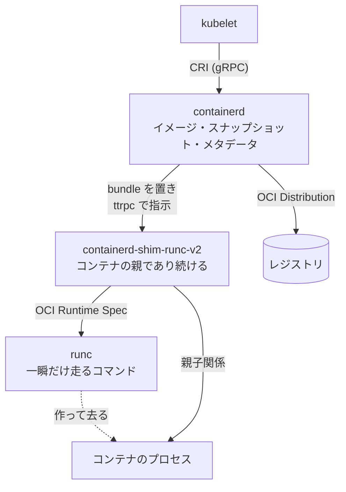

`kubectl run` から実際にプロセスが動き出すまでには、kubelet → CRI → containerd → shim → runc → カーネル、という長い経路がある。この経路の真ん中にいるのが containerd だ。

containerd はコンテナを起動しない。イメージをレジストリから引き、blob を content store に置き、レイヤを snapshotter で重ね、OCI bundle をディスクに書き、`containerd-shim-runc-v2` というバイナリを exec する。そこから先 — clone(2) も cgroup も setns も — は shim が呼ぶ runc の仕事だ。

では containerd は何をしているのか。**「コンテナに必要な材料を揃え、それを誰が持っているかを一貫して覚えておく」** のが仕事だ。この章の主題は、その材料管理と受け渡しの設計にある。

この章には 2 つの目的がある。

1 つは、**コンテナランタイムの層構造を前提から理解できるようにすること**。最初の群「コンテナランタイムの前提」8 ページがそれにあたる。OCI の 2 つの仕様、レイヤと overlayfs、レジストリの配布プロトコル、CRI、そして「なぜ shim という余分なプロセスが挟まっているのか」。ここを読めば残りが読める。

もう 1 つは、**containerd 本体の設計を読むこと**。プラグイン以外に中身のないデーモン、bbolt 1 ファイルに閉じたメタデータ、参照カウントを捨ててリースと GC ラベルにした資源管理、そしてデーモンが再起動してもコンテナが生き残る shim の分離。これが残りの中身になる。

## この OSS について

- Apache 2.0。Go で約 19 万行（vendor と生成コードを除く）。CNCF の Graduated プロジェクトで、Kubernetes の既定のコンテナランタイムとして最も広く動いている実装。
- **やらないことが表になっている。** `SCOPE.md` に機能ごとの in/out が並んでいて、networking・build・volumes・logging はすべて **out**。「一覧にないものはスコープ外」「スコープを変えるには全メンテナの 100% の賛成が必要」とまで書いてある。CNI を呼ぶのも、ログをファイルに書くのも、containerd 本体の仕事ではない。
- **デーモン本体はほぼ空で、機能はすべてプラグイン。** content store も snapshotter も gRPC サービスも同じ `plugin.Registration` として登録され、依存は「型」で宣言し、初期化順は DFS で決まる。`ctr plugins ls` で並ぶものが containerd のほぼ全部だ。
- **賢いのはクライアント側 (smart client model)。** OCI spec の組み立ても、レジストリ名の解決も、イメージのレイヤ関係の把握も、デーモンではなく Go クライアントの側にある。デーモンは「渡された primitive を保存し、実行する」に徹する。
- **参照カウントを持たない。** 資源の生死は、クライアントが付けた GC ラベルと、期限付きのリースだけで決まる。containerd は定期的に tri-color の mark & sweep を回し、誰からも参照されていない blob と snapshot を消す。
- **containerd を再起動してもコンテナは死なない。** コンテナの親は containerd ではなく shim プロセスで、daemon は起動時に bundle ディレクトリを走査して既存の shim に繋ぎ直す。
- **1 つの shim が Pod のコンテナをまとめる。** shim をコンテナごとに立てるか複数でまとめるかは shim 側の裁量で、`io.containerd.runc.v2` は CRI が付けた sandbox-id ラベルでグルーピングする。
- **転送 API が 1 本しかない。** `Transfer(source, destination)` という 1 つの RPC で、pull も push も import も export も表す。組み合わせの意味は実装が決め、API のバージョンは上げない。

## 読む順番

コンテナランタイムの層構造に馴染みがない場合は、**「コンテナランタイムの前提」8 ページを 1 から順に読んでほしい**。後の群はここの語彙を使う。OCI と CRI を知っている場合は、8 ページ目「なぜ shim が要るのか」だけ読んで次へ進んでよい。

「containerd のかたち」は全体像の導入なので、ここも前から読むのがよい。それ以降の群は概ね独立している。ただし「lease と GC」は「メタデータとストア」を、「shim の中身」は「コンテナを実行する」を先に読むと速い。

この章は Linux を前提に書く。Windows コンテナと hcsshim 関連の実装は対象外とする。

コンテナランタイムの前提:

- [なぜコンテナランタイムは何層にも分かれているのか](./why-layered-runtime/)
- [OCI Runtime Spec: runc への入力は bundle 1 つだけ](./oci-runtime-spec/)
- [runc が実際にやること — namespace・cgroup・pivot_root](./how-runc-works/)
- [OCI Image Spec: イメージは manifest・config・layer の 3 点セット](./oci-image-spec/)
- [レイヤと overlayfs: 差分を重ねて 1 つの rootfs にする](./layers-and-overlayfs/)
- [レジストリからイメージを取る手順を分解する](./registry-protocol/)
- [CRI: kubelet がランタイムに要求する輪郭](./cri-interface/)
- [なぜ shim という余分なプロセスが挟まっているのか](./why-shim/)

containerd のかたち:

- [アーキテクチャを一枚で読む](./architecture/)
- [「やらないこと」を表にして、スコープを凍結する](./scope-and-principles/)
- [中核が空のデーモン — すべてがプラグイン](./plugin-architecture/)
- [依存を型で宣言し、初期化順を DFS で決める](./plugin-graph/)
- [賢いのはクライアント側 (smart client model)](./smart-client/)
- [1 つのデーモンを namespace で分ける](./namespaces/)

メタデータとストア:

- [bbolt 1 ファイルに、すべてのメタデータを入れる](./bolt-schema/)
- [content store: digest がそのままファイル名になる](./content-store/)
- [ingest: 中断しても続きから書ける書き込み](./content-ingest/)
- [image store が持つのは「名前 → descriptor」だけ](./image-store/)
- [metadata が実装を包んで、namespace とトランザクションを足す](./metadata-wrapping/)

lease と GC:

- [参照カウントをやめて、「これから使う」を宣言させる](./leases/)
- [資源の関係グラフを、クライアントがラベルで書く](./gc-labels/)
- [tri-color の mark & sweep を、bolt のトランザクションの中で回す](./tricolor-gc/)
- [GC が DB を止める時間を、目標値から逆算する](./gc-scheduler/)
- [削除はメタデータだけ先に済ませ、実体は後で消す](./deferred-cleanup/)

イメージを取り込む:

- [転送 API を 1 本にして、source と destination の組で意味を決める](./transfer-service/)
- [gRPC の上に、自前のストリームとコールバックを作る](./streaming-service/)
- [レジストリの解決を hosts.toml で差し替える](./registry-resolver/)
- [認証を「サーバからクライアントへのコールバック」にする](./auth-callback/)
- [handler を合成して、イメージのグラフを辿る](./image-handlers/)
- [ダウンロードと展開を、パイプラインでつなぐ](./unpack-pipeline/)
- [differ: レイヤ tar を snapshot に適用する](./apply-and-diff/)
- [pull を外部バイナリで止める — image verifier](./image-verifier/)

ファイルシステムを積む:

- [Snapshotter インターフェースの 4 つの動詞](./snapshotter-interface/)
- [active と committed — スナップショットの状態機械](./snapshot-lifecycle/)
- [snapshotter 共通のメタデータを、1 つのパッケージに切り出す](./snapshot-storage/)
- [overlayfs snapshotter を読む](./overlayfs-snapshotter/)
- [Mount 型: マウントを実行せず、値として運ぶ](./mount-as-value/)
- [mount manager: マウント型を拡張し、漏れを追跡する](./mount-manager/)
- [remote snapshotter: レイヤを落とさずに rootfs を作る](./remote-snapshotter/)

コンテナを実行する:

- [runtime v2: シムをバイナリ呼び出し規約で起動する](./runtime-v2-binary/)
- [起動パラメータを stdin の protobuf 1 通に集約する](./shim-bootstrap/)
- [shim manager と task manager の分業](./shim-task-manager/)
- [bundle: ディスク上に置かれた実行単位](./bundle/)
- [containerd が死んでもコンテナは死なない](./shim-reconnect/)
- [イベントは shim から publish バイナリで戻ってくる](./event-publisher/)
- [exit と OOM を拾う監視経路](./task-monitor/)

shim の中身 (containerd-shim-runc-v2):

- [shim プロセスはどう生まれるか](./shim-process-start/)
- [1 つの shim が Pod のコンテナをまとめる](./shim-grouping/)
- [SIGCHLD を 1 か所で受ける reaper](./reaper/)
- [init と exec の状態を、型で表す](./process-state-machine/)
- [runc をどう呼び、終了コードをどう受け取るか](./runc-invocation/)
- [コンテナの stdio を fifo で受け渡す](./shim-io/)
- [shim が終わるとき — delete バイナリコールと後始末](./shim-delete/)

サンドボックスと CRI:

- [Sandbox API: pause コンテナを一般化する](./sandbox-api/)
- [sandbox controller の 2 つの実装](./sandbox-controllers/)
- [sandbox と task が 1 つの shim に同居する](./sandbox-shim-sharing/)
- [CRI プラグインの輪郭](./cri-plugin/)
- [NRI: コンテナ生成に外部プラグインが介入する](./nri/)

運用と拡張:

- [events: namespace 付きの pub/sub を型付きで回す](./events/)
- [introspection: プラグインの生死を API で見せる](./introspection/)
- [errdefs: エラーの意味を境界で保つ](./errdefs/)
- [proxy plugin: 別プロセスを containerd の一部として扱う](./proxy-plugins/)

## この章で扱わないこと

- **Windows コンテナと hcsshim 関連** — `windows` / `lcow` snapshotter、HCS 経由の実行、Windows 固有の I/O (named pipe)。Linux の経路のみを扱う。
- **CRI プラグインの全機能** — kubelet との接続部は「輪郭」1 ページに留める。Pod のネットワーク設定 (CNI 呼び出し)、streaming server、statsd 的なメトリクス収集の詳細は対象外。
- **runc / libcontainer の内部実装** — 前提群では「runc が何をするか」を外形から扱うが、`nsexec` や cgroup ドライバの実装そのものは containerd のコードではない。
- **containerd の外にあるエコシステム** — nerdctl、BuildKit、Kata Containers、stargz snapshotter の実装本体。これらが使う containerd 側の拡張点は扱う。
