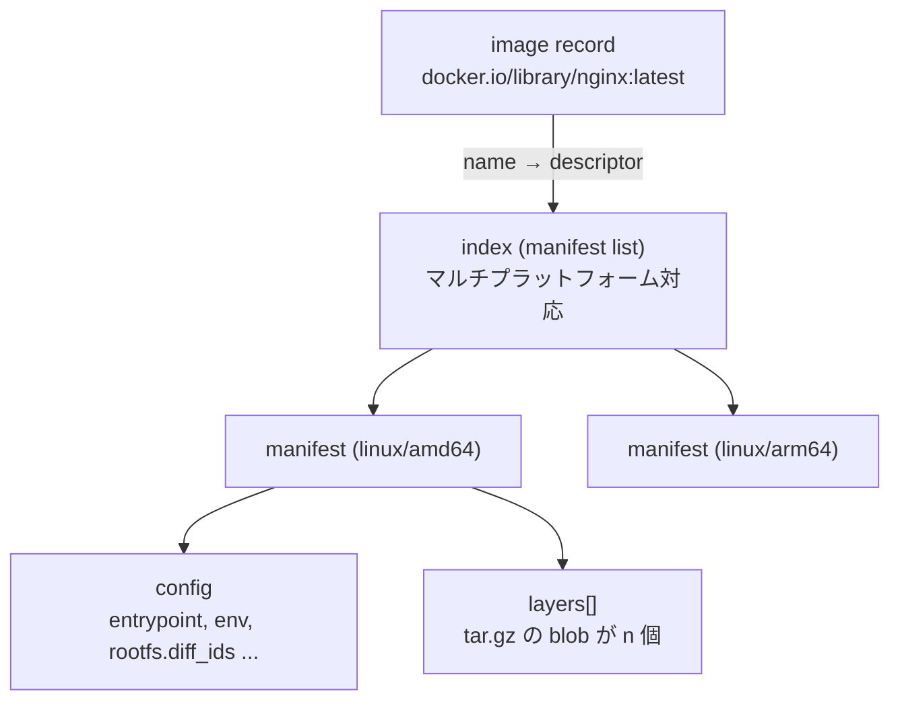

## 何を学んだか

### イメージは blob のグラフ

`nginx:latest` の実体は、次のような有向グラフだ。



ノードは **blob** (ただのバイト列) で、エッジは **descriptor** で表される。descriptor は 3 つのフィールドを持つ小さな構造体だ。

```json
{
  "mediaType": "application/vnd.oci.image.manifest.v1+json",
  "digest": "sha256:1f2c...",
  "size": 1234
}
```

`digest` が中身のハッシュ、`mediaType` が「この blob をどう解釈するか」、`size` が期待サイズ。**型付きのポインタ** だと思えばよい。ダウンロードした blob のハッシュを計算すれば、改竄も破損も検出できる。

### 3 種類の digest を区別する

layer 1 枚に対して、containerd は 3 つの識別子を使い分ける。ここを混同するとコードが読めなくなる。

| 識別子      | 何のハッシュか                          | 使われる場所                               |
| ----------- | --------------------------------------- | ------------------------------------------ |
| **digest**  | 圧縮された blob (`.tar.gz`) のバイト列  | content store のキー、レジストリからの取得 |
| **diffID**  | 展開後の tar のバイト列                 | image config の `rootfs.diff_ids`          |
| **chainID** | 「この layer までを積んだ結果」の識別子 | snapshotter のキー                         |

なぜ 3 つも要るのか。

- **digest** は転送されるバイト列の同一性。圧縮方式が変われば同じ内容でも digest は変わる
- **diffID** は内容の同一性。gzip と zstd で同じ layer を配っても diffID は同じになる
- **chainID** は **積み重ねの同一性**。layer A だけを積んだ状態と、A の上に B を積んだ状態は違うものなので、親から順に畳み込んだハッシュで区別する

chainID の計算は「親の chainID と自分の diffID を連結してハッシュ」を繰り返すだけだ。

```
chainID(0) = diffID(0)
chainID(n) = sha256("chainID(n-1) + ' ' + diffID(n)")
```

2 つのイメージが同じ base image から始まっていれば、途中までの chainID が一致する。だから snapshot がそのまま共有できる。

### image レコードは名前と descriptor だけ

containerd の image は「タグ名 → ルート descriptor」の対応にすぎない。レイヤの一覧も、サイズの合計も持たない。必要になったら content store から blob を読んで辿る。

## ソースコードのどこか

### Image 型は 4 フィールドしかない

[`core/images/image.go#L33-L55`](https://github.com/containerd/containerd/blob/716cbaf51212adb5e80ca1c30b644bfeb9c9d779/core/images/image.go#L33-L55)。

```go title="core/images/image.go"
// Image provides the model for how containerd views container images.
type Image struct {
	// Name of the image.
	//
	// To be pulled, it must be a reference compatible with resolvers.
	//
	// This field is required.
	Name string

	// Labels provide runtime decoration for the image record.
	...
	Labels map[string]string

	// Target describes the root content for this image. Typically, this is
	// a manifest, index or manifest list.
	Target ocispec.Descriptor

	CreatedAt, UpdatedAt time.Time
}
```

`Target` の型が `ocispec.Descriptor` — つまり OCI 仕様の型をそのまま使っている。containerd 独自のイメージモデルを作らず、仕様の型を採用している。

### グラフを辿るのは関数、状態は持たない

[`core/images/image.go`](https://github.com/containerd/containerd/blob/716cbaf51212adb5e80ca1c30b644bfeb9c9d779/core/images/image.go) の主要な関数は、どれも「provider (content を読める何か) と descriptor」を引数に取る純粋な関数だ。

```go title="core/images/image.go"
func Manifest(ctx context.Context, provider content.Provider, image ocispec.Descriptor, platform platforms.MatchComparer) (ocispec.Manifest, error)
func Config(ctx context.Context, provider content.Provider, image ocispec.Descriptor, platform platforms.MatchComparer) (ocispec.Descriptor, error)
func Children(ctx context.Context, provider content.Provider, desc ocispec.Descriptor) ([]ocispec.Descriptor, error)
func RootFS(ctx context.Context, provider content.Provider, configDesc ocispec.Descriptor) ([]digest.Digest, error)
```

`Children` が汎用のグラフ辿りで、descriptor の mediaType を見て「この blob の子は何か」を返す。index なら manifest 群、manifest なら config と layers。この 1 関数があるおかげで、pull も GC も export も同じ辿り方が使える ([handler を合成して、イメージのグラフを辿る](../image-handlers/))。

`RootFS` は config を読んで diffID の列を返すだけ ([`#L409-L424`](https://github.com/containerd/containerd/blob/716cbaf51212adb5e80ca1c30b644bfeb9c9d779/core/images/image.go#L409-L424))。

```go title="core/images/image.go"
// RootFS returns the unpacked diffids that make up and images rootfs.
//
// These are used to verify that a set of layers unpacked to the expected
// values.
func RootFS(ctx context.Context, provider content.Provider, configDesc ocispec.Descriptor) ([]digest.Digest, error) {
	...
	return config.RootFS.DiffIDs, nil
}
```

コメントの「展開結果が期待値になっているか検証するために使う」が重要だ。layer を展開して自分で diffID を計算し、config に書かれた値と一致するかを確かめる。**レジストリが嘘をついていても検出できる**。

### diffID を取るのに 3 つの経路がある

[`core/images/diffid.go#L32-L60`](https://github.com/containerd/containerd/blob/716cbaf51212adb5e80ca1c30b644bfeb9c9d779/core/images/diffid.go#L32-L60)。

```go title="core/images/diffid.go"
// GetDiffID gets the diff ID of the layer blob descriptor.
func GetDiffID(ctx context.Context, cs content.Store, desc ocispec.Descriptor) (digest.Digest, error) {
	switch desc.MediaType {
	case
		// If the layer is already uncompressed, we can just return its digest
		MediaTypeDockerSchema2Layer,
		ocispec.MediaTypeImageLayer,
		...
		return desc.Digest, nil
	}
	info, err := cs.Info(ctx, desc.Digest)
	...
	v, ok := info.Labels[labels.LabelUncompressed]
	if ok {
		// Fast path: if the image is already unpacked, we can use the label value
		return digest.Parse(v)
	}
	// if the image is not unpacked, we may not have the label
	ra, err := cs.ReaderAt(ctx, desc)
```

1. 非圧縮の layer なら digest = diffID
2. 展開済みなら content store のラベル `containerd.io/uncompressed` に記録されている
3. どちらでもなければ、blob を読んで展開しながらハッシュを計算する

3 番目は blob 全体を読むので高い。だから展開時に結果をラベルとして残しておく、というキャッシュになっている。**計算結果をメタデータのラベルに載せる** のは containerd の随所に出てくるパターンだ。

### mediaType は Docker と OCI の両方を持つ

[`core/images/mediatypes.go#L34-L66`](https://github.com/containerd/containerd/blob/716cbaf51212adb5e80ca1c30b644bfeb9c9d779/core/images/mediatypes.go#L34-L66)。

```go title="core/images/mediatypes.go"
	MediaTypeDockerSchema2Layer            = "application/vnd.docker.image.rootfs.diff.tar"
	MediaTypeDockerSchema2LayerGzip        = "application/vnd.docker.image.rootfs.diff.tar.gzip"
	MediaTypeDockerSchema2LayerZstd        = "application/vnd.docker.image.rootfs.diff.tar.zstd"
	MediaTypeDockerSchema2Config           = "application/vnd.docker.container.image.v1+json"
	MediaTypeDockerSchema2Manifest         = "application/vnd.docker.distribution.manifest.v2+json"
	MediaTypeDockerSchema2ManifestList     = "application/vnd.docker.distribution.manifest.list.v2+json"
```

OCI 仕様の mediaType (`application/vnd.oci.*`) は `ocispec` パッケージから来るので、containerd が独自に定義しているのは Docker 由来のものと containerd 固有のもの (checkpoint 用など) だけだ。実運用では Docker Hub の大半のイメージが Docker 形式なので、両方を等価に扱う必要がある。

`parseMediaTypes` ([`#L112-L130`](https://github.com/containerd/containerd/blob/716cbaf51212adb5e80ca1c30b644bfeb9c9d779/core/images/mediatypes.go#L112-L130)) は `+encrypted` のようなサフィックスを分離する。暗号化レイヤは「ベースの型 + 修飾子」として扱われ、ベースの型を見る箇所は変更せずに済む。

### chainID を計算する場所

[`client/image.go#L219`](https://github.com/containerd/containerd/blob/716cbaf51212adb5e80ca1c30b644bfeb9c9d779/client/image.go#L219) と [`core/unpack/unpacker.go#L370`](https://github.com/containerd/containerd/blob/716cbaf51212adb5e80ca1c30b644bfeb9c9d779/core/unpack/unpacker.go#L370)。

```go title="client/image.go"
	if _, err := sn.Stat(ctx, identity.ChainID(diffs).String()); err != nil {
```

「このイメージは展開済みか」の判定が、**最終 chainID の snapshot が存在するか** で行われる。イメージ固有の展開済みフラグは持たない。同じ内容を別名で pull しても、chainID が同じなら展開は不要だと自動的に分かる。

## なぜそうなっているか

### content-addressable にすると、共有と検証が同時に手に入る

digest をキーにすることで得られるものは 3 つある。

- **重複排除** — 100 個のイメージが同じ base layer を使っていても、blob は 1 つ
- **完全性検証** — 取得したバイト列のハッシュを計算するだけでよい。署名や TLS とは独立して効く
- **キャッシュの正しさ** — 「同じ digest なら同じ中身」が保証されるので、無効化を考えなくてよい

代償は「中身を変えると名前が変わる」こと。だからタグ (`latest`) という可変の名前を別レイヤに置き、名前から digest への対応だけを更新する。containerd の image レコードがまさにその対応表だ。

### diffID を分けたのは圧縮方式を変えられるようにするため

もし layer の同一性を圧縮後の digest だけで判断していたら、gzip から zstd に切り替えた瞬間に全レイヤが別物になり、ディスク上の展開結果も再利用できない。diffID (展開後のハッシュ) を config に書いておけば、**転送形式と内容を独立に扱える**。

実際 containerd は zstd レイヤも扱えるが、展開結果が同じなら snapshot は共有される。

### chainID は「途中まで同じ」を判定するための最小の道具

snapshot は積み重ねなので、識別子も積み重ねの履歴を含む必要がある。単純に diffID の列を連結した文字列でもよさそうだが、それだと長さが層数に比例し、キーとして扱いにくい。畳み込みハッシュにすれば固定長になり、しかも「先頭 n 層が同じなら chainID(n) が一致する」という性質が保たれる。

## どう活かすか

### イメージの中身を手で辿る

`ctr` で content store を直接読めば、グラフをそのまま追える。

```sh
# image のルート descriptor を見る
$ ctr -n k8s.io images ls name==docker.io/library/nginx:latest

# その digest の blob を読む (index または manifest)
$ ctr -n k8s.io content get sha256:<digest> | jq

# manifest から config を読み、diff_ids を見る
$ ctr -n k8s.io content get sha256:<config-digest> | jq '.rootfs.diff_ids'
```

「イメージが壊れている」「pull したのに展開されていない」という状況では、どの層まで揃っているかをこの手順で確認できる。

### 型付きポインタとしての descriptor

`{mediaType, digest, size}` の 3 点セットは、分散システムで大きなオブジェクトを参照する形として汎用性が高い。

- **size を含む** ので、受信前にバッファを確保でき、想定外に巨大なレスポンスを弾ける
- **mediaType を含む** ので、取得前にパーサを選べる。中身を見てから型を判定する必要がない
- **digest を含む** ので、どこから取ってきても同じものだと確認できる。CDN やミラーを安全に挟める

自前のシステムで大きな成果物 (ビルド生成物、モデルファイル) を扱うときに、この 3 点セットをそのまま真似できる。
