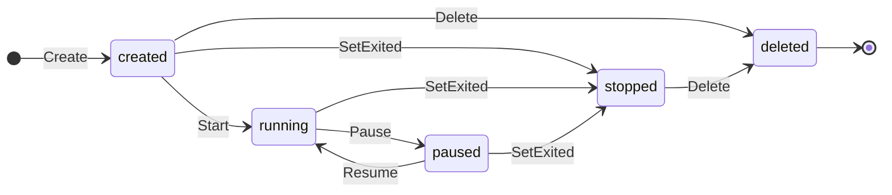

## 何を学んだか

### 状態パターンをそのまま実装している

```go
type initState interface {
	Start(context.Context) error
	Delete(context.Context) error
	Pause(context.Context) error
	Resume(context.Context) error
	Update(context.Context, *google_protobuf.Any) error
	Checkpoint(context.Context, *CheckpointConfig) error
	Exec(context.Context, string, *ExecConfig) (Process, error)
	Kill(context.Context, uint32, bool) error
	SetExited(int)
	Status(context.Context) (string, error)
}
```

このインターフェースを、`createdState` / `runningState` / `pausedState` / `stoppedState` / `deletedState` の 5 つが実装する。`Init` はそのうち 1 つを `initState` フィールドに持つ。

`Init.Start()` は、ロックを取って `p.initState.Start(ctx)` を呼ぶだけ。**何が起きるかは現在の状態が決める**。



遷移の矢印は、各状態の `transition` メソッドが列挙するものと 1 対 1 に対応する。

### 状態ごとに「できないこと」を明示する

```go
func (s *createdState) Pause(ctx context.Context) error {
	return errors.New("cannot pause task in created state")
}

func (s *stoppedState) Start(ctx context.Context) error {
	return errors.New("cannot start a stopped process")
}
```

if 文の羅列ではなく、**各状態の実装として** 書かれる。新しい状態を足すときに全メソッドを実装する必要があるので、考慮漏れが起きにくい。

### 遷移も状態が持つ

各状態に `transition(name string) error` があり、**自分から行ける先だけ** を列挙する。

```go
func (s *stoppedState) transition(name string) error {
	switch name {
	case "deleted":
		s.p.initState = &deletedState{}
	default:
		return fmt.Errorf("invalid state transition %q to %q", stateName(s), name)
	}
	return nil
}
```

stopped から行けるのは deleted だけ。他への遷移を試みるとエラーになる。

### exec は別の状態機械

`execState` は 6 メソッドで、`Pause` も `Checkpoint` もない。exec で起動したプロセスは一時停止できない (コンテナ全体の話なので)。

**init と exec で扱えることが違う** ことが、別のインターフェースとして表現されている。

## ソースコードのどこか

### インターフェースと実装

[`cmd/containerd-shim-runc-v2/process/init_state.go#L21-L50`](https://github.com/containerd/containerd/blob/716cbaf51212adb5e80ca1c30b644bfeb9c9d779/cmd/containerd-shim-runc-v2/process/init_state.go#L21-L50)。

```go title="cmd/containerd-shim-runc-v2/process/init_state.go"
type createdState struct {
	p *Init
}

func (s *createdState) transition(name string) error {
	switch name {
	case "running":
		s.p.initState = &runningState{p: s.p}
	case "stopped":
		s.p.initState = &stoppedState{p: s.p}
	case "deleted":
		s.p.initState = &deletedState{}
	default:
		return fmt.Errorf("invalid state transition %q to %q", stateName(s), name)
	}
	return nil
}
```

状態オブジェクトは `Init` へのポインタだけを持つ。**状態自体はデータを持たない** ので、生成が軽い。

`deletedState` は `p` すら持たない。削除後は何も操作できないので、対象への参照が不要になる。

### 操作と遷移の組み合わせ

```go title="cmd/containerd-shim-runc-v2/process/init_state.go"
func (s *createdState) Start(ctx context.Context) error {
	if err := s.p.start(ctx); err != nil {
		return err
	}
	return s.transition("running")
}

func (s *createdState) Delete(ctx context.Context) error {
	if err := s.p.delete(ctx); err != nil {
		return err
	}
	return s.transition("deleted")
}
```

パターンが揃っている。「実際の操作 (`s.p.start`) を行い、成功したら遷移する」。**操作が失敗したら状態は変わらない**。

大文字の `Start` (状態のメソッド) と小文字の `start` (`Init` の実処理) が分かれているのが要点だ。実処理は状態を知らず、遷移の判断は状態が持つ。

### 終了は特別扱い

```go title="cmd/containerd-shim-runc-v2/process/init_state.go"
func (s *createdState) SetExited(status int) {
	s.p.setExited(status)

	if err := s.transition("stopped"); err != nil {
		panic(err)
	}
}
```

`SetExited` はエラーを返さない。プロセスが実際に終了した事実は、拒否できないからだ。

遷移に失敗したら **panic する**。created / running / paused のどれからでも stopped へ行けるので、失敗はプログラムのバグを意味する。「起こりえない」ことに対して panic を使っている ([依存を型で宣言し、初期化順を DFS で決める](../plugin-graph/) と同じ判断)。

### 排他制御は Init 側

[`cmd/containerd-shim-runc-v2/process/init.go#L264-L283`](https://github.com/containerd/containerd/blob/716cbaf51212adb5e80ca1c30b644bfeb9c9d779/cmd/containerd-shim-runc-v2/process/init.go#L264-L283)。

```go title="cmd/containerd-shim-runc-v2/process/init.go"
// Start the init process
func (p *Init) Start(ctx context.Context) error {
	p.mu.Lock()
	defer p.mu.Unlock()

	return p.initState.Start(ctx)
}

func (p *Init) start(ctx context.Context) error {
	err := p.runtime.Start(ctx, p.id)
	return p.runtimeError(err, "OCI runtime start failed")
}
```

**ロックは `Init` のメソッドで取り、状態オブジェクトはロックを知らない**。状態の実装がロックの有無を気にしなくてよい。

一方で「状態のメソッドの中から `Init` の公開メソッドを呼ぶと自己デッドロック」という制約が生まれる。だから実処理が小文字メソッド (`p.start`) として分けられている。

### ロックを取らない例外

```go title="cmd/containerd-shim-runc-v2/process/init.go"
func (p *Init) Status(ctx context.Context) (string, error) {
	if p.pausing.Load() {
		return "pausing", nil
	}

	p.mu.Lock()
	defer p.mu.Unlock()

	return p.initState.Status(ctx)
}
```

`pausing` だけ `atomic.Bool` で、**ロックの外から読む**。一時停止の処理は時間がかかり、その間ロックを保持するので、`Status` がブロックしてしまう。

「pausing」という中間状態を、状態機械ではなく別のフラグで表現している。状態オブジェクトを増やすと全メソッドの実装が必要になるので、**一時的な遷移中の状態にはフラグを使う** という使い分けだ。

### 終了時の後始末

```go title="cmd/containerd-shim-runc-v2/process/init.go"
func (p *Init) setExited(status int) {
	p.exited = time.Now()
	p.status = status
	p.Platform.ShutdownConsole(context.Background(), p.console)
	close(p.waitBlock)
}
```

`waitBlock` チャネルを閉じることで、待っている全員が起きる。**チャネルの close をブロードキャストとして使う** Go の定番だ。

コンソールの後始末もここで行う。終了したプロセスの pty を持ち続けない。

### exec 側の状態

[`cmd/containerd-shim-runc-v2/process/exec_state.go#L29-L54`](https://github.com/containerd/containerd/blob/716cbaf51212adb5e80ca1c30b644bfeb9c9d779/cmd/containerd-shim-runc-v2/process/exec_state.go#L29-L54)。

```go title="cmd/containerd-shim-runc-v2/process/exec_state.go"
type execState interface {
	Resize(console.WinSize) error
	Start(context.Context) error
	Delete(context.Context) error
	Kill(context.Context, uint32, bool) error
	SetExited(int)
	Status(context.Context) (string, error)
}

type execCreatedState struct {
	p *execProcess
}

func (s *execCreatedState) transition(name string) error {
	switch name {
	case "running":
		s.p.execState = &execRunningState{p: s.p}
	case "stopped":
		s.p.execState = &execStoppedState{p: s.p}
	case "deleted":
		s.p.execState = &deletedState{}
```

`deletedState` は **init と共有している**。削除後は何もできないので、init か exec かの区別が不要になる。

`Resize` があるのは exec 側だけ… ではなく、init 側では別の経路で扱われる。両者の差が、インターフェースの差として現れている。

## なぜそうなっているか

### 状態遷移の誤りを型で防ぐ

`Init` に `state string` フィールドを持たせて if 文で分岐する実装もありうる。しかし、

- 状態が増えたとき、分岐の追加漏れが起きる
- 「この状態でこの操作」の組み合わせが網羅されているか分からない
- 状態と操作の対応がコード全体に散らばる

状態を型にすれば、**インターフェースを満たさないとコンパイルが通らない**。新しい状態を足すときに、全メソッドの振る舞いを決めることが強制される。

冗長さ (5 状態 × 10 メソッド = 50 のメソッド定義) と引き換えに、網羅性を得ている。

### 操作と遷移を分ける

「操作が成功したら遷移する」という形にすることで、**失敗時に状態が壊れない**。runc の呼び出しが失敗したら created のまま残るので、リトライも削除もできる。

もし遷移を先にしていたら、「running なのに実際は起動していない」という不整合が生まれる。

### エラーメッセージが状態を含む

```
cannot pause task in created state
cannot start a stopped process
invalid state transition "stopped" to "running"
```

利用者が見るエラーに、**現在の状態と試みた操作** が入る。「なぜ失敗したか」が一目で分かる。

状態を型にすると `stateName(s)` で名前が取れるので、こういうメッセージが自然に書ける。

## どう活かすか

### 状態に関するエラーを読む

```
cannot start a stopped process
```

コンテナが既に終了している状態で `ctr tasks start` を呼ぶとこうなる。「タスクは存在するが停止している」ので、`ctr tasks rm` してから作り直す必要がある。

```
invalid state transition "running" to "deleted"
```

これは内部エラーで、通常は起きない。停止せずに削除しようとした場合などに出る。

### 状態パターンを使う判断

Go で状態機械を書くとき、この実装は良い参照になる。使うべき条件は、

- **状態が 3 つ以上ある** — 2 つなら bool で足りる
- **状態ごとに許される操作が違う** — 全状態で同じなら意味がない
- **状態が増える見込みがある** — 網羅性の保証が効いてくる
- **不正な操作を明示的に拒否したい** — 黙って無視しない

逆に、状態が 2〜3 で操作が 1〜2 なら、素直な switch のほうが読みやすい。

### 実装するときの要点

- **状態オブジェクトはデータを持たず、対象へのポインタだけ持つ** — 生成コストをゼロに近づける
- **ロックは対象側で取り、状態は知らない** — 状態の実装を単純に保つ
- **公開メソッド (ロックあり) と実処理 (ロックなし) を分ける** — 自己デッドロックを防ぐ
- **操作 → 成功 → 遷移 の順にする** — 失敗時に状態を壊さない
- **拒否できない事象 (プロセスの終了) は、遷移失敗を panic にする** — バグとして扱う
- **一時的な中間状態はフラグで表す** — 状態を増やしすぎない

3 番目は Go 特有の注意点だ。状態オブジェクトから対象の公開メソッドを呼ぶと、同じ mutex を二重に取ってデッドロックする。命名規則 (大文字/小文字) でこれを区別するのが慣例になっている。
