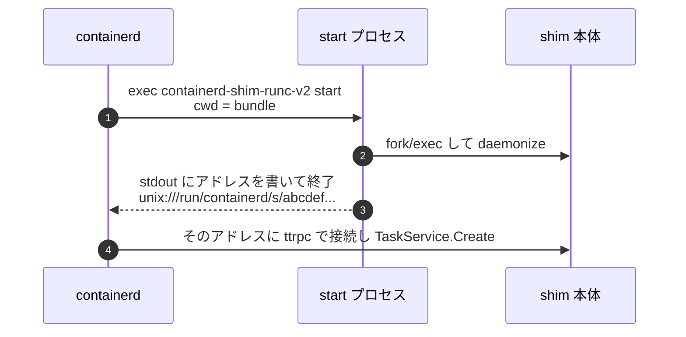

## 何を学んだか

### ランタイム名からバイナリ名への変換規則

`io.containerd.runc.v2` というランタイム名は、次の規則でバイナリ名になる。

1. `.` で分割する
2. **末尾 2 要素を取る** → `runc`, `v2`
3. `containerd-shim-` を前置する → `containerd-shim-runc-v2`

`docs/runtime-v2.md` にはこの規則の理由も書かれている。

```markdown title="docs/runtime-v2.md"
containerd keeps the `containerd-shim-*` prefix so that users can `ps aux | grep containerd-shim` to see running shims on their system.
```

**`ps` で見つけやすくするため**。運用上の都合が命名規則になっている。

ランタイム名の代わりに絶対パスを指定することもできる (containerd 1.6 以降)。

### 起動は 2 段階



`start` を実行したプロセスは **すぐ終了する**。実際に待ち受けるのは、そこから生まれた別のプロセスだ。だから containerd は shim の親ではない ([なぜ shim という余分なプロセスが挟まっているのか](../why-shim/))。

### shim は「起動しない」ことも選べる

`start` は、新しい shim を起動する代わりに **既存の shim のアドレスを返してもよい**。これが 1 shim 複数コンテナ (Pod のグルーピング) の入口になる ([1 つの shim が Pod のコンテナをまとめる](../shim-grouping/))。

containerd 側は「返ってきたアドレスに繋ぐ」だけなので、新規か既存かを区別しない。

### 削除も binary call

shim が死んでいて bundle だけが残っている場合、containerd は `containerd-shim-runc-v2 delete` を bundle ディレクトリで実行する。RPC が使えない状況の後始末経路だ。

## ソースコードのどこか

### 名前の変換

[`pkg/shim/util.go#L41-L49`](https://github.com/containerd/containerd/blob/716cbaf51212adb5e80ca1c30b644bfeb9c9d779/pkg/shim/util.go#L41-L49)。

```go title="pkg/shim/util.go"
func BinaryName(runtime string) string {
	// runtime name should format like $prefix.name.version
	parts := strings.Split(runtime, ".")
	if len(parts) < 2 || parts[0] == "" {
		return ""
	}

	return fmt.Sprintf(shimBinaryFormat, parts[len(parts)-2], parts[len(parts)-1])
}
```

前半 (`io.containerd`) は捨てられる。だから `io.foo.bar.runc2.v2.baz` は `containerd-shim-v2-baz` になる — `docs/runtime-v2.md` がこの例をわざわざ載せている。

**規則が単純すぎて意図しない名前になりうる** ことを、ドキュメントが正直に示している。

### パス解決の優先順位

[`core/runtime/v2/shim_manager.go#L402-L455`](https://github.com/containerd/containerd/blob/716cbaf51212adb5e80ca1c30b644bfeb9c9d779/core/runtime/v2/shim_manager.go#L402-L455)。

```go title="core/runtime/v2/shim_manager.go"
	// Custom path to runtime binary
	if filepath.IsAbs(runtime) {
		// Make sure it exists before returning ok
		if _, err := os.Stat(runtime); err != nil {
			return "", fmt.Errorf("invalid custom binary path: %w", err)
		}

		return runtime, nil
	}

	// Check if relative path to runtime binary provided
	if strings.Contains(runtime, "/") {
		return "", fmt.Errorf("invalid runtime name %s, correct runtime name should be either format like `io.containerd.runc.v2` or a full path to the binary", runtime)
	}
```

絶対パスは許すが、**相対パスは明示的に拒否する**。相対パスだと基準ディレクトリが曖昧になり、意図しないバイナリを実行しかねない。

解決結果はキャッシュされる。

```go title="core/runtime/v2/shim_manager.go"
	if path, ok := m.runtimePaths.Load(name); ok {
		return path.(string), nil
	}
```

`sync.Map` に「ランタイム名 → 解決済みパス」を持つ。コンテナを起動するたびに `exec.LookPath` を走らせない。

探索は 3 段階になっている。

```go title="core/runtime/v2/shim_manager.go"
	binaryPath := shimbinary.BinaryPath(runtime)
	if _, serr := os.Stat(binaryPath); serr == nil {
		cmdPath = binaryPath
	}

	if cmdPath == "" {
		if cmdPath, lerr = exec.LookPath(name); lerr != nil {
			if eerr, ok := lerr.(*exec.Error); ok {
				if eerr.Err == exec.ErrNotFound {
					self, err := os.Executable()
```

1. ランタイム名がパスを含む場合、その **ディレクトリ内** を探す
2. `PATH` を探す
3. **containerd 自身の実行ファイルと同じディレクトリ** を探す

3 番目が実務的で、containerd と shim は同じリリースから同じ場所に配置されることが多い。PATH が通っていない環境 (systemd 経由の起動など) でも見つかる。

### start の実行

[`core/runtime/v2/binary.go#L66-L112`](https://github.com/containerd/containerd/blob/716cbaf51212adb5e80ca1c30b644bfeb9c9d779/core/runtime/v2/binary.go#L66-L112)。

```go title="core/runtime/v2/binary.go"
	cmd, err := command(
		ctx,
		&commandConfig{
			ID:           b.bundle.ID,
			RuntimePath:  b.runtime,
			GRPCAddress:  b.containerdAddress,
			TTRPCAddress: b.containerdTTRPCAddress,
			WorkDir:      b.bundle.Path,
			Opts:         opts,
			Action:       "start",
			SocketDir:    b.socketDir,
		})
```

`WorkDir` が bundle のパス。**shim は bundle ディレクトリを cwd として起動される** ので、`config.json` や `rootfs/` に相対パスで到達できる。

ログの受け取りが起動前に用意される。

```go title="core/runtime/v2/binary.go"
	f, err := openShimLog(shimCtx, b.bundle, client.AnonDialer)
	if err != nil {
		return nil, fmt.Errorf("open shim log pipe: %w", err)
	}
	...
	// open the log pipe and block until the writer is ready
	// this helps with synchronization of the shim
	// copy the shim's logs to containerd's output
	go func() {
		defer f.Close()
		_, err := io.Copy(os.Stderr, f)
```

bundle の中の `log` fifo を先に開いておき、shim の出力を containerd の stderr に流す。**shim のログが containerd のログに混ざる** のはこの経路だ。

コメントの「writer が準備できるまでブロックする。これが shim との同期に役立つ」が示す通り、fifo の open が同期点にもなっている。

```go title="core/runtime/v2/binary.go"
	out, err := cmd.CombinedOutput()
	if err != nil {
		return nil, shimCallError(ctx.Err(), out, err)
	}
```

`start` の終了を待ち、出力を受け取る。**この時点で `start` プロセスは終了している** が、そこから生まれた shim は生きている。

### 起動結果の保存

```go title="core/runtime/v2/binary.go"
	// Save runtime binary path for restore.
	if err := os.WriteFile(filepath.Join(b.bundle.Path, "shim-binary-path"), []byte(b.runtime), 0600); err != nil {
		return nil, err
	}

	params, err := parseStartResponse(out)
	...
	// Save bootstrap configuration (so containerd can restore shims after restart).
	if err := writeBootstrapParams(filepath.Join(b.bundle.Path, "bootstrap.json"), params); err != nil {
```

**再接続に必要な 2 つの情報をディスクに書く** ([containerd が死んでもコンテナは死なない](../shim-reconnect/))。

### 切断時の後始末

[`core/runtime/v2/shim_manager.go#L352-L360`](https://github.com/containerd/containerd/blob/716cbaf51212adb5e80ca1c30b644bfeb9c9d779/core/runtime/v2/shim_manager.go#L352-L360)。

```go title="core/runtime/v2/shim_manager.go"
	shim, err := b.Start(ctx, typeurl.MarshalProto(topts), func() {
		log.G(ctx).WithField("id", id).Info("shim disconnected")

		cleanupAfterDeadShim(context.WithoutCancel(ctx), id, m.shims, m.events, b)
		// Remove self from the runtime task list. Even though the cleanupAfterDeadShim()
		// would publish taskExit event, but the shim.Delete() would always failed with ttrpc
		// disconnect and there is no chance to remove this dead task from runtime task lists.
```

接続が切れたときのコールバックを渡す。shim が突然死んだら、

- `TaskExit` イベントを発行する (誰も待ちっぱなしにならない)
- タスク一覧から削除する

コメントが「`shim.Delete()` は ttrpc の切断で必ず失敗するので、通常経路では一覧から消えない」と説明している。**異常系専用の削除経路** が要る理由だ。

## なぜそうなっているか

### バイナリ規約にすると、統合が containerd の外で完結する

Kata Containers、gVisor、Firecracker、runwasi。これらはすべて `containerd-shim-<name>-v2` という名前のバイナリを配るだけで containerd に統合される。**containerd 側のコード変更もビルドも要らない**。

もし Go のプラグイン機構 (`plugin` パッケージ) を使っていたら、Go のバージョンとビルドフラグを完全に一致させる必要があり、実用にならなかった。gRPC プラグインなら常駐プロセスが増える。

「実行ファイルを 1 つ置く」が最も摩擦の少ない拡張点だった。

### 標準出力をプロトコルにする

`start` の結果を標準出力で受け取る設計は、Unix のツールらしい。ソケットもファイルも要らず、シェルスクリプトで shim を書くことすら可能になる。

ただし制約もある。**shim が余計なものを stdout に出すと壊れる**。だから shim のログは stdout ではなく、bundle の `log` fifo に出す規約になっている。

### PATH からの解決に 3 段のフォールバック

containerd の配布形態は多様だ (tarball、パッケージ、Kubernetes ノードのイメージ)。PATH が想定通りとは限らない。

「containerd 自身の隣を探す」というフォールバックは、**同じ tarball から展開された shim を確実に見つける** ための現実的な手当てになっている。

## どう活かすか

### shim が見つからないとき

```
failed to start shim: failed to resolve runtime path: runtime "io.containerd.runc.v2" binary not installed "containerd-shim-runc-v2": file does not exist
```

エラーに **探したバイナリ名** が出る。確認する場所は 3 つ。

```sh
$ which containerd-shim-runc-v2          # PATH
$ ls $(dirname $(which containerd))/     # containerd の隣
$ systemctl show containerd -p Environment  # systemd の PATH
```

systemd 経由だと PATH が限定されるので、手元のシェルで見つかっても containerd からは見えないことがある。

### 独自ランタイムを試す

```sh
# 絶対パス指定で試せる
$ ctr run --runtime /usr/local/bin/my-shim --rm docker.io/library/alpine:latest test
```

新しい shim を開発するとき、PATH に入れずに絶対パスで試せる。CRI 経由なら `config.toml` の `runtimes` に登録する。

### 「実行ファイルを拡張点にする」判断

containerd の runtime v2 が示す条件は次の通り。

- **呼び出し頻度が低い** — コンテナ起動時の 1 回
- **統合の相手が多様** — 言語もビルド環境も揃わない
- **プロトコルが単純に保てる** — 引数、stdin/stdout、終了コード
- **常駐が必要なら、起動されたプロセスが自分で daemonize する**

4 番目が runtime v2 の工夫だ。「起動して終わる」プロセスと「常駐する」プロセスを分けることで、**呼び出し規約の単純さと常駐の必要性を両立** させている。同じ形は [image verifier](../image-verifier/) にもあるが、あちらは常駐が不要なのでさらに単純になっている。
