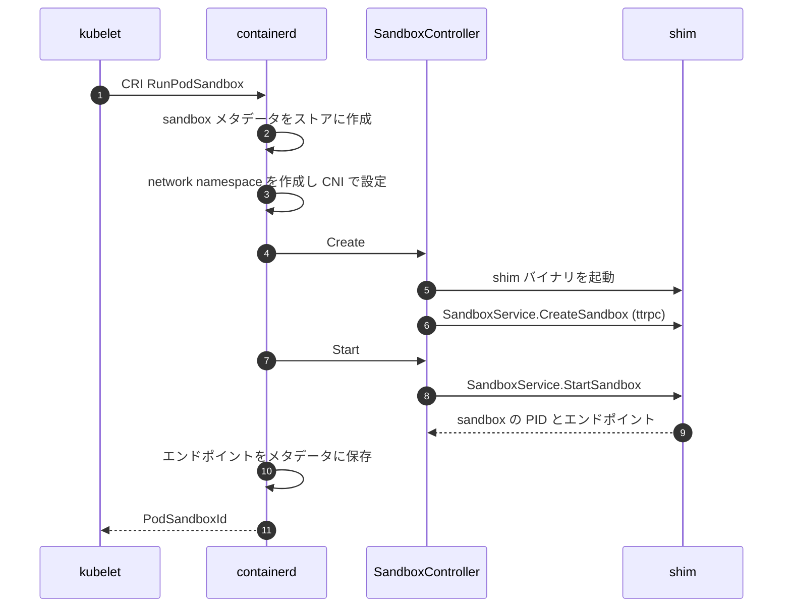
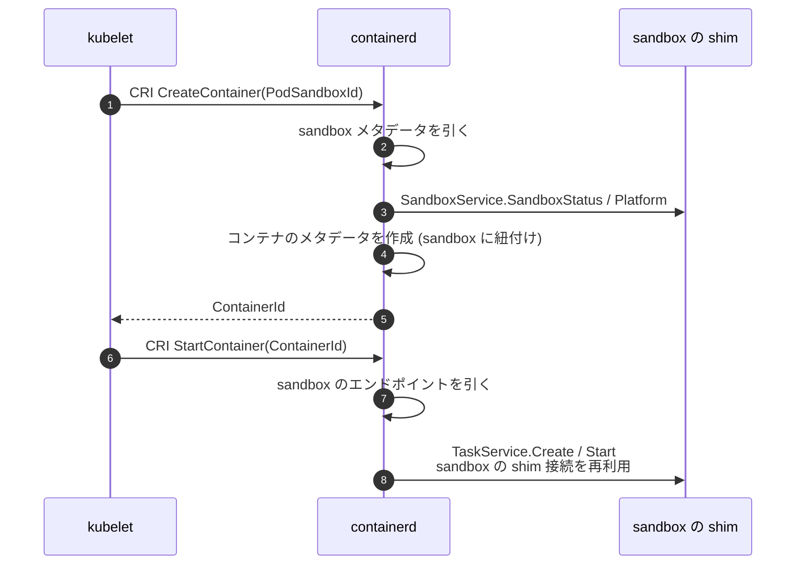
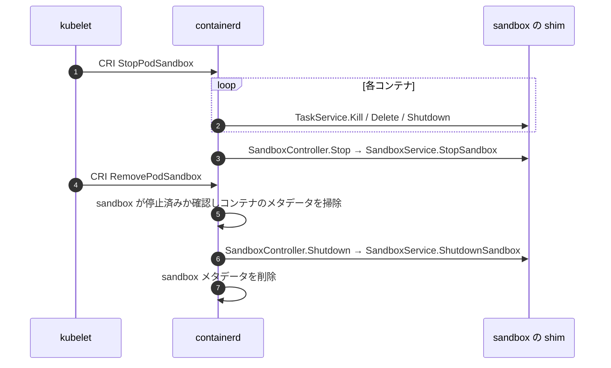

## 何を学んだか

### pause コンテナが解いていた問題

Kubernetes の Pod は、複数のコンテナが network namespace と IPC namespace を共有する。namespace は「参加者が 0 になると消える」ので、**誰かが持ち続ける必要がある**。

そこで、何もせず眠り続ける小さなコンテナ (pause) を最初に作り、その namespace に他のコンテナを参加させる。アプリコンテナが全部再起動しても、Pod の IP は変わらない。

この仕組みは CRI プラグインの中にハードコードされていた。

### なぜ抽象化が必要になったか

[`docs/sandbox-api.md`](https://github.com/containerd/containerd/blob/716cbaf51212adb5e80ca1c30b644bfeb9c9d779/docs/sandbox-api.md) が 3 つの問題を挙げている。

```markdown title="docs/sandbox-api.md"
- One-size-fits-all: the implementation assumed every sandbox was a pause container. Runtimes with a different
  model, such as VM-based runtimes that manage their own sandbox (VMM), had no way to plug in.

- No extension points: the sandbox lifecycle lived inside the CRI plugin, so runtime authors could not customize
  behavior for their runtime.

- Shim lifecycle tied to tasks: the shim process was created and destroyed with the task, but a sandbox needs a
  shim that stays alive while containers come and go.
```

3 つ目が構造的に重い。runtime v2 は「1 shim = 1 タスク」を前提にしていたが、sandbox は **タスクがなくても生き続ける** 必要がある。

### Controller という抽象

```go
type Controller interface {
	Create(ctx, sandboxInfo Sandbox, opts ...CreateOpt) error
	Start(ctx, sandboxID string) (ControllerInstance, error)
	Platform(ctx, sandboxID string) (imagespec.Platform, error)
	Stop(ctx, sandboxID string, opts ...StopOpt) error
	Wait(ctx, sandboxID string) (ExitStatus, error)
	Status(ctx, sandboxID string, verbose bool) (ControllerStatus, error)
	Shutdown(ctx, sandboxID string) error
	Metrics(ctx, sandboxID string) (*types.Metric, error)
	Update(ctx, sandboxID string, sandbox Sandbox, fields ...string) error
}
```

コンテナのライフサイクルとよく似た形をしているが、**`Platform()` があるのが特徴的** だ。sandbox が Linux なのか Windows なのかを問い合わせて、それに合わせた OCI spec を生成する。VM の中が別の OS ということがありうる。

### メタデータは bbolt に保存される

`Sandbox` 構造体は [bbolt の sandboxes バケット](../bolt-schema/) に保存される。コンテナと同じく、spec は `typeurl.Any` で **中身を解釈しない**。

## ソースコードのどこか

### Sandbox のモデル

[`core/sandbox/store.go#L21-L45`](https://github.com/containerd/containerd/blob/716cbaf51212adb5e80ca1c30b644bfeb9c9d779/core/sandbox/store.go#L21-L45)。

```go title="core/sandbox/store.go"
// Sandbox is an object stored in metadata database
type Sandbox struct {
	// ID uniquely identifies the sandbox in a namespace
	ID string
	// Labels provide metadata extension for a sandbox
	Labels map[string]string
	// Runtime shim to use for this sandbox
	Runtime RuntimeOpts
	// Spec carries the runtime specification used to implement the sandbox
	Spec typeurl.Any
	// Sandboxer is the sandbox controller who manages the sandbox
	Sandboxer string
	// CreatedAt is the time at which the sandbox was created
	CreatedAt time.Time
	// UpdatedAt is the time at which the sandbox was updated
	UpdatedAt time.Time
	// Extensions stores client-specified metadata
	Extensions map[string]typeurl.Any
}
```

`Sandboxer` フィールドが **どの Controller が管理するか** を保持する。実装が複数ありうるので、レコードごとに記録しておく必要がある。

`Extensions` は [container レコード](../bolt-schema/) と同じで、クライアント (CRI プラグイン) が任意のデータを紐付ける場所だ。CRI は Pod の設定をここに入れる。

構造がコンテナとほぼ同じであることに注意したい。**同じ設計原則 (メタデータだけ持ち、spec は解釈しない) を、新しい概念にも適用している**。

### Controller の契約

[`core/sandbox/controller.go#L79-L118`](https://github.com/containerd/containerd/blob/716cbaf51212adb5e80ca1c30b644bfeb9c9d779/core/sandbox/controller.go#L79-L118)。

```go title="core/sandbox/controller.go"
// Controller is an interface to manage sandboxes at runtime.
// When running in sandbox mode, shim expected to implement `SandboxService`.
// Shim lifetimes are now managed manually via sandbox API by the containerd's client.
type Controller interface {
	// Create is used to initialize sandbox environment. (mounts, any)
	Create(ctx context.Context, sandboxInfo Sandbox, opts ...CreateOpt) error
	// Start will start previously created sandbox.
	Start(ctx context.Context, sandboxID string) (ControllerInstance, error)
	// Platform returns target sandbox OS that will be used by Controller.
	// containerd will rely on this to generate proper OCI spec.
	Platform(_ctx context.Context, _sandboxID string) (imagespec.Platform, error)
```

「shim のライフタイムは sandbox API 経由で **手動で** 管理される」。タスクの生死に連動しない、という宣言だ。

`Status` のコメントも実務的だ。

```go title="core/sandbox/controller.go"
	// Status will query sandbox process status. It is heavier than Ping call and must be used whenever you need to
	// gather metadata about current sandbox state (status, uptime, resource use, etc).
	Status(ctx context.Context, sandboxID string, verbose bool) (ControllerStatus, error)
```

「Ping より重い」と明記され、**軽い生存確認と重い状態取得を区別** している。CRI は Pod の一覧を頻繁に取るので、この差が効く。

### オプションで渡すもの

[`core/sandbox/controller.go#L19-L66`](https://github.com/containerd/containerd/blob/716cbaf51212adb5e80ca1c30b644bfeb9c9d779/core/sandbox/controller.go#L19-L66)。

```go title="core/sandbox/controller.go"
type CreateOptions struct {
	Rootfs []mount.Mount
	// Options are used to pass arbitrary options to the shim when creating a new sandbox.
	// CRI will use this to pass PodSandboxConfig.
	// Don't confuse this with Runtime options, which are passed at shim instance start
	// to setup global shim configuration.
	Options     typeurl.Any
	NetNSPath   string
	Annotations map[string]string
}
```

コメントが 2 種類の options を区別している。

- **`CreateOptions.Options`** — この sandbox 固有の設定。CRI は `PodSandboxConfig` を入れる
- **Runtime options** — shim 起動時の全体設定

紛らわしいので明示的に注意書きが入っている。前者は sandbox ごと、後者は shim ごとだ。

`NetNSPath` が独立したフィールドなのは、**containerd (CRI プラグイン) が network namespace を作ってから渡す** からだ。CNI の呼び出しは CRI プラグインの仕事で、sandbox はそれを受け取って使う ([「やらないこと」を表にして、スコープを凍結する](../scope-and-principles/))。

### 起動の順序

[`docs/sandbox-api.md`](https://github.com/containerd/containerd/blob/716cbaf51212adb5e80ca1c30b644bfeb9c9d779/docs/sandbox-api.md) のシーケンス図から、`RunPodSandbox` の流れを抜き出すと、



**ネットワークの設定が sandbox の作成より前** にある。namespace のパスを `CreateOptions.NetNSPath` で渡す必要があるからだ。

VM ベースのランタイムでは、この namespace に TAP デバイスを作って VM に繋ぐ、という使い方になる。

### コンテナの追加



**コンテナの起動に使うのは、sandbox が返したエンドポイント** だ。新しい shim を起動しない ([sandbox と task が 1 つの shim に同居する](../sandbox-shim-sharing/))。

`Platform()` を呼んでから spec を生成するのが分かる。VM の中の OS に合わせた spec を作る必要がある。

### 停止の順序



**コンテナを全部片付けてから sandbox を止める**。sandbox が先に消えると、コンテナの namespace が消えて掃除できなくなる。

`Stop` と `Shutdown` が分かれているのも重要で、停止した sandbox の状態を後から問い合わせられる。Pod が終了した理由を kubelet が取得するために要る。

## なぜそうなっているか

### 「先に始まり、最後に終わる親」というモデル

sandbox の本質は、寿命の長さだ。

- コンテナより **先に** 作られる
- コンテナが come and go する間、**生き続ける**
- コンテナが全部消えた **後に** 消える

この寿命の性質が「共有資源を保持する」ことを可能にする。IP アドレス、network namespace、VM、cgroup の親。

pause コンテナは、この性質を「終わらないコンテナ」で実現した実装の 1 つにすぎない。抽象化すれば、VM でも、専用のプロセスでも、あるいは何も起動しない実装でもよくなる。

### CRI プラグインから実装詳細を追い出す

```markdown title="docs/sandbox-api.md"
The Sandbox API provides an abstraction around pod sandbox implementations, so that runtime authors can provide
their own implementation without having to modify containerd or the CRI plugin.
```

**「containerd も CRI プラグインも変更せずに」** 独自実装を提供できるようにする、が目標として書かれている。

Kata Containers が典型例で、Pod = 1 VM というモデルを持つ。pause コンテナの前提が固定されていると、VM の起動を「pause コンテナの起動」に見せかける必要があった。

### 移行が完了していないことを正直に書く

```markdown title="docs/sandbox-api.md"
The `podsandbox` controller technically satisfies the `Controller` interface, but in practice it acts as an
in-memory implementation tightly coupled to the CRI layer. It lives there due to refactoring complexity — moving
it out cleanly is a large incremental effort that has been ongoing since the Sandbox API was first introduced in
containerd 1.7, and improves with every release.
```

「インターフェースは満たしているが、実際には CRI 層と密結合したメモリ内実装」。**理想の形になっていないことが明記されている**。

1.7 で導入され、2.0 で stable になり、それでもまだ移行中。大きなリファクタリングが段階的に進む様子が、ドキュメントに残されている。

## どう活かすか

### sandbox を見る

```sh
# sandbox の一覧
$ ctr -n k8s.io sandboxes ls

# CRI 側から見た Pod
$ crictl pods
```

`ctr sandboxes ls` に出るのが containerd の sandbox レコード、`crictl pods` に出るのが CRI の Pod サンドボックス。**通常は 1 対 1 で対応する**。

対応が崩れている場合、CRI プラグインと containerd コアの状態がずれている。

### 別のランタイムを sandbox として使う

```toml
version = 3
[plugins.'io.containerd.cri.v1.runtime'.containerd.runtimes.kata]
  runtime_type = "io.containerd.kata.v2"
  sandboxer = "shim"
```

`sandboxer` で Controller を選ぶ。`shim` なら shim が `SandboxService` を実装している前提、`podsandbox` なら pause コンテナ方式。

Kubernetes 側では `RuntimeClass` でこのランタイムを指定する。

### 「寿命の違うものを別の概念にする」

同じシステムの中で寿命が異なる資源があるとき、それを別の抽象にするのは有効だ。

- **短命なもの (タスク、コンテナ) と長命なもの (sandbox、セッション) を分ける**
- **長命な側が共有資源を保持する** — IP、namespace、接続
- **短命な側は長命な側を参照する** — 直接資源を持たない
- **API のライフサイクルを別々に定義する** — create/start/stop/delete を両方に持つ

containerd が 1.7 から 2.x にかけてこの分離に苦労しているのは、**後から寿命を分けるのが難しい** ことの証拠でもある。最初の設計で「これは寿命が違う」に気づけるかどうかが分かれ目になる。
