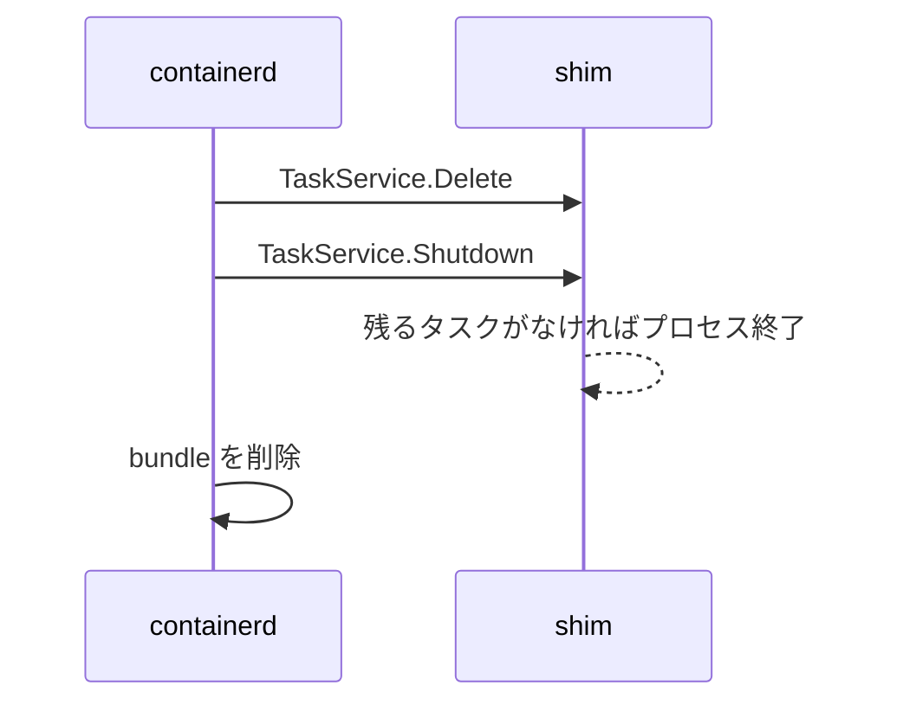
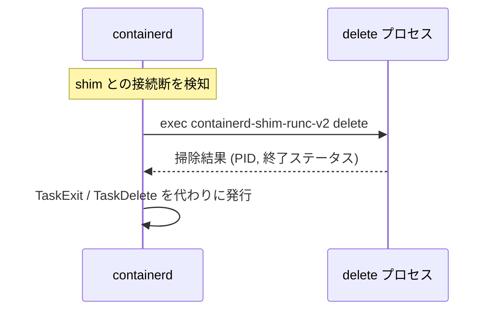

## 何を学んだか

### 正常な終了と異常な終了

コンテナの片付けには 2 つの経路がある。

**正常経路** — shim が生きている。



**異常経路** — shim が死んでいる、または応答しない。



`delete` サブコマンドは、**RPC が使えない状況の後始末口** だ。

### delete が実際にやること

`runc.v2` の実装 (`manager.Stop`) は、

1. `runc delete --force <id>` でコンテナを強制削除する
2. `<bundle>/rootfs` を再帰的にアンマウントする
3. `<bundle>/init.pid` を読んで PID を得る
4. **終了ステータスを `128 + SIGKILL` (= 137) として返す**

実際の終了コードは分からないので、SIGKILL されたものとして扱う。

### イベントの重複を避ける

containerd は掃除の後に `TaskExit` と `TaskDelete` を発行するが、**shim が既に発行済みなら発行しない**。タスク削除が成功していた場合、shim 自身がイベントを送っている。

### 失敗しても情報を捨てない

`delete` が失敗しても、containerd は「終了ステータス 255、終了時刻は今」として **イベントを発行する**。何も送らないと、待っている側が永久にブロックする。

## ソースコードのどこか

### delete の実行

[`core/runtime/v2/binary.go#L154-L200`](https://github.com/containerd/containerd/blob/716cbaf51212adb5e80ca1c30b644bfeb9c9d779/core/runtime/v2/binary.go#L154-L200)。

```go title="core/runtime/v2/binary.go"
	// On Windows and FreeBSD, the current working directory of the shim should
	// not be the bundle path during the delete operation. Instead, we invoke
	// with the default work dir and forward the bundle path on the cmdline.
	// Windows cannot delete the current working directory while an executable
	// is in use with it. On FreeBSD, fork/exec can fail.
	var bundlePath string
	if gruntime.GOOS != "windows" && gruntime.GOOS != "freebsd" {
		bundlePath = b.bundle.Path
	}
```

**cwd を bundle にするかどうかがプラットフォームで違う**。Windows では「実行中のプロセスの cwd になっているディレクトリは削除できない」。FreeBSD では fork/exec が失敗する。

Linux では bundle を cwd にするので、shim は相対パスで `config.json` に到達できる。

```go title="core/runtime/v2/binary.go"
	cmd.Stdout = out
	cmd.Stderr = errb
	if err := cmd.Run(); err != nil {
		log.G(ctx).WithFields(log.Fields{
			"cmd":    cmd.String(),
			"error":  err,
			"id":     b.bundle.ID,
			"stderr": errb.String(),
		}).Error("failed to delete dead shim")
		return nil, shimCallError(ctx.Err(), errb.Bytes(), err)
	}
```

失敗時のログに **実行したコマンドと stderr** が入る。手で再実行して再現できる情報になっている。

`stdout` は結果の protobuf、`stderr` はログ。標準出力をプロトコルに使う設計 ([runtime v2: シムをバイナリ呼び出し規約で起動する](../runtime-v2-binary/)) なので、両者を分ける必要がある。

### runc.v2 の delete 実装

[`cmd/containerd-shim-runc-v2/manager/manager_linux.go#L299-L340`](https://github.com/containerd/containerd/blob/716cbaf51212adb5e80ca1c30b644bfeb9c9d779/cmd/containerd-shim-runc-v2/manager/manager_linux.go#L299-L340)。

```go title="cmd/containerd-shim-runc-v2/manager/manager_linux.go"
func (manager) Stop(ctx context.Context, id string) (shim.StopStatus, error) {
	cwd, err := os.Getwd()
	...
	path := filepath.Join(filepath.Dir(cwd), id)
	...
	runtime, err := runc.ReadRuntime(path)
	if err != nil && !os.IsNotExist(err) {
		return shim.StopStatus{}, err
	}
	opts, err := runc.ReadOptions(path)
	...
	r := process.NewRunc(root, path, ns, runtime, false)
	if err := r.Delete(ctx, id, &runcC.DeleteOpts{
		Force: true,
	}); err != nil {
		log.G(ctx).WithError(err).Warn("failed to remove runc container")
	}
```

**bundle に保存されたランタイム名とオプションを読み直す**。shim は新しく起動されたプロセスなので、メモリ上に何も持っていない。ディスクだけが情報源になる。

`Force: true` で強制削除。プロセスがまだ生きていても SIGKILL する。

削除の失敗は **警告のみ**。既に消えている可能性もあるし、ここで止まると rootfs のアンマウントに進めない。

```go title="cmd/containerd-shim-runc-v2/manager/manager_linux.go"
	if err := mount.UnmountRecursive(filepath.Join(path, "rootfs"), 0); err != nil {
		log.G(ctx).WithError(err).Warn("failed to cleanup rootfs mount")
	}
	pid, err := runcC.ReadPidFile(filepath.Join(path, process.InitPidFile))
	if err != nil {
		log.G(ctx).WithError(err).Warn("failed to read init pid file")
	}
	return shim.StopStatus{
		ExitedAt:   time.Now(),
		ExitStatus: 128 + int(unix.SIGKILL),
		Pid:        pid,
	}, nil
}
```

すべての失敗が警告で、**最後まで進んで結果を返す**。1 つ失敗しても残りをやる。

`128 + SIGKILL` (= 137) は「シグナルで終了した」を表す慣例的な終了コードだ。実際の終了コードは失われているので、**強制終了されたことにする**。

`kubectl` で `Exit Code: 137` を見たとき、OOM や `docker kill` だけでなく、この経路の可能性もある。

### 掃除後のイベント発行

[`core/runtime/v2/shim.go#L146-L200`](https://github.com/containerd/containerd/blob/716cbaf51212adb5e80ca1c30b644bfeb9c9d779/core/runtime/v2/shim.go#L146-L200)。

```go title="core/runtime/v2/shim.go"
func cleanupAfterDeadShim(ctx context.Context, id string, rt *runtime.NSMap[ShimInstance], events *exchange.Exchange, binaryCall *binary) {
	ctx, cancel := timeout.WithContext(ctx, cleanupTimeout)
	defer cancel()

	log.G(ctx).WithField("id", id).Info("cleaning up after shim disconnected")
	response, err := binaryCall.Delete(ctx)
	if err != nil {
		log.G(ctx).WithError(err).WithField("id", id).Warn("failed to clean up after shim disconnected")
	}

	s, err := rt.Get(ctx, id)
	if err != nil {
		// Task was never started, or its record has already been removed.
		// No need to publish events.
		return
	}

	// If the task delete already succeeded, the shim itself has delivered the
	// exit and delete events. No need to publish duplicates.
	if s.(taskDeleteState).taskDeleteResult() != nil {
		return
	}
```

**2 段階で「イベントが要るか」を判定する**。

1. タスクの記録がない → 起動していないか、既に削除済み。イベント不要
2. タスク削除が成功していた → shim が既にイベントを送った。重複させない

`taskDeleteResult()` は、正常な削除の結果を保持しているかを返す。**正常経路を通ったかどうかの印** になっている。

```go title="core/runtime/v2/shim.go"
	if response != nil {
		pid = response.Pid
		exitStatus = response.Status
		exitedAt = response.Timestamp
	} else {
		exitStatus = 255
		exitedAt = time.Now()
	}
	events.Publish(ctx, runtime.TaskExitEventTopic, &eventstypes.TaskExit{
		ContainerID: id,
		ID:          id,
		Pid:         pid,
		ExitStatus:  exitStatus,
		ExitedAt:    protobuf.ToTimestamp(exitedAt),
	})

	events.Publish(ctx, runtime.TaskDeleteEventTopic, &eventstypes.TaskDelete{
```

`delete` が失敗して `response` が nil でも、**255 という値でイベントを出す**。

「情報がないから何も送らない」を選ばない。待っている側 (CRI プラグイン、`ctr tasks wait`) が永久にブロックするより、不正確でも終了を伝えるほうがよい。

`TaskExit` の後に `TaskDelete` を出すのは、[イベントの順序仕様](../event-publisher/) に従うためだ。

### タイムアウトの取り直し

[`core/runtime/v2/shim.go#L209-L231`](https://github.com/containerd/containerd/blob/716cbaf51212adb5e80ca1c30b644bfeb9c9d779/core/runtime/v2/shim.go#L209-L231)。

```go title="core/runtime/v2/shim.go"
func cleanupShimTask(ctx context.Context, st *shimTask) error {
	dctx, cancel := timeout.WithContext(context.WithoutCancel(ctx), cleanupTimeout)
	defer cancel()

	_, err := st.delete(dctx, func(context.Context, string) {})
	if err == nil {
		return nil
	}

	// Shutting down needs a context with time left on it. Check the deadline
	// rather than the error: a timeout only survives as context.DeadlineExceeded
	// over GRPC. Over TTRPC it arrives as the raw context error, which carries no
	// GRPC status, so errgrpc.ToNative flattens it into errdefs.ErrUnknown.
	if dctx.Err() != nil {
		dctx, cancel = timeout.WithContext(context.WithoutCancel(ctx), cleanupTimeout)
		defer cancel()
	}

	st.Shutdown(dctx)
	st.Close()

	return err
}
```

このコメントが優れている。

- **エラーの種類ではなく、コンテキストの期限を見る**
- 理由: **gRPC ではタイムアウトが `DeadlineExceeded` として保たれるが、ttrpc では素のコンテキストエラーとして届き、gRPC のステータスを持たないので `errdefs.ErrUnknown` に潰れてしまう**

つまり「タイムアウトしたかどうか」をエラーから判定できない経路がある。だから **観測できる事実 (期限が過ぎたか)** で判断する。

タイムアウトしていたら、`Shutdown` のために新しい予算を取り直す。期限切れのコンテキストで RPC を呼んでも即座に失敗するだけだ。

`context.WithoutCancel` で、呼び出し元のキャンセルから切り離すのも一貫している。

## なぜそうなっているか

### RPC が使えない状況の後始末口が要る

shim が SIGKILL された、あるいは応答しなくなった場合、RPC で片付けを頼めない。しかし、

- runc のコンテナが `/run/containerd/runc/<ns>/<id>` に残る
- rootfs がマウントされたまま残る
- bundle ディレクトリが残る

これらを containerd が直接掃除することもできるが、**掃除の方法はランタイムによって違う**。VM ベースのランタイムなら VM を止める必要がある。

だから「掃除の仕方を知っている shim バイナリ」に、新しいプロセスとして実行させる。これが `delete` サブコマンドの存在理由だ。

### 失敗しても最後まで進む

`Stop` の実装は、すべての失敗を警告にして最後まで進む。理由は明快で、**掃除が途中で止まると、より多くの残骸が残る** からだ。

runc の削除に失敗したから rootfs のアンマウントもやらない、では困る。それぞれ独立した資源なので、独立に掃除を試みる。

同じ方針は [bundle の削除](../bundle/) にも見られる。

### 不正確でもイベントを出す

「終了ステータス 255」は嘘かもしれない。しかし、

- イベントを出さない → 待機者が永久にブロックする
- 不正確なイベントを出す → 待機者は進める。値が不正確なことは記録される

**待たせるより、不正確でも進ませる**。分散システムでの「タイムアウトしたら失敗として扱う」と同じ判断だ。

なお、正常経路を通った場合は正確な終了コードが shim から届く。この 255 が出るのは異常時だけで、そのときは containerd のログに `failed to clean up after shim disconnected` が残っている。

### エラーではなく期限を見る

「タイムアウトしたか」をエラーの型で判定すると、RPC の実装によって結果が変わる。containerd は gRPC と ttrpc の両方を使うので、この差が実際に問題になった。

`ctx.Err() != nil` なら、**どんな経路で来たエラーであれ、期限は過ぎている**。観測可能な事実で判断するほうが頑健だ。

コメントに「なぜエラーで判定しないか」まで書かれているので、後から「エラーで判定するほうが素直では」と変更されることを防いでいる。

## どう活かすか

### 掃除が失敗しているとき

```sh
# containerd のログ
$ journalctl -u containerd | grep -E "cleaning up dead shim|failed to delete dead shim"

# 残った runc コンテナ
$ runc --root /run/containerd/runc/k8s.io list

# 残ったマウント
$ mount | grep <container-id>
```

`failed to delete dead shim` が出ていたら、そのコンテナの残骸が残っている可能性が高い。ログに実行したコマンドが出るので、手で再実行できる。

```sh
$ cd /run/containerd/io.containerd.runtime.v2.task/k8s.io/<id>
$ containerd-shim-runc-v2 -namespace k8s.io -id <id> -bundle $(pwd) delete
```

### Exit Code 137 の解釈

`137 = 128 + 9 (SIGKILL)` は複数の原因で出る。

- OOM killer による kill
- `kubectl delete` などによる正常な停止 (grace period 後の SIGKILL)
- **shim が死んだ後の掃除経路** (この記事の経路)

3 つ目を疑うときは、containerd のログに `cleaning up after shim disconnected` があるかを見る。

### 後始末処理を書くときの型

- **後始末専用の入口を用意する** — 通常の経路が使えない状況を想定する
- **状態はディスクから読み直す** — メモリ上の情報は失われている前提で書く
- **すべての失敗を警告にして、最後まで進む** — 部分的な成功を積み上げる
- **結果が不明でも、待機者に何かを返す** — 待たせない
- **重複を避ける判定を入れる** — 正常経路と異常経路の両方が走りうる
- **タイムアウトの判定は、エラーではなく期限で行う**

5 番目を忘れると、「イベントが 2 回来る」という厄介な不具合になる。異常系の処理を足すときは、正常系と両方走る可能性を必ず検討する。
