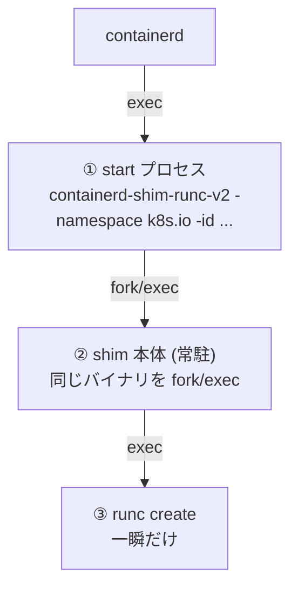

## 何を学んだか

### 3 つのプロセスが登場する



① は ② を起こしてアドレスを標準出力に書き、すぐ終了する。containerd が待つのは ① の終了だけで、② は containerd の子ではなくなる ([なぜ shim という余分なプロセスが挟まっているのか](../why-shim/))。

### ソケットは親が作り、fd で渡す

順序が巧妙だ。

1. **① がソケットを作って listen する**
2. その fd を `ExtraFiles` に入れて ② を起動する
3. ② は継承した fd でそのまま accept を始める

この順序なら、**① が終了した時点でソケットは既に listen 済み** だ。containerd がアドレスを受け取って接続すれば、必ず繋がる。

「子が listen を始めるまで待つ」という同期が要らない。「接続を試みてリトライする」も要らない。

### アドレスはパスの SHA256

ソケットのパスは `<socketDir>/<sha256 hex>` で、ハッシュの元は `<containerd のソケットパス>/<namespace>/<grouping key>`。

Unix ソケットのパス長制限 (104〜108 バイト) に収めるため、**64 文字の固定長ハッシュ**にしている。ディレクトリは `/run/containerd/s` と極端に短い ([起動パラメータを stdin の protobuf 1 通に集約する](../shim-bootstrap/))。

### 環境を整えてから起動する

- **`Setpgid: true`** — 新しいプロセスグループにする。containerd への操作 (Ctrl-C、プロセスグループへのシグナル) が shim に波及しない
- **`GOMAXPROCS=4`** — shim の Go ランタイムのスレッド数を制限する。多数の shim が動くので、それぞれが CPU 数分のスレッドを持つと無駄
- **OOM スコアを親より +1** — メモリ逼迫時に、containerd より先に shim が殺される
- **`SCHED_CORE`** — 設定されていれば core scheduling を有効にする (Hyper-Threading のサイドチャネル対策)

## ソースコードのどこか

### 起動コマンドの組み立て

[`cmd/containerd-shim-runc-v2/manager/manager_linux.go#L84-L114`](https://github.com/containerd/containerd/blob/716cbaf51212adb5e80ca1c30b644bfeb9c9d779/cmd/containerd-shim-runc-v2/manager/manager_linux.go#L84-L114)。

```go title="cmd/containerd-shim-runc-v2/manager/manager_linux.go"
	self, err := os.Executable()
	...
	cwd, err := os.Getwd()
	...
	args := []string{
		"-namespace", ns,
		"-id", id,
		"-address", containerdAddress,
	}
	...
	cmd := exec.Command(self, args...)
	cmd.Dir = cwd
	cmd.Env = append(os.Environ(), "GOMAXPROCS=4")
	cmd.Env = append(cmd.Env, "OTEL_SERVICE_NAME=containerd-shim-"+id)

	cmd.SysProcAttr = &syscall.SysProcAttr{
		Setpgid: true,
	}
```

`os.Executable()` で **自分自身を再実行する**。別バイナリではない。`cmd.Dir = cwd` で bundle ディレクトリを引き継ぐ。

`GOMAXPROCS=4` の固定は、shim が多数動く前提の判断だ。64 コアのマシンで 100 個の shim が各 64 スレッドを持つと、スレッド数が現実的でなくなる。

`OTEL_SERVICE_NAME` にコンテナ ID が入るので、トレースで shim を識別できる。

### ソケットの作成と継承

[`cmd/containerd-shim-runc-v2/manager/manager_linux.go#L150-L184`](https://github.com/containerd/containerd/blob/716cbaf51212adb5e80ca1c30b644bfeb9c9d779/cmd/containerd-shim-runc-v2/manager/manager_linux.go#L150-L184)。

```go title="cmd/containerd-shim-runc-v2/manager/manager_linux.go"
	socket, err := shim.NewSocket(address)
	if err != nil {
		// the only time where this would happen is if there is a bug and the socket
		// was not cleaned up in the cleanup method of the shim or we are using the
		// grouping functionality where the new process should be run with the same
		// shim as an existing container
		if !shim.SocketEaddrinuse(err) {
			return nil, fmt.Errorf("create new shim socket: %w", err)
		}
		if !debug && shim.CanConnect(address) {
			return &shimSocket{addr: address}, errdefs.ErrAlreadyExists
		}
		if err := shim.RemoveSocket(address); err != nil {
			return nil, fmt.Errorf("remove pre-existing socket: %w", err)
		}
		if socket, err = shim.NewSocket(address); err != nil {
			return nil, fmt.Errorf("try create new shim socket 2x: %w", err)
		}
	}
```

`EADDRINUSE` の扱いが 3 分岐する。

- **接続できる** → 既存の shim が生きている。`ErrAlreadyExists` を返す ([1 つの shim が Pod のコンテナをまとめる](../shim-grouping/))
- **接続できない** → 死んだ shim のソケットファイルが残っている。削除して作り直す
- **その他のエラー** → 失敗

コメントが「バグで掃除されなかった場合か、グルーピング機能を使っている場合」と両方の可能性を挙げている。

fd の取り出しと受け渡し。

```go title="cmd/containerd-shim-runc-v2/manager/manager_linux.go"
	f, err := socket.File()
	if err != nil {
		s.Close()
		return nil, err
	}
	s.f = f
	...
	sockets = append(sockets, s)
	cmd.ExtraFiles = append(cmd.ExtraFiles, s.f)
```

`net.UnixListener.File()` で fd を取り出し、`ExtraFiles` に入れる。子プロセスでは fd 3 番以降として現れる。

デバッグモードなら **2 つ目のソケット** も作って渡す。デバッグ用の別エンドポイントを持つためだ。

### アドレスの計算

[`pkg/shim/util_unix.go#L76-L88`](https://github.com/containerd/containerd/blob/716cbaf51212adb5e80ca1c30b644bfeb9c9d779/pkg/shim/util_unix.go#L76-L88)。

```go title="pkg/shim/util_unix.go"
// CreateSocketAddress returns a shim socket address under socketRoot.
func CreateSocketAddress(ctx context.Context, socketRoot, socketPath, id string, debug bool) (string, error) {
	ns, err := namespaces.NamespaceRequired(ctx)
	if err != nil {
		return "", err
	}
	path := filepath.Join(socketPath, ns, id)
	if debug {
		path = filepath.Join(path, "debug")
	}
	d := sha256.Sum256([]byte(path))
	return fmt.Sprintf("unix://%s/%x", socketRoot, d), nil
}
```

**同じ入力からは必ず同じアドレスが得られる**。だから既存の shim を探すのも、再接続するのも、ハッシュを計算し直すだけでよい。ソケットのアドレスをどこかに記録する必要がない (実際には `address` ファイルにも書かれるが、計算でも求まる)。

`id` に渡されるのが grouping key なので、同じ Pod のコンテナは同じアドレスになる。

### OOM スコアの調整

[`pkg/shim/util_unix.go#L56-L67`](https://github.com/containerd/containerd/blob/716cbaf51212adb5e80ca1c30b644bfeb9c9d779/pkg/shim/util_unix.go#L56-L67)。

```go title="pkg/shim/util_unix.go"
func AdjustOOMScore(pid int) error {
	parent := os.Getppid()
	score, err := sys.GetOOMScoreAdj(parent)
	if err != nil {
		return fmt.Errorf("get parent OOM score: %w", err)
	}
	shimScore := score + 1
	if err := sys.AdjustOOMScore(pid, shimScore); err != nil {
		return fmt.Errorf("set shim OOM score: %w", err)
	}
	return nil
}
```

**親 (containerd) のスコアを読んで +1 する**。固定値ではなく相対値にすることで、containerd 自身の設定 (systemd の `OOMScoreAdjust=-999` など) に追随する。

メモリ逼迫時の優先順位は「コンテナ > shim > containerd」になる。containerd が最後まで生き残れば、状況を把握して対処できる。

### core scheduling

```go title="cmd/containerd-shim-runc-v2/manager/manager_linux.go"
	goruntime.LockOSThread()
	if os.Getenv("SCHED_CORE") != "" {
		if err := schedcore.Create(schedcore.ProcessGroup); err != nil {
			return nil, fmt.Errorf("enable sched core support: %w", err)
		}
	}

	if err := cmd.Start(); err != nil {
		return nil, err
	}

	goruntime.UnlockOSThread()
```

`LockOSThread` で goroutine を OS スレッドに固定する。core scheduling の設定は **スレッド単位で効く** うえ、子プロセスに継承されるので、fork するスレッドと設定するスレッドが同じでなければならない。

Go のスケジューラが goroutine を別スレッドに移す可能性があるので、固定が必須になる。[runc の nsexec](../how-runc-works/) と同じ種類の問題だ。

### 中間プロセスを回収する

```go title="cmd/containerd-shim-runc-v2/manager/manager_linux.go"
	defer func() {
		if retErr != nil {
			cmd.Process.Kill()
		}
	}()
	// make sure to wait after start
	go cmd.Wait()
```

`go cmd.Wait()` で ② の終了を回収する。① は ② の親なので、`wait` しないとゾンビになる — ただし ① 自身がすぐ終了するので実害は小さい。それでも念のため回収している。

失敗時には ② を kill する。listen ソケットだけ残って誰も使わない、という状態を作らない。

### shim を別の cgroup に入れる

```go title="cmd/containerd-shim-runc-v2/manager/manager_linux.go"
		if shimCgroup := runcOpts.GetShimCgroup(); shimCgroup != "" {
			if cgroups.Mode() == cgroups.Unified {
				cg, err := cgroupsv2.Load(shimCgroup)
				...
				if err := cg.AddProc(uint64(cmd.Process.Pid)); err != nil {
```

ランタイムオプションで指定されていれば、shim を特定の cgroup に入れる。**shim 自体のリソースを制限したい** 場合に使う。Kubernetes では kubelet の管理下の cgroup に入れる構成がある。

## なぜそうなっているか

### listen 済みの fd を渡すことで、起動の同期が消える

「子プロセスが listen するのを待つ」を素直に実装すると、

- ポーリングして接続を試みる (遅い、タイムアウトの調整が要る)
- 子から準備完了の合図を受け取る (パイプが要る、プロトコルが増える)

のどちらかになる。**親が listen してから fork** すれば、どちらも要らない。子が accept を始める前に来た接続は、カーネルの accept キューに溜まる。

これは inetd 以来の古典的なテクニックで、systemd の socket activation も同じ原理だ。

Windows では名前付きパイプに同じ性質がないので、`awaitPipeReady` で待つ処理が入る ([`pkg/shim/shim.go`](https://github.com/containerd/containerd/blob/716cbaf51212adb5e80ca1c30b644bfeb9c9d779/pkg/shim/shim.go))。プラットフォームの差が実装の差になっている。

### アドレスを計算で求める

ソケットのアドレスを「入力から計算できる」ようにすると、

- **既存の shim を探すのに、レジストリが要らない** — 計算して接続してみればよい
- **再接続に必要な情報が減る** — namespace と ID があれば求まる
- **衝突しない** — ハッシュなので、異なる入力は異なるアドレス

grouping key を入力に含めることで、「同じ Pod なら同じアドレス」が自動的に成立する。

### 自分自身を再実行する

別のバイナリを用意せず、`os.Executable()` で自分を再実行する。

- バイナリが 1 つで済む
- バージョンの不整合が起きない
- サブコマンドの有無で役割を切り替えられる

`runc` も同じ手法を使う ([runc が実際にやること](../how-runc-works/))。**プロセスの役割を分けたいが、コードは共有したい** ときの定石になっている。

## どう活かすか

### shim の起動を観察する

```sh
# shim のプロセスグループ (PGID が自分自身 = 独立したグループ)
$ ps -o pid,ppid,pgid,cmd -C containerd-shim-runc-v2

# OOM スコア
$ cat /proc/<shim-pid>/oom_score_adj
$ cat /proc/<containerd-pid>/oom_score_adj

# ソケット
$ ls -l /run/containerd/s/
```

`PPID` が 1 (init) になっているはずだ。containerd の子ではない。

`/run/containerd/s/` に 64 文字のファイル名が並ぶ。数が Pod 数と一致していれば、グルーピングが効いている。

### 「listen してから fork」を使う

サーバプロセスを起動して接続する設計では、この手法で起動時の競合を消せる。

- **親がソケットを作って listen する**
- **fd を子に継承させる** (`ExtraFiles`、あるいは `dup2` して固定 fd 番号にする)
- **親はアドレスを呼び出し元に返して終了する**

代償は、親がソケットの作成権限を持つ必要があること。特権を落として子を動かす構成では、この順序が特に効く (親が特権でソケットを作り、子は非特権で動く)。

### 相対的な OOM スコア

「親より 1 だけ高く」という設定は、絶対値を決め打ちするより頑健だ。デプロイ方法 (systemd、Kubernetes の static pod、手動起動) によって親のスコアが違っても、相対関係が保たれる。

**優先順位を絶対値ではなく相対値で表現する** のは、設定が外部から与えられる環境で有効なパターンになる。
