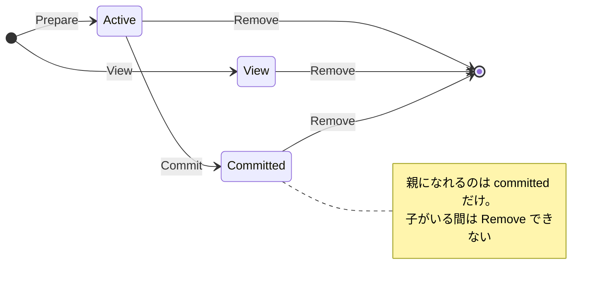

## 何を学んだか

### 3 つの状態と、遷移の向き



- **Active** — 書き込み可能。`Prepare` で作られる
- **View** — 読み取り専用。`View` で作られる。committed を覗くために使う
- **Committed** — 不変。`Commit` でのみ作られる。親になれる

**active が committed になることはあっても、逆はない**。そして「active を親にする」ことはできない。

### key と name は同じ空間にある

active を指すのが `key`、committed を指すのが `name` だが、**同じ名前空間を共有する**。同じ文字列を持つ active と committed は同時に存在できない。

だから `Commit(ctx, name, key)` で名前が変わることに意味がある。作業用のキー (`extract-abc123 sha256:...`) から、恒久的な名前 (chainID) へ移る。

### 親は committed でなければならない

`Prepare(ctx, key, parent)` の `parent` が active だとエラーになる。書き込み中のものの上に積むと、下が動いている間に上を作ることになり、内容が確定しない。

### 子がいるものは消せない

`Remove` は、その snapshot を親とする子が 1 つでもあれば `ErrFailedPrecondition` を返す。overlayfs の lowerdir が消えると、それを使っている上位層が壊れるからだ。

GC の掃除が「葉から順に消す」のはこの制約のためだ ([削除はメタデータだけ先に済ませ、実体は後で消す](../deferred-cleanup/))。

### Commit 時に親を後付けできる場合がある

親を指定せずに作った active は、**Commit のときに親を与えられる** (rebase)。並列展開のために追加された経路で、対応する snapshotter だけが `rebase` capability を申告する。

## ソースコードのどこか

### 作成時の検査

[`core/snapshots/storage/bolt.go#L217-L250`](https://github.com/containerd/containerd/blob/716cbaf51212adb5e80ca1c30b644bfeb9c9d779/core/snapshots/storage/bolt.go#L217-L250)。

```go title="core/snapshots/storage/bolt.go"
func CreateSnapshot(ctx context.Context, kind snapshots.Kind, key, parent string, opts ...snapshots.Opt) (s Snapshot, err error) {
	switch kind {
	case snapshots.KindActive, snapshots.KindView:
	default:
		return Snapshot{}, fmt.Errorf("snapshot type %v invalid; only snapshots of type Active or View can be created: %w", kind, errdefs.ErrInvalidArgument)
	}
```

**committed を直接作ることはできない**。必ず active を経由する。関数の入口でこれを弾いている。

親の検査。

```go title="core/snapshots/storage/bolt.go"
		if parent != "" {
			spbkt = bkt.Bucket([]byte(parent))
			if spbkt == nil {
				return fmt.Errorf("missing parent %q bucket: %w", parent, errdefs.ErrNotFound)
			}

			if readKind(spbkt) != snapshots.KindCommitted {
				return fmt.Errorf("parent %q is not committed snapshot: %w", parent, errdefs.ErrInvalidArgument)
			}
```

親が存在しない → `ErrNotFound`、親が committed でない → `ErrInvalidArgument`。**エラーの種類を分けている** ので、呼び出し側が対応を変えられる ([errdefs: エラーの意味を境界で保つ](../errdefs/))。

### Commit は「新しいバケットを作って移す」

[`core/snapshots/storage/bolt.go#L350-L400`](https://github.com/containerd/containerd/blob/716cbaf51212adb5e80ca1c30b644bfeb9c9d779/core/snapshots/storage/bolt.go#L350-L400)。

```go title="core/snapshots/storage/bolt.go"
	if err := withBucket(ctx, func(ctx context.Context, bkt, pbkt *bolt.Bucket) error {
		dbkt, err := bkt.CreateBucket([]byte(name))
		if err != nil {
			if err == errbolt.ErrBucketExists {
				err = errdefs.ErrAlreadyExists
			}
			return fmt.Errorf("committed snapshot %v: %w", name, err)
		}
		sbkt := bkt.Bucket([]byte(key))
		if sbkt == nil {
			return fmt.Errorf("failed to get active snapshot %q: %w", key, errdefs.ErrNotFound)
		}
		...
		if si.Kind != snapshots.KindActive {
			return fmt.Errorf("snapshot %q is not active: %w", key, errdefs.ErrFailedPrecondition)
		}
		si.Kind = snapshots.KindCommitted
		si.Created = time.Now().UTC()
		si.Updated = si.Created

		// Replace labels, do not inherit
		si.Labels = base.Labels
```

先に **新しい名前のバケットを作る**。既に存在すれば `ErrAlreadyExists` で終わり、元の active は無傷のまま残る。順序を逆にすると、失敗時に active が消えてしまう。

ラベルは継承せず置き換える。「作業中に付けたラベル」が commit 後に残らない。コメント `// Replace labels, do not inherit` が明示している。

rebase の許可もここにある。

```go title="core/snapshots/storage/bolt.go"
		// If the snapshot didn't have a parent when created, allow it
		// to be rebased on a parent on commit.
```

### 削除時の子チェック

[`core/snapshots/storage/bolt.go#L298-L330`](https://github.com/containerd/containerd/blob/716cbaf51212adb5e80ca1c30b644bfeb9c9d779/core/snapshots/storage/bolt.go#L298-L330)。

```go title="core/snapshots/storage/bolt.go"
		if pbkt != nil {
			k, _ := pbkt.Cursor().Seek(parentPrefixKey(id))
			if getParentPrefix(k) == id {
				return fmt.Errorf("cannot remove snapshot with child: %w", errdefs.ErrFailedPrecondition)
			}
```

親子関係は別バケット (`pbkt`) に「親 ID + 子 ID」というキーで格納されていて、**親 ID をプレフィックスとして Seek するだけで子の有無が分かる**。子のリストを別に持たず、キーの順序を利用している。

bbolt の B+tree はキー順に並ぶので、`parentPrefixKey(id)` で seek して先頭が同じ親 ID なら子がいる、という判定が O(log n) でできる。

### Active の取得は Kind を検査する

[`core/snapshots/storage/bolt.go#L182-L207`](https://github.com/containerd/containerd/blob/716cbaf51212adb5e80ca1c30b644bfeb9c9d779/core/snapshots/storage/bolt.go#L182-L207)。

```go title="core/snapshots/storage/bolt.go"
		s.Kind = readKind(sbkt)

		if s.Kind != snapshots.KindActive && s.Kind != snapshots.KindView {
			return fmt.Errorf("requested snapshot %v not active or view: %w", key, errdefs.ErrFailedPrecondition)
		}

		if parentKey := sbkt.Get(bucketKeyParent); len(parentKey) > 0 {
			spbkt := bkt.Bucket(parentKey)
			if spbkt == nil {
				return fmt.Errorf("parent does not exist: %w", errdefs.ErrNotFound)
			}

			s.ParentIDs, err = parents(bkt, spbkt, readID(spbkt))
```

`GetSnapshot` は active/view 専用で、committed を渡すと `ErrFailedPrecondition`。マウント情報を返す用途なので、committed を渡すのは呼び出し側の誤りだ。

親の連鎖は再帰的に辿られて `ParentIDs` になる。

### 展開用のキーには特別な形式がある

[`core/snapshots/snapshotter.go#L30-L35`](https://github.com/containerd/containerd/blob/716cbaf51212adb5e80ca1c30b644bfeb9c9d779/core/snapshots/snapshotter.go#L30-L35)。

```go title="core/snapshots/snapshotter.go"
	// UnpackKeyPrefix is the beginning of the key format used for snapshots that will have
	// image content unpacked into them.
	UnpackKeyPrefix = "extract"
	// UnpackKeyFormat is the format for the snapshotter keys used for extraction
	UnpackKeyFormat       = UnpackKeyPrefix + "-%s %s"
```

`extract-<ランダム> <chainID>` という形になる。ランダム部分があるので、同じ layer を同時に 2 回展開しようとしても active のキーが衝突しない。

`ctr snapshots ls` に `extract-` で始まるエントリが残っていたら、それは **中断した展開の残骸** だ。

## なぜそうなっているか

### 不変性が共有を可能にする

committed が不変だからこそ、複数のコンテナやイメージが同じ snapshot を親として共有できる。もし親が書き換わりうるなら、共有している全員に影響が出る。

「active は親になれない」という制約は、この不変性を守るためのものだ。書き込み中のものを土台にできてしまうと、内容が確定しない状態を親にすることになる。

### 状態遷移を一方向にする

active → committed の一方向にしたことで、

- 「commit 済みのものを書き換える」経路が存在しない
- 実装が状態の巻き戻しを考えなくてよい
- GC が「committed は参照されうる、active は作業中」と単純に扱える

もし双方向なら、「commit したものを active に戻して書き換え、また commit する」という操作が可能になり、その間の参照者の扱いが問題になる。

新しい層を作りたければ、committed を親にして新しい active を作る。**変更は常に新しい snapshot を生む**。

### 制約をストレージ層で検査する

「親は committed でなければならない」「子がいたら消せない」といった検査は、bolt のトランザクションの中で行われる。各 snapshotter の実装がこれを書く必要はない。

storage パッケージを使わずに実装することもできるが、その場合はこれらの不変条件を自分で守ることになる。**共通のストレージ層を提供することが、実装の質を揃える手段** になっている ([snapshotter 共通のメタデータを、1 つのパッケージに切り出す](../snapshot-storage/))。

## どう活かすか

### 消せない snapshot に出会ったら

```
cannot remove snapshot with child: failed precondition
```

このエラーは、子を先に消す必要があることを示す。親子関係を辿るには、

```sh
# Parent 列を見る
$ ctr -n k8s.io snapshots ls

# 特定 snapshot の親
$ ctr -n k8s.io snapshots info <key> | grep -i parent
```

通常は GC が葉から順に処理するので手で消す必要はない。手動で消したくなる状況は、たいてい何かが GC を妨げている (リースが残っている、ラベルが張られたまま)。

### 中断した展開の残骸

```sh
$ ctr -n k8s.io snapshots ls | grep '^extract-'
```

pull が中断すると `extract-` で始まる active が残ることがある。リースが切れれば GC で消えるが、消えない場合は `containerd.io/gc.root` ラベルが残っていないかを確認する。

### 「一方向の状態機械 + 不変な成果物」

この形は、共有される成果物を扱うシステムで広く使える。

- **作業領域と成果物を別の状態にする** — 書き込み中のものと確定したものを混ぜない
- **遷移を一方向にする** — 確定したものを書き換える経路を作らない
- **確定したものだけを参照可能にする** — 依存関係の土台にできるのは確定物のみ
- **依存されているものは消せない** — 削除は葉から

Git のオブジェクトモデル、Nix のストア、ビルドキャッシュもみな同じ形をしている。共有と不変性はセットで、片方だけを取ることはできない。
