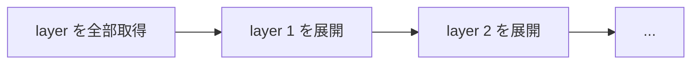

## 何を学んだか

### unpack は pull の handler に割り込む形で動く

素直に書けば、pull と unpack は逐次になる。



containerd の unpacker は、[handler チェーン](../image-handlers/) をラップして pull の途中に入り込む。

```go
// Unpack wraps an image handler to filter out blob handling and scheduling them
// during the unpack process. When an image config is encountered, the unpack
// process will be started in a goroutine.
func (u *Unpacker) Unpack(h images.Handler) images.Handler
```

やっていることは 2 つ。

1. **manifest を見たら、children から layer を抜き取る** — layer は通常の handler 経路では取得されなくなる
2. **config を見たら、抜き取っておいた layer リストで展開処理を起動する**

layer の取得は unpack 処理の側が制御する。だから「1 枚落ちたら展開を始める」というパイプラインが組める。

### なぜ config を起点にするのか

展開には diffID の列が必要で、それは **config の中にしかない**。manifest を見た時点では layer の digest しか分からず、chainID が計算できない。

だから manifest では layer を退避しておくだけにして、config が来たら本番を始める。

### 上半分と下半分

layer 1 枚の展開は 2 段階に分かれる。

- **top half** — snapshotter に `Prepare` を要求し、layer のダウンロードを待ち、`Apply` で tar を展開する
- **bottom half** — `Commit` して chainID をキーにした committed snapshot にする

`Commit` は親が確定していないとできないので、下半分は順序を守って直列に実行される。上半分 (ダウンロードと展開) は条件が揃えば並列に走る。

### 既に展開済みならスキップ

`Prepare` が `ErrAlreadyExists` を返せば、その chainID の snapshot は既にある。ダウンロードも展開も不要になる。これがイメージ間のレイヤ共有を効かせている。

## ソースコードのどこか

### layer の抜き取り

[`core/unpack/unpacker.go#L219-L267`](https://github.com/containerd/containerd/blob/716cbaf51212adb5e80ca1c30b644bfeb9c9d779/core/unpack/unpacker.go#L219-L267)。

```go title="core/unpack/unpacker.go"
		if images.IsManifestType(desc.MediaType) {
			var nonLayers []ocispec.Descriptor
			var manifestLayers []ocispec.Descriptor
			// Split layers from non-layers, layers will be handled after
			// the config
			for i, child := range children {
				...
				if images.IsLayerType(child.MediaType) || layerTypes[child.MediaType] {
					manifestLayers = append(manifestLayers, child)
				} else {
					nonLayers = append(nonLayers, child)
				}
			}

			lock.Lock()
			for _, nl := range nonLayers {
				layers[nl.Digest] = manifestLayers
			}
			lock.Unlock()

			children = nonLayers
		}
```

**`children` から layer を除いて返す**。上位の `Dispatch` は layer を辿らなくなる。

layer のリストは `layers[config の digest]` という形で記録される。config が来たときに引けるようにするためだ。

```go title="core/unpack/unpacker.go"
		} else if images.IsConfigType(desc.MediaType) || configTypes[desc.MediaType] {
			lock.Lock()
			l := layers[desc.Digest]
			lock.Unlock()
			if len(l) > 0 {
				u.eg.Go(func() error {
					return u.unpack(h, desc, l)
				})
			}
		}
```

config を見つけたら `errgroup` に投入する。**handler はすぐ返る** ので、pull の他の部分 (他プラットフォームの manifest など) は止まらない。

完了は `Wait()` で待つ。

```go title="core/unpack/unpacker.go"
// Wait waits for any ongoing unpack processes to complete then will return
// the result.
func (u *Unpacker) Wait() (Result, error) {
```

### 対応しないプラットフォームなら取得だけ

[`core/unpack/unpacker.go#L342-L347`](https://github.com/containerd/containerd/blob/716cbaf51212adb5e80ca1c30b644bfeb9c9d779/core/unpack/unpacker.go#L342-L347)。

```go title="core/unpack/unpacker.go"
	if unpack == nil {
		log.G(ctx).WithField("image", config.Digest).WithField("platform", platforms.Format(imgPlatform)).Debugf("unpacker does not support platform, only fetching layers")
		return u.fetch(ctx, h, layers, nil)
	}
```

`--all-platforms` で pull した場合、実行できないプラットフォームの layer は **取得するが展開しない**。展開の設定がないプラットフォームを黙って飛ばすのではなく、blob は揃える。

### chainID は先に全部計算する

```go title="core/unpack/unpacker.go"
	// pre-calculate chain ids for each layer
	chainIDs := make([]digest.Digest, len(diffIDs))
	copy(chainIDs, diffIDs)
	chainIDs = identity.ChainIDs(chainIDs)
```

層ごとに `identity.ChainID(diffIDs[:i+1])` を呼ぶと、毎回先頭から畳み込むので O(n²) になる。`ChainIDs` は一度に全部計算する。

ベンチマーク (`unpacker_test.go` の `BenchmarkUnpackWithChainID` と `BenchmarkUnpackWithChainIDs`) がわざわざ用意されていて、この違いを測っている。

### ダウンロードと展開の同期

[`core/unpack/unpacker.go#L510-L570`](https://github.com/containerd/containerd/blob/716cbaf51212adb5e80ca1c30b644bfeb9c9d779/core/unpack/unpacker.go#L510-L570)。

```go title="core/unpack/unpacker.go"
		if fetchErr == nil {
			fetchOffset = i
			n := len(layers) - fetchOffset
			fetchErr = make([]chan error, n)
			fetchC = make([]chan struct{}, n)
			for i := range n {
				fetchC[i] = make(chan struct{})
				fetchErr[i] = make(chan error, 1)
			}
			go func(i int) {
				err := u.fetch(ctx, h, layers[i:], fetchC)
				...
			}(i)
		}
```

layer 1 枚につきチャネルを 2 本 (完了通知とエラー通知) 用意し、取得処理を 1 つの goroutine で走らせる。取得が終わった layer から `fetchC[i]` が閉じられる。

`fetchOffset` に注目したい。**既に展開済みの layer は取得すらしない** ので、取得を開始する位置がずれる。最初に「展開が必要」と判明した層から取得が始まる。

展開側はチャネルを待つ。

```go title="core/unpack/unpacker.go"
			select {
			case <-ctx.Done():
				cleanup.Do(ctx, abort)
				status.err = ctx.Err()
				resCh <- status
				return
			case err := <-fetchErr[i-fetchOffset]:
				if err != nil {
					cleanup.Do(ctx, abort)
					status.err = err
					resCh <- status
					return
				}
			case <-fetchC[i-fetchOffset]:
			}
			...
			diff, err := a.Apply(ctx, desc, mounts, unpack.ApplyOpts...)
```

キャンセル、取得失敗、取得完了の 3 つを 1 つの `select` で待つ。失敗時には `cleanup.Do` で `abort` を呼び、作りかけの snapshot を消す。

`cleanup.Do` は **キャンセル済みのコンテキストでも後始末を実行する** ためのヘルパで、`context.WithoutCancel` 相当の処理を行う。エラー経路で後始末がスキップされるのを防ぐ。

### 並列展開の落とし穴

```go title="core/unpack/unpacker.go"
			// In case of parallel unpack, the parent snapshot isn't provided to the snapshotter.
			// The overlayfs will return bind mounts for all layers, we need to convert them
			// to overlay mounts for the applier to perform whiteout conversion correctly.
			// TODO: this is a temporary workaround until #13053 lands.
			// See: https://github.com/containerd/containerd/issues/13030
			if i > 0 && parallel && unpack.SnapshotterKey == "overlayfs" {
				mounts = bindToOverlay(mounts)
			}
```

並列展開では親を指定せずに `Prepare` するので、overlayfs は bind マウントを返す ([レイヤと overlayfs](../layers-and-overlayfs/) で見た「親がなければ bind」の分岐)。

しかし bind マウント先に tar を展開すると、**whiteout の変換が正しく行われない**。差分適用は「下の層が見えている」前提で whiteout をキャラクタデバイスに変換するからだ。そこで一時的に overlay マウントの形に組み替えている。

issue 番号つきの workaround で、CLAUDE の言う「非自明な WHY」がそのまま書かれている良い例だ。

### 重複 pull の抑制

```go title="core/unpack/unpacker.go"
			duplicationSuppressor: kmutex.NewNoop(),
```

同じ blob を同時に処理しないためのキー付きロックを差し込める。既定は no-op で、CRI プラグインは実物を渡す。

Kubernetes では同じイメージの Pod が同時に複数起動することがあり、その場合に同じ layer を 2 回展開しないための仕組みになる。

## なぜそうなっているか

### pull の待ち時間はネットワークが支配する

layer のダウンロードは数十秒かかることがあり、展開 (tar の解凍とファイル書き込み) も無視できない。直列にすると単純に足し算になる。

パイプライン化すると、**layer n を展開している間に layer n+1 をダウンロード** できる。理想的には遅い方の合計時間に収まる。

Pod の起動時間はイメージの pull が支配的なので、この最適化はノードのスケール速度に直結する。

### handler に割り込む形にした理由

unpack を pull の後段に置く (全部取得してから展開する) 実装のほうが単純だ。しかしそれでは、

- 取得と展開が重ならない
- 「既に展開済みだから取得も不要」という判断ができない
- pull の途中でエラーが起きたとき、無駄に全部取得してしまう

handler の中で判断すると、**取得を始める前に「必要か」を決められる**。

### 上半分と下半分に分ける

`Commit` は親の snapshot が確定していないとできない。この順序制約があるので、完全な並列化はできない。

上半分 (取得 + 展開) と下半分 (commit) を分けることで、**順序制約のある部分だけを直列に** できる。パイプラインの原理そのままだ。

## どう活かすか

### pull が遅いときに見るところ

```sh
# 同時ダウンロード数を上げてみる
$ ctr images pull --max-concurrent-downloads 5 <image>
```

CRI 経由では設定ファイルで指定する。

```toml
version = 3
[plugins.'io.containerd.cri.v1.images']
  max_concurrent_downloads = 5
```

ダウンロードが速いのに pull が遅い場合は、展開側 (ディスク I/O、snapshotter) が律速している。`ctr content active` で offset の進みを見ると、どちらが遅いか分かる。

erofs snapshotter のように「展開しない」方式が検討されるのは、この展開コストが理由だ ([remote snapshotter](../remote-snapshotter/))。

### パイプラインを組むときの型

取得と加工を重ねる処理を書くときの要点。

- **段の間はチャネル 1 本で繋ぐ** — 完了通知とエラー通知を分けると、待ち側の select が素直になる
- **順序制約のある処理だけを直列にする** — 全体を直列にしない
- **早期にスキップ判定を入れる** — 「もう持っている」を先に判定できれば、取得自体が不要になる
- **失敗時の後始末をキャンセル耐性のあるコンテキストで実行する** — `cleanup.Do` に相当する仕組みを用意する

最後の点は忘れられがちだ。エラーで抜けるときに `ctx` が既にキャンセルされていると、後始末の API 呼び出しも失敗する。containerd は専用のヘルパを用意してこれを避けている。
