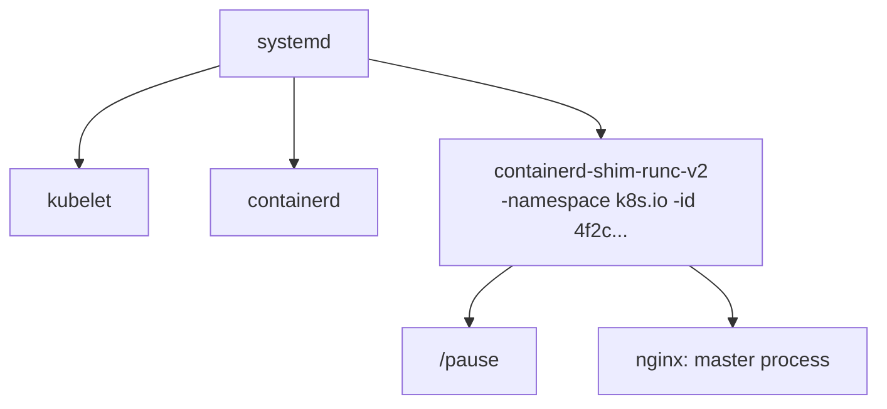

## 何を学んだか

### どんな状況の話か

Kubernetes ノードで nginx の Pod が 1 つ動いているとき、プロセスの親子関係は `ps` でこう見える。



ここで気づくことが 2 つある。**nginx の親は containerd ではない**。そして **`runc` はどこにもいない**。runc はコンテナを作った直後に終了していて、生き残っているのは shim だけだ。

なぜこんな構造になっているのか。「デーモンが fork してコンテナを起動する」ではいけないのか。この章全体の前提として、まずこの層構造を押さえる。

### 層と、その境界にある仕様

コンテナランタイムは 5 層あり、層と層の境界にはそれぞれ **仕様** がある。層が入れ替え可能なのは、境界が実装ではなく仕様で定義されているからだ。

| 層                 | 代表実装                           | 下の層との境界                                          |
| ------------------ | ---------------------------------- | ------------------------------------------------------- |
| オーケストレータ   | kubelet, dockerd, nerdctl          | **CRI** (protobuf / gRPC) または各ツール独自の API      |
| 高レベルランタイム | **containerd**, CRI-O              | shim API (ttrpc)、OCI Image Spec、OCI Distribution Spec |
| shim               | containerd-shim-runc-v2, kata-shim | **OCI Runtime Spec** (bundle ディレクトリ)              |
| 低レベルランタイム | runc, crun, runsc (gVisor), kata   | Linux のシステムコール                                  |
| カーネル           | namespace, cgroup, seccomp, LSM    | —                                                       |

「高レベル / 低レベル」という呼び分けは、扱う対象の抽象度の差だ。低レベルランタイムが知っているのは「このディレクトリを rootfs にして、この設定でプロセスを 1 つ作れ」だけで、イメージもレジストリも知らない。高レベルランタイムはイメージを引き、レイヤを重ね、その結果として低レベルランタイムに渡す入力を組み立てる。

### containerd の担当範囲

containerd の仕事は、**コンテナに必要な材料を揃え、誰が何を使っているかを覚えておくこと** に尽きる。具体的には次の 6 つだ。

1. **引く** — レジストリから manifest と layer blob を取得する (OCI Distribution)
2. **置く** — blob を digest 名で content store に保存する
3. **積む** — layer を展開して snapshotter でスタックし、マウント可能な rootfs にする
4. **書く** — `config.json` と `rootfs/` を持つ bundle ディレクトリを作る
5. **投げる** — shim バイナリを起動し、ttrpc 越しに create/start を送る
6. **覚える／片付ける** — 誰が何を参照しているかを bbolt に記録し、参照が切れたら GC する

逆に **やらないこと** が明示的に決められている。ネットワークインターフェースの作成 (CNI を呼ぶのは CRI プラグイン側か、その上の層)、イメージのビルド、ボリューム管理、ログの永続化。そしてコンテナプロセスを直接 fork することもしない。

## ソースコードのどこか

### やらないことが表になっている

[`SCOPE.md#L38-L45`](https://github.com/containerd/containerd/blob/716cbaf51212adb5e80ca1c30b644bfeb9c9d779/SCOPE.md#L38-L45) に、機能ごとの in/out の表がある。

```markdown title="SCOPE.md"
| execution | Provide an extensible execution layer for executing a container | in | Create,start, stop pause, resume exec, signal, delete |
...
| networking | creation and management of network interfaces | out | Networking will be handled and provided to containerd via higher level systems. |
| build | Building images as a first class API | out | Build is a higher level tooling feature and can be implemented in many different ways on top of containerd |
| volumes | Volume management for external data | out | The API supports mounts, binds, etc where all volumes type systems can be built on top of containerd. |
| logging | Persisting container logs | out | Logging can be build on top of containerd because the container's STDIO will be provided to the clients and they can persist any way they see fit. There is no io copying of container STDIO in containerd. |
```

logging の理由が明快だ。「コンテナの STDIO はクライアントに渡すので、好きなように永続化すればよい。**containerd の中に STDIO のコピーは存在しない**」。実際、コンテナの stdout を読んでいるのは containerd ではなく shim だ ([コンテナの stdio を fifo で受け渡す](../shim-io/))。

さらに [`SCOPE.md#L48-L57`](https://github.com/containerd/containerd/blob/716cbaf51212adb5e80ca1c30b644bfeb9c9d779/SCOPE.md#L48-L57)。

```markdown title="SCOPE.md"
containerd is scoped to a single host and makes assumptions based on that fact.
...
The scope of this project is an allowed list.
If it's not mentioned as being in scope, it is out of scope.
For the scope of this project to change it requires a 100% vote from all maintainers of the project.
```

「一覧にないものは対象外」「変更には全メンテナの 100% の賛成が必要」。スコープの拡大に対して、意思決定のコストを最大に設定してある。

### デーモンはコンテナを起動しない、と最初に書いてある

[`docs/runtime-v2.md#L5-L11`](https://github.com/containerd/containerd/blob/716cbaf51212adb5e80ca1c30b644bfeb9c9d779/docs/runtime-v2.md#L5-L11) の冒頭。

```markdown title="docs/runtime-v2.md"
containerd, the daemon, does not directly launch containers. Instead, it acts as a higher-level manager
or hub for coordinating the activities of containers and content, that lower-level
programs, called "runtimes", actually implement to start, stop and manage containers,
either individual containers or groups of containers, e.g. Kubernetes pods.

For example, containerd will retrieve container image config and its content as layers, use the snapshotter to lay it out on disk, set up
the container's rootfs and config, and then launch a runtime that will create/start/stop the container.
```

「イメージの config とレイヤを取得し、snapshotter でディスク上に並べ、rootfs と config を用意し、そのあとランタイムを起動する」。前半 3 つが containerd の仕事、最後が別プロセスの仕事だという分割がそのまま書かれている。

### 差し替え可能な点の一覧 = プラグイン型の一覧

[`plugins/types.go`](https://github.com/containerd/containerd/blob/716cbaf51212adb5e80ca1c30b644bfeb9c9d779/plugins/types.go) に並ぶプラグイン型が、そのまま「containerd のどこを取り替えられるか」の一覧になっている。

```go title="plugins/types.go"
	// RuntimePluginV2 implements a runtime v2
	RuntimePluginV2 plugin.Type = "io.containerd.runtime.v2"
	...
	// SnapshotPlugin implements a snapshotter
	SnapshotPlugin plugin.Type = "io.containerd.snapshotter.v1"
	...
	// ContentPlugin implements a content store
	ContentPlugin plugin.Type = "io.containerd.content.v1"
	...
	// CRIServicePlugin implements a cri service
	CRIServicePlugin plugin.Type = "io.containerd.cri.v1"
```

ランタイム、snapshotter、content store、CRI サービス — 上下の境界にあたるものは全部プラグインになっている。詳しくは [中核が空のデーモン](../plugin-architecture/) で読む。

### バイナリの分かれ方

[`cmd/`](https://github.com/containerd/containerd/tree/716cbaf51212adb5e80ca1c30b644bfeb9c9d779/cmd) 配下に並ぶバイナリは 6 つで、うちコンテナ実行に関わるのは 3 つだけだ。

- `containerd` — デーモン本体
- `containerd-shim-runc-v2` — shim。コンテナごと (または Pod ごと) に 1 プロセス
- `ctr` — デバッグ用 CLI。「人間に優しくすることも、インターフェースの安定性も保証しない」と `SCOPE.md` に書かれている

`runc` はこのリポジトリには入っていない。containerd は runc をライブラリとして取り込まず、**PATH 上のバイナリとして exec する**。runc の実装がどう変わろうと、CLI と `config.json` の仕様さえ守られていれば containerd は影響を受けない。

## なぜそうなっているか

### 歴史的には「1 つだった実装を切り出した」結果

2013 年の Docker は 1 バイナリだった。そこから `runc` が OCI 標準の参照実装として切り出され (2015)、実行管理部分が containerd として切り出され (2016)、Kubernetes が特定ランタイムへの依存を切るために CRI を定義した (2016)。層はいきなり設計されたのではなく、**「ここは仕様にできる」と分かった境界から順に切られてきた**。

その帰結として、境界の切り方が層ごとに違っている。

- **CRI**: protobuf の gRPC サービス。kubelet が「Pod サンドボックスを作れ」「コンテナを作れ」と命令する
- **OCI Runtime Spec**: ディレクトリ 1 つ。API ではなく **ファイルシステム上の状態** が境界になっている
- **shim API**: ttrpc ソケット。containerd が接続し、コマンドを送る
- **OCI Image Spec / Distribution Spec**: HTTP とメディアタイプ

特に OCI Runtime Spec の「ディレクトリが境界」という選択が効いている。プロセスが死んでも、ディレクトリは残る。containerd が再起動しても bundle ディレクトリを読めば状態を復元できる ([containerd が死んでもコンテナは死なない](../shim-reconnect/))。

### 層が独立に再起動できることが要件だった

デーモンがコンテナの親プロセスだと、デーモンの更新のたびに全コンテナが死ぬ。ノード上で数十個の Pod が動いている状況でこれは許されない。だから containerd はコンテナの親にならず、shim を挟む。この動機の詳細は [なぜ shim という余分なプロセスが挟まっているのか](../why-shim/) で扱う。

### primitive を出す、抽象は出さない

`SCOPE.md` の Principles にはもう 1 つ重要な原則がある。

```markdown title="SCOPE.md"
containerd should expose primitives to solve problems instead of building high level abstractions in the API.
A common example of this is how build would be implemented.
Instead of having a build API in containerd we should expose the lower level primitives that allow things required in build to work.
```

「ビルド API を持つ代わりに、ビルドを実装できる低レベルの primitive を出す」。BuildKit が containerd の上に載るのはこの方針の結果で、snapshotter の `Prepare` / `Commit`、content store、differ という部品を組み合わせればビルドが書ける、という設計になっている。

## どう活かすか

### 障害の切り分けは「どの層か」から始める

層ごとにログの出所も、状態の置き場も違う。

| 症状                                           | 見る層                     | 手段                                          |
| ---------------------------------------------- | -------------------------- | --------------------------------------------- |
| Pod が ContainerCreating のまま                | kubelet ↔ CRI              | `journalctl -u kubelet`、`crictl pods`        |
| イメージが取れない                             | containerd の distribution | `ctr -n k8s.io images ls`、containerd のログ  |
| コンテナが起動直後に落ちる                     | shim ↔ runc                | bundle の `config.json`、shim のログ          |
| コンテナは生きているが containerd から見えない | containerd ↔ shim の接続   | `ps` で shim を探し、state ディレクトリを見る |

`crictl` は CRI の層を、`ctr` は containerd の層を叩く別々の道具で、`ctr` にはネームスペース (`-n k8s.io`) の指定が要る。この 2 つを混同しないだけで切り分けが速くなる。

### 「ファイルとプロセスで境界を切る」は他所でも使える

層をライブラリ境界ではなくプロセス境界で切り、受け渡しをファイルシステム上の状態にする、という設計は、containerd に限らず有効なパターンだ。得られるものは 3 つある。

- **独立更新** — 片方を再起動しても他方が生き残る
- **言語非依存** — runc は Go、crun は C、どちらでも同じ `config.json` を読む
- **観測可能性** — 実行中の状態が `cat` できる。デバッグのために API を叩く必要がない

代償は、状態の整合性を自前で守る必要があること。containerd がこれをどう解いているかが、この章の後半の主題になる。
