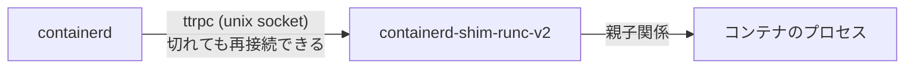
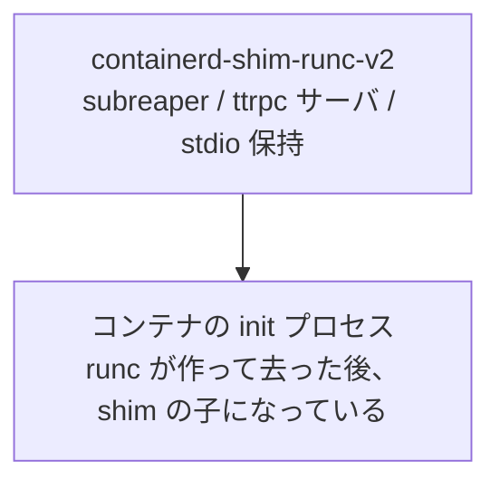

## 何を学んだか

### 親であることには義務がある

Unix でプロセスの終了コードを受け取れるのは親だけだ。`wait(2)` を呼べるのは親であり、親が死ねば子は init (PID 1) に引き取られ、**終了コードは誰にも観測されずに捨てられる**。

コンテナランタイムのデーモンがコンテナプロセスの親になっている場合、次の問題が全部降ってくる。

1. **デーモンを再起動すると、コンテナの終了コードが失われる** — 再起動中に終了したコンテナの結果が分からない
2. **デーモンを更新するには全コンテナを止める必要がある** — あるいは孤児として放置する
3. **デーモンがコンテナ数に比例して重くなる** — 全コンテナの stdio をコピーし続けるゴルーチンを持つ
4. **デーモンがクラッシュすると stdio が閉じる** — コンテナ側が SIGPIPE で死ぬ

Kubernetes ノードでは containerd の更新は日常的な運用作業だ。そのたびに Pod が落ちるのは受け入れられない。

### 解決は「親を別プロセスに切り出す」

containerd の答えは、コンテナ 1 つ (または Pod 1 つ) につき **shim プロセスを 1 つ立て、そこに親の役割を全部渡す** ことだ。



shim が持つ責任は 3 つある。

- **親であること** — subreaper になり、コンテナプロセスの終了を `wait` で受け取る
- **stdio を持つこと** — fifo やログファイルへのコピーを続ける。containerd が落ちても止まらない
- **API を提供すること** — ttrpc サーバとして待ち受け、containerd からの create/start/kill/delete を受ける

containerd と shim の関係は **親子ではなく、ソケット越しのクライアントとサーバ** だ。だから containerd はいつ死んでも、いつ戻ってきてもよい。

### runc も残らない

さらに言えば、shim の子として動き続けるのは runc でもない。`runc create` はコンテナの init プロセスを作ったら **自分は終了する**。init プロセスは shim に引き取られる。

これが可能なのは shim が `PR_SET_CHILD_SUBREAPER` を設定しているからだ。subreaper を設定したプロセスは、自分の子孫が孤児になったときに init の代わりに引き取れる。

結果として、実行中の構成はこうなる。



`runc` は起動時と削除時に一瞬走るだけの **コマンド** であって、常駐しない。

## ソースコードのどこか

### subreaper の設定

[`pkg/shim/shim_linux.go#L23-L30`](https://github.com/containerd/containerd/blob/716cbaf51212adb5e80ca1c30b644bfeb9c9d779/pkg/shim/shim_linux.go#L23-L30)。

```go title="pkg/shim/shim_linux.go"
func newServer(opts ...ttrpc.ServerOpt) (*ttrpc.Server, error) {
	opts = append(opts, ttrpc.WithServerHandshaker(ttrpc.UnixSocketRequireSameUser()))
	return ttrpc.NewServer(opts...)
}

func subreaper() error {
	return reaper.SetSubreaper(1)
}
```

[`pkg/sys/reaper/reaper_utils_linux.go#L25-L28`](https://github.com/containerd/containerd/blob/716cbaf51212adb5e80ca1c30b644bfeb9c9d779/pkg/sys/reaper/reaper_utils_linux.go#L25-L28)。

```go title="pkg/sys/reaper/reaper_utils_linux.go"
// SetSubreaper sets the value i as the subreaper setting for the calling process
func SetSubreaper(i int) error {
	return unix.Prctl(unix.PR_SET_CHILD_SUBREAPER, uintptr(i), 0, 0, 0)
}
```

この 1 行が「shim が親であり続ける」を成立させている。

ttrpc サーバに `UnixSocketRequireSameUser()` が付いているのも見逃せない。shim のソケットに接続できるのは同じ UID のプロセスだけで、**shim の API は containerd 専用** という前提を接続時に確認している。

### 再接続のための情報をディスクに残す

[`core/runtime/v2/binary.go#L114-L140`](https://github.com/containerd/containerd/blob/716cbaf51212adb5e80ca1c30b644bfeb9c9d779/core/runtime/v2/binary.go#L114-L140)。

```go title="core/runtime/v2/binary.go"
	// Save runtime binary path for restore.
	if err := os.WriteFile(filepath.Join(b.bundle.Path, "shim-binary-path"), []byte(b.runtime), 0600); err != nil {
		return nil, err
	}

	params, err := parseStartResponse(out)
	if err != nil {
		return nil, err
	}

	conn, err := makeConnection(ctx, b.bundle.ID, params, onCloseWithShimLog, client.AnonDialer)
	if err != nil {
		return nil, err
	}

	// Save bootstrap configuration (so containerd can restore shims after restart).
	if err := writeBootstrapParams(filepath.Join(b.bundle.Path, "bootstrap.json"), params); err != nil {
```

shim を起動した直後に、**どのバイナリを使ったか** と **どこに繋げばよいか** を bundle ディレクトリに書く。コメントがそのまま目的を語っている ("so containerd can restore shims after restart")。

containerd が再起動したとき、この 2 つのファイルがあれば shim に繋ぎ直せる。詳細は [containerd が死んでもコンテナは死なない](../shim-reconnect/) で読む。

### containerd が死んだときの掃除口

shim にはもう 1 つの契約がある。[`docs/runtime-v2.md#L266-L272`](https://github.com/containerd/containerd/blob/716cbaf51212adb5e80ca1c30b644bfeb9c9d779/docs/runtime-v2.md#L266-L272)。

```markdown title="docs/runtime-v2.md"
Each shim MUST implement a `delete` subcommand.
This command allows containerd to delete any container resources created, mounted, and/or run by a shim when containerd can no longer communicate over rpc.
This happens if a shim is SIGKILL'd with a running container.
These resources will need to be cleaned up when containerd looses the connection to a shim.
This is also used when containerd boots and reconnects to shims.
If a bundle is still on disk but containerd cannot connect to a shim, the delete command is invoked.
```

**shim が死んでいて、bundle だけが残っている** 場合の掃除経路が定義されている。containerd はその bundle のディレクトリで `containerd-shim-runc-v2 delete` を実行し、マウントの解除と残骸の削除をさせる。

「プロセスが 1 つ死んでも、ディスク上の状態から復旧できる」という設計が、ここでも効いている。

### 1 つの shim が複数コンテナを持てる

[`docs/runtime-v2.md`](https://github.com/containerd/containerd/blob/716cbaf51212adb5e80ca1c30b644bfeb9c9d779/docs/runtime-v2.md) の Architecture 節。

```markdown title="docs/runtime-v2.md"
containerd does not know or care about whether the shim to container relationship is one-to-one,
or one-to-many. It is entirely up to the shim to decide. For example, the `io.containerd.runc.v2` shim
automatically groups based on the presence of
[labels](...). In practice, this means that containers launched by Kubernetes, that are part of the same Kubernetes pod, are handled by a single
shim, grouping on the `io.kubernetes.cri.sandbox-id` label set by the CRI plugin.
```

containerd 側は「shim が 1 コンテナを持つのか 10 コンテナを持つのか」を知らない。判断は shim の実装に委ねられている。Kubernetes の Pod は 1 shim にまとめられ、プロセス数とメモリ使用量が抑えられる ([1 つの shim が Pod のコンテナをまとめる](../shim-grouping/))。

## なぜそうなっているか

### Docker の "live restore" が難しかったことの反省

Docker には `--live-restore` というオプションがあり、デーモン再起動中もコンテナを動かし続けられる。しかし dockerd がコンテナの親だった時代には、これは非常に扱いが難しかった。デーモンが死んでいる間の終了イベントは失われ、再起動後に `/proc` を漁って状態を推測する必要があった。

containerd の shim は、この問題を **アーキテクチャで** 解いている。監視の主体が最初から別プロセスなので、「デーモンがいない間」という特別な状態が存在しない。shim は変わらず動き続け、コンテナの終了を記録し、containerd が戻ってきたらそれを伝える。

### shim v1 から v2 への変化

初期の shim (v1) は containerd が直接 fork するもので、shim のプロトコルも containerd 固有だった。v2 で変わったのは 2 点だ。

- **バイナリ呼び出し規約になった** — `containerd-shim-<name>-<version>` という命名規則で PATH から探し、`start` サブコマンドを実行して、標準出力でソケットアドレスを受け取る
- **shim が自分で daemonize する** — containerd の子である必要すらなくなった

この規約のおかげで、**runc 以外のランタイム統合が containerd のコード変更なしに書ける**。Kata Containers も gVisor も Firecracker も、この規約に従った shim バイナリを配るだけでよい。

### 代償はプロセス数とメモリ

shim は 1 つあたり数 MB〜十数 MB のメモリを使う。1 ノードに 100 Pod なら 100 個の shim が常駐する。無視できるコストではない。

だから containerd と shim の実装は、この常駐コストを削る方向に進んできた。

- Pod 単位でのグルーピング (コンテナ数ではなく Pod 数に比例させる)
- shim 本体の依存を減らす
- 不要なゴルーチンを持たない

「独立性のためにプロセスを分ける」設計を採るなら、**分けた側が軽いこと** が前提条件になる、という教訓でもある。

## どう活かすか

### shim を起点にしたトラブルシュート

shim はコンテナと containerd の中間にいるので、ここを見ると両側の状況が分かる。

```sh
# 動いている shim を探す (引数に namespace と container id が入る)
$ ps -ef | grep containerd-shim-runc-v2

# shim の子プロセス = コンテナのプロセス
$ pstree -p <shim-pid>

# shim が持つソケットと bundle
$ ls -l /run/containerd/io.containerd.runtime.v2.task/k8s.io/<id>/
```

「containerd からはコンテナが見えないのに、プロセスは生きている」という状況では、shim は動いているが containerd との接続が切れている可能性が高い。逆に「containerd はコンテナが動いていると言うのに shim がいない」なら、bundle だけが残った状態だ。

### 「監視者を分離する」パターン

このパターンは、長時間動くプロセスを管理するあらゆる場面で使える。

- 管理デーモンは **状態を持つが、親ではない**
- 監視は小さな専用プロセスに任せ、そこが終了を記録する
- 両者はソケットで繋ぎ、切れても再接続できるようにする
- 再接続に必要な情報は **ディスクに書いておく**

Podman の conmon も同じ形の解 (デーモンレス版) で、containerd の shim とほぼ同じ役割を持つ。「誰がプロセスの親になるか」は、それだけで一つの設計判断になる。
