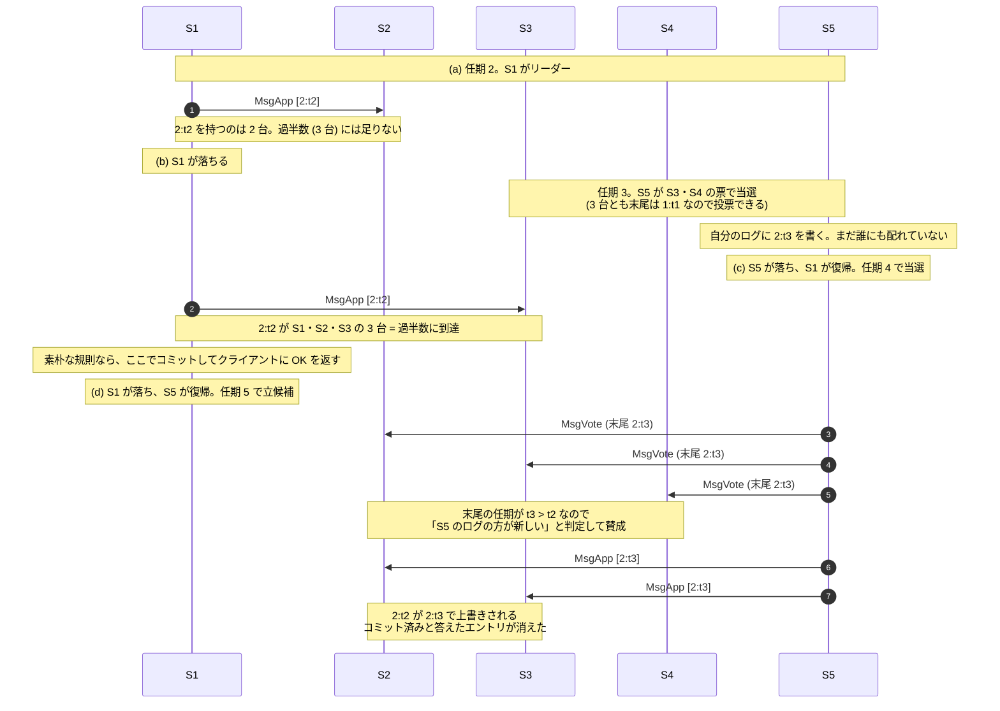
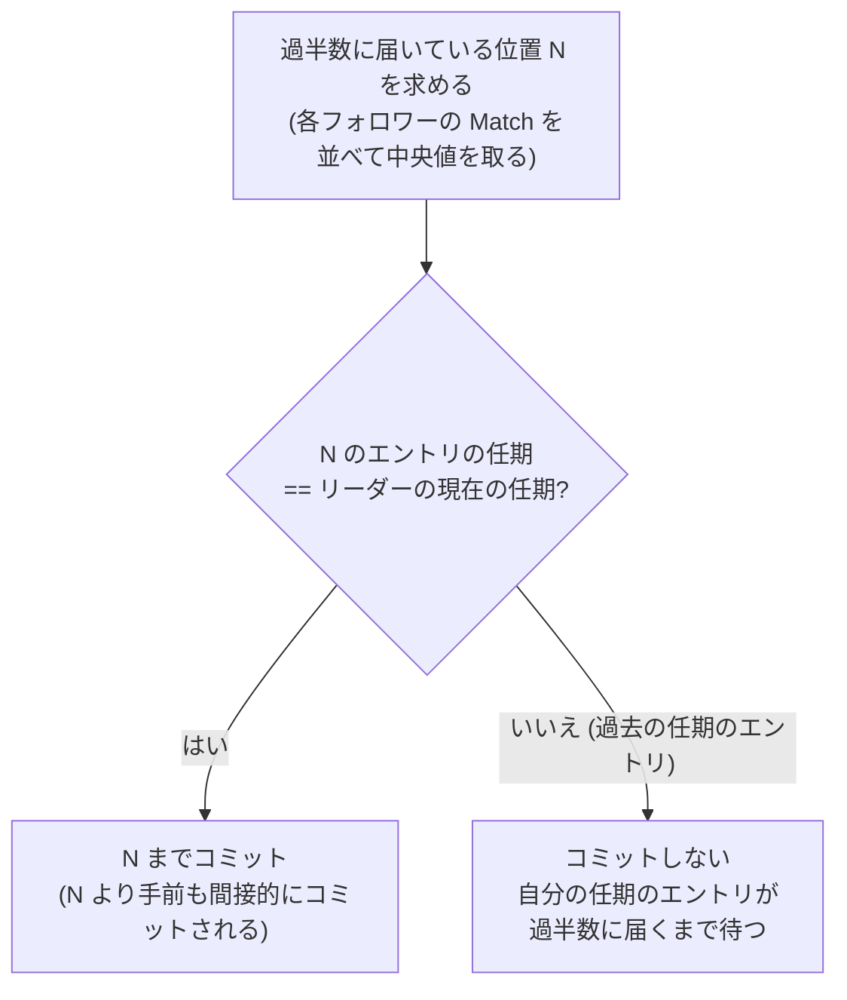

前のページの最後に「過半数の `Match` が届いたらコミット」と書いた。これは正しくない。このページはその修正を扱う。Raft の中でいちばん直感に反する部分で、論文でも図 8 という 1 枚の図に丸ごと 1 節が割かれている。

## 素朴な規則とその反例

素朴な規則はこうだ。

> エントリが過半数のノードのログに書かれたら、そのエントリをコミットしてよい。

これが破れる例を見る。5 台のクラスタ S1〜S5 を考える。各セルはそのノードのログで、`t2` は任期 2 のエントリを意味する。

**(a) 任期 2。S1 がリーダー。index 2 のエントリを S1 と S2 に書いた。**

```
S1  [1:t1][2:t2]   ← leader (term 2)
S2  [1:t1][2:t2]
S3  [1:t1]
S4  [1:t1]
S5  [1:t1]
```

**(b) S1 が落ちる。任期 3 で S5 がリーダーになる。** S3・S4・S5 の票で勝てる (S3・S4 の末尾は `1:t1` なので、S5 の `1:t1` と同じ = 投票してよい)。S5 は自分のログに index 2 を任期 3 で書く。まだ誰にも配れていない。

```
S1  [1:t1][2:t2]   (down)
S2  [1:t1][2:t2]
S3  [1:t1]
S4  [1:t1]
S5  [1:t1][2:t3]   ← leader (term 3)
```

**(c) S5 が落ちる。S1 が復帰し、任期 4 でリーダーになる。** S1 は自分の `2:t2` を S3 にも配った。これで `2:t2` は S1・S2・S3 の **3 台、つまり過半数** に存在する。

```
S1  [1:t1][2:t2]   ← leader (term 4)
S2  [1:t1][2:t2]
S3  [1:t1][2:t2]
S4  [1:t1]
S5  [1:t1][2:t3]   (down)
```

素朴な規則に従うなら、ここで `2:t2` をコミットできる。クライアントに「書けました」と返せる。

**(d) ところが S1 が落ち、任期 5 で S5 がリーダーになれてしまう。** S2・S3・S4 が投票する。S5 の末尾は `2:t3` で、S2・S3 の末尾 `2:t2` より **任期が大きい** ので「S5 のログの方が新しい」と判定されるからだ (この判定規則は次のページで扱う)。

S5 はリーダーとして自分のログを配る。S2・S3 の `2:t2` は `2:t3` で **上書きされる**。

```
S1  [1:t1][2:t2]   (down)
S2  [1:t1][2:t3]   ← 上書きされた
S3  [1:t1][2:t3]   ← 上書きされた
S4  [1:t1][2:t3]
S5  [1:t1][2:t3]   ← leader (term 5)
```

コミット済みとしてクライアントに返した `2:t2` が、クラスタから消えた。これは Raft の最重要の保証 (**コミットされたエントリは決して失われない**) の違反にあたる。

### 時系列で並べ直す

(a) から (d) までを 1 本の時間軸に置くと、何が起きたのかが見やすくなる。



## 何が悪かったのか

(c) の時点で S1 がコミットしたエントリ `2:t2` は、**S1 の現在の任期 (4) ではなく、過去の任期 (2) のエントリ** だった。

過去の任期のエントリは、それが過半数に載っていても、より新しい任期のエントリを持つノードに負ける可能性がある。選挙で比較されるのは「末尾エントリの任期とインデックス」であり、そこには「そのエントリが何台に複製されているか」は反映されないからだ。S5 は `2:t3` を 1 台にしか持っていなくても、任期が大きいという理由だけで選挙に勝てる。

## Raft の解決

Raft は次の制限を置く。

> **リーダーは、自分の現在の任期のエントリだけを、複製数の数え上げによってコミットする。**
> **過去の任期のエントリは、その後ろにある自分の任期のエントリがコミットされたときに、間接的にコミットされる。**

コミットしてよいかの判定は、この 2 段の分岐になる。



素朴な規則との違いは右の分岐 1 つしかない。**「何台に届いたか」に加えて「そのエントリが誰の任期のものか」を見る**、それだけだ。

(c) の場面に戻ると、S1 は `2:t2` を単独ではコミットできない。しかし S1 が任期 4 で新しいエントリ `3:t4` を書き、それを過半数に複製できたなら、`3:t4` をコミットできる。ログマッチング特性により `3:t4` を持つノードは `2:t2` も持っているので、`2:t2` も同時にコミットされる。

そしてこのとき、S5 はもう選挙に勝てない。S2・S3 の末尾は `3:t4` になっており、S5 の `2:t3` より新しいからだ。

```
(e) S1 が [3:t4] を S2, S3 に配ってからコミットした場合

S1  [1:t1][2:t2][3:t4]   ← leader (term 4)
S2  [1:t1][2:t2][3:t4]
S3  [1:t1][2:t2][3:t4]
S4  [1:t1]
S5  [1:t1][2:t3]

S5 が立候補しても、S2/S3/S4 の過半数を取れない
(S2, S3 は「あなたのログは古い」と拒否する)
```

**「自分の任期のエントリを 1 つコミットする」ことが、過去の全エントリを安全にする** という構造になっている。

## リーダーが最初に空のエントリを書く理由

ここで [任期とリーダー選挙のページ](../term-and-election/) の伏線が回収される。`becomeLeader` は、リーダーになった瞬間に中身が空のエントリを 1 つ書いていた ([`raft.go#L960-L964`](https://github.com/etcd-io/raft/blob/af7bf26c25cacf88c26db8751e78af2badbda5d8/raft.go#L960-L964))。

```go title="raft.go"
	emptyEnt := &pb.Entry{Data: nil}
	if !r.appendEntry(emptyEnt) {
		// This won't happen because we just called reset() above.
		r.logger.Panic("empty entry was dropped")
	}
```

これがないと、新しいリーダーは **クライアントから次の書き込みが来るまで、過去のコミット待ちのエントリをコミットできない**。読み取り専用のワークロードでは永久に来ないかもしれない。空エントリを 1 つ書いておけば、それを複製するだけで過去のエントリも一緒にコミットされる。

`Data` が空なので、この規則の副作用でログが太ることもない。実際、[未コミットサイズ制限のページ](../uncommitted-size/) で見るとおり、空エントリのサイズは 0 として扱われ、上限の勘定に入らない。

## コードでは 1 つの項になっている

`etcd-io/raft` でこの規則がどこに書かれているかというと、`maybeCommit` の引数だ ([`raft.go#L775-L779`](https://github.com/etcd-io/raft/blob/af7bf26c25cacf88c26db8751e78af2badbda5d8/raft.go#L775-L779))。

```go title="raft.go"
func (r *raft) maybeCommit() bool {
	defer traceCommit(r)

	return r.raftLog.maybeCommit(entryID{term: r.Term, index: r.trk.Committed()})
}
```

`r.trk.Committed()` が「過半数に届いているインデックス」を返す。素朴な規則ならこれをそのままコミット位置にすればよい。ここでは `entryID{term: r.Term, index: ...}` という組にして渡している。

受け側 ([`log.go#L453-L462`](https://github.com/etcd-io/raft/blob/af7bf26c25cacf88c26db8751e78af2badbda5d8/log.go#L453-L462)):

```go title="log.go"
func (l *raftLog) maybeCommit(at entryID) bool {
	// NB: term should never be 0 on a commit because the leader campaigned at
	// least at term 1. But if it is 0 for some reason, we don't consider this a
	// term match.
	if at.term != 0 && at.index > l.committed && l.matchTerm(at) {
		l.commitTo(at.index)
		return true
	}
	return false
}
```

`l.matchTerm(at)` が本体だ。**「過半数に届いている位置にあるエントリの任期が、リーダーの現在の任期と一致するか」** を検査している。一致しなければコミット位置は進まない。

図 8 の (c) では、過半数に届いている位置は index 2 で、そこにあるエントリの任期は 2。リーダーの現在の任期は 4。一致しないので `false` が返り、コミットは進まない。そのまま論文の規則になっている。

`at.term != 0` の但し書きは、`matchTerm` が範囲外で 0 を返すケースへの防御だ。0 は任期として存在しないので、これを「一致」と解釈させない。

## 読み取りにも影響する

この制限は、[線形化可能な読み取り](../read-index/) にも波及する。リーダーになったばかりのノードは、自分のコミット位置が本当に最新かを保証できない。過去の任期のエントリが「コミット済みだがまだ自分は知らない」状態でありうるからだ。

そのため、`MsgReadIndex` (読み取り要求) は、自分の任期のエントリを 1 つコミットするまで保留される ([`raft.go#L1362-L1367`](https://github.com/etcd-io/raft/blob/af7bf26c25cacf88c26db8751e78af2badbda5d8/raft.go#L1362-L1367))。

```go title="raft.go"
		// Postpone read only request when this leader has not committed
		// any log entry at its term.
		if !r.committedEntryInCurrentTerm() {
			r.pendingReadIndexMessages = append(r.pendingReadIndexMessages, m)
			return nil
		}
```

その判定は、コミット位置のエントリの任期を見るだけで済む ([`raft.go#L2066-L2071`](https://github.com/etcd-io/raft/blob/af7bf26c25cacf88c26db8751e78af2badbda5d8/raft.go#L2066-L2071))。

```go title="raft.go"
// committedEntryInCurrentTerm return true if the peer has committed an entry in its term.
func (r *raft) committedEntryInCurrentTerm() bool {
	// NB: r.Term is never 0 on a leader, so if zeroTermOnOutOfBounds returns 0,
	// we won't see it as a match with r.Term.
	return r.raftLog.zeroTermOnOutOfBounds(r.raftLog.term(r.raftLog.committed)) == r.Term
}
```

保留された要求は、コミットが進んだ瞬間に一斉に解放される ([`raft.go#L1553-L1557`](https://github.com/etcd-io/raft/blob/af7bf26c25cacf88c26db8751e78af2badbda5d8/raft.go#L1553-L1557))。

```go title="raft.go"
				if r.maybeCommit() {
					// committed index has progressed for the term, so it is safe
					// to respond to pending read index requests
					releasePendingReadIndexMessages(r)
					r.bcastAppend()
```

## テストが論文の節番号を指している

この規則には専用のテストがあり、コメントに論文の参照節が書かれている ([`raft_paper_test.go#L749-L752`](https://github.com/etcd-io/raft/blob/af7bf26c25cacf88c26db8751e78af2badbda5d8/raft_paper_test.go#L749-L752))。

```go title="raft_paper_test.go"
// TestLeaderOnlyCommitsLogFromCurrentTerm tests that only log entries from the leader’s
// current term are committed by counting replicas.
// Reference: section 5.4.2
func TestLeaderOnlyCommitsLogFromCurrentTerm(t *testing.T) {
	ents := []*pb.Entry{{Term: new(uint64(1)), Index: new(uint64(1))}, {Term: new(uint64(2)), Index: new(uint64(2))}}
	tests := []struct {
		index   uint64
		wcommit uint64
	}{
		// do not commit log entries in previous terms
		{1, 0},
		{2, 0},
		// commit log in current term
		{3, 3},
	}
```

任期 1 と 2 のエントリを持たせたうえで任期 3 のリーダーにし、フォロワーが index 1 または 2 まで受け取ったと報告してもコミットは 0 のまま、index 3 (リーダー自身の任期のエントリ) が報告されたときだけコミットが 3 まで **一気に** 進むことを確かめている。1 と 2 も同時にコミットされる、つまり「間接的なコミット」がここに現れている。

この形のテストは `raft_paper_test.go` に 26 本あり、論文の主張 1 つに 1 本が対応している。[論文テストのページ](../paper-tests/) で扱う。

## まとめ

- 過去の任期のエントリを「過半数に届いた」だけでコミットすると、後から上書きされうる。
- Raft は「自分の任期のエントリだけを数え上げでコミットする」ことでこれを塞ぐ。過去のエントリは、それより後ろの自分の任期のエントリがコミットされたときに一緒にコミットされる。
- そのため、新しいリーダーは必ず空エントリを 1 つ書いて、自分の任期のエントリを作る。
- コードでは `maybeCommit` に `entryID{term: r.Term, ...}` を渡し、`matchTerm` で判定する 1 項として現れる。

このページは「消えないこと」の必要条件の 1 つを見た。次のページで、なぜ全体として消えないと言えるのかを組み立てる。
