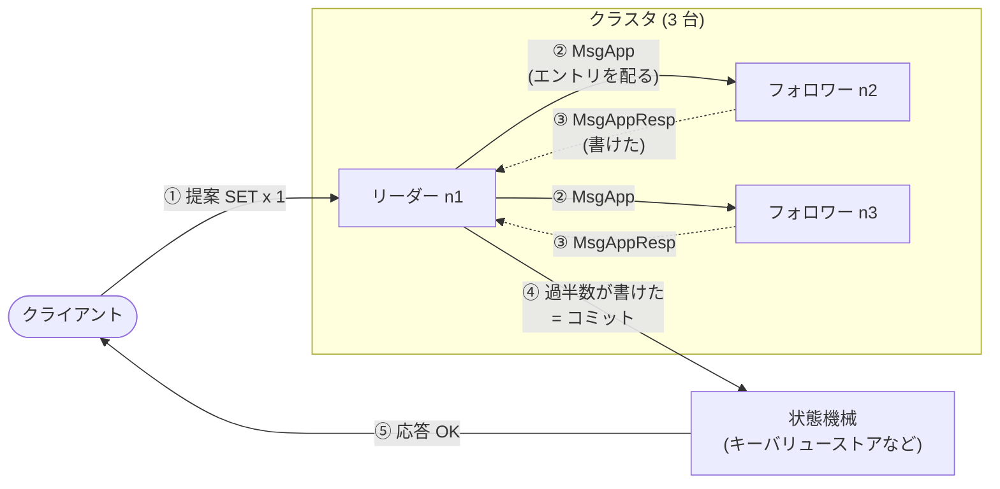
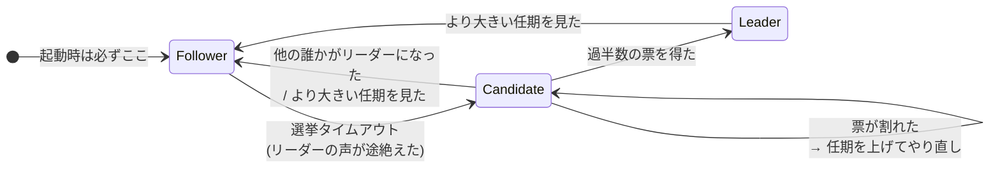

`etcd-io/raft` は、分散合意アルゴリズム Raft の実装だ。etcd、CockroachDB、TiKV、Docker Swarm、Dgraph — 名前を知っているような分散システムの多くが、その中心にこのライブラリか、その移植を置いている。

この章には 2 つの目的がある。

1 つは、**Raft というアルゴリズムそのものを、何も知らない状態から完全に理解できるようにすること**。最初の群「Raft を理解する」の 9 ページがそれにあたる。論文 ["In Search of an Understandable Consensus Algorithm"](https://raft.github.io/raft.pdf) が扱っている内容を全部カバーしつつ、それぞれの規則が実際のコードのどこに現れるかを都度示していく。Raft を知らなくても、この 9 ページを順に読めば残りが読める。

もう 1 つは、**このライブラリ固有の設計を読むこと**。Raft の実装は世の中に無数にあるが、これほど「アルゴリズムだけ」に絞り込まれたものは珍しい。その絞り込みが何を可能にしたのかが、残り 24 ページの主題になる。

## 30 秒で見る Raft

細かい規則に入る前に、動いているところの形だけ見ておく。クライアントの 1 回の書き込みが、3 台のクラスタをどう通るか。

3 台とも同じ **ログ** (操作の並び) を持ち、それを先頭から順に **状態機械** に食わせる。だから 3 台の中身が一致する。リーダーは 1 人だけで、ログに書き足せるのはリーダーだけ。「過半数に届いた」が「もう消えない」の定義になる。

役割は 3 つあって、この間を行き来する。

Raft の内容はほぼこの 2 枚の図の細部を詰める作業になる。「誰がリーダーか」「リーダーのログをどう配るか」「その 2 つが噛み合っても壊れないか」の 3 つだ。

## この OSS について

- CNCF プロジェクト etcd から切り出された独立リポジトリ。Apache 2.0 ライセンス。Go で書かれている。
- **テストを除くと約 1.1 万行しかない。** うち `raft.go` が 2162 行で、残りはログ、ストレージ境界、進捗管理、定足数計算、構成変更に分かれている。1 週間あれば全部読める規模だ。
- **ディスク I/O もネットワーク I/O もしない。** ライブラリがやるのは「メッセージを受け取って、状態を進めて、やるべき I/O のリストを返す」ことだけで、実際に書くのも送るのも利用側の仕事になる。README の言葉を借りれば、入力が `Message`、出力が `{[]Messages, []LogEntries, NextState}` の 3 つ組である決定的な状態機械だ。
- **その決定性が、テストの形を変えている。** `testdata/` にある 28 本のテストは、コマンドと期待出力を並べたテキストファイルだ。ログ構成を手で作り、リーダーを選び、収束させ、その過程で流れたメッセージを 1 通残らずファイルに書き出す。差分が出たら、それがそのまま仕様の変更になる。
- **TLA+ の仕様が同居している。** `tla/` には Raft のモデルだけでなく、**実行時のトレースをモデルに突き合わせる** 仕様がある。ビルドタグ `with_tla` を付けると状態遷移が NDJSON で吐かれ、それを TLC に食わせて「実装がモデルから外れていないか」を検査する。
- **コメントが異常に厚い。** 「なぜこの順序でなければならないか」「この最適化がないと何時間かかるか」「この ABA 問題はどういう手順で起きるか」が、20 行、40 行のコメントとしてコードの隣に書いてある。この章の引用の多くはその手のコメントそのものだ。

## 読む順番

Raft を知らない場合は、**「Raft を理解する」の 9 ページを 1 から順に読んでほしい**。前のページの語彙を後のページが使うので、飛ばすと読めない。Raft を知っている場合は、4 ページ目「コミット規則」と 8 ページ目「メンバー変更」だけ眺めて次の群に進んで構わない。

「ライブラリとしての骨格」は、この実装の一番の特徴である「I/O をしない」設計を扱う。ここも前から順に読むのがよい。以降の群は、この骨格の上に乗る個別の工夫なので、どこからでも読める。

Raft を理解する (アルゴリズムをゼロから):

- [1 台では壊れるから複製する。複製がズレないように、操作の並びを合意する](./replicated-state-machine/)
- [「今は誰の時代か」を整数 1 つで表すと、古い情報を機械的に捨てられる](./term-and-election/)
- [リーダーは、直前の 1 エントリだけを見せて、フォロワーのログ全体の一致を保証する](./log-replication/)
- [「過半数に届いた」だけではコミットできない。自分の任期のエントリを 1 つ挟む必要がある](./commit-rule/)
- [投票に「相手のログが自分以上か」の制限をかけると、コミット済みが消えないことが言える](./safety/)
- [任期・投票・ログ。この 3 つをディスクに書くタイミングが、Raft の安全性の土台になる](./persistent-state/)
- [ログを無限に持てないので、状態そのもののコピーで先頭を捨てる](./snapshot/)
- [メンバー変更は「過半数の定義が変わる」変更なので、新旧が重なる中間状態を挟む](./membership-basics/)
- [ここまでの規則を、3 台のクラスタが起動して書き込みを返しリーダーが落ちるまでの時間軸で通しで見る](./walkthrough/)

ライブラリとしての骨格 (I/O をしない状態機械にする):

- [I/O を全部呼び出し側に押し付けると、合意アルゴリズムが決定的な関数になる](./ready-loop/)
- [タイマー発火も提案もローカル I/O の完了も、全部 1 つの Message 型で表す](./everything-is-a-message/)
- [「永続化前に送ってはいけない返答」だけを別のキューに分ける](./msgs-after-append/)
- [ローカルストレージへの書き込みも「宛先付きメッセージ」にすると、非同期にできる](./async-storage-writes/)
- [まだディスクにないログを、メモリ側が「書き込み中」まで含めて 3 状態で持つ](./unstable-log/)
- [ログの読み出しをインターフェース 1 枚に切り出し、圧縮の判断は呼び出し側に残す](./storage-interface/)

選挙の工夫 (無駄な選挙を起こさない):

- [投票する前に「勝てるか」を聞いて回ると、復帰したノードが任期を吊り上げなくなる](./prevote/)
- [リーダーが自分で過半数の生存を確認し、フォロワーは最近聞いた声を理由に投票を拒む](./check-quorum-and-lease/)
- [選挙タイムアウトを乱数でずらし、時間の単位を実時間ではなく tick にする](./randomized-timeout/)
- [リーダーを降ろすのではなく渡す。渡す先に「今すぐ立候補しろ」と言う](./leader-transfer/)
- [投票権がないはずの learner にも投票させないと、クラスタが止まる場合がある](./learner-must-vote/)

複製と流量制御 (追いつかせながら、溢れさせない):

- [フォロワーごとの状態を「探る」「流す」「送らない」の 3 つに分ける](./progress-state-machine/)
- [送信済み未確認のメッセージを環状バッファで数え、帯域遅延積で上限を決める](./inflights/)
- [ログの食い違いを 1 件ずつ探らず、任期の単調性を使って一気に飛ばす](./probe-optimization/)
- [コミット位置の計算を「ソートして真ん中を取る」に還元し、7 台までは確保なしで済ませる](./committed-index/)
- [過半数を失ったリーダーのログが無限に伸びないよう、未コミット分をバイト数で止める](./uncommitted-size/)
- [コミット位置だけを伝える空メッセージを、送っても無駄なときは送らない](./sent-commit/)

読み取りと構成変更 (ログを通さずに読む、止めずに入れ替える):

- [読み取りをログに書かずに線形化する。コミット位置を 1 回確認して、追いつくまで待つ](./read-index/)
- [構成変更を「新旧両方の過半数が要る中間状態」として実装する](./joint-consensus/)
- [空の構成を「勝ち」「無限大」と定義すると、joint の計算が分岐なしで書ける](./empty-config-convention/)
- [不変条件を壊さずに voter を learner へ降格するために、意図を別の集合に置く](./learners-next/)

正しさの担保 (仕様と実装のズレを機械で見つける):

- [テストを「コマンドと出力のテキスト」にすると、差分がそのまま仕様の変更になる](./datadriven-tests/)
- [実行時のトレースを TLA+ の仕様に突き合わせ、実装がモデルから外れたことを検出する](./tla-trace-validation/)
- [論文の主張 1 つにテスト 1 つを対応させ、コメントに参照節を書く](./paper-tests/)
