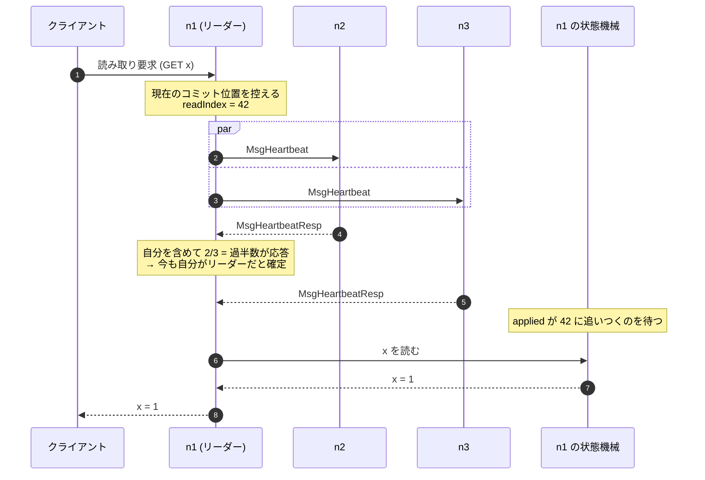

## 何を学んだか

**確認したい対象が「単調に増える数」の形をしていれば、定足数の計算がそのまま使える。** 線形化可能な読み取りは、リーダーが「自分はまだリーダーか」を過半数に確認してから答える必要がある。素朴には読み取り 1 件ごとに 1 往復かかる。

`etcd-io/raft` は、未確認の読み取り要求に **通し番号** を振り、その番号をハートビートに載せる。返ってきた番号を「各ノードが確認した位置」として `CommittedIndex` に食わせると、「過半数が確認した番号」が出る。**ログのコミット位置を求めるのと同じ関数** が、読み取りの確認にそのまま使える。

## 解いている問題

線形化可能な読み取りとは、「読み取りの完了前に完了していた書き込みは、必ず見える」という保証だ。

リーダーがローカルの状態機械を読んで返すだけでは、これが保証できない。**リーダーは自分がもうリーダーでないことを知らない可能性がある** からだ。

```
S1 がリーダー (任期 5)。ネットワークが分断される。

  S1 | S2 S3 S4 S5

S2〜S5 で任期 6 の選挙が起き、S2 がリーダーになる。
S2 は書き込み x=2 を受け付けてコミットする。

S1 は分断に気づいていない。クライアントが S1 に読み取りを送ると、
S1 は古い値 x=1 を返す。
```

読み取りをログエントリとして書けばこの問題は消える。コミットできるということは、まだリーダーだということだからだ。しかしそれでは読み取りごとにディスク書き込みが発生する。

**ログに書かずに、同じ保証を得たい**。それが ReadIndex になる。

## 手順

1. リーダーは、要求を受けた時点の **コミット位置** を覚える。これを `readIndex` とする。
2. 過半数にハートビートを送り、応答を待つ。応答が返れば、**その時点で自分はまだリーダー** だと分かる。
3. 状態機械の適用位置が `readIndex` に追いつくまで待つ。
4. 状態機械を読んで答える。



ログにエントリを 1 件も書いていないことに注目してほしい。ディスク書き込みは発生せず、コストはハートビート 1 往復だけになる。

手順 2 が「自分がリーダーであること」の確認になる。過半数が自分をリーダーとして扱っているなら、他に同じ任期のリーダーはいない。より新しい任期のリーダーがいたなら、その過半数と交差するので、ハートビートが拒否される。

手順 3 が「その時点までの書き込みが見える」ことの保証になる。`readIndex` はコミット済みの位置なので、それより前の書き込みは全部そこに含まれている。

## ソースコードのどこか

利用側の API はこうなる ([`node.go#L216-L223`](https://github.com/etcd-io/raft/blob/af7bf26c25cacf88c26db8751e78af2badbda5d8/node.go#L216-L223))。

```go title="node.go"
	// ReadIndex request a read state. The read state will be set in the ready.
	// Read state has a read index. Once the application advances further than the read
	// index, any linearizable read requests issued before the read request can be
	// processed safely. The read state will have the same rctx attached.
	// Note that request can be lost without notice, therefore it is user's job
	// to ensure read index retries.
	ReadIndex(ctx context.Context, rctx []byte) error
```

**手順 3 と 4 は利用側の仕事** だ。ライブラリは `readIndex` を返すところまでしかやらない。「適用位置が追い越したら読んでよい」という判断は、状態機械を持っている側にしかできない。

返り値は `Ready.ReadStates` に入る ([`read_only.go#L24-L32`](https://github.com/etcd-io/raft/blob/af7bf26c25cacf88c26db8751e78af2badbda5d8/read_only.go#L24-L32))。

```go title="read_only.go"
// ReadState provides state for read only query.
// It's caller's responsibility to call ReadIndex first before getting
// this state from ready, it's also caller's duty to differentiate if this
// state is what it requests through RequestCtx, eg. given a unique id as
// RequestCtx
type ReadState struct {
	Index      uint64
	RequestCtx []byte
}
```

`RequestCtx` で要求と応答を対応付ける。ライブラリはこのバイト列を解釈せず、そのまま返すだけだ。

## 複数の読み取りを 1 往復にまとめる

ここからが実装の面白いところになる。読み取り 1 件ごとにハートビートを 1 往復させると、負荷が高いときに大量のハートビートが飛ぶ。まとめたい。

素朴な方法は「要求ごとに一意な ID を振り、応答をその ID で照合する」だが、それだと ID ごとに集計が要る。`etcd-io/raft` はもっと単純な形に落としている ([`read_only.go#L34-L47`](https://github.com/etcd-io/raft/blob/af7bf26c25cacf88c26db8751e78af2badbda5d8/read_only.go#L34-L47))。

```go title="read_only.go"
type readIndexRequest struct {
	req   *pb.Message
	index uint64
}

type readOnly struct {
	option ReadOnlyOption
	acks   map[uint64]uint64

	unconfirmedReads []*readIndexRequest
	// Number of readIndexRequests that were confirmed in the past by this
	// readOnly, which were removed from the beginning of `unconfirmedReads`.
	confirmedReads uint64
}
```

未確認の読み取りをキューに並べ、**確認済みの件数** を整数 1 つで持つ。要求そのものに ID はない。「先頭から何件目まで確認されたか」だけを追う。

ハートビートに載せるのは、この通し番号だ ([`read_only.go#L92-L101`](https://github.com/etcd-io/raft/blob/af7bf26c25cacf88c26db8751e78af2badbda5d8/read_only.go#L92-L101))。

```go title="read_only.go"
// heartbeatCtx returns the `Context` that should be sent in order to confirm
// all currently unconfirmed reads.
func (ro *readOnly) heartbeatCtx() []byte {
	if len(ro.unconfirmedReads) == 0 {
		return nil
	}
	unconfirmedReadPosition := ro.confirmedReads + uint64(len(ro.unconfirmedReads))
	encLastIndex := make([]byte, 8)
	binary.LittleEndian.PutUint64(encLastIndex, unconfirmedReadPosition)
	return encLastIndex
}
```

「今キューに入っている最後の要求は、通算で何件目か」を 8 バイトに詰める。未確認がなければ `nil` を返すので、読み取りがないときのハートビートには何も載らない。

フォロワーはこの `Context` をそのまま返す ([`raft.go#L1835-L1838`](https://github.com/etcd-io/raft/blob/af7bf26c25cacf88c26db8751e78af2badbda5d8/raft.go#L1835-L1838))。

```go title="raft.go"
func (r *raft) handleHeartbeat(m *pb.Message) {
	r.raftLog.commitTo(m.GetCommit())
	r.send(&pb.Message{To: m.From, Type: pb.MsgHeartbeatResp.Enum(), Context: m.GetContext()})
}
```

**フォロワーは中身を解釈しない**。エコーバックするだけだ。読み取り確認という機能がフォロワー側に一切実装されていない。

リーダーは返ってきた番号を、ノードごとの最大値として記録する ([`read_only.go#L63-L69`](https://github.com/etcd-io/raft/blob/af7bf26c25cacf88c26db8751e78af2badbda5d8/read_only.go#L63-L69))。

```go title="read_only.go"
// recvAck notifies the `readOnly` of an acknowledgment of a heartbeat response.
func (ro *readOnly) recvAck(from uint64, ctx []byte) {
	if len(ctx) != 0 {
		ro.acks[from] = max(ro.acks[from], binary.LittleEndian.Uint64(ctx))
	}
}
```

`max` を取っているので、応答が順不同で届いても、遅れて届いた古い応答が新しい確認を巻き戻さない。

## 定足数計算の再利用

そして集計だ ([`read_only.go#L71-L91`](https://github.com/etcd-io/raft/blob/af7bf26c25cacf88c26db8751e78af2badbda5d8/read_only.go#L71-L91))。

```go title="read_only.go"
// AckedIndex allows for using `CommittedIndex` in `maybeAdvance`.
func (ro *readOnly) AckedIndex(voterID uint64) (quorum.Index, bool) {
	idx, found := ro.acks[voterID]
	return quorum.Index(idx), found
}

// maybeAdvance uses the existing acknowledgements and current raft
// configuration to confirm and return as many unconfirmed reads as possible.
func (ro *readOnly) maybeAdvance(c quorum.JointConfig) []*readIndexRequest {
	// Use `CommittedIndex` to figure out how many reads are now confirmed.
	newConfirmedReads := uint64(c.CommittedIndex(ro))
	if newConfirmedReads <= ro.confirmedReads {
		return nil
	}
	readStates := ro.unconfirmedReads[:newConfirmedReads-ro.confirmedReads]
	ro.unconfirmedReads = ro.unconfirmedReads[newConfirmedReads-ro.confirmedReads:]
	ro.confirmedReads = newConfirmedReads
	return readStates
}
```

`readOnly` 自身が `quorum.AckedIndexer` を実装している。渡すと `CommittedIndex` が「過半数が確認した通し番号」を返す。

**「過半数が到達している単調な値」という形が同じなので、ログのコミット位置と同じ関数で計算できる**。[コミット位置のページ](../committed-index/) で見た抽象化が、ここで効いている。joint consensus への対応も自動的に付いてくる。

そして、確認された件数ぶんをキューの先頭から取り出す。スライスの切り出し 2 行で済んでいる。要求ごとの ID も、応答ごとの照合も要らない。

**問題を「単調な整数への到達」に還元したことで、データ構造がキューと整数 1 つになった**。

## リーダー側の入口

読み取り要求を受けたリーダーの処理 ([`raft.go#L1355-L1372`](https://github.com/etcd-io/raft/blob/af7bf26c25cacf88c26db8751e78af2badbda5d8/raft.go#L1355-L1372))。

```go title="raft.go"
	case pb.MsgReadIndex:
		// only one voting member (the leader) in the cluster
		if r.trk.IsSingleton() {
			if resp := r.responseToReadIndexReq(m, r.raftLog.committed); resp.GetTo() != None {
				r.send(resp)
			}
			return nil
		}

		// Postpone read only request when this leader has not committed
		// any log entry at its term.
		if !r.committedEntryInCurrentTerm() {
			r.pendingReadIndexMessages = append(r.pendingReadIndexMessages, m)
			return nil
		}

		sendMsgReadIndexResponse(r, m)
```

1 台構成なら確認は不要なので即答する。

2 つ目の分岐は [コミット規則のページ](../commit-rule/) で見たものだ。自分の任期のエントリを 1 つもコミットしていないリーダーは、自分のコミット位置が本当に最新か保証できない。過去の任期にコミットされたエントリを、まだ自分が知らない可能性がある。だから保留する。

本体はこうなる ([`raft.go#L2146-L2161`](https://github.com/etcd-io/raft/blob/af7bf26c25cacf88c26db8751e78af2badbda5d8/raft.go#L2146-L2161))。

```go title="raft.go"
func sendMsgReadIndexResponse(r *raft, m *pb.Message) {
	// thinking: use an internally defined context instead of the user given context.
	// We can express this in terms of the term and index instead of a user-supplied value.
	// This would allow multiple reads to piggyback on the same message.
	switch r.readOnly.option {
	// If more than the local vote is needed, go through a full broadcast.
	case ReadOnlySafe:
		r.readOnly.addRequest(r.raftLog.committed, m)
		// The local node automatically acks the request.
		r.readOnly.recvAck(r.id, r.readOnly.heartbeatCtx())
		r.bcastHeartbeat()
	case ReadOnlyLeaseBased:
		if resp := r.responseToReadIndexReq(m, r.raftLog.committed); resp.GetTo() != None {
			r.send(resp)
		}
	}
}
```

`ReadOnlySafe` では、キューに積んで、自分の票を入れて、ハートビートを全員に送る。**リーダー自身の確認も `recvAck` で入れている** ので、集計に例外がない。

`ReadOnlyLeaseBased` では、確認を省いて即答する。[CheckQuorum のページ](../check-quorum-and-lease/) で見たとおり、リーダーリースが有効な間は自分がリーダーだと仮定する。速いが時計のずれに依存する。

冒頭の `thinking:` コメントが、より良い設計案を残している。「利用者が渡す `Context` ではなく、任期とインデックスから内部的に生成した文脈を使えば、複数の読み取りが同じメッセージに相乗りできる」。実際、この案は `heartbeatCtx` という形で **既に実現されている** — 現在のコードは通し番号を使っているので、複数の読み取りが 1 回のハートビートで確認される。コメントが実装より古く残っている。

## 応答の集計

ハートビート応答の処理 ([`raft.go#L1599-L1610`](https://github.com/etcd-io/raft/blob/af7bf26c25cacf88c26db8751e78af2badbda5d8/raft.go#L1599-L1610))。

```go title="raft.go"
		if r.readOnly.option != ReadOnlySafe || len(m.GetContext()) == 0 {
			return nil
		}

		r.readOnly.recvAck(m.GetFrom(), m.GetContext())
		rss := r.readOnly.maybeAdvance(r.trk.Voters)
		for _, rs := range rss {
			if resp := r.responseToReadIndexReq(rs.req, rs.index); resp.GetTo() != None {
				r.send(resp)
			}
		}
```

`Context` が空なら早期リターン。読み取りがないときのハートビートでは、この経路に入らない。

確認された要求は `responseToReadIndexReq` で応答に変換される ([`raft.go#L2073-L2088`](https://github.com/etcd-io/raft/blob/af7bf26c25cacf88c26db8751e78af2badbda5d8/raft.go#L2073-L2088))。

```go title="raft.go"
// responseToReadIndexReq constructs a response for `req`. If `req` comes from the peer
// itself, a blank value will be returned.
func (r *raft) responseToReadIndexReq(req *pb.Message, readIndex uint64) *pb.Message {
	if req.GetFrom() == None || req.GetFrom() == r.id {
		r.readStates = append(r.readStates, ReadState{
			Index:      readIndex,
			RequestCtx: req.GetEntries()[0].GetData(),
		})
		return &pb.Message{}
	}
	return &pb.Message{
		Type:    pb.MsgReadIndexResp.Enum(),
		To:      req.From,
		Index:   new(readIndex),
		Entries: req.GetEntries(),
	}
}
```

要求元が自分なら `readStates` に積んで `Ready` で返す。他ノードからの転送なら `MsgReadIndexResp` を返す。**要求元によって「返し方」が変わるが、呼び出し側は 1 か所で済む**。空のメッセージを返すことで「送るものはない」を表現している。

## フォロワーからの読み取り

フォロワーも読み取りを扱える。要求をリーダーに転送する ([`raft.go#L1753-L1758`](https://github.com/etcd-io/raft/blob/af7bf26c25cacf88c26db8751e78af2badbda5d8/raft.go#L1753-L1758))。

```go title="raft.go"
	case pb.MsgReadIndex:
		if r.lead == None {
			r.logger.Infof("%x no leader at term %d; dropping index reading msg", r.id, r.Term)
			return nil
		}
		m.To = new(r.lead)
		r.send(m)
```

応答を受け取ったら `readStates` に積む ([`raft.go#L1759-L1765`](https://github.com/etcd-io/raft/blob/af7bf26c25cacf88c26db8751e78af2badbda5d8/raft.go#L1759-L1765))。

```go title="raft.go"
	case pb.MsgReadIndexResp:
		if len(m.GetEntries()) != 1 {
			r.logger.Errorf("%x invalid format of MsgReadIndexResp from %x, entries count: %d", r.id, m.GetFrom(), len(m.GetEntries()))
			return nil
		}
		r.readStates = append(r.readStates, ReadState{Index: m.GetIndex(), RequestCtx: m.GetEntries()[0].GetData()})
```

これで **フォロワーでも線形化可能な読み取りができる**。リーダーから安全な `readIndex` をもらい、自分の適用位置がそこに追いつくまで待って、ローカルの状態機械を読む。読み取り負荷をフォロワーに分散できる。

`MsgReadIndex` は任期を持たずに送られる ([`raft.go#L580-L584`](https://github.com/etcd-io/raft/blob/af7bf26c25cacf88c26db8751e78af2badbda5d8/raft.go#L580-L584))。

```go title="raft.go"
		// do not attach term to MsgProp, MsgReadIndex
		// proposals are a way to forward to the leader and
		// should be treated as local message.
		// MsgReadIndex is also forwarded to leader.
		if m.GetType() != pb.MsgProp && m.GetType() != pb.MsgReadIndex {
			m.Term = new(r.Term)
		}
```

転送されるメッセージなので、転送元の任期を付けると、リーダー側で任期の食い違いとして弾かれる。`MsgProp` と同じ扱いになっている。

## 保留した要求の解放

任期のエントリがコミットされていないため保留した要求は、コミットが進んだ瞬間に一斉に解放される ([`raft.go#L2127-L2144`](https://github.com/etcd-io/raft/blob/af7bf26c25cacf88c26db8751e78af2badbda5d8/raft.go#L2127-L2144))。

```go title="raft.go"
func releasePendingReadIndexMessages(r *raft) {
	if len(r.pendingReadIndexMessages) == 0 {
		// Fast path for the common case to avoid a call to storage.LastIndex()
		// via committedEntryInCurrentTerm.
		return
	}
	if !r.committedEntryInCurrentTerm() {
		r.logger.Error("pending MsgReadIndex should be released only after first commit in current term")
		return
	}

	msgs := r.pendingReadIndexMessages
	r.pendingReadIndexMessages = nil

	for _, m := range msgs {
		sendMsgReadIndexResponse(r, m)
	}
}
```

2 つ目の検査は「起きないはずだが、起きたらログに出す」形になっている。panic ではなく `Error` ログなのは、読み取りが遅れるだけで安全性は壊れないからだろう。

## etcd 側の使い方

etcd 本体は、この上にさらにバッチ処理を重ねている。同じ確認を待っている複数のクライアント要求を 1 つにまとめる仕組みで、[etcd の章](../../etcd/linearizable-read-batching/) で扱っている。

ライブラリ側で「ハートビート 1 往復に複数の読み取りを載せる」バッチをやり、利用側で「1 つの `ReadIndex` 呼び出しに複数のクライアント要求を載せる」バッチをやる。**2 段のバッチ処理** になっている。

## どう活かすか

- **確認したいものを単調な整数に還元する**。「N 件目まで確認された」という形にできれば、要求ごとの ID も照合も要らない。キューと整数 1 つで済む。
- **定足数の計算を汎用化しておく**。「過半数が到達している値」を求める関数を 1 つ持っておくと、ログのコミット位置以外にも使える。構成変更への追随も 1 か所で済む。
- **中継役に機能を実装させない**。フォロワーは `Context` をエコーバックするだけで、読み取り確認の仕組みを何も知らない。不透明なトークンを往復させる設計は、片側だけで完結する。
- **自分自身の票も同じ経路で入れる**。`recvAck(r.id, ...)` のように自分を特別扱いしないと、集計に例外分岐が要らなくなる。
- **速い経路と安全な経路を選べるようにし、既定は安全側にする**。`ReadOnlySafe` が既定で、`ReadOnlyLeaseBased` は明示的に選ぶ。速い方の前提 (時計の単調性) をコメントに書いておく。
