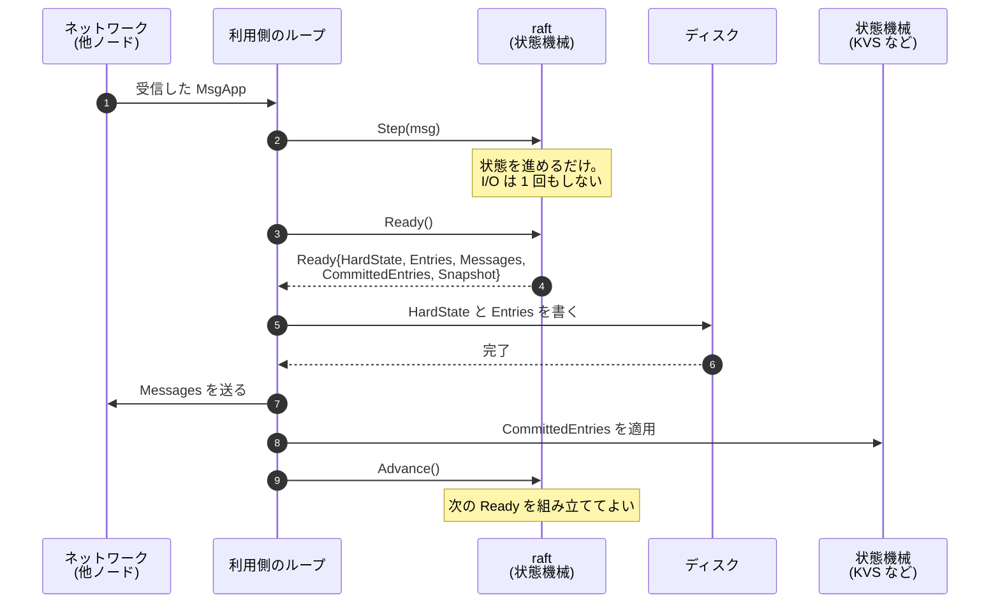

## 何を学んだか

**合意アルゴリズムから I/O を完全に追い出すと、それは「メッセージを入れると次の状態とやるべきことのリストが出てくる」決定的な関数になる。** `etcd-io/raft` は `Ready` という構造体でそのリストを返し、実際にディスクに書くのも、ネットワークに送るのも、状態機械に適用するのも、全部利用側の仕事にしている。

この境界の引き方が、次の 3 つを同時に成立させている。

- **決定的なテスト**。同じ入力に同じ出力が返るので、テストをテキストファイルとして書ける。
- **利用側ごとの永続化戦略**。ログの書き方も、`fsync` の粒度も、送信の並列度も利用側が決める。
- **多重化**。goroutine を持たない層 (`RawNode`) があるので、1 プロセスで数万の Raft グループを回せる。

## ソースコードのどこか

README がこの設計を明言している。

> Most Raft implementations have a monolithic design, including storage handling, messaging serialization, and network transport. This library instead follows a minimalistic design philosophy by only implementing the core raft algorithm. This minimalism buys flexibility, determinism, and performance.
>
> In order to easily test the Raft library, its behavior should be deterministic. To achieve this determinism, the library models Raft as a state machine. The state machine takes a `Message` as input. ... The state machine's output is a 3-tuple `{[]Messages, []LogEntries, NextState}`.

その出力にあたるのが `Ready` だ ([`node.go#L49-L114`](https://github.com/etcd-io/raft/blob/af7bf26c25cacf88c26db8751e78af2badbda5d8/node.go#L49-L114))。

```go title="node.go"
// Ready encapsulates the entries and messages that are ready to read,
// be saved to stable storage, committed or sent to other peers.
// All fields in Ready are read-only.
type Ready struct {
	// The current volatile state of a Node.
	// SoftState will be nil if there is no update.
	*SoftState

	// The current state of a Node to be saved to stable storage BEFORE
	// Messages are sent.
	*pb.HardState

	ReadStates []ReadState

	// Entries specifies entries to be saved to stable storage BEFORE
	// Messages are sent.
	Entries []*pb.Entry

	// Snapshot specifies the snapshot to be saved to stable storage.
	Snapshot *pb.Snapshot

	// CommittedEntries specifies entries to be committed to a
	// store/state-machine. These have previously been appended to stable
	// storage.
	CommittedEntries []*pb.Entry

	// Messages specifies outbound messages.
	Messages []*pb.Message

	// MustSync indicates whether the HardState and Entries must be durably
	// written to disk or if a non-durable write is permissible.
	MustSync bool
}
```

すべて読み出し専用で、フィールドの並びがそのまま「利用側がやるべきこと」のリストになっている。

利用側のループは README にある形になる。

```go
  for {
    select {
    case <-s.Ticker:
      n.Tick()
    case rd := <-s.Node.Ready():
      saveToStorage(rd.HardState, rd.Entries, rd.Snapshot)
      send(rd.Messages)
      if !raft.IsEmptySnap(rd.Snapshot) {
        processSnapshot(rd.Snapshot)
      }
      for _, entry := range rd.CommittedEntries {
        process(entry)
        if entry.GetType() == raftpb.EntryConfChange {
          var cc raftpb.ConfChange
          proto.Unmarshal(entry.GetData(), &cc)
          s.Node.ApplyConfChange(cc)
        }
      }
      s.Node.Advance()
    case <-s.done:
      return
    }
  }
```

`Ready` を受け取り、書き、送り、適用し、`Advance()` で「次をください」と伝える。

このループを、ライブラリ・利用側・外の世界の 3 者のやり取りとして描くとこうなる。**ライブラリの側から外に出ていく矢印が 1 本もない** のが要点だ。



利用側は「書く」「送る」「適用する」の 3 つを自分の都合で実装できる。ディスクに書くのを batch にしても、送信を並列にしても、適用を別 goroutine に投げてもいい。**ライブラリはその選択に一切関与しない**。

## Ready の組み立て

`Ready` を組み立てているのは `readyWithoutAccept` だ ([`rawnode.go#L137-L169`](https://github.com/etcd-io/raft/blob/af7bf26c25cacf88c26db8751e78af2badbda5d8/rawnode.go#L137-L169))。

```go title="rawnode.go"
// readyWithoutAccept returns a Ready. This is a read-only operation, i.e. there
// is no obligation that the Ready must be handled.
func (rn *RawNode) readyWithoutAccept() Ready {
	r := rn.raft

	rd := Ready{
		Entries:          r.raftLog.nextUnstableEnts(),
		CommittedEntries: r.raftLog.nextCommittedEnts(rn.applyUnstableEntries()),
		Messages:         r.msgs,
	}
	if softSt := r.softState(); !softSt.equal(rn.prevSoftSt) {
		// Allocate only when SoftState changes.
		escapingSoftSt := softSt
		rd.SoftState = &escapingSoftSt
	}
	if hardSt := r.hardState(); !isHardStateEqual(hardSt, rn.prevHardSt) {
		rd.HardState = hardSt
	}
```

`readyWithoutAccept` と `acceptReady` が **分かれている** のが設計の要点だ。前者は読むだけで状態を変えない。後者を呼んで初めて「この `Ready` は利用側に渡した」ことが状態に記録される。

なぜ分けるのか。`node.run()` のコメントが説明している ([`node.go#L354-L363`](https://github.com/etcd-io/raft/blob/af7bf26c25cacf88c26db8751e78af2badbda5d8/node.go#L354-L363))。

```go title="node.go"
		if advancec == nil && n.rn.HasReady() {
			// Populate a Ready. Note that this Ready is not guaranteed to
			// actually be handled. We will arm readyc, but there's no guarantee
			// that we will actually send on it. It's possible that we will
			// service another channel instead, loop around, and then populate
			// the Ready again. We could instead force the previous Ready to be
			// handled first, but it's generally good to emit larger Readys plus
			// it simplifies testing (by emitting less frequently and more
			// predictably).
			rd = n.rn.readyWithoutAccept()
			readyc = n.readyc
		}
```

Go の `select` は、どのケースが選ばれるか事前に分からない。`Ready` を用意してチャネルに載せても、別のチャネルが選ばれて `Ready` が渡らないことがある。そのとき **状態を変えていなければ、次のループでもう一度作り直せる**。しかもその間に届いたメッセージが取り込まれるので、より大きな `Ready` になる。バッチが自然に大きくなる。

`acceptReady` の側は、渡したことを記録して内部のキューを空にする ([`rawnode.go#L400-L441`](https://github.com/etcd-io/raft/blob/af7bf26c25cacf88c26db8751e78af2badbda5d8/rawnode.go#L400-L441))。

```go title="rawnode.go"
	rn.raft.msgs = nil
	rn.raft.msgsAfterAppend = nil
	rn.raft.raftLog.acceptUnstable()
	if len(rd.CommittedEntries) > 0 {
		ents := rd.CommittedEntries
		index := ents[len(ents)-1].GetIndex()
		rn.raft.raftLog.acceptApplying(index, entsSize(ents), rn.applyUnstableEntries())
	}
```

`acceptUnstable` と `acceptApplying` が、「渡したが完了はしていない」という中間状態を記録する。この中間状態については [unstable ログのページ](../unstable-log/) で扱う。

## HasReady は「何もないこと」を安く判定する

`Ready` を作る前に、そもそも渡すものがあるかを判定する ([`rawnode.go#L448-L470`](https://github.com/etcd-io/raft/blob/af7bf26c25cacf88c26db8751e78af2badbda5d8/rawnode.go#L448-L470))。

```go title="rawnode.go"
// HasReady called when RawNode user need to check if any Ready pending.
func (rn *RawNode) HasReady() bool {
	// TODO(nvanbenschoten): order these cases in terms of cost and frequency.
	r := rn.raft
	if softSt := r.softState(); !softSt.equal(rn.prevSoftSt) {
		return true
	}
	if hardSt := r.hardState(); !IsEmptyHardState(hardSt) && !isHardStateEqual(hardSt, rn.prevHardSt) {
		return true
	}
	if r.raftLog.hasNextUnstableSnapshot() {
		return true
	}
	if len(r.msgs) > 0 || len(r.msgsAfterAppend) > 0 {
		return true
	}
	if r.raftLog.hasNextUnstableEnts() || r.raftLog.hasNextCommittedEnts(rn.applyUnstableEntries()) {
		return true
	}
	if len(r.readStates) != 0 {
		return true
	}
	return false
}
```

この関数が重要なのは、**1 プロセスに数万の Raft グループを載せる利用側があるから** だ。ほとんどのグループはほとんどの時刻で何もすることがない。`Ready` を組み立てて中身が空だったと分かるのでは、その割り当てが数万回発生する。

`log.go` にも同じ配慮がある。`hasNextCommittedEnts` は「重い `raftLog.slice()` を呼ばない高速な検査」だと明記されている ([`log.go#L246-L248`](https://github.com/etcd-io/raft/blob/af7bf26c25cacf88c26db8751e78af2badbda5d8/log.go#L246-L248))。

```go title="log.go"
// hasNextCommittedEnts returns if there is any available entries for execution.
// This is a fast check without heavy raftLog.slice() in nextCommittedEnts().
func (l *raftLog) hasNextCommittedEnts(allowUnstable bool) bool {
```

`SoftState` の割り当ても、変化したときだけに絞られている (`// Allocate only when SoftState changes.`)。「何も起きていないループを、割り当てゼロで回せること」が要求として効いている。

## なぜそうなっているか

### 決定性がテストの形を決めた

README が挙げる 3 つの利点のうち、実装への影響がいちばん大きいのは決定性だ。

> For state machines with the same state, the same state machine input should always generate the same state machine output.

I/O が中にあると、テストは「ディスクに書けたか」「送れたか」を待たなければならない。タイミングが絡むと、テストは不安定になるか、モックだらけになる。

I/O が外にあると、テストは「このメッセージを入れたら、この `Ready` が出る」を比較するだけになる。実際、このライブラリのテストは **コマンドと期待出力を並べたテキストファイル** になっている ([`testdata/`](https://github.com/etcd-io/raft/blob/af7bf26c25cacf88c26db8751e78af2badbda5d8/testdata/) に 28 本)。[datadriven テストのページ](../datadriven-tests/) で扱う。

### 順序の制約だけを残した

I/O を外に出すと、「どの順序で実行しなければならないか」は利用側が守る約束になる。README はそれを 4 つの手順として書いている。

> 1. Write Entries, HardState and Snapshot to persistent storage in order... Note that when writing an Entry with Index i, any previously-persisted entries with Index >= i must be discarded.
> 2. Send all Messages to the nodes named in the To field. It is important that no messages be sent until the latest HardState has been persisted to disk...
> 3. Apply Snapshot (if any) and CommittedEntries to the state machine...
> 4. Call Node.Advance() to signal readiness for the next batch of updates.

そして「これらは 2 番を除いて並列に実行してよい」と続く。**制約を最小限に切り出したうえで、それ以外は自由にした** 形になっている。

利点は具体的だ。たとえば手順 2 の注釈に、リーダーだけの最適化が書かれている。

> To reduce the I/O latency, an optimization can be applied to make leader write to disk in parallel with its followers (as explained at section 10.2.1 in Raft thesis).

リーダーは、自分のディスク書き込みとフォロワーへの送信を並列にできる。フォロワーは、書き込みが終わるまで返答を送れない。**役割によって守るべき順序が違う** という事実を、ライブラリの中に閉じ込めるのではなく、利用側の裁量として開いている。

etcd 本体がこの自由度をどう使っているかは [etcd の章](../../etcd/raft-ready-loop/) で扱っている。

### 2 層に分けた理由

`Node` と `RawNode` の 2 層構造も、この設計から来ている ([`node.go#L297-L312`](https://github.com/etcd-io/raft/blob/af7bf26c25cacf88c26db8751e78af2badbda5d8/node.go#L297-L312))。

```go title="node.go"
// node is the canonical implementation of the Node interface
type node struct {
	propc      chan msgWithResult
	recvc      chan *pb.Message
	confc      chan *pb.ConfChangeV2
	confstatec chan *pb.ConfState
	readyc     chan Ready
	advancec   chan struct{}
	tickc      chan struct{}
	done       chan struct{}
	stop       chan struct{}
	status     chan chan Status

	rn *RawNode
}
```

`node` は goroutine 1 本とチャネル 10 本を持つ。使いやすいが、Raft グループ 1 つあたりのコストが大きい。

`RawNode` にはそれがない。ただのメソッド呼び出しで、呼び出し側がロックも並行性も管理する。CockroachDB のように 1 ノードで数万のレンジ (= Raft グループ) を持つ利用側は、こちらを使って自前のスケジューラで回す。

**同じアルゴリズムの実装を、並行性モデルだけ差し替えて 2 通り提供している** ことになる。これができるのも、コアが I/O も goroutine も持たない純粋な状態機械だからだ。

### tick も外から来る

時間の扱いも同じ方針で貫かれている。ライブラリは時計を読まない。利用側が `Tick()` を呼んだ回数を数えるだけだ。

```go title="node.go"
	// make tickc a buffered chan, so raft node can buffer some ticks when the node
	// is busy processing raft messages. Raft node will resume process buffered
	// ticks when it becomes idle.
	tickc:  make(chan struct{}, 128),
```

`tickc` に 128 のバッファがある。処理が詰まっているときに tick を落とさず溜める。時計を読む実装だと「気付いたら 3 秒経っていた」となるところが、ここでは「tick が 3 個溜まっている」になる。**遅延が発生したときの振る舞いまで決定的になる**。詳細は [ランダム化タイムアウトのページ](../randomized-timeout/) で扱う。

## どう活かすか

「純粋な決定ロジック」と「副作用の実行」を分ける設計は、合意アルゴリズムに限らず使える。

- **やるべきことを構造体で返す**。`Ready` のように、「次に何をすべきか」をデータとして返す。呼び出し側がそれを実行する。関数の戻り値を見るだけでロジックをテストできる。
- **順序の制約だけを文書化する**。全部を隠すのではなく、「これとこれの順序だけは守れ」を明示して、残りは開ける。並列化の余地が利用側に残る。
- **「渡した」と「完了した」を分ける**。`readyWithoutAccept` / `acceptReady` の分離は、渡す前なら作り直せるという性質を生む。バッチが自然に大きくなる副産物もある。
- **何もないことを安く判定できるようにする**。同じオブジェクトを大量に持つ利用側があるなら、`HasReady` のような早期リターンが効く。

取り込むべきでない条件もある。この分離は **利用側に約束を守らせる** 設計だ。順序を守らなければ壊れるが、ライブラリはそれを検知できない。利用側が 1 つのアプリケーションに閉じているなら割に合うが、不特定多数に配るライブラリで同じことをすると、誤用が事故になる。`etcd-io/raft` が README と `doc.go` に合わせて 60 行以上をこの手順の説明に割いているのは、そのコストの表れでもある。
