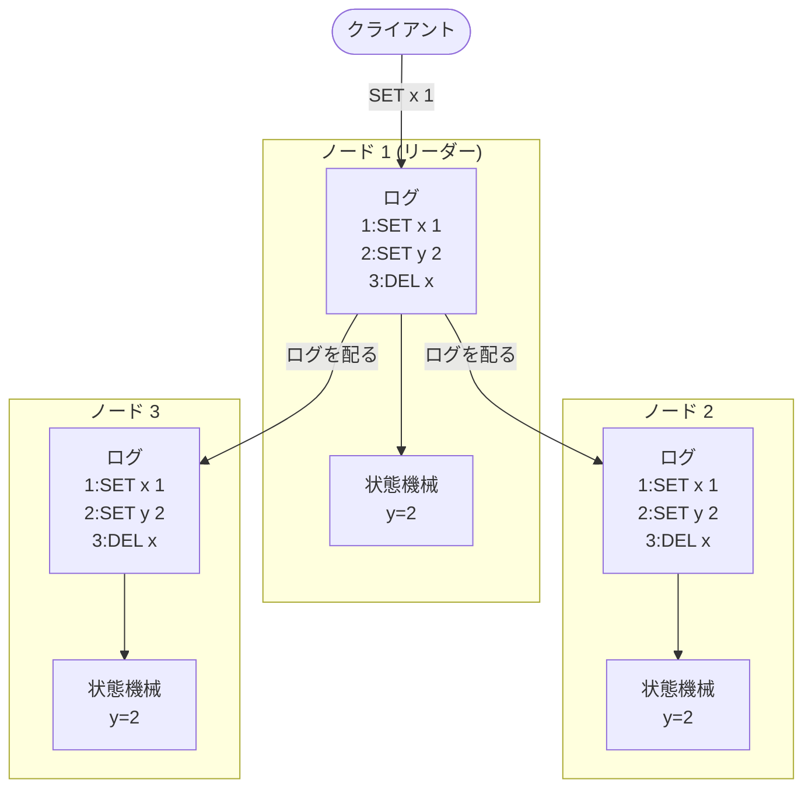
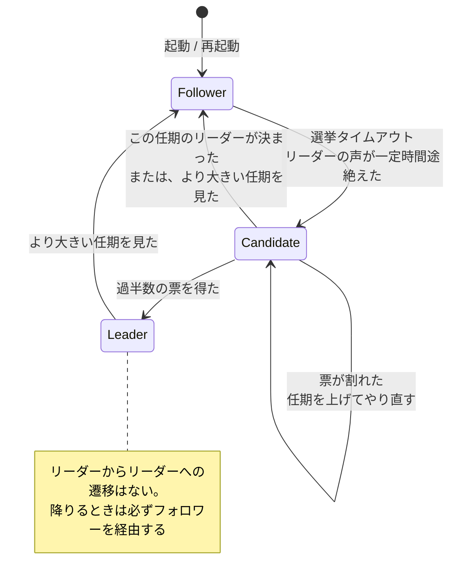

このページは Raft を知らない人のためのものだ。分散システムの経験も要らない。「サーバが 1 台落ちても止まらないようにしたい」という動機から出発して、Raft が解いている問題の形まで進む。

## 1 台のサーバは落ちる

キーバリューストアを 1 台のサーバで動かしているとする。`SET x 1` を受けて、メモリ上のマップに書き、必要ならディスクに落とす。単純で、正しい。

このサーバが落ちると、サービスが止まる。ディスクが壊れれば、データも消える。

素直な対策は複製だ。同じデータを 3 台に置いておけば、1 台落ちても残り 2 台で応答できる。問題は「同じデータ」をどう維持するかにある。クライアントからのリクエストを 3 台がそれぞれ勝手に受けたら、届く順序が違うだけで内容がズレる。

```
クライアント A: SET x 1
クライアント B: SET x 2

サーバ 1 の受信順: A, B → x = 2
サーバ 2 の受信順: B, A → x = 1
```

3 台に同じデータを置きたいなら、**3 台が同じ操作を、同じ順序で** 実行しなければならない。

## 複製状態機械

ここで使うのが **複製状態機械 (replicated state machine)** という考え方だ。

- サーバの中身を、**決定的な状態機械** とみなす。同じ初期状態から、同じ入力列を、同じ順序で与えれば、必ず同じ状態になるもののこと。キーバリューストアはこれに当てはまる。乱数も現在時刻も使わないなら、`SET x 1` `SET y 2` `DEL x` を順に適用した結果は常に同じだ。
- 各サーバに、**操作の並び** を持たせる。これを **ログ (log)** と呼ぶ。ログの各要素が **エントリ (entry)**、先頭からの位置が **インデックス (index)** だ。
- 全サーバのログが同じ内容になれば、それを順に適用した状態機械も同じ状態になる。

```
        ログ (全サーバで同じ内容にしたい)
        ┌───────┬───────┬───────┬───────┐
index   │   1   │   2   │   3   │   4   │
        ├───────┼───────┼───────┼───────┤
        │SET x 1│SET y 2│ DEL x │SET z 3│
        └───────┴───────┴───────┴───────┘
              ↓ 先頭から順に適用 (apply)
        状態機械 (キーバリューストア)
```

3 台に広げるとこうなる。ログを配るところだけが通信で、状態機械はそれぞれのノードが自分のログを読んで勝手に動かす。



**ログの中身が一致していれば、それを順に適用した状態機械も一致する**。状態機械の中身そのものを比べたり同期したりする必要はない。

つまり **「データを一致させる」問題が「ログの各位置に何が入るかを一致させる」問題に還元される**。この還元が Raft の出発点だ。以降、Raft は状態機械の中身に一切関心を持たない。エントリの `Data` はただのバイト列で、その意味を解釈するのは利用側の仕事になる。

`etcd-io/raft` でも、エントリは本当にこれだけの構造をしている ([`raftpb/raft.proto#L12-L17`](https://github.com/etcd-io/raft/blob/af7bf26c25cacf88c26db8751e78af2badbda5d8/raftpb/raft.proto#L12-L17))。

```protobuf title="raftpb/raft.proto"
message Entry {
	optional uint64     Term  = 2;
	optional uint64     Index = 3;
	optional EntryType  Type  = 1;
	optional bytes      Data  = 4;
}
```

`Data` はバイト列だ。`Index` はログ上の位置。`Term` は次のページで導入する。`Type` は「普通のデータ」か「メンバー変更」かの区別で、これも後で扱う。

## コミットと適用は別のこと

ログにエントリを **書いた (append)** だけでは、まだそれを実行してはいけない。書いたサーバが直後に落ちて、そのエントリが他のどこにも残っていなければ、そのエントリは無かったことになるからだ。

そこで 2 つの段階を分ける。

- **コミット (commit)**: そのエントリが「もう絶対に消えない」と確定した状態。何をもって確定とするかが、まさに合意アルゴリズムの中身になる。
- **適用 (apply)**: コミット済みのエントリを状態機械に食わせて、実際に `SET x 1` を実行すること。

`etcd-io/raft` は、ログ上の位置をこの 3 段階で覚えている ([`log.go#L25-L49`](https://github.com/etcd-io/raft/blob/af7bf26c25cacf88c26db8751e78af2badbda5d8/log.go#L25-L49))。

```go title="log.go"
	// committed is the highest log position that is known to be in
	// stable storage on a quorum of nodes.
	committed uint64
	// applying is the highest log position that the application has
	// been instructed to apply to its state machine. Some of these
	// entries may be in the process of applying and have not yet
	// reached applied.
	applying uint64
	// applied is the highest log position that the application has
	// successfully applied to its state machine.
	applied uint64
```

`applied <= applying <= committed <= lastIndex` が常に成り立つ。`applying` が挟まっているのは、適用を非同期に投げられるようにするためで、これは [Ready ループのページ](../ready-loop/) で扱う。

クライアントへの応答は、普通は適用の後に返す。「書けた」と答えた操作が読み返せないと困るからだ。

## 過半数という定足数

では「もう絶対に消えない」をどう定義するか。

**過半数 (majority)** に届いたら確定、とする。5 台のクラスタなら 3 台、3 台なら 2 台。この定義が効くのは、**任意の 2 つの過半数は必ず 1 台以上を共有する** からだ。

```
5 台のクラスタ {1,2,3,4,5}

過半数 A = {1,2,3}
過半数 B = {3,4,5}
             ↑ 3 が両方に属する
```

この性質があると、次のような論法が使える。「エントリ E は過半数 A に書かれた」「新しいリーダーは過半数 B の投票で選ばれた」→「A と B は少なくとも 1 台を共有する」→「その 1 台は E を持っている」。共有された 1 台を経由して、古い決定が新しい決定に伝わる。この交差性が Raft の安全性の議論のほぼ全部を支えている。

台数を `n` とすると、耐えられる故障台数は `f = (n-1)/2` だ。3 台で 1 台、5 台で 2 台。偶数台にしても耐障害性は上がらない (4 台の過半数は 3 なので、耐えられるのは 1 台のまま) ので、クラスタは奇数台にするのが普通になる。

`etcd-io/raft` では、この「過半数」が独立したパッケージになっている。投票の集計 ([`quorum/majority.go#L169-L196`](https://github.com/etcd-io/raft/blob/af7bf26c25cacf88c26db8751e78af2badbda5d8/quorum/majority.go#L169-L196)) を見ると、定足数の定義がそのまま書いてある。

```go title="quorum/majority.go"
	q := len(c)/2 + 1
	if votedCnt >= q {
		return VoteWon
	}
	if votedCnt+missing >= q {
		return VotePending
	}
	return VoteLost
```

`VotePending` という 3 つ目の答えがあるのが目を引く。「まだ賛成が足りないが、未回答が全部賛成すれば届く」状態を、「負け」と区別している。負けが確定した瞬間に候補者は降りられるので、次の選挙まで待たずに済む。

## なぜリーダーを置くのか

「ログの各位置に何が入るかを全員で合意する」問題は、原理的にはリーダーなしでも解ける。Paxos がそれで、各位置ごとに独立に合意を取る。

Raft はそうしない。**任期ごとにただ 1 人のリーダーを選び、そのリーダーだけがログにエントリを追加できる** という制約を置く。この制約が問題を単純にする。

- ログの内容を決めるのは常に 1 人なので、「同じ位置に別々の値が提案される」ことが起きない。
- フォロワーは、リーダーの言うとおりに自分のログを合わせればいい。判断が要らない。
- 結果、考えるべきことが「誰がリーダーか」「リーダーのログをどう配るか」「その 2 つが噛み合っても壊れないか」の 3 つに分解される。

論文の副題が "Understandable" なのはここに由来する。Raft は Paxos より効率的なわけではなく、**理解しやすいように問題を分解した** アルゴリズムだ。

3 つのサブ問題は、この章の以降のページに対応する。

| サブ問題     | 内容                                                 | ページ                                                |
| ------------ | ---------------------------------------------------- | ----------------------------------------------------- |
| リーダー選挙 | リーダーが落ちたとき、新しいリーダーを 1 人だけ選ぶ  | [任期とリーダー選挙](../term-and-election/)           |
| ログ複製     | リーダーのログをフォロワーに配り、食い違いを直す     | [ログ複製](../log-replication/)                       |
| 安全性       | 選挙と複製が噛み合っても、コミット済みが消えないこと | [コミット規則](../commit-rule/)、[安全性](../safety/) |

## ノードの 3 つの役割

Raft のノードは、常に次の 3 つのうちどれかの役割を持つ。

- **リーダー (leader)**: クライアントの提案を受け付け、ログに書き、フォロワーに配る。同時に 1 人だけ。
- **フォロワー (follower)**: 受け身。リーダーから来たものを自分のログに書き、投票要求に答える。
- **候補者 (candidate)**: 選挙中の一時的な役割。リーダーが落ちたと判断したフォロワーがここに移る。

この 3 つの間の行き来には決まった形がある。**全ノードはフォロワーとして起動する** し、リーダーになる道は「候補者として過半数の票を得る」1 本しかない。



矢印がこれだけしかないことを覚えておくと、後のページで「この状況ではどこにいるか」を追いやすい。リーダーから候補者への直行がないこと、リーダーが自発的に降りる矢印がないこと (降りるのは常に「より大きい任期を見た」とき) が特に効いてくる。

`etcd-io/raft` にはもう 1 つ `StatePreCandidate` があるが、これは無駄な選挙を減らすための拡張なので [PreVote のページ](../prevote/) まで置いておく ([`raft.go#L50-L57`](https://github.com/etcd-io/raft/blob/af7bf26c25cacf88c26db8751e78af2badbda5d8/raft.go#L50-L57))。

```go title="raft.go"
const (
	StateFollower StateType = iota
	StateCandidate
	StateLeader
	StatePreCandidate
	numStates
)
```

役割の切り替えは、`becomeFollower` / `becomeCandidate` / `becomeLeader` という 3 つの関数に集約されている。どれも同じ形をしていて、**メッセージの処理関数 `step` と、タイマー処理 `tick` を差し替える** ([`raft.go#L891-L900`](https://github.com/etcd-io/raft/blob/af7bf26c25cacf88c26db8751e78af2badbda5d8/raft.go#L891-L900))。

```go title="raft.go"
func (r *raft) becomeFollower(term uint64, lead uint64) {
	r.step = stepFollower
	r.reset(term)
	r.tick = r.tickElection
	r.lead = lead
	r.state = StateFollower
	r.logger.Infof("%x became follower at term %d", r.id, r.Term)

	traceBecomeFollower(r)
}
```

役割ごとの振る舞いの違いが、`stepLeader` / `stepCandidate` / `stepFollower` という 3 つの関数に閉じている。役割で分岐する `if` がコード中に散らばらないので、「リーダーのときだけこうする」がどこに書かれているかを探しやすい。

## ログスライスという単位

もう 1 つ、`etcd-io/raft` 固有の型を先に見ておく。`logSlice` は「ログの連続した一部分」を表す型で、フォロワーに送る複製メッセージも、受け取ったフォロワー側の処理も、この型を通る ([`types.go#L38-L72`](https://github.com/etcd-io/raft/blob/af7bf26c25cacf88c26db8751e78af2badbda5d8/types.go#L38-L72))。

```go title="types.go"
//  1. entries[i].Index == prev.index + 1 + i,
//  2. prev.term <= entries[0].Term,
//  3. entries[i-1].Term <= entries[i].Term,
//  4. entries[len-1].Term <= term.
//
// Property (1) means the slice is contiguous. Properties (2) and (3) mean that
// the terms of the entries in a log never regress. Property (4) means that a
// leader log at a specific term never has entries from higher terms.
type logSlice struct {
	// term is the leader term containing the given entries in its log.
	term uint64
	// prev is the ID of the entry immediately preceding the entries.
	prev entryID
	// entries contains the consecutive entries representing this slice.
	entries []*pb.Entry
}
```

ここに書かれている 4 つの性質は、Raft のログが常に満たす不変条件だ。今の時点で全部を理解する必要はないが、「ログは連続していて、任期は後戻りしない」という形だけ頭に入れておくと後が読みやすい。`prev` が「エントリの直前の位置」を持っているのが特徴で、これが次々ページの **ログマッチング** の鍵になる。

## この章で使う語彙

以降のページで断りなく使う言葉を、ここでまとめておく。

| 語               | 意味                                                 | コード上の対応            |
| ---------------- | ---------------------------------------------------- | ------------------------- |
| エントリ         | ログの 1 要素。操作 1 つ分                           | `pb.Entry`                |
| インデックス     | ログ上の位置。1 から始まる                           | `Entry.Index`             |
| 任期 (term)      | 「今は誰の時代か」を表す整数                         | `Entry.Term`、`raft.Term` |
| コミット         | もう消えないと確定した状態                           | `raftLog.committed`       |
| 適用 (apply)     | 状態機械に食わせること                               | `raftLog.applied`         |
| 定足数 (quorum)  | 過半数                                               | `quorum.MajorityConfig`   |
| 提案 (propose)   | クライアントが操作をログに載せるよう頼むこと         | `MsgProp`                 |
| 複製 (replicate) | リーダーがフォロワーにエントリを配ること             | `MsgApp`                  |
| スナップショット | 状態機械の中身のコピー。ログの先頭を捨てるために使う | `pb.Snapshot`             |
| 進捗 (Progress)  | リーダーが持つ「フォロワーごとにどこまで届いたか」   | `tracker.Progress`        |

## コードの地図

このライブラリの読み方の目安を挙げておく。

| ファイル          | 行数 | 中身                                                     |
| ----------------- | ---- | -------------------------------------------------------- |
| `raft.go`         | 2162 | 本体。役割ごとの `step` 関数、選挙、複製、構成変更の適用 |
| `log.go`          | 576  | ログの抽象。追記、食い違いの検出、コミット位置の更新     |
| `log_unstable.go` | 240  | まだディスクに書かれていない部分のログ                   |
| `node.go`         | 616  | goroutine とチャネルによる利用側 API                     |
| `rawnode.go`      | 557  | goroutine を使わない下位 API。`Ready` の組み立て         |
| `tracker/`        | 738  | フォロワーごとの進捗と流量制御                           |
| `quorum/`         | 331  | 定足数の計算。投票集計とコミット位置                     |
| `confchange/`     | 574  | メンバー変更の適用と検証                                 |
| `raftpb/`         | —    | メッセージとエントリの protobuf 定義                     |

`node.go` と `rawnode.go` は 2 層になっている。`RawNode` が「goroutine を持たない状態機械のラッパー」で、`node` がそれをチャネルで包んだもの。CockroachDB のように 1 プロセスで数万の Raft グループを回す利用側は、goroutine を持たない `RawNode` を直接使う。

次のページから、リーダーをどうやって 1 人に決めるかに入る。
