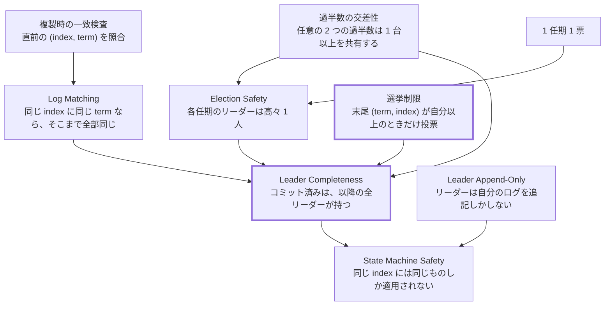
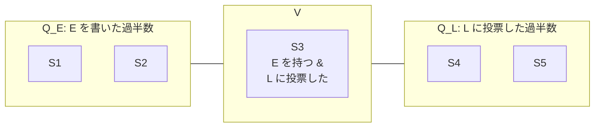

ここまでで、リーダー選挙とログ複製とコミット規則が揃った。このページはそれらを組み合わせて、**なぜ壊れないのか** を組み立てる。

## Raft が保証する 5 つの性質

論文が挙げる性質は 5 つある。

| 性質                 | 内容                                                                                                             |
| -------------------- | ---------------------------------------------------------------------------------------------------------------- |
| Election Safety      | 各任期のリーダーは高々 1 人                                                                                      |
| Leader Append-Only   | リーダーは自分のログを上書きも削除もしない。追記のみ                                                             |
| Log Matching         | 同じ index に同じ term のエントリがあれば、そこまでのログは全部同一                                              |
| Leader Completeness  | ある任期でコミットされたエントリは、それより大きい全任期のリーダーのログに存在する                               |
| State Machine Safety | あるノードが index i のエントリを状態機械に適用したら、他のどのノードも同じ index には同じエントリしか適用しない |

最初の 3 つは既に見た。Election Safety は「1 任期 1 票 + 過半数の交差」から、Log Matching は複製時の一致検査から出る。Leader Append-Only は実装上の約束で、`etcd-io/raft` ではリーダーの `step` 関数に自分のログを切り詰める経路が存在しないという形で守られている。

残る 2 つが本題だ。**Leader Completeness が成り立てば State Machine Safety は自動的に従う** ので、実質は Leader Completeness ひとつを示せばよい。

依存関係を図にすると、どこが証明の要かがはっきりする。



太くしてある 2 つ、**選挙制限** と **Leader Completeness** が中心だ。他は既に見たか、実装上の約束にすぎない。

## 選挙制限

Leader Completeness を成り立たせているのが **選挙制限 (election restriction)** だ。

> 投票者は、候補者のログが自分のログと同じかそれ以上に「新しい」ときだけ賛成する。

「新しい」の定義は、**末尾エントリの `(term, index)` の辞書式比較** になる。

- 末尾の任期が違うなら、任期が大きい方が新しい。
- 末尾の任期が同じなら、インデックスが大きい方が新しい。

`etcd-io/raft` では 1 行で書かれている ([`log.go#L434-L443`](https://github.com/etcd-io/raft/blob/af7bf26c25cacf88c26db8751e78af2badbda5d8/log.go#L434-L443))。

```go title="log.go"
// isUpToDate determines if a log with the given last entry is more up-to-date
// by comparing the index and term of the last entries in the existing logs.
//
// If the logs have last entries with different terms, then the log with the
// later term is more up-to-date. If the logs end with the same term, then
// whichever log has the larger lastIndex is more up-to-date. If the logs are
// the same, the given log is up-to-date.
func (l *raftLog) isUpToDate(their entryID) bool {
	our := l.lastEntryID()
	return their.term > our.term || their.term == our.term && their.index >= our.index
}
```

投票要求にはこの `(term, index)` が載っている。[任期とリーダー選挙のページ](../term-and-election/) で見た `campaign` の送信箇所を再掲する。

```go title="raft.go"
		last := r.raftLog.lastEntryID()
		r.send(&pb.Message{To: new(id), Term: new(term), Type: voteMsg.Enum(), Index: new(last.index), LogTerm: new(last.term), Context: ctx})
```

**ログの長さでは比較していない** ことに注意してほしい。長さで比較すると図 8 の反例が別の形で通ってしまう。任期を第一キーにするのが本質だ。

## なぜ「末尾の比較」で全体が保証されるのか

「末尾の 2 つの数を比べただけで、コミット済みのエントリを全部持っていると言えるのか」という疑問が残る。言える。背理法で示す。

いま、任期 T でエントリ E がコミットされたとする。コミットの定義から、**E は過半数のノードのログに存在する**。この集合を `Q_E` と呼ぶ。

もし Leader Completeness が破れるなら、T より大きいある任期 U で、E を持たないリーダー L が選ばれたことになる。U を、そのような任期のうち最小のものとする。

L は過半数の票 `Q_L` で選ばれた。`Q_E` と `Q_L` は両方とも過半数なので、少なくとも 1 台を共有する。その 1 台を V と呼ぶ。



- V は `Q_E` に属するので、E を持っている。
- V は `Q_L` に属するので、L に投票した。つまり **L のログは V のログ以上に新しい** と判定した。

V が E を持っているので、V の末尾の任期は E の任期 (= T) 以上だ。選挙制限より、L の末尾の任期も T 以上になる。ここで場合分けする。

**L の末尾の任期が T より大きい場合。** U は「E を持たないリーダーが現れる最小の任期」だった。L の末尾には任期 T' (`T < T' < U`) のエントリがある。それを作った任期 T' のリーダーは、U の最小性から E を持っていたはずだ。ログマッチング特性より、その T' のエントリを持つ L も E を持つ。矛盾。

**L の末尾の任期がちょうど T の場合。** 選挙制限より L の末尾インデックスは V の末尾インデックス以上。V は E を持っているので、V の末尾は E のインデックス以上。よって L の末尾も E のインデックス以上。L と V はどちらも任期 T のエントリを末尾に持つので、ログマッチング特性より E の位置まで一致している。つまり L は E を持つ。矛盾。

どちらでも矛盾するので、Leader Completeness が成り立つ。

議論の重さはすべて **過半数の交差性** に乗っている。「必ず 1 台を共有する」から、古い決定を知っているノードが必ず新しい選挙に参加する。

## State Machine Safety が従うこと

Leader Completeness があると、State Machine Safety はほぼ自明に出る。

- あるノードが index `i` を適用したなら、それは `i` がコミットされていたということ。
- コミットは常にその時点のリーダーが決める。
- 以降のどのリーダーも `i` のエントリを (Leader Completeness により) 同じ内容で持っている。
- リーダーは自分のログを上書きしないので、`i` の中身は永久に変わらない。
- 他のノードは常にリーダーの内容に合わせるので、`i` に別の内容が入ることはない。

つまり **「コミットされた位置の内容は二度と変わらない」** が保証される。ログの末尾側 (未コミット部分) は上書きされうるが、コミット位置より手前は不変になる。

## 実装がこの不変条件を主張している箇所

この「コミット位置より手前は不変」を、`etcd-io/raft` は複数箇所で明示的に検査している。破れたら黙って進むのではなく落ちる。

コミット位置は後戻りしない ([`log.go#L322-L330`](https://github.com/etcd-io/raft/blob/af7bf26c25cacf88c26db8751e78af2badbda5d8/log.go#L322-L330))。

```go title="log.go"
func (l *raftLog) commitTo(tocommit uint64) {
	// never decrease commit
	if l.committed < tocommit {
		if l.lastIndex() < tocommit {
			l.logger.Panicf("tocommit(%d) is out of range [lastIndex(%d)]. Was the raft log corrupted, truncated, or lost?", tocommit, l.lastIndex())
		}
		l.committed = tocommit
	}
}
```

自分が持っていないインデックスまでコミットしろと言われたら panic する。panic メッセージがそのまま「ログが壊れたか、切り詰められたか、失われたのでは」と原因の候補を挙げているのが目を引く。この状態はアルゴリズム上ありえないので、疑うべきはストレージ層になる。

コミット済みと食い違うエントリは受け付けない ([`log.go#L114-L119`](https://github.com/etcd-io/raft/blob/af7bf26c25cacf88c26db8751e78af2badbda5d8/log.go#L114-L119))。

```go title="log.go"
	ci := l.findConflict(a.entries)
	switch {
	case ci == 0:
	case ci <= l.committed:
		l.logger.Panicf("entry %d conflict with committed entry [committed(%d)]", ci, l.committed)
```

コミット位置より手前で食い違いが見つかったら panic。これも Leader Completeness が成り立っていれば起きない。

追記もコミット位置より前には及ばない ([`log.go#L133-L142`](https://github.com/etcd-io/raft/blob/af7bf26c25cacf88c26db8751e78af2badbda5d8/log.go#L133-L142))。

```go title="log.go"
func (l *raftLog) append(ents ...*pb.Entry) uint64 {
	if len(ents) == 0 {
		return l.lastIndex()
	}
	if after := ents[0].GetIndex() - 1; after < l.committed {
		l.logger.Panicf("after(%d) is out of range [committed(%d)]", after, l.committed)
	}
```

同じ不変条件を、3 つの入口それぞれで検査している。1 か所にまとめないのは、どの経路で破れたかがスタックトレースで分かるようにするためだろう。

## 投票の追加条件

`etcd-io/raft` の投票条件を、論文と並べて確認しておく ([`raft.go#L1213-L1222`](https://github.com/etcd-io/raft/blob/af7bf26c25cacf88c26db8751e78af2badbda5d8/raft.go#L1213-L1222))。

```go title="raft.go"
		canVote := r.Vote == m.GetFrom() ||
			(r.Vote == None && r.lead == None) ||
			(m.GetType() == pb.MsgPreVote && m.GetTerm() > r.Term)
		lastID := r.raftLog.lastEntryID()
		candLastID := entryID{term: m.GetLogTerm(), index: m.GetIndex()}
		if canVote && r.raftLog.isUpToDate(candLastID) {
```

論文の条件は「まだ投票していない、かつ相手のログが自分以上に新しい」の 2 つだ。ここにはそれに加えて条件が入っている。

- `r.Vote == m.GetFrom()`: **同じ相手への再投票は許す**。投票要求が再送された場合に冪等に答えられる。安全性は損なわない (票の相手が増えないため)。
- `r.lead == None`: 同じ任期でリーダーを既に知っているなら投票しない。これは安全性のためではなく、無駄な選挙を減らすためだ。
- 3 つ目の `MsgPreVote` の条件は [PreVote のページ](../prevote/) で扱う。

`isUpToDate` は無条件に効いている。**投票の追加条件は増やせるが、選挙制限だけは外せない** という構造になっている。

## 分断されたノードが復帰したとき

選挙制限には、Leader Completeness とは別の効果もある。分断されていたノードが復帰しても、そのノードはリーダーになれない。

```
分断中:
  S1 S2 S3 (多数派、任期 5 で進行中、index 100 まで)
  S4       (少数派、任期 20 まで空回りで上げた、index 10 のまま)

S4 が復帰して立候補:
  任期 21 で MsgVote を送る
  → S1, S2, S3 は任期を 21 に上げる (大きい任期の規則)
  → しかし isUpToDate で拒否 (S4 の末尾は index 10、こちらは index 100)
  → S4 は勝てない
```

安全性は保たれる。ただし **S1〜S3 は任期を 21 に上げてしまい、リーダーが降ろされる**。復帰したノードが何もしていないのに、クラスタの可用性が一時的に落ちる。この問題を解くのが [PreVote](../prevote/) と [CheckQuorum](../check-quorum-and-lease/) で、`etcd-io/raft` の追加機能になっている。

## 「ログの分岐」の全体像

安全性の議論を終えたところで、ログ同士の関係を整理しておく。`etcd-io/raft` の `logSlice` のコメントがこれを一文でまとめている。

```go title="types.go"
// Specifically, logs at two different leader terms share a common prefix, after
// which they *permanently* diverge.
```

任意の 2 つのノードのログは、次の形をしている。

```
共通の接頭辞                分岐した末尾
├────────────────────────┤├──────────────┤
[1:t1][2:t1][3:t2][4:t3] │ [5:t4][6:t4]      ← ノード A
[1:t1][2:t1][3:t2][4:t3] │ [5:t5]            ← ノード B
                          ↑
                    ここから先は永久に別物
                    (どちらか一方が捨てられる)
```

そして **コミット位置は必ず共通接頭辞の中にある**。コミット済み部分に分岐が及ばないこと、それが Raft の安全性が言っていることのすべてだ。

## まとめ

- Raft の 5 性質のうち、Leader Completeness が核。他はそこから従うか、実装上の約束。
- 選挙制限 (末尾エントリの `(term, index)` の辞書式比較) と過半数の交差性から、Leader Completeness が導かれる。
- コミット位置より手前のログは不変になる。`etcd-io/raft` はこれを 3 か所で panic 付きで検査している。
- 選挙制限は安全だが可用性を守らない。分断から復帰したノードが任期を吊り上げる問題は別の仕組みで解く。

アルゴリズムの安全性はここまで。次のページから、それをディスクとメモリの上でどう実現するかに移る。
