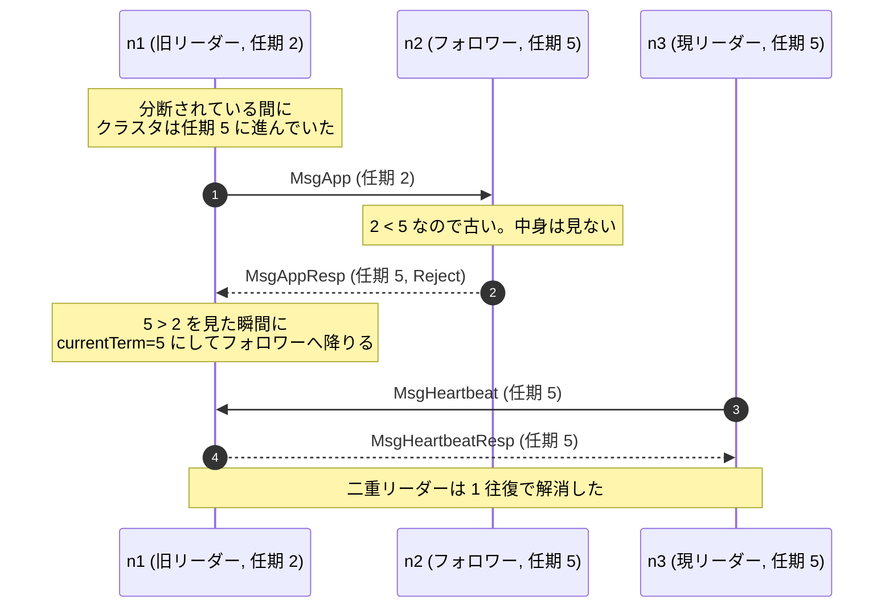
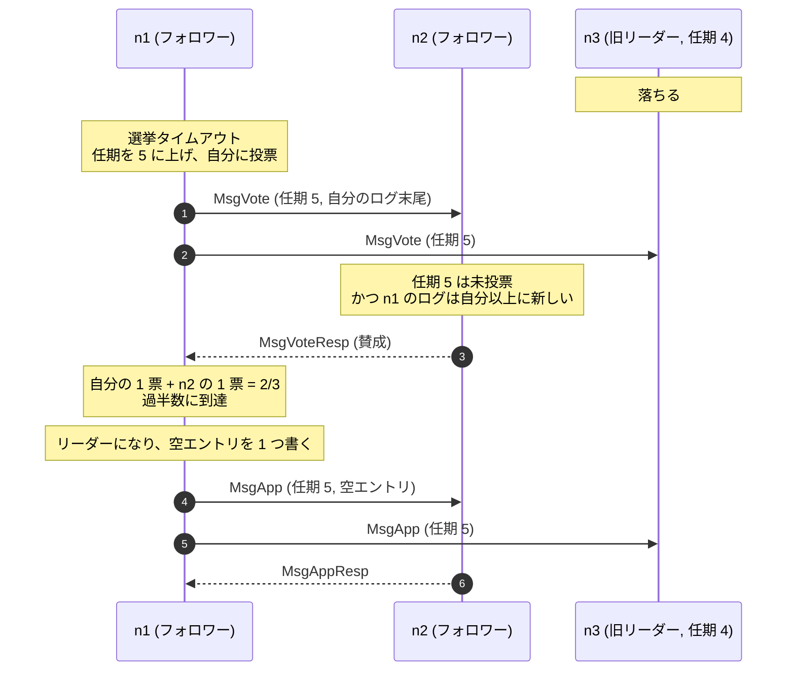
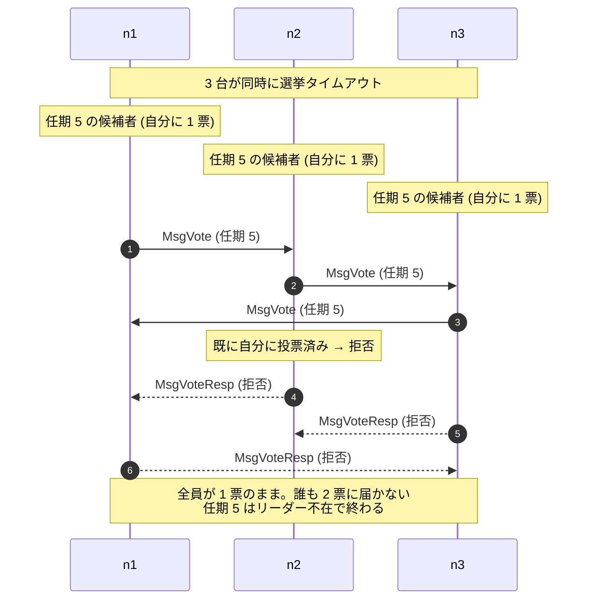

前のページで「任期ごとにただ 1 人のリーダーを選ぶ」と書いた。このページはその任期とは何か、リーダーをどうやって 1 人に絞るかを扱う。

## 任期は論理的な時計

**任期 (term)** は 1 から始まる単調増加の整数だ。時刻ではない。「今が何代目か」を表す世代番号だと思えばいい。

```
任期 1              任期 2       任期 3
├─選挙─┬──── n1 が leader ────┤├選挙┤├─選挙─┬─ n3 が leader ─
        (n1 が落ちる)                  (誰も勝てなかった)
```

任期には次の性質がある。

- 各任期は **選挙から始まる**。誰かが立候補すると任期が 1 つ増える。
- 各任期のリーダーは **高々 1 人**。0 人のこともある (誰も過半数を取れなかった場合)。その任期は空のまま次に進む。
- 各ノードは自分が知っている最大の任期 `currentTerm` を覚えている。

そして、Raft のあらゆるメッセージが任期を運ぶ。受け取った側は、まず任期だけを見て次のように振る舞う。

- **相手の任期が自分より大きい**: 自分は時代遅れだ。`currentTerm` を相手に合わせ、フォロワーになる。
- **相手の任期が自分より小さい**: 相手が時代遅れだ。そのメッセージを無視して、拒否を返す。
- **同じ**: 中身を処理する。

この 3 行が Raft の骨格になっている。**「大きい任期を見たら無条件で降りる」** ため、分断から復帰した古いリーダーは、最初のメッセージ 1 通で自動的にフォロワーに戻る。ネットワーク分断の検知も、リーダーの二重化の解消も、専用の仕組みを持たずにここで片付く。

この 2 行がどう効くかを、いちばん怖いシナリオで見ておく。分断されていた古いリーダーが復帰して、まだ自分がリーダーのつもりでいる場合だ。



「分断を検知する」「リーダーが 2 人いることに気づく」といった専用の仕組みはどこにもない。**任期の大小比較だけで片付いている**。

`etcd-io/raft` では、この規則が `Step` 関数の冒頭にそのまま書かれている ([`raft.go#L1096-L1132`](https://github.com/etcd-io/raft/blob/af7bf26c25cacf88c26db8751e78af2badbda5d8/raft.go#L1096-L1132))。

```go title="raft.go"
	// Handle the message term, which may result in our stepping down to a follower.
	switch {
	case m.GetTerm() == 0:
		// local message
	case m.GetTerm() > r.Term:
		// ...
		default:
			r.logger.Infof("%x [term: %d] received a %s message with higher term from %x [term: %d]",
				r.id, r.Term, m.GetType(), m.GetFrom(), m.GetTerm())
			if m.GetType() == pb.MsgApp || m.GetType() == pb.MsgHeartbeat || m.GetType() == pb.MsgSnap {
				r.becomeFollower(m.GetTerm(), m.GetFrom())
			} else {
				r.becomeFollower(m.GetTerm(), None)
			}
		}

	case m.GetTerm() < r.Term:
		// ... 拒否またはログ出力のみ
		return nil
	}
```

3 つの分岐が、上に挙げた 3 つの規則に対応している。`m.GetTerm() == 0` はローカル起源のメッセージ (タイマー発火など) で、任期を持たない。これについては [「全部を Message にする」のページ](../everything-is-a-message/) で扱う。

大きい任期を見て降りるとき、`MsgApp`・`MsgHeartbeat`・`MsgSnap` なら送り主をリーダーとして記録し、それ以外なら `None` にしている。この 3 つは **リーダーしか送らないメッセージ** だからだ。投票要求から降りたときは、その相手はまだ候補者でしかないので、リーダーとして記録してはいけない。

## リーダーの生存確認

リーダーは、書くべきエントリがなくても定期的に **ハートビート** を送る。フォロワーはこれを受け取っている限り「リーダーは生きている」と判断する。

フォロワー側には **選挙タイムアウト (election timeout)** がある。この時間だけリーダーから何も来なければ、リーダーが落ちたと判断して選挙を始める。

`etcd-io/raft` は時間を実時刻ではなく **tick** という抽象的な単位で数える。利用側が `Node.Tick()` を定期的に呼び、ライブラリは呼ばれた回数を数えるだけだ ([`raft.go#L850-L860`](https://github.com/etcd-io/raft/blob/af7bf26c25cacf88c26db8751e78af2badbda5d8/raft.go#L850-L860))。

```go title="raft.go"
// tickElection is run by followers and candidates after r.electionTimeout.
func (r *raft) tickElection() {
	r.electionElapsed++

	if r.promotable() && r.pastElectionTimeout() {
		r.electionElapsed = 0
		if err := r.Step(&pb.Message{From: new(r.id), Type: pb.MsgHup.Enum()}); err != nil {
			r.logger.Debugf("error occurred during election: %v", err)
		}
	}
}
```

`electionElapsed` は、フォロワーがリーダーから有効なメッセージを受けるたびに 0 に戻される ([`raft.go#L1735-L1737`](https://github.com/etcd-io/raft/blob/af7bf26c25cacf88c26db8751e78af2badbda5d8/raft.go#L1735-L1737))。タイムアウトすると、自分自身に `MsgHup` (立候補しろ) を送る。時間を tick にしていることの効果は [ランダム化タイムアウトのページ](../randomized-timeout/) でまとめて扱う。

推奨される設定は `ElectionTick = 10 * HeartbeatTick` だ ([`raft.go#L129-L140`](https://github.com/etcd-io/raft/blob/af7bf26c25cacf88c26db8751e78af2badbda5d8/raft.go#L129-L140))。ハートビートが 10 回連続で届かなかったら選挙、という比率になる。この比率が小さすぎると、一時的な遅延で不要な選挙が起きる。

## 選挙の手順

選挙タイムアウトしたフォロワーがすることは 4 つある。

1. `currentTerm` を 1 増やす。
2. **候補者 (candidate)** になる。
3. 自分に投票する。
4. 他の全ノードに **投票要求 (RequestVote)** を送る。

3 台のクラスタでリーダーが落ちた場合の一部始終はこうなる。



n3 は落ちたままだが、3 台中 2 台で過半数なので選挙は成立する。「全員の返事を待たない」のが定足数を使う意味だ。最後の空エントリについては、なぜそれが要るのかを [コミット規則のページ](../commit-rule/) で扱う。

`etcd-io/raft` では `becomeCandidate` と `campaign` に分かれている ([`raft.go#L902-L915`](https://github.com/etcd-io/raft/blob/af7bf26c25cacf88c26db8751e78af2badbda5d8/raft.go#L902-L915))。

```go title="raft.go"
func (r *raft) becomeCandidate() {
	if r.state == StateLeader {
		panic("invalid transition [leader -> candidate]")
	}
	r.step = stepCandidate
	r.reset(r.Term + 1)
	r.tick = r.tickElection
	r.Vote = r.id
	r.state = StateCandidate
	r.logger.Infof("%x became candidate at term %d", r.id, r.Term)

	traceBecomeCandidate(r)
}
```

`r.reset(r.Term + 1)` で任期を 1 つ増やし、`r.Vote = r.id` で自分に投票する。`reset` の中では、任期が変わったとき `Vote` を `None` に戻す処理が入っている ([`raft.go#L781-L785`](https://github.com/etcd-io/raft/blob/af7bf26c25cacf88c26db8751e78af2badbda5d8/raft.go#L781-L785))。任期が変われば投票もやり直しになるからだ。

```go title="raft.go"
func (r *raft) reset(term uint64) {
	if r.Term != term {
		r.Term = term
		r.Vote = None
	}
	r.lead = None
```

投票要求の送信は `campaign` にある ([`raft.go#L1046-L1072`](https://github.com/etcd-io/raft/blob/af7bf26c25cacf88c26db8751e78af2badbda5d8/raft.go#L1046-L1072))。

```go title="raft.go"
	for _, id := range ids {
		if id == r.id {
			// The candidate votes for itself and should account for this self
			// vote once the vote has been durably persisted (since it doesn't
			// send a MsgVote to itself). This response message will be added to
			// msgsAfterAppend and delivered back to this node after the vote
			// has been written to stable storage.
			r.send(&pb.Message{To: new(id), Term: new(term), Type: voteRespMsgType(voteMsg).Enum()})
			continue
		}
		last := r.raftLog.lastEntryID()
		// ...
		r.send(&pb.Message{To: new(id), Term: new(term), Type: voteMsg.Enum(), Index: new(last.index), LogTerm: new(last.term), Context: ctx})
	}
```

自分への投票も **メッセージとして自分に送っている** のが目を引く。`r.Vote = r.id` を代入するだけでは済ませていない。これは「投票はディスクに書いてから有効」という規則を守るためで、[永続化のページ](../persistent-state/) と [msgsAfterAppend のページ](../msgs-after-append/) で扱う。

投票要求には自分のログの末尾 `(Index, LogTerm)` を載せている。受け取った側はこれを見て投票の可否を決める。これが安全性の要になる **選挙制限** で、[安全性のページ](../safety/) で扱う。

## 投票の規則

投票を受けたノードは、次を全部満たすときだけ賛成する。

1. 相手の任期が自分の任期以上であること (これは `Step` の冒頭で処理済み)。
2. **その任期でまだ誰にも投票していない** こと。または、同じ相手に既に投票していること (再送への冪等な応答)。
3. 相手のログが自分のログと同じかそれ以上に新しいこと。

規則 2 が「1 任期 1 票」で、これがリーダーが 2 人にならないことの直接の根拠になる。過半数の票を集めた者だけが勝ち、任意の 2 つの過半数は交差するから、同じ任期で 2 人が過半数を集めることはできない。

`etcd-io/raft` の実装 ([`raft.go#L1213-L1219`](https://github.com/etcd-io/raft/blob/af7bf26c25cacf88c26db8751e78af2badbda5d8/raft.go#L1213-L1219)):

```go title="raft.go"
	case pb.MsgVote, pb.MsgPreVote:
		// We can vote if this is a repeat of a vote we've already cast...
		canVote := r.Vote == m.GetFrom() ||
			// ...we haven't voted and we don't think there's a leader yet in this term...
			(r.Vote == None && r.lead == None) ||
			// ...or this is a PreVote for a future term...
			(m.GetType() == pb.MsgPreVote && m.GetTerm() > r.Term)
		// ...and we believe the candidate is up to date.
		lastID := r.raftLog.lastEntryID()
		candLastID := entryID{term: m.GetLogTerm(), index: m.GetIndex()}
		if canVote && r.raftLog.isUpToDate(candLastID) {
```

論文よりも条件が 1 つ厳しくなっている。論文は「まだ投票していなければ投票する」だが、ここでは **`r.lead == None` も要求している**。同じ任期でリーダーを既に認識しているなら、投票しない。この任期のリーダーは既に決まっているので、投票しても意味がないという判断だ。

## 選挙の 3 つの結末

候補者になった後、起きることは 3 つしかない。

**過半数の票を得る**。リーダーになる。すぐにハートビートを送って他を黙らせる。

**他の誰かがリーダーになる**。より大きいかまたは同じ任期の `MsgApp` が来る。任期が同じなら、その任期のリーダーが決まったということなので、候補者はフォロワーに戻る ([`raft.go#L1697-L1699`](https://github.com/etcd-io/raft/blob/af7bf26c25cacf88c26db8751e78af2badbda5d8/raft.go#L1697-L1699))。

```go title="raft.go"
	case pb.MsgApp:
		r.becomeFollower(m.GetTerm(), m.GetFrom()) // always m.Term == r.Term
		r.handleAppendEntries(m)
```

**誰も過半数を取れない (分割投票)**。3 台が同時にタイムアウトして同時に立候補すると、票が割れて誰も勝てない。この場合、また選挙タイムアウトを待って、任期を増やしてやり直す。

分割投票は図にするとこうなる。誰も過半数に届かないまま任期だけが消費される。



分割投票が毎回起きると永久に決まらない。これを防ぐのが **選挙タイムアウトのランダム化** だ ([`raft.go#L2053-L2055`](https://github.com/etcd-io/raft/blob/af7bf26c25cacf88c26db8751e78af2badbda5d8/raft.go#L2053-L2055))。

```go title="raft.go"
func (r *raft) resetRandomizedElectionTimeout() {
	r.randomizedElectionTimeout = r.electionTimeout + globalRand.Intn(r.electionTimeout)
}
```

実際のタイムアウトは `[electionTimeout, 2*electionTimeout)` の一様乱数になる。誰かが先にタイムアウトして先に立候補し、他が起きる前に決着がつく確率が高くなる。運悪くぶつかっても、次はまた違う値になるので、繰り返せば必ず抜ける。

## 票の集計

候補者は票を集めながら、勝敗が確定したかを毎回判定する ([`raft.go#L1075-L1087`](https://github.com/etcd-io/raft/blob/af7bf26c25cacf88c26db8751e78af2badbda5d8/raft.go#L1075-L1087))。

```go title="raft.go"
func (r *raft) poll(id uint64, t pb.MessageType, v bool) (granted int, rejected int, result quorum.VoteResult) {
	// ...
	r.trk.RecordVote(id, v)
	return r.trk.TallyVotes()
}
```

集計結果は `VoteWon` / `VoteLost` / `VotePending` の 3 値で、これを受けた候補者の分岐はこうなる ([`raft.go#L1700-L1714`](https://github.com/etcd-io/raft/blob/af7bf26c25cacf88c26db8751e78af2badbda5d8/raft.go#L1700-L1714))。

```go title="raft.go"
	case myVoteRespType:
		gr, rj, res := r.poll(m.GetFrom(), m.GetType(), !m.GetReject())
		r.logger.Infof("%x has received %d %s votes and %d vote rejections", r.id, gr, m.GetType(), rj)
		switch res {
		case quorum.VoteWon:
			if r.state == StatePreCandidate {
				r.campaign(campaignElection)
			} else {
				r.becomeLeader()
				r.bcastAppend()
			}
		case quorum.VoteLost:
			// pb.MsgPreVoteResp contains future term of pre-candidate
			// m.Term > r.Term; reuse r.Term
			r.becomeFollower(r.Term, None)
		}
```

`VotePending` のときは何もしない。まだ結果が出ていないので待つ。`VoteLost` なら即座にフォロワーに戻る — 拒否票が過半数に達した時点で勝ち目がないことが確定するので、残りの返答を待つ必要がない。

## リーダーになった直後にすること

`becomeLeader` は、リーダーになった瞬間に **空のエントリを 1 つ自分のログに書く** ([`raft.go#L933-L971`](https://github.com/etcd-io/raft/blob/af7bf26c25cacf88c26db8751e78af2badbda5d8/raft.go#L933-L971))。

```go title="raft.go"
	// Conservatively set the pendingConfIndex to the last index in the
	// log. There may or may not be a pending config change, but it's
	// safe to delay any future proposals until we commit all our
	// pending log entries, and scanning the entire tail of the log
	// could be expensive.
	r.pendingConfIndex = r.raftLog.lastIndex()

	traceBecomeLeader(r)
	emptyEnt := &pb.Entry{Data: nil}
	if !r.appendEntry(emptyEnt) {
		// This won't happen because we just called reset() above.
		r.logger.Panic("empty entry was dropped")
	}
```

中身が空のエントリを書くのは無駄に見えるが、これには 2 つの役目がある。1 つは「新しいリーダーの任期のエントリ」を確実に 1 つ作ること。これがないとコミットが進められない場合があり、その理由は [コミット規則のページ](../commit-rule/) で扱う。もう 1 つは、このエントリの複製を通じてフォロワーのログの状態を探ることだ。

## 選挙のテキスト表現

このライブラリのテストは、コマンドと出力を並べたテキストファイルになっている。1 台構成の選挙は次のように書かれる ([`testdata/single_node.txt`](https://github.com/etcd-io/raft/blob/af7bf26c25cacf88c26db8751e78af2badbda5d8/testdata/single_node.txt))。

```text title="testdata/single_node.txt"
campaign 1
----
INFO 1 is starting a new election at term 0
INFO 1 became candidate at term 1

stabilize
----
> 1 handling Ready
  Ready MustSync=true:
  Lead:0 State:StateCandidate
  HardState Term:1 Vote:1 Commit:3
  INFO 1 received MsgVoteResp from 1 at term 1
  INFO 1 has received 1 MsgVoteResp votes and 0 vote rejections
  INFO 1 became leader at term 1
> 1 handling Ready
  Ready MustSync=true:
  Lead:1 State:StateLeader
  Entries:
  1/4 EntryNormal ""
```

`HardState Term:1 Vote:1` が先に出て、その **後で** 自分への投票 `MsgVoteResp` が処理されている。任期と投票を永続化してから票を数える、という順序がテキストとして見えている。最後の `1/4 EntryNormal ""` が、リーダーになった直後の空エントリだ。

このテスト形式については [datadriven テストのページ](../datadriven-tests/) で扱う。

## まとめ

- 任期は単調増加する整数で、すべてのメッセージが運ぶ。
- 大きい任期を見たら無条件でフォロワーに降りる。小さい任期は無視する。この 2 行が分断からの復帰を自動化する。
- 選挙タイムアウトで立候補し、任期を増やし、自分に投票し、投票要求を送る。
- 1 任期 1 票と過半数の交差性から、各任期のリーダーは高々 1 人になる。
- 分割投票はタイムアウトのランダム化で解く。

次のページで、選ばれたリーダーがログをどう配るかに入る。
