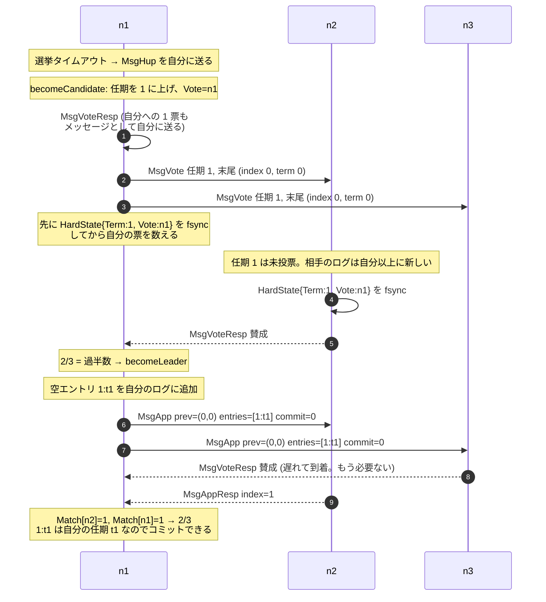
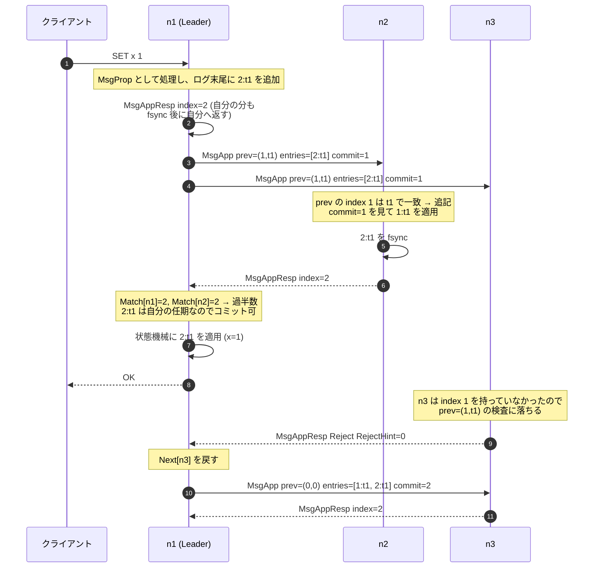
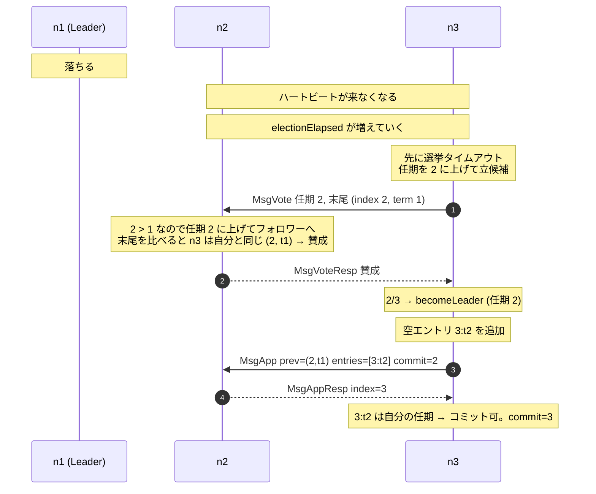
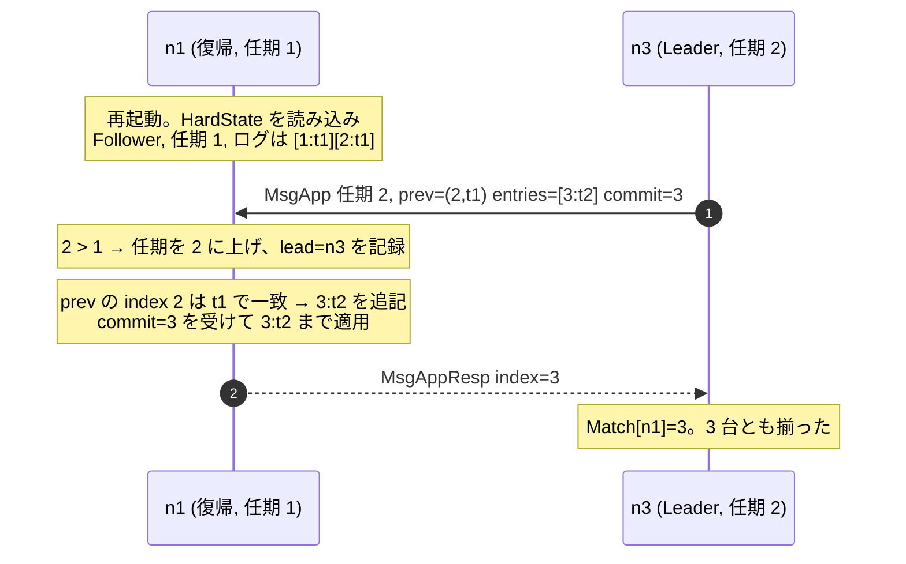
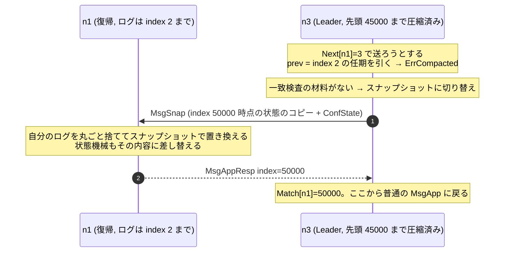

ここまでで、任期・選挙・複製・コミット規則・安全性・永続化・スナップショット・メンバー変更が揃った。規則は 1 つずつ見てきたが、それが噛み合って動いているところはまだ見ていない。

このページは新しい規則を導入しない。**3 台のクラスタ `n1` `n2` `n3` を起動して、書き込みを 1 件処理し、リーダーを落として、復帰させる** までを 1 本の時間軸で追う。どの規則がどこで効いているかを、都度前のページに戻して示す。

## 場面 0: 起動直後

3 台とも `becomeFollower` で始まる。ログは空、任期は 0、投票先は未定。「誰がリーダーか」も分からない。

| ノード | 役割     | 任期 | 投票先 | ログ | commit |
| ------ | -------- | ---- | ------ | ---- | ------ |
| n1     | Follower | 0    | なし   | 空   | 0      |
| n2     | Follower | 0    | なし   | 空   | 0      |
| n3     | Follower | 0    | なし   | 空   | 0      |

再起動したノードも必ずここから始まる。リーダーだったという事実は `SoftState` なので永続化されていない ([永続状態](../persistent-state/))。

この時点では誰も何もしない。動きを起こすのは **時間** だけだ。各ノードは `Tick()` を数えていて、選挙タイムアウトに達したものが立候補する。タイムアウトは `[electionTimeout, 2*electionTimeout)` の一様乱数なので、3 台が同時に達する確率は低い ([任期とリーダー選挙](../term-and-election/))。

## 場面 1: 最初の選挙

`n1` が最初にタイムアウトしたとする。

3 か所、前のページの規則がそのまま出ている。

- **自分への投票をメッセージにしている** (3 行目)。`r.Vote = r.id` を代入するだけでは、ディスクに書く前に票を数えてしまう。永続化してから数えるために、自分宛のメッセージという回り道をする ([永続状態](../persistent-state/))。
- **投票の前に fsync している** (7・9 行目)。ここを飛ばすと、投票を忘れて再起動したノードが同じ任期で二重に投票し、リーダーが 2 人になる。
- **リーダーになった直後に空エントリを書いている** (11 行目)。これがないと、この後に何も書き込みが来なかった場合、過去のエントリを永久にコミットできない ([コミット規則](../commit-rule/))。

終わった時点の状態はこうなる。

| ノード | 役割     | 任期 | ログ     | Match (n1 が持つ) | commit |
| ------ | -------- | ---- | -------- | ----------------- | ------ |
| n1     | Leader   | 1    | `[1:t1]` | n1=1, n2=1, n3=0  | 1      |
| n2     | Follower | 1    | `[1:t1]` | —                 | 0      |
| n3     | Follower | 1    | 空       | —                 | 0      |

`n2` の commit がまだ 0 なのに注意してほしい。**フォロワーは、リーダーがコミットしたことをまだ知らない**。次のメッセージの `Commit` フィールドで知る ([ログ複製](../log-replication/))。

## 場面 2: 書き込みを 1 件処理する

クライアントが `n1` に `SET x 1` を投げる。

`n3` が遅れているが、クライアントへの応答はそれを待っていない。**過半数が書けた時点で確定** なので、残り 1 台の状況は応答の速さに影響しない ([複製状態機械](../replicated-state-machine/))。

同時に、`n3` が遅れていても勝手に置いていかれるわけではない。拒否が返ればリーダーが送る位置を戻して、追いつくまで面倒を見る ([ログ複製](../log-replication/))。

| ノード | 役割     | 任期 | ログ           | commit | 状態機械 |
| ------ | -------- | ---- | -------------- | ------ | -------- |
| n1     | Leader   | 1    | `[1:t1][2:t1]` | 2      | x=1      |
| n2     | Follower | 1    | `[1:t1][2:t1]` | 1      | —        |
| n3     | Follower | 1    | `[1:t1][2:t1]` | 2      | x=1      |

`n2` の commit が 1 のままで `n3` が 2 なのは、順序の綾でしかない。`n2` も次の `MsgApp` か `MsgHeartbeat` で 2 に追いつく。**コミット位置の伝播は常に 1 往復遅れる** が、それで困ることはない。

## 場面 3: リーダーが落ちる

`n1` の電源が抜ける。

ここで効いているのが **選挙制限** だ。`n3` の末尾は `(index 2, term 1)`、`n2` の末尾も `(index 2, term 1)`。同じなので投票してよい ([安全性](../safety/))。

もし `n3` が `[1:t1]` しか持っていなかったら、`n2` は「あなたのログは古い」と拒否する。過半数の交差性により、コミット済みの `2:t1` を持つノードは必ず投票側に含まれるので、`2:t1` を持たない候補者は絶対に勝てない。**コミット済みのエントリを持たないノードがリーダーになる経路がない**、これが Raft の安全性の中身だった。

| ノード | 役割     | 任期 | ログ                 | commit |
| ------ | -------- | ---- | -------------------- | ------ |
| n1     | (down)   | 1    | `[1:t1][2:t1]`       | 2      |
| n2     | Follower | 2    | `[1:t1][2:t1][3:t2]` | 2      |
| n3     | Leader   | 2    | `[1:t1][2:t1][3:t2]` | 3      |

## 場面 4: 落ちたノードが復帰する

`n1` が起動する。`Storage.InitialState()` から `HardState{Term:1, Vote:n1, Commit:2}` が復元され、`becomeFollower(1, None)` で始まる。**リーダーだったことは忘れている**。

`n1` が復帰しても選挙は起きない。**`MsgApp` を受け取った時点で `electionElapsed` が 0 に戻る** ので、リーダーの声が聞こえている限りタイムアウトしないからだ。

そして復帰した `n1` は「自分が任期 1 のリーダーだった」ことを主張しない。任期 2 の `MsgApp` を 1 通見ただけでフォロワーに落ち着く ([任期とリーダー選挙](../term-and-election/))。

ただし、この復帰が **もっと悪い形** になることもある。`n1` がネットワークから切り離されていて、その間に選挙タイムアウトを繰り返していた場合、任期だけが 20 や 30 に上がっている。そのノードが復帰して `MsgVote` を送ると、健全なクラスタ全体が任期を上げてリーダーを失う。ログが古いので `n1` は勝てないのに、である。これを塞ぐのが [PreVote](../prevote/) と [CheckQuorum](../check-quorum-and-lease/) で、次の群以降で扱う。

## 場面 5: 長く落ちていた場合

`n1` が数時間落ちていて、その間に `n3` がログを index 50000 まで進め、先頭 45000 件を圧縮してしまったとする。

ログの追いつきが不可能になったときだけスナップショットに落ちる、という切り替えになっている ([スナップショット](../snapshot/))。

## 通して見えること

5 つの場面を並べると、Raft の全体が 3 種類のメッセージでほぼ回っていることが分かる。

| メッセージ                | 誰が送る | 何のため                                     |
| ------------------------- | -------- | -------------------------------------------- |
| `MsgVote` / `MsgVoteResp` | 候補者   | リーダーを 1 人に決める                      |
| `MsgApp` / `MsgAppResp`   | リーダー | ログを配り、一致を検査し、コミット位置を運ぶ |
| `MsgHeartbeat` / Resp     | リーダー | 生存を知らせて選挙を起こさせない             |

そして、判断はほぼ 2 つの比較に還元されている。

- **任期の比較**。大きいものを見たら降りる。小さいものは無視する。これで分断からの復帰も二重リーダーの解消も片付く。
- **末尾エントリ `(term, index)` の比較**。投票してよいか、複製を受け入れてよいかがこれで決まる。

残りは全部、この 2 つの比較を安全に保つための付帯条件だ。「自分の任期のエントリしか数え上げでコミットしない」も、「返答の前に fsync する」も、「メンバー変更に中間状態を挟む」も、比較の前提が崩れないようにするためにある。

## つまずきやすいところ

**コミットと適用は別**。リーダーがコミットしても、フォロワーがそれを知るのは次のメッセージで、適用するのはさらに後になる。「クライアントに OK を返した瞬間に全ノードの状態機械が更新されている」わけではない。保証されているのは「もう消えない」ことだけで、そこから読めるようになるまでには遅れがある。

**リーダーのログが正しい、は結論であって前提ではない**。フォロワーが無条件にリーダーに合わせられるのは、選挙制限によって「コミット済みを全部持つノードしかリーダーになれない」が保証されているからだ。順序を逆に読むと安全性の議論が空回りする。

**Raft は状態機械の中身を知らない**。エントリの `Data` はバイト列で、`SET x 1` なのか JSON なのかはライブラリの関心事ではない。「同じ並びを同じ順序で適用すれば同じ結果になる」という決定性だけを利用側に要求している。

**タイマーは実時間ではない**。`Tick()` が何ミリ秒に 1 回呼ばれるかは利用側が決める。ライブラリの中に時計はない。この割り切りが、テストで時間を自由に進められることにつながる ([ランダム化タイムアウト](../randomized-timeout/))。

ここまでが Raft のアルゴリズムだ。次の群からは、この状態機械を「I/O を一切しないライブラリ」として切り出すために `etcd-io/raft` が何をしているかに移る。
