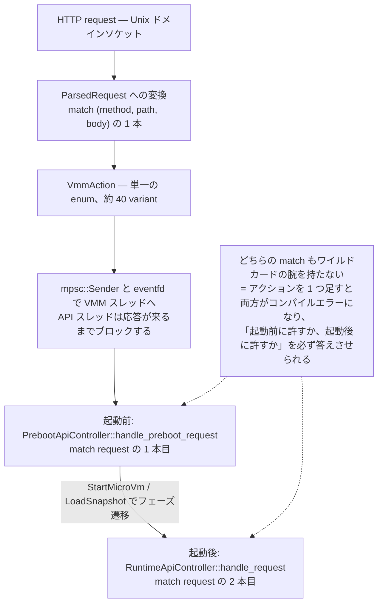
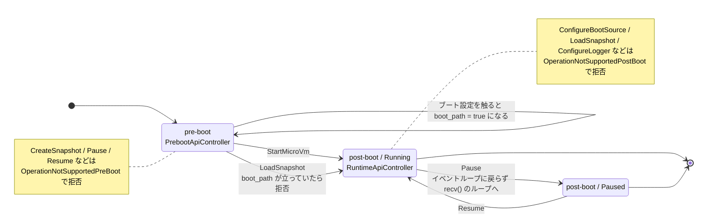

## 何を学んだか

### API の状態機械が、2 つの match 式として書かれている

Firecracker の microVM には、はっきりした 2 つのフェーズがある。

- **起動前 (pre-boot)** — カーネルイメージ、ドライブ、ネットワークインタフェースなどを設定する。まだ vCPU スレッドは存在しない。
- **起動後 (post-boot)** — vCPU が走っている。スナップショットを取る、pause/resume する、レートリミッタを更新する。

この 2 つで「できること」は違う。起動前に `Pause` は無意味だし、起動後に `ConfigureBootSource` を受け付けたら何が起きるか分からない。

多くの実装なら、`enum State { PreBoot, Running }` のようなフィールドを持ち、各ハンドラの先頭で `if state != PreBoot { return Err(...) }` を書く。Firecracker はそうしていない。**HTTP リクエストをまず単一の `VmmAction` enum に潰し、その enum に対する match 式を 2 本用意して、片方を pre-boot、片方を post-boot の「できることの全集合」とした。**



`VmmAction` は非網羅的 (`#[non_exhaustive]`) ではない普通の enum で、2 つの match はどちらもワイルドカード `_ =>` を持たない。だから **新しいアクションを 1 つ追加すると、両方の match がコンパイルエラーになる。** 追加した人は「これは起動前に許すのか、起動後に許すのか、両方か」を必ず答えさせられる。答えを書き忘れることができない。

拒否は明示的な variant で表される。

| 状況                                                                     | 返るエラー                                      | HTTP |
| ------------------------------------------------------------------------ | ----------------------------------------------- | ---- |
| 起動前に `CreateSnapshot` / `Pause` / `Resume` など                      | `VmmActionError::OperationNotSupportedPreBoot`  | 400  |
| 起動後に `ConfigureBootSource` / `LoadSnapshot` / `ConfigureLogger` など | `VmmActionError::OperationNotSupportedPostBoot` | 400  |

### API スレッドは何もしない

もう 1 つ、実装を読むと分かる性質がある。**API スレッドはリクエストを VMM スレッドに渡して、返事が来るまでブロックする。** 並行処理はしない。

`ApiServer::serve_vmm_action_request` は mpsc チャネルに `Box<VmmAction>` を送り、eventfd に 1 を書いて VMM スレッドの epoll を起こし、応答チャネルで `recv()` する。この間 API スレッドは次のリクエストを読まない。つまり **API リクエストは常に直列** で、VMM 側は「今 1 つだけリクエストを処理している」ことを前提にできる。ロックの設計が一段楽になる。

代償として、時間のかかる操作（フルスナップショット作成など）の間は他の API 呼び出しが待たされる。Firecracker はこれを問題とみなしていない。1 プロセス = 1 microVM で、[制御プレーンは外側にある](../minimalism-charter/)からだ。

### StartMicroVm と LoadSnapshot は排他

フェーズ遷移のトリガーは 2 つしかない。

- `StartMicroVm` — `build_and_boot_microvm()` を呼び、[起動シーケンス](../boot-sequence/)を実行する
- `LoadSnapshot` — [スナップショットから復元](../restore-from-file/)する

どちらも成功すると `PrebootApiController::built_vmm` が `Some` になり、pre-boot ループが抜けて `RuntimeApiController` に切り替わる。



そしてこの 2 つは互いに排他だ。`PrebootApiController` は `boot_path: bool` というフラグを持っていて、ブート設定に触るリクエスト（`ConfigureBootSource`、`InsertBlockDevice`、`InsertNetworkDevice`、`SetBalloonDevice`、`SetVsockDevice`、`UpdateMachineConfiguration`、`SetMmdsConfiguration`、`SetEntropyDevice`、`SetMemoryHotplugDevice`、`InsertPmemDevice`）を 1 つでも処理すると `true` になる。`LoadSnapshot` は先頭で `boot_path` を見て、立っていたら `LoadSnapshotNotAllowed` で拒否する。

```
PUT /boot-source   → boot_path = true
PUT /snapshot/load → LoadSnapshotNotAllowed
```

「一度でもブート設定を触ったら、そのプロセスではもうスナップショット復元はできない」。逆は制約されていない（`LoadSnapshot` が成功すればもう post-boot なので、ブート設定系は `OperationNotSupportedPostBoot` で自動的に弾かれる）。

### Pause 中は VMM スレッドがイベントループに戻らない

`Pause` を受け取ったあと、VMM スレッドは `event_manager.run()` に戻らない。`from_api.recv()` をブロッキングで回す小さなループに入り、`Resume` が来るまでそこに留まる。

デバイスエミュレーションを明示的に止めるコードは無い。**イベントループに戻らないから、デバイスの eventfd を誰も読まなくなり、結果として emulation が止まる。** 副作用として、60 秒ごとの[メトリクス flush タイマー](../metrics-design/)も止まる。

## ソースコードのどこか

### ルーティング: 1 つの match

[`src/firecracker/src/api_server/parsed_request.rs#L67-L145`](https://github.com/firecracker-microvm/firecracker/blob/cc535f035f3828b2c5bfc85276c5d394022ed220/src/firecracker/src/api_server/parsed_request.rs#L67-L145) が API のルーティング表そのものだ。URI を `/` で分割し、最初のトークンとメソッドとボディの有無の 3 つ組でマッチする。ルータライブラリも属性マクロも使っていない。

```rust title="src/firecracker/src/api_server/parsed_request.rs"
        match (request.method(), path, request.body.as_ref()) {
            (Method::Get, "", None) => parse_get_instance_info(),
            (Method::Get, "balloon", None) => parse_get_balloon(path_tokens),
            (Method::Get, "version", None) => parse_get_version(),
            (Method::Get, "vm", None) if path_tokens.next() == Some("config") => {
                Ok(ParsedRequest::new_sync(VmmAction::GetFullVmConfig))
            }
            ...
            (Method::Put, "boot-source", Some(body)) => parse_put_boot_source(body),
            ...
            (Method::Get, _, Some(_)) => method_to_error(Method::Get),
            (Method::Put, _, None) => method_to_error(Method::Put),
            (method, unknown_uri, _) => Err(RequestError::InvalidPathMethod(
                unknown_uri.to_string(),
                method,
            )),
        }
```

各 `parse_*` はボディを serde でデシリアライズして `ParsedRequest::new_sync(VmmAction::...)` を返すだけだ。たとえば `PUT /actions` は [`request/actions.rs#L31-L51`](https://github.com/firecracker-microvm/firecracker/blob/cc535f035f3828b2c5bfc85276c5d394022ed220/src/firecracker/src/api_server/request/actions.rs#L31-L51) で `action_type` を見て 3 つの `VmmAction` に振り分ける。

```rust title="src/firecracker/src/api_server/request/actions.rs"
    match action_body.action_type {
        ActionType::FlushMetrics => Ok(ParsedRequest::new_sync(VmmAction::FlushMetrics)),
        ActionType::InstanceStart => Ok(ParsedRequest::new_sync(VmmAction::StartMicroVm)),
        ActionType::SendCtrlAltDel => { ... }
    }
```

`RequestAction` は `Sync(Box<VmmAction>)` の 1 variant しか持たない。API 層に非同期の余地は残されていない。

### API スレッドから VMM スレッドへ

[`src/firecracker/src/api_server/mod.rs#L147-L186`](https://github.com/firecracker-microvm/firecracker/blob/cc535f035f3828b2c5bfc85276c5d394022ed220/src/firecracker/src/api_server/mod.rs#L147-L186)。送って、起こして、待つ。3 行で終わっている。

```rust title="src/firecracker/src/api_server/mod.rs"
        self.api_request_sender
            .send(vmm_action)
            .expect("Failed to send VMM message");
        self.to_vmm_fd.write(1).expect("Cannot update send VMM fd");
        let vmm_outcome = *(self.vmm_response_receiver.recv().expect("VMM disconnected"));
        let response = ParsedRequest::convert_to_response(&vmm_outcome);
```

`send` に失敗したら `expect` でパニックする。VMM スレッドが死んでいるのに API だけ生きている状態を作らない、という判断だ。

eventfd は [`api_server_adapter.rs#L168`](https://github.com/firecracker-microvm/firecracker/blob/cc535f035f3828b2c5bfc85276c5d394022ed220/src/firecracker/src/api_server_adapter.rs#L168) で `EFD_SEMAPHORE` 付きで作られている。カウンタが 1 減るだけの read になるので、「送ったメッセージの数」と「起こされた回数」が 1 対 1 に対応する。pre-boot ループ側が eventfd をブロッキング read で消費する設計に合わせたものだ。

### 起動前の match

[`src/vmm/src/rpc_interface.rs#L434-L523`](https://github.com/firecracker-microvm/firecracker/blob/cc535f035f3828b2c5bfc85276c5d394022ed220/src/vmm/src/rpc_interface.rs#L434-L523)。許可されるものを列挙したあと、拒否するものを `|` で連ねて 1 本の腕にまとめている。

```rust title="src/vmm/src/rpc_interface.rs"
            // Operations not allowed pre-boot.
            CreateSnapshot(_)
            | FlushMetrics
            | Pause
            | Resume
            | GetBalloonStats
            | GetMemoryHotplugStatus
            | UpdateBalloon(_)
            ...
            | HotUnplugDevice(_) => Err(VmmActionError::OperationNotSupportedPreBoot),
            #[cfg(target_arch = "x86_64")]
            SendCtrlAltDel => Err(VmmActionError::OperationNotSupportedPreBoot),
```

`_ => Err(...)` と書けば同じ動作になるが、そう書かない。**書いた瞬間に、アクション追加時のコンパイルエラーという安全網が失われる**からだ。

### 起動後の match

[`src/vmm/src/rpc_interface.rs#L697-L861`](https://github.com/firecracker-microvm/firecracker/blob/cc535f035f3828b2c5bfc85276c5d394022ed220/src/vmm/src/rpc_interface.rs#L697-L861)。構造は鏡写しで、拒否リストが入れ替わる。

```rust title="src/vmm/src/rpc_interface.rs"
            // Operations not allowed post-boot.
            ConfigureBootSource(_)
            | ConfigureLogger(_)
            | ConfigureMetrics(_)
            | ConfigureSerial(_)
            | LoadSnapshot(_)
            | PutCpuConfiguration(_)
            | SetBalloonDevice(_)
            | SetVsockDevice(_)
            | SetMmdsConfiguration(_)
            | SetEntropyDevice(_)
            | SetMemoryHotplugDevice(_)
            | StartMicroVm
            | UpdateMachineConfiguration(_) => Err(VmmActionError::OperationNotSupportedPostBoot),
```

`ConfigureLogger` と `ConfigureMetrics` がここにあるのが重要で、[ロガー](../logger-reentrancy/)と[メトリクス](../metrics-design/)の設定は起動前にしか変えられない。この事実がロガーの `RwLock` 選択の前提になっている。

なお両方の match は `GetVmMachineConfig`、`GetMMDS`、`GetFullVmConfig` などを別々に実装している。同じ問い合わせでも、pre-boot では `VmResources` から、post-boot では `Vmm` から答えるからだ。

### boot_path フラグ

[`src/vmm/src/rpc_interface.rs#L283-L296`](https://github.com/firecracker-microvm/firecracker/blob/cc535f035f3828b2c5bfc85276c5d394022ed220/src/vmm/src/rpc_interface.rs#L283-L296) にコメント付きで宣言されている。

```rust title="src/vmm/src/rpc_interface.rs"
    // Configuring boot specific resources will set this to true.
    // Loading from snapshot will not be allowed once this is true.
    boot_path: bool,
```

チェックは [`L643-L653`](https://github.com/firecracker-microvm/firecracker/blob/cc535f035f3828b2c5bfc85276c5d394022ed220/src/vmm/src/rpc_interface.rs#L643-L653) の 1 箇所だけ。

```rust title="src/vmm/src/rpc_interface.rs"
        if self.boot_path {
            let err = LoadSnapshotError::LoadSnapshotNotAllowed;
            info!("{}", err);
            return Err(err);
        }
```

`self.boot_path = true;` は各セッターの先頭に散らばっている。フラグの立て方はコンパイラに守られていない（新しいブート設定アクションを足したときに書き忘れうる）が、立ったフラグの効果は 1 箇所に集約されている。

### Pause のブロッキングループ

[`src/firecracker/src/api_server_adapter.rs#L96-L119`](https://github.com/firecracker-microvm/firecracker/blob/cc535f035f3828b2c5bfc85276c5d394022ed220/src/firecracker/src/api_server_adapter.rs#L96-L119)。コメントが実装意図をそのまま書いている。

```rust title="src/firecracker/src/api_server_adapter.rs"
            // If the latest req is a pause request, temporarily switch to a mode where we
            // do blocking `recv`s on the `from_api` receiver in a loop, until we get
            // unpaused. The device emulation is implicitly paused since we do not
            // relinquish control to the event manager because we're not returning from
            // `process`.
            if request_is_pause {
                // This loop only attempts to process API requests, so things like the
                // metric flush timerfd handling are frozen as well.
                loop {
                    let req = self.from_api.recv().expect("Error receiving API request.");
                    let req_is_resume = *req == VmmAction::Resume;
                    self._handle_request(*req, event_manager);
                    if req_is_resume {
                        break;
                    }
                }
            }
```

`implicitly paused`（暗黙的に止まる）という語が使われている。「デバイスを止める処理」ではなく「イベントループを回さない」ことで止めている。

### テストは網羅性の代わりにならない

[`src/vmm/src/rpc_interface.rs#L1201-L1255`](https://github.com/firecracker-microvm/firecracker/blob/cc535f035f3828b2c5bfc85276c5d394022ed220/src/vmm/src/rpc_interface.rs#L1201-L1255) に `test_preboot_disallowed`、L1273 から `test_runtime_disallowed` がある。拒否されるべきアクションを 1 つずつ列挙して `OperationNotSupportedPreBoot` / `PostBoot` が返ることを確認するテストだ。

ただしこれは **手で列挙したリスト** なので、アクションを追加したときに自動で失敗しない。網羅性を保証しているのはあくまで match のほうで、テストは「拒否のときに正しいエラー型が返る」ことを見ている。役割が分かれている。

## なぜそうなっているか

### API を「型」に落としてから配る

Firecracker が [OpenAPI 仕様をコントラクトとして扱っている](../specification-as-contract/)ことと、この設計は表裏だ。仕様に書かれた各エンドポイントは、必ず 1 つの `VmmAction` に対応する。逆に `VmmAction` に variant を足すことは API を増やすことを意味する。

HTTP のパースは `src/firecracker`（バイナリ側）に、状態機械は `src/vmm`（ライブラリ側）にある。境界は `VmmAction` / `VmmData` / `VmmActionError` の 3 つの enum だけだ。この分割のおかげで、`src/vmm` のテストは HTTP を一切通さずに状態機械を叩ける（実際 `rpc_interface.rs` のテストは `VmmAction` を直接渡している）。

### なぜスレッドを分けて、それでも直列なのか

API を別スレッドにしている理由は並行性ではなく **隔離**だ。API スレッドと VMM スレッドは別々の [seccomp フィルタ](../per-thread-seccomp/)を持つ。API スレッドは Unix ドメインソケットを読み書きするための syscall を必要とするが、VMM スレッドはそれを必要としない。同じスレッドで両方をやると、フィルタは和集合になってしまう。

`ApiServer::run` の中で `apply_filter` を呼んでいるのはそのためで、フィルタ適用に失敗したら `panic!` する。フィルタ無しで動き続けるという選択肢を実装が持っていない。

### 状態機械を「型で表す」ことの限界

この設計は完璧ではない。実際、コード上には状態が 2 つ以上ある。

- `boot_path` フラグ（bool 1 個）
- `Vmm` 内部の `VmState`（Paused / Running）
- `built_vmm: Option<...>`

`Pause` されているのに `Pause` をもう一度送る、といったケースは match では捕まらず、`Vmm::pause_vm()` の内部で処理される。**match の網羅性が守ってくれるのは「pre-boot / post-boot」という一番粗い軸だけ**で、それ以上細かい状態は普通の実行時チェックになっている。

粗い軸だけを型に持ち上げたのは、そこが一番間違えやすく、かつ間違えると影響が大きいからだと読める（推測だが、`OperationNotSupportedPreBoot` / `PostBoot` という 2 つのエラー variant が API 仕様にも現れていることが傍証になる）。

## どう活かすか

### 使いどころ

**「ライフサイクルのフェーズによって受け付ける操作が変わる」コンポーネント**にそのまま効く。デバイスドライバの初期化前/後、コネクションのハンドシェイク前/後、トランザクションの開始前/コミット後。

移植するときの要点は 3 つ。

1. **リクエストを 1 つの enum に正規化する。** HTTP のパースやシリアライズ形式は enum の外に置く。これをやらないと match が書けない。
2. **フェーズごとに 1 つの match を書き、ワイルドカードを使わない。** 「許可リスト + 拒否リスト」を両方書く。拒否リストを `_ =>` に潰した瞬間、この設計の利点は消える。
3. **拒否理由を専用のエラー variant にする。** 呼び出し側が「引数が悪い」のか「タイミングが悪い」のかを区別できる。

Rust なら match の網羅性、TypeScript なら discriminated union + `never` による網羅チェック、Java なら sealed interface + switch で同じことができる。**言語が「全部の場合を書いたか」を検査できることが前提条件**で、それがない言語（Python、Go の型 switch）では実行時のテストで代替するしかなく、効果は大きく落ちる。

### 取り込むべきでない条件

- **variant が数百になる API。** `VmmAction` は約 40 で、2 つの match が各 150 行程度に収まっている。これが 300 variant になると match は読めなくなり、フェーズが 3 つ 4 つに増えると組み合わせ爆発する。その規模ではトレイトやテーブル駆動に切り替えるほうがよい。
- **リクエストを並行処理したい API。** Firecracker が直列で済むのは「1 プロセス 1 microVM、制御プレーンは外側」という前提があるからだ。同時接続を捌く必要があるなら、この「単一 enum を単一スレッドに投げて待つ」構造は最初から選択肢に入らない。
- **フェーズが実行時に何度も行き来する場合。** Firecracker の pre-boot → post-boot は不可逆で一度きりだ。行き来するなら、コントローラを差し替える方式（`PrebootApiController` を捨てて `RuntimeApiController` を作る）は成立しない。

### 副次的に真似できる小さな判断

- **「送って、起こして、待つ」を関数 1 つに閉じ込める。** mpsc + eventfd の組は epoll ベースのループに外から仕事を渡す定石で、これを 5 行に収めておくと呼び出し側から見て同期関数と区別がつかない。
- **不可逆フラグの立て方は散らばってよいが、効かせ方は 1 箇所にする。** `boot_path` はセッターごとに立つが、判定は `load_snapshot` の先頭 1 箇所だけ。逆（立てるのが 1 箇所、判定が散らばる）にすると、判定の書き忘れが直接バグになる。
- **止めたいものは「動かす側を止める」。** Pause でデバイスを 1 つずつ停止するのではなく、イベントループに戻らないことで止める。停止漏れが原理的に起きない代わりに、止まってほしくないもの（メトリクス flush）まで止まる。この副作用を許容できるかは、止まる時間が有限だと保証できるかで決まる。
