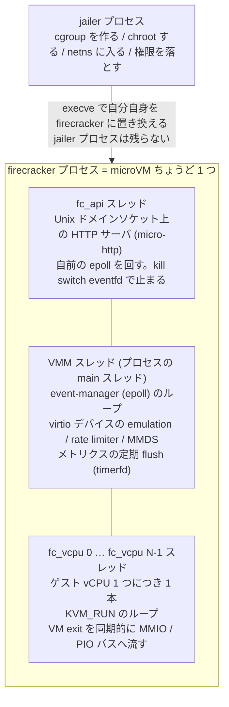
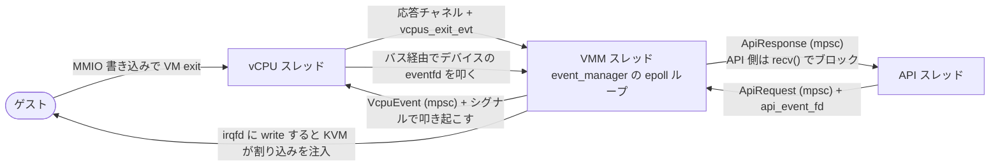

## 何を学んだか

### 1 プロセス = 1 microVM

`docs/design.md` の書き出しが、この設計の全部を言い切っている。

> Each Firecracker process encapsulates one and only one microVM. The process runs the following threads: API, VMM and vCPU(s).

`firecracker` プロセスを 1 つ起動すると、その中に microVM がちょうど 1 つできる。複数の microVM を 1 プロセスに詰めることはできない。プロセスの外に出ていくのは API 用の Unix ドメインソケット、ログ・メトリクスの出力先、TAP デバイスやバッキングファイルの fd だけである。

この帰結として、**OS のプロセス境界がそのまま microVM 同士の隔離境界になる**。あるゲストが VMM を乗っ取ったとしても、そのプロセスが持っている fd と seccomp が許すシステムコールの範囲までしか届かない。隣の microVM は別プロセスなので、そもそもアドレス空間が違う。

### プロセス内の 3 種類のスレッド



スレッドの名前はコード中でそのまま付けられている。API スレッドは `fc_api`、vCPU スレッドは `fc_vcpu {index}` である。この名前は seccomp フィルタのキー（`api` / `vmm` / `vcpu`）とも対応していて、[スレッドごとに違うフィルタ](../per-thread-seccomp/)を当てる単位になっている。

### スレッド間の通信手段

| 経路              | 手段                                                                                                         |
| ----------------- | ------------------------------------------------------------------------------------------------------------ |
| API → VMM         | `mpsc::channel`（`ApiRequest`）＋ `api_event_fd`（`EventFd`）。eventfd が epoll に登録されている             |
| VMM → API         | `mpsc::channel`（`ApiResponse`）。API スレッドは `recv()` でブロックする                                     |
| VMM → vCPU        | `VcpuHandle` 経由の `mpsc::channel`（`VcpuEvent`）＋ シグナルによる[叩き起こし](../vcpu-kick/)               |
| vCPU → VMM        | `VcpuHandle` の応答チャネル ＋ `vcpus_exit_evt`（`EventFd`）。これも epoll に登録されている                  |
| ゲスト → デバイス | MMIO 書き込みで VM exit → vCPU スレッドがバス経由でデバイスの eventfd を叩く → VMM スレッドが epoll で起きる |
| デバイス → ゲスト | irqfd（KVM に登録した eventfd）。VMM スレッドが書くと KVM が割り込みを注入する                               |

「共有メモリ＋ロック」ではなく「チャネル＋eventfd」で揃えているのは、**VMM スレッドの epoll ループに全部の待ちを集約する**ためである。VMM スレッドは `event_manager.run()` を回すだけで、API 要求もデバイス I/O も vCPU の終了も同じループで拾える。



### 外側の jailer

`jailer` は Firecracker とは別のバイナリで、Firecracker の**親ではなく前身**である。cgroup の作成、chroot、netns への参加、uid/gid の切り替えといった特権が要る準備を済ませたあと、`execve` で自分自身を `firecracker` に置き換える。だから実行中のプロセスツリーに jailer は残らない。詳細は[jailer のページ](../jailer/)で扱う。

### API の形

制御は Unix ドメインソケット上の HTTP で行う。既定のパスは `/run/firecracker.socket`（FHS の「runtime file は /run」に従っている）。OpenAPI 仕様が `src/firecracker/swagger/firecracker.yaml` に置かれていて、`/boot-source`、`/drives/{drive_id}`、`/network-interfaces/{iface_id}`、`/machine-config`、`/snapshot/create`、`/snapshot/load`、`/mmds`、`/actions` など 26 個のパスがある。

API を全く使わない起動方法もある。`--no-api` を付けると HTTP サーバも API スレッドも立たず、`--config-file` で渡した JSON だけで microVM が組み上がって即座に起動する。`--no-api` は `--config-file` を `requires` しているので、片方だけでは起動しない。

### ゲストに見えるデバイス

| 種類             | デバイス                                                                                                                      |
| ---------------- | ----------------------------------------------------------------------------------------------------------------------------- |
| virtio           | net、block（virtio-blk と [vhost-user-blk](../vhost-user/)）、vsock、balloon、rng（entropy）、pmem、mem（メモリホットプラグ） |
| legacy（x86_64） | シリアル（`vm-superio` の UART、port 0x3f8、IRQ 4）、i8042（port 0x60、IRQ 1）                                                |
| ACPI             | VMGenID、vmclock                                                                                                              |
| 疑似デバイス     | boot timer（`--boot-timer` を付けたときだけ）                                                                                 |
| KVM の in-kernel | PIC、IOAPIC、PIT                                                                                                              |

virtio のトランスポートは既定が MMIO で、PCIe は `--enable-pci` で opt-in する。この選択の理由は[MMIO と PCI のページ](../mmio-vs-pci/)で扱う。

この表に**入っていないもの**が Firecracker の性格を決めている。VGA も USB も SCSI も ACPI の電源管理も、フロッピーもない。i8042 に至ってはキーボードコントローラとして動くわけですらなく、リブート要求を検出するためだけに存在する。その理由は[「作らない」を憲章に書く](../minimalism-charter/)で扱う。

## ソースコードのどこか

### スレッド構成の一次資料

[`docs/design.md#L69-L79`](https://github.com/firecracker-microvm/firecracker/blob/cc535f035f3828b2c5bfc85276c5d394022ed220/docs/design.md#L69-L79) が、スレッドの責務を明示している。

> The API thread is responsible for Firecracker's API server and associated control plane. It's never in the fast path of the virtual machine. The VMM thread exposes the machine model, minimal legacy device model, microVM metadata service (MMDS) and VirtIO device emulated Net, Block and Vsock devices, complete with I/O rate limiting. In addition to them, there are one or more vCPU threads (one per guest CPU core). They are created via KVM and run the `KVM_RUN` main loop.

「API スレッドは決して VM の fast path に乗らない」という一文が重要である。API スレッドは HTTP を受け取ってチャネルに投げるだけで、デバイスエミュレーションにもゲストのメモリにも触らない。

### API スレッドの生成と接続

[`src/firecracker/src/api_server_adapter.rs#L165-L214`](https://github.com/firecracker-microvm/firecracker/blob/cc535f035f3828b2c5bfc85276c5d394022ed220/src/firecracker/src/api_server_adapter.rs#L165-L214) が、チャネルと eventfd を作ってスレッドを起こしている箇所である。

```rust title="src/firecracker/src/api_server_adapter.rs"
// FD to notify of API events. This is a blocking eventfd by design.
// It is used in the config/pre-boot loop which is a simple blocking loop
// which only consumes API events.
let api_event_fd = EventFd::new(libc::EFD_SEMAPHORE).expect("Cannot create API Eventfd.");
// FD used to signal API thread to stop/shutdown.
let api_kill_switch = EventFd::new(libc::EFD_NONBLOCK).expect("Cannot create API kill switch.");

// Channels for both directions between Vmm and Api threads.
let (to_vmm, from_api) = channel();
let (to_api, from_vmm) = channel();
```

eventfd が 2 本あることに注意したい。`api_event_fd` は「要求が来た」を伝えるためのもので、`EFD_SEMAPHORE` 付きなので複数の要求が溜まっても取りこぼさない。`api_kill_switch` は逆向きで、VMM 側が終了するときに HTTP サーバの `accept` を叩き起こすために使う。同じファイルの末尾で `api_kill_switch.write(1)` してから `join()` している。

`api_event_fd` は VMM スレッド側では epoll のイベント源になる。`ApiServerAdapter` が `MutEventSubscriber` を実装し、`init` でこの fd を epoll に登録している（[`src/firecracker/src/api_server_adapter.rs#L121-L150`](https://github.com/firecracker-microvm/firecracker/blob/cc535f035f3828b2c5bfc85276c5d394022ed220/src/firecracker/src/api_server_adapter.rs#L121-L150)）。

### VMM 本体

[`src/vmm/src/lib.rs#L297-L311`](https://github.com/firecracker-microvm/firecracker/blob/cc535f035f3828b2c5bfc85276c5d394022ed220/src/vmm/src/lib.rs#L297-L311) の `Vmm` は驚くほど小さい。

```rust title="src/vmm/src/lib.rs"
pub struct Vmm {
    /// The [`InstanceInfo`] state of this [`Vmm`].
    pub instance_info: InstanceInfo,
    /// Machine config
    pub machine_config: MachineConfig,
    boot_source_config: BootSourceConfig,
    shutdown_exit_code: Option<FcExitCode>,

    /// VM object.
    pub vm: Vm,
    // Device manager
    device_manager: DeviceManager,
}
```

vCPU のハンドルはここには無い。`Vm::Kvm(Arc<KvmVm>)` の中の `VmCommon` に `vcpus_handles: Mutex<Vec<VcpuHandle>>` として置かれている（[`src/vmm/src/vstate/vm.rs#L65-L86`](https://github.com/firecracker-microvm/firecracker/blob/cc535f035f3828b2c5bfc85276c5d394022ed220/src/vmm/src/vstate/vm.rs#L65-L86)）。ゲストメモリ、MMIO バス、リソースアロケータ、割り込みルーティングも同じ `VmCommon` に集まっている。

`Vmm` 自身も epoll の購読者である。[`src/vmm/src/lib.rs#L789-L838`](https://github.com/firecracker-microvm/firecracker/blob/cc535f035f3828b2c5bfc85276c5d394022ed220/src/vmm/src/lib.rs#L789-L838) を見ると、`Vmm` が epoll に登録しているイベント源は **1 つだけ**である。

```rust title="src/vmm/src/lib.rs"
impl MutEventSubscriber for Vmm {
    /// Handle a read event (EPOLLIN).
    fn process(&mut self, event: Events, _: &mut EventOps) {
        match &self.vm {
            Vm::Kvm(kvm_vm) => {
                if source == kvm_vm.vcpus_exit_evt().as_raw_fd() && event_set == EventSet::IN {
                    // Exit event handling should never do anything more than call 'self.stop()'.
```

`vcpus_exit_evt` は「どれかの vCPU が終了した」を伝える eventfd で、各 vCPU スレッドはこの fd の複製を持っている。VMM スレッドはこれで起きたら、全 vCPU の応答チャネルを浚って終了コードを集め、エラー終了があればそれを優先して `stop()` を呼ぶ。「exit イベントの処理は `self.stop()` を呼ぶ以外のことをしてはならない」というコメントが付いている。

### 2 つの起動経路

`main` の分岐は `--no-api` の有無だけである（[`src/firecracker/src/main.rs#L421-L473`](https://github.com/firecracker-microvm/firecracker/blob/cc535f035f3828b2c5bfc85276c5d394022ed220/src/firecracker/src/main.rs#L421-L473)）。`--no-api` の側では、API スレッド用の seccomp フィルタが不要になるので明示的に落としている。

```rust title="src/firecracker/src/main.rs"
} else {
    let seccomp_filters: BpfThreadMap = seccomp_filters
        .into_iter()
        .filter(|(k, _)| k != "api")
        .collect();
```

どちらの経路も、最後は同じ形のループに落ち着く（[`src/firecracker/src/main.rs#L670-L681`](https://github.com/firecracker-microvm/firecracker/blob/cc535f035f3828b2c5bfc85276c5d394022ed220/src/firecracker/src/main.rs#L670-L681)）。

```rust title="src/firecracker/src/main.rs"
// Run the EventManager that drives everything in the microVM.
loop {
    event_manager
        .run()
        .expect("Failed to start the event manager");

    match vmm.lock().unwrap().shutdown_exit_code() {
        Some(FcExitCode::Ok) => break,
        Some(exit_code) => return Err(RunWithoutApiError::Shutdown(exit_code)),
        None => continue,
    }
}
```

「epoll を 1 回回す → 終了コードが立っていないか見る → 立っていなければまた回す」。microVM の生存期間全体がこの 10 行に収まっている。

## なぜそうなっているか

### 脅威封じ込めがスレッド分割を決めている

`docs/design.md` の Threat Containment 節（[`docs/design.md#L81-L94`](https://github.com/firecracker-microvm/firecracker/blob/cc535f035f3828b2c5bfc85276c5d394022ed220/docs/design.md#L81-L94)）が、なぜこの分け方なのかを説明している。

> From a security perspective, all vCPU threads are considered to be running malicious code as soon as they have been started; these malicious threads need to be contained. Containment is achieved by nesting several trust zones which increment from least trusted or least safe (guest vCPU threads) to most trusted or safest (host).

vCPU スレッドは**起動した瞬間から悪意あるコードを走らせているものとして扱う**。だから vCPU スレッドと VMM スレッドを分けることには意味がある。信頼度の違う 2 つの実行文脈が、別々の seccomp フィルタを持ち、別々のタイミングでそれを適用できる。

同じ節に、境界がどこに引かれるかの具体例がある。

> For example, all outbound network traffic data is copied by the Firecracker I/O thread from the emulated network interface to the backing host TAP device, and I/O rate limiting is applied at this point.

ゲストからのパケットは vCPU スレッドではなく VMM スレッドが TAP にコピーし、レートリミットもそこで掛かる。信頼境界を跨ぐデータの通り道が 1 本に絞られている。

そのすぐ後に、明示的な非目標が書かれている。

> Firecracker does not perform any network traffic filtering. All egress traffic from a guest is therefore considered untrusted, and should be filtered at the host-level.

Firecracker はパケットフィルタを一切実装しない。ホスト側の責務だと宣言している。これは[憲章の Minimalist in Features](../minimalism-charter/) の直接の現れである。

### なぜ API を別スレッドにするのか

API を VMM スレッドの epoll に直接混ぜることもできたはずである。しかし `docs/design.md` は「API スレッドは決して fast path に乗らない」と書いている。HTTP のパース、JSON のデシリアライズ、ソケットの accept といった処理は、デバイスエミュレーションの応答時間に混ざってほしくない。

さらに実務的な理由として、API スレッドと VMM スレッドで**必要なシステムコールの集合が違う**。API スレッドは `accept4` や `recvfrom` が要るが、VMM スレッドには不要である。スレッドを分けているから、それぞれに最小のフィルタを当てられる。

### なぜ API を Unix ドメインソケットに置くのか

TCP ではなくファイルシステム上のソケットにすることで、アクセス制御をファイルのパーミッションと chroot に委ねられる。jailer が chroot の中にソケットを作るので、chroot 外のプロセスは（root でない限り）そもそもパスに到達できない。認証機構を Firecracker 自身が持たなくて済む。

### なぜ `--no-api` があるのか

`--no-api` を使うと、API スレッドも HTTP サーバも立たない。設定が完全に事前に決まっている用途（同じ構成の microVM を大量に起動する、など）では、ソケットの作成・接続・HTTP の往復が全部省ける。`--no-api` が `--config-file` を必須にしているのは、API がない以上、設定を渡す手段が JSON しかないからである。

## この章の残りをどう読むか

この地図の各部分は、以降の群で個別に掘り下げる。

- [KVM をどう叩くか](../create-vm-eintr/)：`KvmVm` の生成、irqchip と vCPU の順序、vCPU スレッドのライフサイクル
- [CPU をゲストにどう見せるか](../cpu-templates/)：CPUID / MSR のフィルタリングと CPU テンプレート
- [起動を速くする](../pvh-boot/)：PVH ブート、デバイス発見、MMIO と PCI
- [virtio を実装する](../device-state-typing/)：virtqueue の実装、記述子の検証、割り込み抑制、レートリミッタ
- [メモリを伸縮させる](../balloon-zeroing/)：balloon、virtio-mem、hugepages
- [スナップショット](../snapshot-format/)：保存と復元の全体
- [隔離とセキュリティ](../threat-model/)：脅威モデル、jailer、seccomp
- [API と可観測性](../api-state-machine/)：API の状態機械、メトリクス、ロガー、シグナル

## どう活かすか

**「1 プロセス = 1 テナント」を最初から決めておく**のが、この設計の一番移植しやすい部分である。マルチテナントのワークロードを扱うとき、テナントをスレッドやコルーチンで分けると、隔離の責任が全部自分のコードに乗る。プロセスで分ければ、隔離の大部分をカーネルに任せられる。代償はプロセスあたりの固定オーバーヘッド（Firecracker の場合は VMM スレッドで 5 MiB 以下という[明示的な契約](../specification-as-contract/)がある）だが、これが許容できる規模なら検討する価値がある。

**信頼度が違うコードは別スレッドに置き、境界を跨ぐ通信手段を 1 種類に絞る**のも取り込みやすい。Firecracker は「チャネル＋eventfd」に統一していて、共有可変状態を跨がせていない。これによって、境界で何が起きうるかの列挙が有限になる。逆に、スレッド間で `Arc<Mutex<T>>` を気軽に共有し始めると、境界の定義が曖昧になって seccomp のような外部の防御が当てにくくなる。

**制御プレーンをデータプレーンの fast path から外す**という分離は、規模に関係なく効く。ただし、制御要求とデータ処理が同じ状態を触る以上、どこかで排他が要る。Firecracker は「API 要求を epoll ループの合間にだけ処理する」ことで、ロックの範囲を最小にしている。API 要求を非同期に処理する必要がある設計（長時間かかる制御操作がある場合など）では、この形はそのまま使えない。

一方で、**取り込むべきでない条件**もはっきりしている。1 プロセス 1 インスタンスは、インスタンス間で大きなリソース（ページキャッシュ、コネクションプール、JIT したコード）を共有したい場合には向かない。Firecracker はゲストメモリを共有しないことを前提に、静的リンクしたバイナリを毎回コピーして起動する。共有によるメモリ削減を狙う設計とは真逆である。
