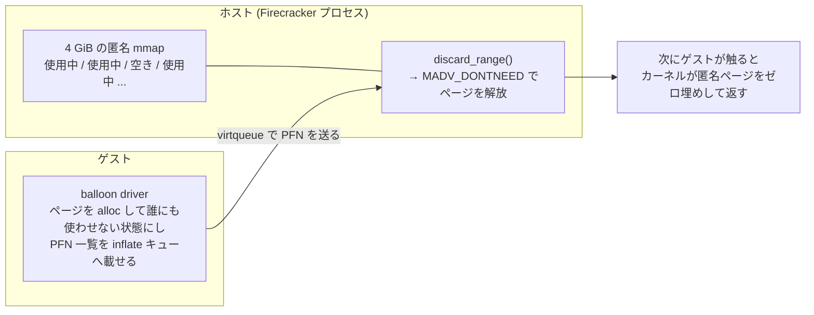
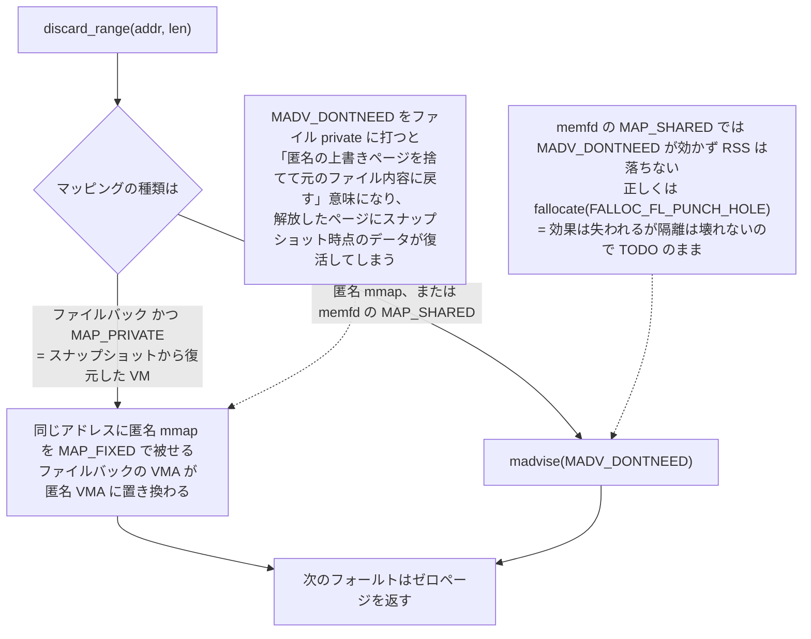

## 何を学んだか

### balloon は「ゲストにメモリを掴ませて、ホストがそれを捨てる」装置

[ゲストメモリのページ](../guest-memory/) で見たとおり、ゲスト物理メモリの実体はホストプロセスの匿名 mmap である。mmap した瞬間に物理メモリが消費されるわけではなく、ゲストが実際に触ったページだけがフォールトで割り当てられるので、**RSS はゲストが触ったページの累積** になる。問題は、ゲストが一度触ったページを解放しても RSS は下がらないことだ。ゲスト OS の中では「free なページ」でも、ホストのページテーブルからは区別が付かない。

virtio-balloon はこの情報ギャップを埋める。ホストがターゲットサイズを指定すると、ゲストの balloon ドライバがそのぶんのページを **ゲスト内で確保** し（誰にも使わせない状態にする）、確保したページのページフレーム番号 (PFN) を inflate キューに載せてホストへ送る。ホストは「このゲスト物理アドレスはもう誰も使っていない」と知り、対応するホストメモリを解放する。逆に deflate はゲストにページを返す操作で、ホスト側は何もしない（ゲストが次にアクセスしたときにフォールトで再割り当てされる）。



### 実装の要点は 3 つ

1. **PFN の列は連続範囲に圧縮してから解放する。** ゲストから届くのは 4 KiB 粒度の PFN が最大 2048 個。`compact_page_frame_numbers` がソートして隣接する PFN をまとめ、`(開始 PFN, 長さ)` の列に畳んでから `discard_range` を呼ぶ。
2. **解放の方法はマッピングの種類で分岐する。** 匿名 mmap なら `madvise(MADV_DONTNEED)` で足りるが、スナップショットファイルを `MAP_PRIVATE` で mmap して復元した場合は、`MADV_DONTNEED` が「匿名の上書きページを捨てて元のファイル内容に戻す」意味になってしまう。そこで匿名 mmap を `MAP_FIXED` で被せて穴を空ける。
3. **どちらの経路でも、次のアクセスでは必ずゼロが返る。** これが balloon の隔離上の要件そのものである。

### 「ゼロが返る」が保証でなければならない理由

`docs/ballooning.md` は、ドライバが壊れていても balloon が満たす性質としてこう書いている。

> On subsequent accesses on previously `madvise`d memory addresses, the memory is zeroed. Furthermore, the guest memory is `mmap`ped with the `MAP_PRIVATE` and `MAP_ANONYMOUS` flags, which ensure that even if a Firecracker yields some information through an inflate and that same physical page containing the information is mapped onto another Firecracker process, reads on that address space will see zeroes.
> — [`docs/ballooning.md#L95-L109`](https://github.com/firecracker-microvm/firecracker/blob/cc535f035f3828b2c5bfc85276c5d394022ed220/docs/ballooning.md#L95-L109)

balloon の inflate は、ホスト物理ページをカーネルのフリーリストに返す操作である。そのページはやがて **別の Firecracker プロセスのゲストメモリ** として再割り当てされうる。もし「解放したページの中身が次のアクセスで見える」実装だったら、VM A が捨てたページを VM B が読んでしまう。Firecracker は明示的にゼロクリアするコードを持たず、匿名ページのフォールト時にカーネルがゼロ埋めすることに依存している。だからこそ「どの解放方法を使うか」が隔離の境界になる。

### free page reporting と free page hinting

balloon にはターゲットサイズを指定する伝統的な inflate/deflate 以外に、2 つのオプション機能がある。どちらも最終的に呼ぶのは同じ `discard_range` だが、**誰が起動するか** が違う。

|                  | free page reporting                            | free page hinting                  |
| ---------------- | ---------------------------------------------- | ---------------------------------- |
| 起動する側       | ゲスト（buddy allocator のフックから継続的に） | ホスト（`/balloon/hinting/start`） |
| 停止             | できない（起動後は常時動作）                   | ホストが `cmd_id` を更新して制御   |
| 単位             | ページオーダーで決まる範囲                     | ドライバが見つけた範囲             |
| 状態             | 通常機能                                       | Developer Preview                  |
| 必要なゲスト設定 | `CONFIG_PAGE_REPORTING`                        | —                                  |

hinting が Developer Preview に留まっているのは、仕様上のレースが残っているためだ。hinting はもともとライブマイグレーション向けに設計されていて、ゲストは範囲をホストに報告したあと、ホストが解放し終わるのを待たずにその範囲を再利用してよい。つまり **ホストが「解放してよい」と思っている範囲を、ゲストがすでに使い始めている** 可能性がある。この状態で `MADV_DONTNEED` を打つと、ゲストが書いたばかりのデータが消える。

`docs/ballooning.md` はこのレースの回避策として、hinting 実行前にゲストメモリを UFFD の `WRITEPROTECT` にし、書き込まれた範囲を記録して、Firecracker が報告してくる範囲のうち書き込み済みのものをスキップする手順を挙げている。**UFFD ハンドラ側で「ゲストが再利用したかどうか」を独立に観測する** わけで、逆に言えば UFFD なしでは潰せない。

## ソースコードのどこか

### PFN を範囲に畳む

inflate キューの処理は、まずディスクリプタから PFN を `pfn_buffer` に読み出し、バッファが埋まるか（`MAX_PAGE_COMPACT_BUFFER = 2048`）キューが空になったところで圧縮に回る。

```rust title="src/vmm/src/devices/virtio/balloon/device.rs"
            // Compact pages into ranges.
            let page_ranges = compact_page_frame_numbers(&mut self.pfn_buffer[..pfn_buffer_idx]);
            pfn_buffer_idx = 0;

            // Remove the page ranges.
            for (page_frame_number, range_len) in page_ranges {
                let guest_addr =
                    GuestAddress(u64::from(page_frame_number) << VIRTIO_BALLOON_PFN_SHIFT);

                if let Err(err) = mem.discard_range(
                    guest_addr,
                    usize::try_from(range_len).unwrap() << VIRTIO_BALLOON_PFN_SHIFT,
                ) {
                    error!("Error removing memory range: {:?}", err);
                }
            }
```

解放に失敗しても `error!` を出して先へ進む。ゲストへの応答（`add_used`）はすでに済んでいて、失敗を伝える手段がないためだ。

[`src/vmm/src/devices/virtio/balloon/device.rs#L443-L458`](https://github.com/firecracker-microvm/firecracker/blob/cc535f035f3828b2c5bfc85276c5d394022ed220/src/vmm/src/devices/virtio/balloon/device.rs#L443-L458)

`VIRTIO_BALLOON_PFN_SHIFT` は 12 で固定されている（[`mod.rs#L36-L37`](https://github.com/firecracker-microvm/firecracker/blob/cc535f035f3828b2c5bfc85276c5d394022ed220/src/vmm/src/devices/virtio/balloon/mod.rs#L36-L37)）。virtio の balloon 仕様が PFN を 4 KiB 単位と定めているので、ホスト側のページサイズが何であっても解放要求は 4 KiB 粒度で届く。

圧縮側（[`src/vmm/src/devices/virtio/balloon/util.rs#L10-L62`](https://github.com/firecracker-microvm/firecracker/blob/cc535f035f3828b2c5bfc85276c5d394022ed220/src/vmm/src/devices/virtio/balloon/util.rs#L10-L62)）は `sort_unstable()` してから走査し、隣接する PFN を `(開始, 長さ)` に畳むだけである。重複した PFN は `error!` を出してスキップする。コメントは、重複を落とすことが「`v[previous] + length` がオーバーフローしない」証明の前提になっていると説明している。ゲストが同じ PFN を何度も送ってくるのは仕様違反だが、それでホスト側の算術がおかしくなってはいけない、という組み立てである。

### discard_range の 2 経路

```rust title="src/vmm/src/vstate/memory.rs"
        match (self.inner.file_offset(), self.inner.flags()) {
            // If and only if we are resuming from a snapshot file, we have a file and it's mapped
            // private
            (Some(_), flags) if flags & libc::MAP_PRIVATE != 0 => {
                // Mmap a new anonymous region over the present one in order to create a hole
                // with zero pages.
                // ... In this case, MADV_DONTNEED on the
                // file only drops any anonymous pages in range, but subsequent accesses would read
                // whatever page is stored on the backing file. Mmapping anonymous pages ensures
                // it's zeroed.
```

[`src/vmm/src/vstate/memory.rs#L719-L775`](https://github.com/firecracker-microvm/firecracker/blob/cc535f035f3828b2c5bfc85276c5d394022ed220/src/vmm/src/vstate/memory.rs#L719-L775)

このアームでは `mmap(MAP_FIXED | MAP_ANONYMOUS | MAP_PRIVATE)` を同じアドレスに被せる。ファイルバックの VMA が匿名 VMA に置き換わり、次のフォールトはゼロページを返す。

もう一方のアーム（匿名マッピング、あるいは memfd の `MAP_SHARED`）は `madvise(MADV_DONTNEED)` を呼ぶだけだが、ここには正直な TODO が付いている。

```rust title="src/vmm/src/vstate/memory.rs"
            // Match either the case of an anonymous mapping, or the case
            // of a shared file mapping.
            // TODO: madvise(MADV_DONTNEED) doesn't actually work with memfd
            // (or in general MAP_SHARED of a fd). In those cases we should use
            // fallocate64(FALLOC_FL_PUNCH_HOLE|FALLOC_FL_KEEP_SIZE).
            // We keep falling to the madvise branch to keep the previous behaviour.
```

つまり **vhost-user を使うときのように memfd バックのゲストメモリでは、balloon の inflate は RSS を落とせていない**。`MAP_SHARED` の fd マッピングに対する `MADV_DONTNEED` はそのプロセスのマッピングを落とすだけで、memfd 側のページは残るからだ。正しくは `fallocate(FALLOC_FL_PUNCH_HOLE)` が要る。ただしこの経路でも **隔離は壊れない**。ページが解放されないだけで他プロセスに漏れるわけではないので、安全性ではなく効果が失われるだけであり、既存挙動を維持したまま TODO にしてある、と読める。



### reporting / hinting は同じ出口に合流する

free page reporting のキュー処理（[`device.rs#L618-L653`](https://github.com/firecracker-microvm/firecracker/blob/cc535f035f3828b2c5bfc85276c5d394022ed220/src/vmm/src/devices/virtio/balloon/device.rs#L618-L653)）は、ディスクリプタチェーンをたどって各要素をそのまま `discard_range` に渡す。inflate と違って PFN の列ではなく、ディスクリプタのアドレスと長さがそのまま解放対象の範囲である。

hinting 側（[`#L538-L616`](https://github.com/firecracker-microvm/firecracker/blob/cc535f035f3828b2c5bfc85276c5d394022ed220/src/vmm/src/devices/virtio/balloon/device.rs#L538-L616)）は、同じキュー処理に `cmd_id` の照合が挟まる。長さ 4 のディスクリプタは範囲ではなくコマンド ID の更新として扱い、以降の範囲がそのコマンドに属するかを `chain_cmd != host_cmd` で判定する。ホストが停止コマンドを出したあとに遅れて届いた範囲を捨てるためのガードだが、前述のとおりゲスト側の再利用との競合はこれでは防げない。

### balloon と UFFD

[UFFD による復元](../uffd-handler/) と balloon を組み合わせる場合、Firecracker は UFFD を作るときに `EVENT_REMOVE` を無条件で要求する（[`src/vmm/src/persist.rs#L566-L570`](https://github.com/firecracker-microvm/firecracker/blob/cc535f035f3828b2c5bfc85276c5d394022ed220/src/vmm/src/persist.rs#L566-L570)）。コメントは「カーネルがこのフラグを見るのは madvise からのフックだけで、UFFD の挙動を能動的に変えるものではない」ため条件分岐を省いた、と説明している。`MADV_DONTNEED` を UFFD 登録済みの範囲に打つとカーネルが `UFFD_EVENT_REMOVE` をハンドラに通知するので、ハンドラは balloon が捨てた範囲を覚えて次の要求にはゼロページを返す必要がある。これを取りこぼすと、解放したページにスナップショットファイルの中身を再供給してしまう。

## なぜそうなっているか

**PFN を圧縮するのは、システムコール回数を落とすため。** `MAX_PAGES_IN_DESC = 256`、`MAX_PAGE_COMPACT_BUFFER = 2048` が示すとおり、1 回の inflate 処理で最大 2048 ページ = 8 MiB ぶんの PFN が届く。ゲストの balloon ドライバは buddy allocator から取ったページを送るので PFN はかなりの割合で連続しており、圧縮しなければ 2048 回の `madvise`、圧縮すれば理想的には 1 回で済む。

**分岐の理由はコメントが直接書いている。** 「MADV_DONTNEED on the file only drops any anonymous pages in range, but subsequent accesses would read whatever page is stored on the backing file」。ファイルから復元した VM で balloon を膨らませたとき、解放したページを読むとスナップショット時点のデータが復活する。これは同一 VM 内なので機密性の問題ではないが、ゲスト OS から見ると「free にしたページに古いデータが載って戻ってくる」という整合性の破壊になる。

**「ゼロが返る」がドライバの正しさに依存しないことが重要。** `docs/ballooning.md` の Security disclaimer は、ドライバが壊れれば「ターゲットサイズを守る」「統計が正しい」といった性質は保証されなくなる、と明言している。壊れたドライバは嘘の PFN を送れる。だが Firecracker 側は PFN がゲストメモリの範囲内かを検証したうえで解放するだけなので、**最悪でもそのゲスト自身のメモリが消えるだけ** で、他 VM のデータには届かない。統計（`/balloon/statistics`）も同じ立て付けで、ドキュメントは「guarantee ではなく indication として見よ」と書いている。ホスト側の制御に使う値と、隔離の保証に使う性質を分けている。

## どう活かすか

**メモリを返す API を作るなら、「返したあと読んだら何が見えるか」を先に決める。** `discard_range` の分岐は、バッキングが変わっただけで解放の意味論が変わる例である。同じ「捨てる」でも、匿名メモリなら次はゼロ、ファイル private なら次は元のファイル内容、`MAP_SHARED` なら他プロセスにも影響、と全部違う。キャッシュの無効化やテナント間で共有するバッファプールのように、下のレイヤの実体が複数ありうる場面では、「解放」をインターフェース名だけで済ませず、読み出し後の観測結果を仕様として書き下す価値がある。

**バッチの上限を定数で切り、そこからバッファサイズを逆算する設計は真似しやすい。** `MAX_PAGE_COMPACT_BUFFER` が固定なので `pfn_buffer` は事前確保でき、データパスに動的アロケーションが入らない。信頼できない入力元が無制限にワークを積めない、という点でも効いている。

**hinting のレースの構図は、非同期な所有権移譲すべてに当てはまる。** 「相手が『これはもう使わない』と通知したあと、こちらが処理を終える前に相手が使い始めてよい」という仕様は、単体では安全に実装できない。Firecracker が取った態度は 2 つで、(1) Developer Preview に留めて本番利用の推奨を外す、(2) 上位レイヤ（UFFD ハンドラ）で write-protect による独立した観測を入れる回避策を文書化する。プロトコル側にレースが埋まっていて自分では直せないとき、機能を隠すのではなく **前提と回避策を明示して段階を落とす** のは扱いやすいやり方だ。

**取り込むべきでない条件もはっきりしている。** balloon が効くのは「同じホストに多数の VM を詰め込み、ピークではなく平均の使用量に合わせて売りたい」オーバーサブスクリプション前提のときだけだ。インフレーション速度をホストが制御できないこと、ターゲットに到達しようとして CPU を食い続けること、memfd バックでは RSS が落ちないことを踏まえると、単一 VM を専有ホストで動かす構成では入れる理由がない。また [hugepages のページ](../hugepages/) で扱うとおり、PFN が 4 KiB 固定である以上、2 MiB ページでバックされたゲストメモリから balloon が RSS を回収することはできない。ホスト側でスロットごとメモリを外したいなら [virtio-mem](../virtio-mem/) を見るべきである。
