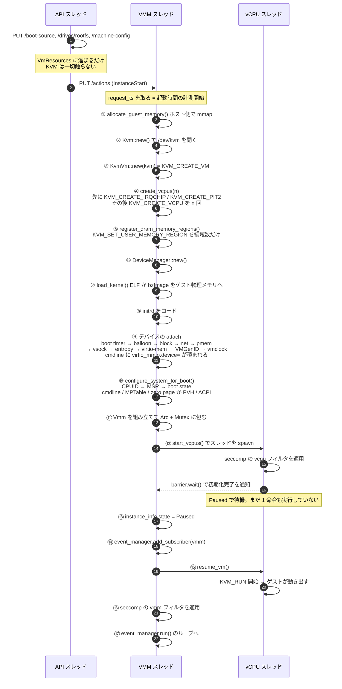
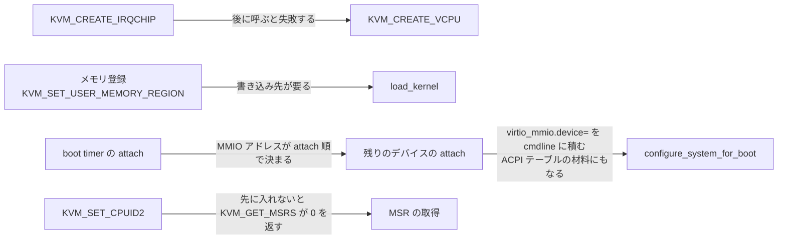

## 何を学んだか

### 起動は 1 本の関数に収まっている

microVM が起動するまでの処理は、`src/vmm/src/builder.rs` の `build_microvm_for_boot`（143〜364 行）にほぼ全部入っている。入力は API 経由で溜まった `VmResources`、出力は `Arc<Mutex<Vmm>>` である。

この関数から返った時点で、vCPU スレッドは全て起きているが、まだ 1 命令も実行していない。**Paused 状態で待機している**。ゲストが走り出すのは呼び出し元が `resume_vm()` を呼んだときである。

### 全体の流れ



### 順序に理由がある箇所

- **irqchip は vCPU 作成より前**。x86_64 では `KVM_CREATE_IRQCHIP` を `KVM_CREATE_VCPU` の後に呼ぶと失敗する。だから `create_vcpus` の内部で、vCPU を作る前に `arch_pre_create_vcpus()` が呼ばれる（[irqchip と vCPU の順序](../irqchip-ordering/)）
- **メモリ登録はカーネルロードより前**。`load_kernel` はゲスト物理メモリにバイト列を書く。しかも `GuestMemoryMmap` は `register_dram_memory_regions` で `KvmVm` の中に move されるので、以降は `kvm_vm.guest_memory()` から借りる形になる
- **デバイスの attach は `configure_system_for_boot` より前**。MMIO トランスポートの virtio デバイスは `virtio_mmio.device=<size>@<baseaddr>:<irq>` という文字列でゲストに教える必要があり、これは attach 時に `boot_cmdline` へ積まれる。加えて `create_acpi_tables` が `device_manager` を受け取ってデバイス情報を ACPI テーブルに書き出す
- **boot timer は最初にアタッチする**。MMIO アドレスがアタッチ順で決まるので、ドキュメントとテストが参照するアドレスを固定するにはこの位置しかない
- **CPUID の設定は MSR の取得より前**。KVM は CPUID から「このゲストがどの MSR をサポートするか」を判断するので、CPUID を入れる前に `KVM_GET_MSRS` すると値が 0 で返る（[CPUID を先に、MSR を後に](../cpuid-before-msr/)）

依存関係だけを取り出すとこうなる。矢印の向きが「先に済ませておかないといけない」を表す。



### vCPU は Paused で起動する

`build_microvm_for_boot` の doc コメントが明記している。

> The built microVM and all the created vCPUs start off in the paused state. To boot the microVM and run those vCPUs, `Vmm::resume_vm()` needs to be called.

この 2 段構えのおかげで、**スナップショットからの復元が同じ道を通れる**。`build_microvm_from_snapshot` も vCPU を Paused で起こし、状態を流し込んでから resume する。`start_vcpus` が即座に走り出す実装だったら、復元経路のために別の起動関数が要る。

### seccomp が入るタイミングは 3 箇所バラバラ

| スレッド | フィルタ | 適用場所                                                        |
| -------- | -------- | --------------------------------------------------------------- |
| vCPU     | `vcpu`   | `Vcpu::run` の先頭。`KVM_RUN` に入る前                          |
| API      | `api`    | `ApiServer::run` の先頭。HTTP サーバを起動する前                |
| VMM      | `vmm`    | `build_microvm_for_boot` から返った直後。イベントループに入る前 |

vCPU と API はスレッドの入口で自分自身に適用する。VMM だけが違って、**microVM の組み立てが終わってから**適用される。組み立て中には `open`、`mmap`、`ioctl(KVM_CREATE_VM)` など、定常運転では要らないシステムコールが大量に要るからである。

## ソースコードのどこか

### 入口

[`src/vmm/src/builder.rs#L149-L168`](https://github.com/firecracker-microvm/firecracker/blob/cc535f035f3828b2c5bfc85276c5d394022ed220/src/vmm/src/builder.rs#L149-L168)。

```rust title="src/vmm/src/builder.rs"
    // Timestamp for measuring microVM boot duration.
    let request_ts = TimestampUs::default();
    ...
    // Clone the command-line so that a failed boot doesn't pollute the original.
    // If the user didn't provide boot_args, use the KVM-specific default.
    #[allow(unused_mut)]
    let mut boot_cmdline = match boot_config.cmdline.clone() {
        Some(cmdline) => cmdline,
        None => build_cmdline(DEFAULT_KERNEL_CMDLINE)?,
    };
```

`request_ts` はここでしか取られない。この値が boot timer デバイスに渡り、[起動時間の計測](../specification-as-contract/)の起点になる。

コマンドラインを clone しているのは、この後デバイスの attach で `boot_cmdline` に文字列が追記されるからである。起動に失敗しても `VmResources` 側の設定は汚れず、設定をやり直して再度起動できる。

既定のコマンドラインは `reboot=k panic=1 nomodule 8250.nr_uarts=0 i8042.noaux i8042.nomux i8042.dumbkbd swiotlb=noforce` で、`i8042.dumbkbd` には「i8042 経由でキーボードの状態を制御しようとするな（起動時間を節約する）」というコメントが付いている（[`src/vmm/src/vmm_config/boot_source.rs#L10-L20`](https://github.com/firecracker-microvm/firecracker/blob/cc535f035f3828b2c5bfc85276c5d394022ed220/src/vmm/src/vmm_config/boot_source.rs#L10-L20)）。ゲスト側の設定まで含めて起動時間を削りにいっている。

### VM と vCPU の生成

[`src/vmm/src/builder.rs#L175-L180`](https://github.com/firecracker-microvm/firecracker/blob/cc535f035f3828b2c5bfc85276c5d394022ed220/src/vmm/src/builder.rs#L175-L180)。

```rust title="src/vmm/src/builder.rs"
    let kvm = Kvm::new(cpu_template.kvm_capabilities.clone())?;
    // Set up KVM VM and register memory regions.
    let mut vm = KvmVm::new(kvm)?;
    let mut vcpus = vm.create_vcpus(vm_resources.machine_config.vcpu_count)?;
    vm.register_dram_memory_regions(guest_memory)?;
```

CPU テンプレートの取得（この直前）が `Kvm::new` より先なのは、テンプレートが「有効化すべき KVM capability のリスト」を持っているからである。

irqchip は `create_vcpus` の中で作られる。x86_64 側のフック実装（[`src/vmm/src/arch/x86_64/vm.rs#L116-L125`](https://github.com/firecracker-microvm/firecracker/blob/cc535f035f3828b2c5bfc85276c5d394022ed220/src/vmm/src/arch/x86_64/vm.rs#L116-L125)）に理由が書いてある。

```rust title="src/vmm/src/arch/x86_64/vm.rs"
    /// Pre-vCPU creation setup.
    pub fn arch_pre_create_vcpus(&mut self, _: u8) -> Result<(), KvmVmError> {
        // For x86_64 we need to create the interrupt controller before calling `KVM_CREATE_VCPUS`
        self.setup_irqchip()
    }

    /// Post-vCPU creation setup.
    pub fn arch_post_create_vcpus(&mut self, _: u8) -> Result<(), KvmVmError> {
        Ok(())
    }
```

x86_64 では pre 側に irqchip があり post 側が空。aarch64 では逆になる（GIC は vCPU の数が決まってからでないと作れない）。この 2 つのフックは、まさにその差を吸収するために存在する。

なお `create_vcpus`（[`src/vmm/src/vstate/vm.rs#L197-L216`](https://github.com/firecracker-microvm/firecracker/blob/cc535f035f3828b2c5bfc85276c5d394022ed220/src/vmm/src/vstate/vm.rs#L197-L216)）では、各 vCPU が `vcpus_exit_evt` の複製を受け取る。これが[アーキテクチャのページ](../architecture/)で見た「vCPU → VMM」の通知経路になる。

### カーネルのロードとデバイスのアタッチ

[`src/vmm/src/builder.rs#L213-L226`](https://github.com/firecracker-microvm/firecracker/blob/cc535f035f3828b2c5bfc85276c5d394022ed220/src/vmm/src/builder.rs#L213-L226)。

```rust title="src/vmm/src/builder.rs"
    let guest_memory = kvm_vm.guest_memory();
    let entry_point = load_kernel(&boot_config.kernel_file, guest_memory)?;
    let initrd = InitrdConfig::from_config(boot_config, guest_memory)?;

    if !vm_resources.pci_enabled {
        boot_cmdline.insert("pci", "off")?;
    }

    // The boot timer device needs to be the first device attached in order
    // to maintain the same MMIO address referenced in the documentation
    // and tests.
    if vm_resources.boot_timer {
        device_manager.attach_boot_timer_device(&kvm_vm, request_ts)?;
    }
```

`load_kernel` は ELF（vmlinux）を先に試し、ELF マジックがなければ bzImage ローダにフォールバックする。ELF の中に PVH のエントリポイントがあればそちらを使う（[`src/vmm/src/arch/x86_64/mod.rs#L496-L531`](https://github.com/firecracker-microvm/firecracker/blob/cc535f035f3828b2c5bfc85276c5d394022ed220/src/vmm/src/arch/x86_64/mod.rs#L496-L531)）。ここで決まる `EntryPoint.protocol` が、後段で「zero page を作るか PVH の start_info を作るか」を分岐させる（[PVH ブート](../pvh-boot/)）。`pci=off` を明示的に足しているのは、ゲストカーネルが PCI バスを探して時間を浪費するのを止めるためである。

### CPU とシステムの設定

[`src/vmm/src/builder.rs#L311-L321`](https://github.com/firecracker-microvm/firecracker/blob/cc535f035f3828b2c5bfc85276c5d394022ed220/src/vmm/src/builder.rs#L311-L321) の `configure_system_for_boot` は引数が 9 個ある。そこに `device_manager` と `boot_cmdline` が入っていることが、「デバイスを先にアタッチしておかなければならない」ことの根拠である。

中身（[`src/vmm/src/arch/x86_64/mod.rs#L237-L303`](https://github.com/firecracker-microvm/firecracker/blob/cc535f035f3828b2c5bfc85276c5d394022ed220/src/vmm/src/arch/x86_64/mod.rs#L237-L303)）は、vCPU の設定 → コマンドラインの書き込み → MPTable → ブートプロトコル別の構造体 → ACPI テーブル、という順である。vCPU 設定の内部（[`src/vmm/src/arch/x86_64/mod.rs#L181-L232`](https://github.com/firecracker-microvm/firecracker/blob/cc535f035f3828b2c5bfc85276c5d394022ed220/src/vmm/src/arch/x86_64/mod.rs#L181-L232)）には、順序の理由が doc コメントで書かれている。

```rust title="src/vmm/src/arch/x86_64/mod.rs"
/// KVM determines support for CPUID-dependent MSRs from guest CPUID. Install
/// guest CPUID before retrieving MSRs for CPU templates; otherwise,
/// `KVM_GET_MSRS` returns zero for an MSR that guest CPUID does not support.
```

### vCPU スレッドの起動

[`src/vmm/src/builder.rs#L341-L351`](https://github.com/firecracker-microvm/firecracker/blob/cc535f035f3828b2c5bfc85276c5d394022ed220/src/vmm/src/builder.rs#L341-L351)。

```rust title="src/vmm/src/builder.rs"
    // Move vcpus to their own threads and start their state machine in the 'Paused' state.
    kvm_vm
        .start_vcpus(
            vcpus,
            seccomp_filters
                .get("vcpu")
                .ok_or_else(|| StartMicrovmError::MissingSeccompFilters("vcpu".to_string()))?
                .clone(),
        )
        .map_err(VmmError::VcpuStart)?;
    vmm.lock().unwrap().instance_info.state = VmState::Paused;
```

`start_vcpus`（[`src/vmm/src/vstate/vm.rs#L238-L276`](https://github.com/firecracker-microvm/firecracker/blob/cc535f035f3828b2c5bfc85276c5d394022ed220/src/vmm/src/vstate/vm.rs#L238-L276)）は、標準入力を raw / non-blocking にしてから vCPU ごとにスレッドを起こし、`Barrier::new(vcpu_count + 1)` で全スレッドの初期化完了を待ってから戻る。待ち人数が +1 なのは、呼び出し元のスレッドも待つからである。

スレッド側は seccomp を適用してシグナルハンドラを登録してからバリアに入る（[`src/vmm/src/vstate/vcpu.rs#L182-L210`](https://github.com/firecracker-microvm/firecracker/blob/cc535f035f3828b2c5bfc85276c5d394022ed220/src/vmm/src/vstate/vcpu.rs#L182-L210)）。フィルタの適用は `Vcpu::run` の先頭で、失敗したら `panic!` する（[`src/vmm/src/vstate/vcpu.rs#L217-L226`](https://github.com/firecracker-microvm/firecracker/blob/cc535f035f3828b2c5bfc85276c5d394022ed220/src/vmm/src/vstate/vcpu.rs#L217-L226)）。

```rust title="src/vmm/src/vstate/vcpu.rs"
        // Load seccomp filters for this vCPU thread.
        // Execution panics if filters cannot be loaded, use --no-seccomp if skipping filters
        // altogether is the desired behaviour.
        if let Err(err) = crate::seccomp::apply_filter(seccomp_filter) {
            panic!(
```

「フィルタを当てられなかったのに、フィルタなしで進む」という選択肢を潰している。外したいなら `--no-seccomp` を明示せよ、という設計である。

### resume と VMM の seccomp

呼び出し元の `build_and_boot_microvm`（[`src/vmm/src/builder.rs#L373-L387`](https://github.com/firecracker-microvm/firecracker/blob/cc535f035f3828b2c5bfc85276c5d394022ed220/src/vmm/src/builder.rs#L373-L387)）が resume を呼ぶ。

```rust title="src/vmm/src/builder.rs"
    debug!("event_start: build microvm for boot");
    let vmm = build_microvm_for_boot(instance_info, vm_resources, event_manager, seccomp_filters)?;
    debug!("event_end: build microvm for boot");
    // The vcpus start off in the `Paused` state, let them run.
    debug!("event_start: boot microvm");
    vmm.lock().unwrap().resume_vm()?;
    debug!("event_end: boot microvm");
```

この `event_start:` / `event_end:` が、組み立て時間と resume 時間を分けて測るためのマーカーになっている。

VMM スレッド用の seccomp は、さらに上のレイヤで適用される（[`src/firecracker/src/api_server_adapter.rs#L250-L258`](https://github.com/firecracker-microvm/firecracker/blob/cc535f035f3828b2c5bfc85276c5d394022ed220/src/firecracker/src/api_server_adapter.rs#L250-L258)）。

```rust title="src/firecracker/src/api_server_adapter.rs"
    // INVARIANT: seccomp must be applied before entering the event loop.
    // No guest-facing operations may occur between builder return and filter installation.
    let result = build_result.and_then(|vmm| {
        vmm::seccomp::apply_filter(
            seccomp_filters
                .get("vmm")
                .ok_or(ApiServerError::MissingSeccompFilter)?,
        )
```

`INVARIANT:` という接頭辞付きで不変条件が書かれている。`--no-api` 側の経路（[`src/firecracker/src/main.rs#L656-L662`](https://github.com/firecracker-microvm/firecracker/blob/cc535f035f3828b2c5bfc85276c5d394022ed220/src/firecracker/src/main.rs#L656-L662)）にも同じコメントがある。

ここで 1 つ注意して読むべき点がある。`build_and_boot_microvm` は関数の中で `resume_vm()` を呼ぶので、**JSON 設定ファイルから起動する経路では、vCPU が走り出してから VMM スレッドの seccomp が入る**。ゲストコードが動き出す前にフィルタが入るのは vCPU スレッドだけで、VMM スレッドはわずかに遅れる。最も信頼できない実行文脈が先に閉じ込められている、という順序にはなっている。

## なぜそうなっているか

### 設定の蓄積と VM の生成を分離している

`PUT /drives/rootfs` を送っても、その時点では KVM に何も起こらない。`VmResources` に設定が溜まるだけで、KVM を触るのは `InstanceStart` を受けてからである。

この分離には実利がある。設定は何度でもやり直せる。ブロックデバイスのパスを間違えて `PUT` しても、正しいパスで上書きすればよい。KVM の状態が絡んでいたら、途中まで作った VM を巻き戻す処理が要る。[API の状態機械](../api-state-machine/)が「起動前は何でも変えられる／起動後は限られた操作だけ」という 2 状態で済んでいるのも、この分離のおかげである。

### なぜ Paused で起動するのか

- **スナップショット復元と経路を共有できる**。復元は「vCPU を作る → 状態を流し込む → 走らせる」なので、真ん中の工程を挟むには走り出す前に止まっている必要がある
- **gdb サーバをアタッチできる**。`gdb` feature が有効なとき、`start_vcpus` の後・`resume_vm` の前に gdb スレッドが立ち上がる（[`src/vmm/src/builder.rs#L353-L359`](https://github.com/firecracker-microvm/firecracker/blob/cc535f035f3828b2c5bfc85276c5d394022ed220/src/vmm/src/builder.rs#L353-L359)）。最初の命令からブレークできる
- **`event_manager.add_subscriber(vmm)` を先に済ませられる**。vCPU が走り出す前に `vcpus_exit_evt` を epoll に登録しておける。`add_subscriber` は `build_microvm_for_boot` の最後の行、`resume_vm()` はその外側なので、この順序は実際に守られている

### なぜ seccomp のタイミングが揃っていないのか

理想を言えば、プロセス起動直後に 1 つのフィルタを当てて終わりにしたい。それができないのは、**フェーズによって必要なシステムコールが違いすぎる**からである。組み立て中には `openat`、`mmap`、大量の `ioctl` が要る。定常運転では `ioctl(KVM_RUN)` と `read`/`write`/`epoll_pwait` 程度しか要らない。

`docs/design.md` の Seccomp 節が方針を書いている。

> The filters are loaded in the Firecracker process, on a per-thread basis, before executing any guest code.

「ゲストコードを実行する前に、スレッドごとに」。`build_microvm_for_boot` が Paused で返るのは、この不変条件を成立させるための土台でもある（[スレッドごとの seccomp](../per-thread-seccomp/)）。

### なぜ 220 行の 1 関数のままなのか

この関数の各段は前の段の返り値に依存していて、しかもその依存が「型」ではなく「順序」で表現されているものが多い（irqchip と vCPU、CPUID と MSR）。分割すると、順序の制約が関数境界を跨いで見えなくなる。

実際、デバイスのアタッチだけは `attach_block_devices` などの小関数に切り出されている。これらは互いに独立で、順序に意味がないからである。順序に意味がある部分だけが 1 本のまま残っている。

## どう活かすか

**「設定を溜める」と「リソースを作る」を分ける**のは、設定 API を持つあらゆるサービスに効く。宣言的な設定オブジェクトを組み立てるフェーズと、それを外部リソース（ソケット、ファイル、子プロセス、クラウドリソース）に反映するフェーズを分けておくと、バリデーションが安く済み、失敗時の巻き戻しが要らなくなる。

**外部 API の順序制約を、関数名とフックで構造化する**。`arch_pre_create_vcpus` / `arch_post_create_vcpus` という名前は、それ自体が「vCPU 作成の前後に何かをする必要がある」という事実を宣言している。x86_64 では pre が中身を持ち post が空、aarch64 では逆。順序に意味があることを、コメントではなく構造で表している。

**リソースを作り終えた状態と、動き始めた状態を分ける**という 2 段階起動も応用が広い。`build → (何かする) → start` の形にしておくと、テスト、デバッガのアタッチ、状態の注入、監視の登録を「間」に差し込める。1 段階で作って即座に動き出す API は、この差し込み口を持てない。

**権限の絞り込みをフェーズごと・スレッドごとに行う**のは、seccomp に限らず fd の close や capability の drop にも当てはまる。実際 `resources/seccomp/x86_64-unknown-linux-musl.json` では、vsock 用の `connect` は `vmm` フィルタにしかなく、`api` フィルタの `socket` は `AF_UNIX` と `SOCK_STREAM | SOCK_CLOEXEC` に引数レベルで制約されている。スレッドを分けたことが、そのまま許可集合の差になっている。

ただし絞り込みの効き目は、**そのスレッドが定常運転で本当に何を必要とするか**に縛られる。Firecracker の 3 つのフィルタはどれも `open` を無条件で許している。ブロックデバイスのバッキングファイルを差し替える API や、ログの出力先を後から設定する API がある以上、`open` を落とせないからである。「フェーズを分ければ最小権限になる」わけではなく、そのフェーズで許してよい操作の集合を機能セット側の決定が規定している。何を作らないかの判断（[「作らない」を憲章に書く](../minimalism-charter/)）が、絞り込みの上限をそのまま決めている。
