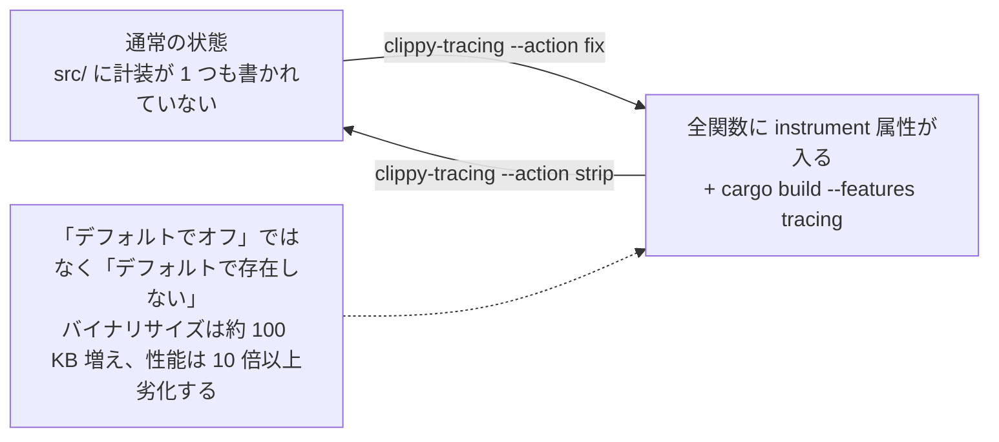
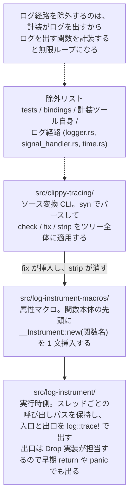

## 何を学んだか

### 計装を「ソースに書かない」ことで、オーバーヘッドをゼロにする

Firecracker は関数の入口と出口でトレースログを出す仕組みを持っている。ただし、その属性マクロは**リポジトリのソースに 1 つも書かれていない**。`src/vmm/src`、`src/firecracker/src`、`src/utils/src` を `log_instrument` で検索しても 1 件もヒットしない。

代わりに、必要になったときにソースツリー全体を機械的に書き換えて計装を挿入し、使い終わったら剥がす。そのためのツールが `src/clippy-tracing/` である。



「デフォルトでオフ」ではなく「デフォルトで存在しない」。この差が主題である。

### 3 つのクレートで役割が分かれている

| クレート                     | 役割                                                                                        |
| ---------------------------- | ------------------------------------------------------------------------------------------- |
| `src/log-instrument-macros/` | `#[instrument]` 属性マクロ。関数本体の先頭に 1 文を挿入する proc macro                      |
| `src/log-instrument/`        | 実行時側。スレッドごとの呼び出しパスを保持し、入口 `>>` と出口 `<<` を `log::trace!` で出す |
| `src/clippy-tracing/`        | ソース変換 CLI。`--action check` / `fix` / `strip` でツリー全体に属性を検査・挿入・削除する |

`clippy-tracing` は `syn` でファイルをパースし、関数定義を訪問して属性行を足したり消したりする。汎用のツールとして独立していて、Firecracker のコードには依存していない。



### 理由は性能である

[`docs/tracing.md`](https://github.com/firecracker-microvm/firecracker/blob/cc535f035f3828b2c5bfc85276c5d394022ed220/docs/tracing.md) が数値を書いている。

> This will result in an increase in the binary size (~100kb) and a significant regression in performance (>10x).

バイナリサイズが約 100 KB 増え、性能が **10 倍以上**劣化する。同じドキュメントは方針も明記している。

> Adding traces impacts Firecracker binary size and its performance, so instrumentation is not present by default. Instrumentation is also not present on the release binaries.

Firecracker の売り文句は起動 125 ms・メモリオーバーヘッド 5 MiB である（[`../specification-as-contract/`](../specification-as-contract/)）。10 倍の劣化はもちろん、100 KB の増加も、[`../minimalism-charter/`](../minimalism-charter/) で見た「作らない」の姿勢からすれば正当化しづらい。そこで、計装を本番の成果物から完全に排除する方向に倒している。

## ソースコードのどこか

### 属性マクロは 1 文を挿入するだけ

`log-instrument-macros` の全体はこれだけである。

```rust title="src/log-instrument-macros/src/lib.rs"
#[proc_macro_attribute]
pub fn instrument(
    _attr: proc_macro::TokenStream,
    item: proc_macro::TokenStream,
) -> proc_macro::TokenStream {
    let input = syn::parse_macro_input!(item as syn::Item);

    let syn::Item::Fn(mut item_fn) = input else {
        panic!("Instrument macro can only be on functions.")
    };
    // ...
    let item_fn_ident = item_fn.sig.ident.to_string();
    let new_stmt: syn::Stmt =
        parse_quote! { let __ = log_instrument::__Instrument::new(#item_fn_ident); };
    item_fn.block.stmts.insert(0, new_stmt);

    let out = quote! { #item_fn };
    proc_macro::TokenStream::from(out)
}
```

[`src/log-instrument-macros/src/lib.rs#L15-L38`](https://github.com/firecracker-microvm/firecracker/blob/cc535f035f3828b2c5bfc85276c5d394022ed220/src/log-instrument-macros/src/lib.rs#L15-L38)

関数本体の先頭に `let __ = __Instrument::new("関数名");` を差し込む。出口のログは別に書かない。`__Instrument` の `Drop` 実装が担当するので、`return` が何本あっても、`?` で早期リターンしても、panic で巻き戻っても出口ログが出る。RAII をそのまま使った設計だ。

実行時側は、スレッドごとに現在の呼び出しパスを積んでいる。

```rust title="src/log-instrument/src/lib.rs"
type InnerPath = Mutex<HashMap<std::thread::ThreadId, Vec<&'static str>>>;
static PATH: OnceLock<InnerPath> = OnceLock::new();
```

```rust title="src/log-instrument/src/lib.rs"
        // Write log
        log::trace!("{id:?}{prefix}>>{s}");
```

[`src/log-instrument/src/lib.rs#L17-L55`](https://github.com/firecracker-microvm/firecracker/blob/cc535f035f3828b2c5bfc85276c5d394022ed220/src/log-instrument/src/lib.rs#L17-L55)

出力は `ThreadId(1)::main::main_exec>>single_value` のような形になり、`>>` が入口、`<<` が出口、`::` 区切りが呼び出し階層を表す。10 倍の劣化の出どころもここに見える。関数を 1 回呼ぶたびにグローバルな `Mutex` を 2 回取り、`HashMap` を引き、`String` を組み立てている。全関数に付ける計装としては重い。

### `clippy-tracing` の 3 つのアクション

CLI の定義がそのまま仕様になっている。

```rust title="src/clippy-tracing/src/main.rs"
/// The action to take.
#[derive(Clone, ValueEnum)]
enum Action {
    /// Checks `tracing::instrument` is on all functions.
    Check,
    /// Adds `tracing::instrument` to all functions.
    Fix,
    /// Removes `tracing::instrument` from all functions.
    Strip,
}
```

[`src/clippy-tracing/src/main.rs#L44-L53`](https://github.com/firecracker-microvm/firecracker/blob/cc535f035f3828b2c5bfc85276c5d394022ed220/src/clippy-tracing/src/main.rs#L44-L53)

引数は `--path`（探索の起点）、`--exclude`（部分文字列で除外）、`--suffix`（属性のパス接頭辞の差し替え）、`--cfg-attr`（`#[cfg_attr(feature = "tracing", ...)]` で包むかどうか）。実装は `walkdir` でツリーを歩き、`.rs` ファイルだけを対象にする。

```rust title="src/clippy-tracing/src/main.rs"
        // File paths must not contain any excluded strings.
        let no_excluded_strings = !args.exclude.iter().any(|e| path_str.contains(e));
        // The file must not be a `build.rs` file.
        let not_build_file = !entry_path.ends_with("build.rs");
        // The file must be a `.rs` file.
        let is_rs_file = entry_path.extension().is_some_and(|ext| ext == "rs");
```

[`src/clippy-tracing/src/main.rs#L262-L292`](https://github.com/firecracker-microvm/firecracker/blob/cc535f035f3828b2c5bfc85276c5d394022ed220/src/clippy-tracing/src/main.rs#L262-L292)

各ファイルは `syn::parse_file` で AST にされ、アクションごとの `Visit` 実装が走る。`fix` は関数定義の開始行の 1 つ手前に属性文字列を挿入する（インデントは関数のカラム位置から復元する）、`strip` は属性のスパンに当たる行を削除する、`check` は最初に見つかった非計装関数のスパンを返す。

行番号を保ったまま行を挿入するために、`SegmentedList` という「元の行」と「新しく挿入する行」のペア列を使っている。AST のスパンが指す行番号がずれないようにする工夫だ。

### `check` は専用の終了コードを返す

CI から使うことを想定した設計になっている。

```rust title="src/clippy-tracing/src/main.rs"
/// Type to return from `main` to support returning an error then handling it.
#[repr(u8)]
enum Exit {
    /// Process completed successfully.
    Ok = 0,
    /// Process encountered an error.
    Error = 1,
    /// Process ran `check` action and found missing instrumentation.
    Check = 2,
}
```

[`src/clippy-tracing/src/main.rs#L202-L217`](https://github.com/firecracker-microvm/firecracker/blob/cc535f035f3828b2c5bfc85276c5d394022ed220/src/clippy-tracing/src/main.rs#L202-L217)

「計装が足りない」（2）と「ツールが壊れた」（1）を区別する。前者は `Missing instrumentation at {path}:{line}:{column}.` を標準出力に出すので、そのまま編集位置に飛べる。

### 計装しない関数の判定

すべての関数に付けるわけではない。`const fn`、`extern` 関数、そして「テスト」は除外される。

```rust title="src/clippy-tracing/src/main.rs"
        // Match `#[test]` or `#[kani::proof]`.
        if match &attr.meta {
            syn::Meta::List(syn::MetaList { path, .. }) => {
                matches!(path.segments.last(), Some(syn::PathSegment { ident, .. }) if ident == "proof")
            }
            syn::Meta::Path(syn::Path { segments, .. }) => {
                matches!(segments.last(), Some(syn::PathSegment { ident, .. }) if ident == "test" || ident == "proof")
            }
            syn::Meta::NameValue(_) => false,
        } {
            test = true;
        }
```

[`src/clippy-tracing/src/main.rs#L423-L447`](https://github.com/firecracker-microvm/firecracker/blob/cc535f035f3828b2c5bfc85276c5d394022ed220/src/clippy-tracing/src/main.rs#L423-L447)

`#[test]` に加えて `#[kani::proof]` が明示的に除外されている。Kani のハーネス（[`../kani-verification/`](../kani-verification/)）に計装を挿入すると、証明が探索するコードが無関係に増えて検証時間が伸びる。ソース変換ツールが検証基盤の存在を知っている、という結び付きだ。

### 除外リストが語るもの

`docs/tracing.md` が示す実際の呼び出しは、除外の並びが読みどころになっている。

```bash
clippy-tracing \
  --action fix \
  --path ./src \
  --exclude benches \
  --exclude virtio/generated,bindings.rs,net/generated \
  --exclude log-instrument-macros/,log-instrument/,clippy-tracing/ \
  --exclude vmm_config/logger.rs,logger/,signal_handler.rs,time.rs
```

ドキュメント自身が 4 行の意図を列挙している。「tests」「bindings」「the instrumentation tooling」、そして最後が **"logger functionality that may form an infinite loop"**。

計装はログを出す。ログを出す関数を計装すれば、ログを出すためにログを出す関数を呼び、無限ループになる。[`../logger-reentrancy/`](../logger-reentrancy/) で見たロガーの再入問題が、ここでは「除外パスのリテラル」という形で現れている。`signal_handler.rs` と `time.rs` が同じ行にあるのも同じ理由（シグナルハンドラとタイムスタンプ取得はログ経路から呼ばれる）と読める。

### 2 段階のフィルタリング

計装を入れたまま影響を減らす道が 2 つ用意されている。

**実行時フィルタ**は `/logger` API でモジュールパスやファイルパスを指定する。ログの構築と書き出しを避けられるので実行時間の影響は大きく減るが、ドキュメントの言うとおり「Memory usage impact is not mitigated as the instrumentation remains in the binary unchanged.」——バイナリサイズは変わらない。

**コンパイル時フィルタ**は `clippy-tracing` をもう一度使う。

```bash
# Remove all instrumentation.
clippy-tracing --action strip --path ./src
# Adds instrumentation to the specific file/s.
clippy-tracing --action fix --path ./src/firecracker/src/api_server/src/request
# Build Firecracker.
cargo build --features tracing
```

全部剥がしてから、見たいディレクトリにだけ入れ直す。ドキュメントはこちらを「can almost entirely mitigate the impact on execution time and the impact on memory usage」と評価し、実行時の再設定ができない環境（本番に近い制約下）で必要になると位置付けている。

### `tracing` feature は依存の有効化だけを担う

`--features tracing` の中身は薄い。

```toml title="src/vmm/Cargo.toml"
tracing = ["log-instrument"]
```

`log-instrument` は `optional = true` の依存で、feature はそれを有効にするだけである。`src/firecracker/Cargo.toml` では `tracing = ["log-instrument", "utils/tracing", "vmm/tracing"]` とワークスペース全体に伝播させている。

つまり、`#[cfg(feature = "tracing")]` で計装のオン・オフを切り替えているのではない。計装が挿入されたソースをコンパイルできるようにするために依存を足しているだけだ。`--cfg-attr 'feature="tracing"'` を渡すと属性は `#[cfg_attr(feature = "tracing", log_instrument::instrument)]` の形で挿入されるので、挿入済みのソースを feature 無しでもビルドできる。挿入と有効化が直交している。

### CI が検査しているのは「不在」ではなく「動くこと」

CI で計装の混入をチェックしているかを確認すると、答えは「していない」である。`devtool checkstyle` が回すのは `integration_tests/style` と `test_clippy.py` で、`clippy-tracing --action check` は含まれていない。

代わりにあるのは、ワークフローそのものを回す統合テストである。

```python title="tests/integration_tests/functional/test_instrumented_firecracker.py"
PATHS_TO_INSTRUMENT = [
    "../src/firecracker/src/main.rs",
    "../src/firecracker/src/api_server",
    "../src/vmm/src/lib.rs",
    "../src/vmm/src/builder.rs",
]
```

```python title="tests/integration_tests/functional/test_instrumented_firecracker.py"
@pytest.fixture(scope="module")
def instrumented_binary():
    """Build and provide the path to an instrumented Firecracker binary."""
    binary_path = build_instrumented_binary()
    yield binary_path
    cleanup_instrumentation()
```

[`tests/integration_tests/functional/test_instrumented_firecracker.py#L23-L67`](https://github.com/firecracker-microvm/firecracker/blob/cc535f035f3828b2c5bfc85276c5d394022ed220/tests/integration_tests/functional/test_instrumented_firecracker.py#L23-L67)

4 つのパスに `--action fix` で計装を入れ、別の `CARGO_TARGET_DIR` に `--features tracing` でビルドし、その microVM を起動する。そのうえで検査するのは次の 3 点だ。

1. ログレベル `Info` で起動した時点では、`TRACE` も `ThreadId(N)>>` マーカーも出ていない
2. `/logger` に `level: Trace` を PUT した後には、入口 `>>` と出口 `<<` の両方が出る
3. トレースに `vmm` / `request` / `response` を含むものが少なくとも 1 つずつある

そしてフィクスチャの teardown で `--action strip` を実行し、ソースツリーを元に戻す。つまり CI が守っているのは「計装が本番に紛れ込んでいないこと」ではなく、「計装を入れて剥がすワークフローが壊れていないこと」である。前者はそもそもソースに書かないという運用で守られていて、`git diff` に現れる（コードレビューで見える）ので、機械的な検査を置いていない、と読める。

## なぜそうなっているか

### 10 倍という数字が選択肢を狭めている

性能影響が数パーセントなら、`#[cfg(feature = "tracing")]` を全関数にベタ書きして feature でオフにするのが素直だ。実際、無効時のコストはゼロになる。それでもソース変換にしたのは、書き込むこと自体のコストが問題だからだと考えられる（以下は推測を含む）。

Firecracker のソースには数千の関数がある。全部に属性行を書けば、差分は数千行になり、以後すべての関数追加でレビューが「属性を付け忘れていないか」を気にすることになる。そして属性が付いているだけで、コードを読むときのノイズになる。

ソース変換にすれば、通常のツリーは属性ゼロで読める。必要な人が必要なときにコマンド 1 つで入れる。そのうえ「どこに入れるか」を後から自由に選べる（コンパイル時フィルタ）。feature フラグ方式では、この最後の自由度が得られない——属性はソースに固定されているので、部分的に無効化するには結局ソースを編集することになる。

### 「レビューで見える」ことに依存している

計装の混入を機械的にチェックしていないのは一見手薄に見えるが、脅威の性質が違う。計装が本番に入るには、誰かが `clippy-tracing --action fix` を実行した結果をコミットする必要がある。それは数千行の差分になり、PR で見逃しようがない。

対照的に、[`../kani-verification/`](../kani-verification/) で見た `fuzzing` feature は 1 行の `--features` 指定で有効になり、差分に現れない。だから `compile_error!` という機械的な柵が要る。**差分に現れる危険には人のレビュー、差分に現れない危険には機械の柵**、という使い分けになっている。

### ツールが汎用として切り出されている

`clippy-tracing` は Firecracker のコードを一切知らない。`--suffix` で属性のパスを差し替えられるので、`tracing` クレートの `#[tracing::instrument]` にも使える（README とツールの doc コメントが `tracing::instrument` を前提に書かれているのはその名残だ）。実際、外部リポジトリとしても公開されている。

ワークスペースのメンバーに入っている（`Cargo.toml` の `"src/clippy-tracing"`）ので、`cargo run --bin clippy-tracing --` で常に最新版が使える。デバッグ用ツールをリポジトリ内に置いて、本体と一緒にビルド・テストされる状態にしておく、という判断である。

## どう活かすか

### 代替との比較

「関数の入口・出口を全部見たい」という要求に対する選択肢は 4 つある。

| 手段                                     | 無効時のコスト               | 有効化の手間          | 得られる情報                                                     |
| ---------------------------------------- | ---------------------------- | --------------------- | ---------------------------------------------------------------- |
| ソース変換（`clippy-tracing`）           | ゼロ（コードに存在しない）   | ツール実行 + 再ビルド | 全関数の入口・出口、呼び出し階層                                 |
| feature フラグ（属性を常時記述）         | ゼロ（ただしソースは汚れる） | 再ビルドのみ          | 同上                                                             |
| 動的トレーシング（`tracing` + フィルタ） | 条件判定のみ残る             | 実行時設定            | 同上（ただしバイナリは常に太い）                                 |
| eBPF / uprobe                            | ゼロ（外部から attach）      | 再ビルド不要          | シンボルが残っている関数のみ、インライン展開されたものは見えない |

Firecracker が 1 番目を選ぶ理由は「無効時のコストがゼロ」と「ソースが汚れない」を両立できる唯一の選択肢だから、と整理できる。

eBPF は再ビルドが要らないので運用上は魅力的だが、Rust の最適化ビルドでは小さな関数が軒並みインライン展開され、`log_instrument` が見せてくれる `main_exec::single_value::value_of` のような細かい階層は取れない。そして Firecracker の場合、[`../jailer/`](../jailer/) の chroot と seccomp フィルタの内側で動くプロセスに外から attach すること自体が、隔離の前提と衝突する。

### この設計が効く前提

ソース変換方式を選ぶ価値があるのは、次の条件が揃うときだ。

- **計装のオーバーヘッドが許容できない。** 数パーセントなら feature フラグで十分。10 倍なら、本番から完全に消す動機がある。
- **計装を入れる対象が機械的に決まる。** 「全関数」のような一様な規則があること。「重要な関数だけ」なら手で書くほうが早い。
- **ソースが単一言語で AST パーサが手に入る。** `syn` のような成熟したパーサがあるから 450 行で書ける。
- **計装を入れた状態をコミットしない運用が守れる。** チームが小さいか、レビューが機能していること。

逆に、次の場合は選ぶべきでない。

- **本番でもトレースを取りたい。** 再ビルドが要る時点で、障害発生中のプロセスからは何も取れない。動的トレーシングか eBPF が要る。
- **計装の粒度を細かく制御したい。** 引数の値、戻り値、スパンの属性といったものは、この方式では表現できない（`log_instrument` は関数名しか記録しない）。`tracing` クレートの `#[instrument(fields(...))]` のような表現力が必要なら別の道具になる。
- **CI で「計装が入っていないこと」を強制したい。** `clippy-tracing --action check` は「計装が**入っている**こと」を検査するアクションであって、逆向きの検査ではない。不在を機械的に守りたいなら、`git grep` ベースの別チェックを足すことになる。

### 使い捨てツールをワークスペースに置く

この章で見てきたもののうち、`clippy-tracing` は「製品ではないがリポジトリに常駐するツール」の例として素直に真似できる。ワークスペースメンバーにしておけば、本体のリファクタリングで壊れたらビルドが落ちるし、`cargo run --bin` で誰でも最新版を使える。使うたびにバージョンのずれを心配する必要がない。

同じ発想で、`--action check` と専用終了コードを最初から持たせておくと、後から CI に組み込むのが楽になる。挿入ツールを書くときに検査モードも一緒に書く、というのはコストがほぼ増えない。

---

Firecracker のコードを追ってきて残るのは、この VMM が「作らない」ことと「守る」ことを別々の手段で担保している、という構造である。デバイスを virtio の少数に絞り、レガシー BIOS を持たず、直接カーネルを起動するという引き算は、攻撃面と起動時間を同時に削るための設計判断だった。一方で、削った結果として残った最小限の面——ゲストが書く virtqueue、MMDS の TCP/IP スタック、ディスクリプタチェーンの変換——には、Kani による形式検証、jailer と seccomp による多層の隔離、そして A/B テストによる回帰検出が集中的に置かれている。

そして本ページの `clippy-tracing` が示すのは、その「削る」を維持するための道具立てである。デバッグしやすさは欲しいが、そのために本番バイナリを 10 倍遅くはできない。ならば計装をソース変換として外部化し、必要なときだけ持ち込む。小ささを主張として掲げたプロジェクトが、その主張を守るためにどこまで手間をかけるかの一例だと言える。
