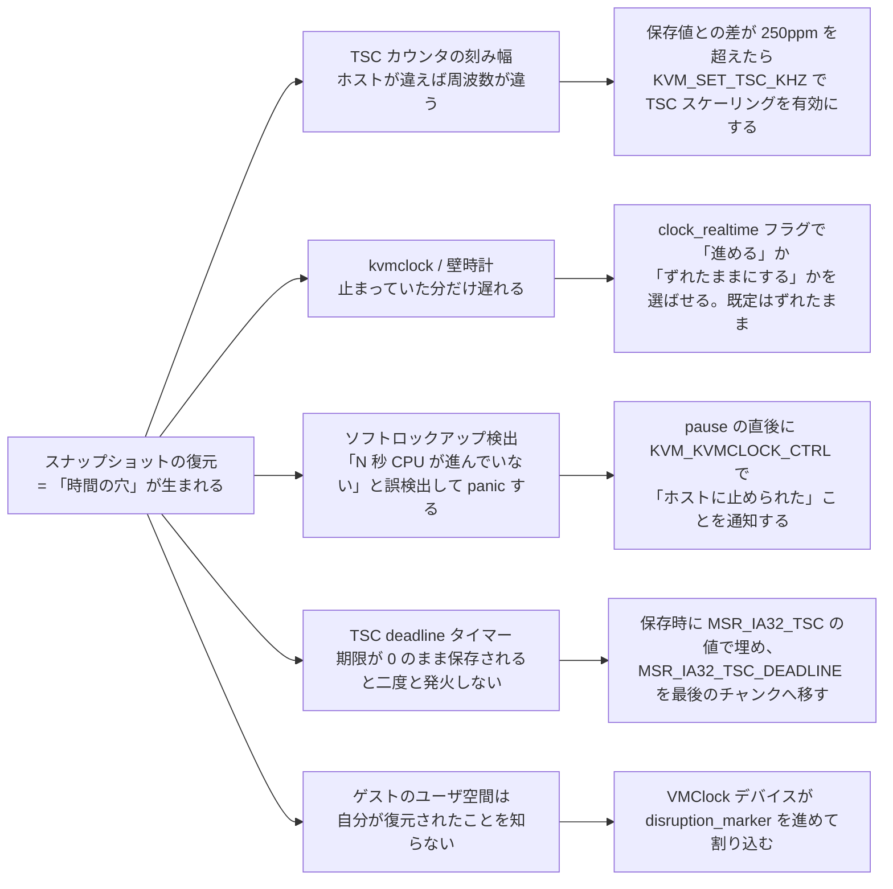
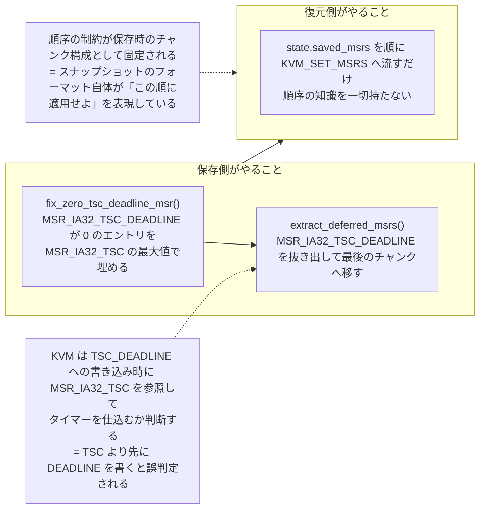

## 何を学んだか

### 復元は「時間の穴」を作る

スナップショットから復元した VM から見ると、保存した瞬間と復元した瞬間の間の時間が消えている。しかも復元先のホストは別のマシンかもしれない。ゲストが持っている時間の表現は 1 つではないので、問題は 4 つに分かれる。

| ゲストが見ている時間   | 保存→復元で何が起きるか                     | Firecracker の対処                    |
| ---------------------- | ------------------------------------------- | ------------------------------------- |
| TSC カウンタの刻み幅   | ホストが違えば周波数が違う                  | 250ppm 超なら TSC スケーリング        |
| kvmclock / 壁時計      | 止まっていた分だけ遅れる                    | `clock_realtime` で進めるか選ばせる   |
| ソフトロックアップ検出 | 「N 秒 CPU が進んでない」と誤検出して panic | `KVM_KVMCLOCK_CTRL` で pause を通知   |
| TSC deadline タイマー  | 期限が 0 だと二度と発火しない               | 保存時に TSC 値で埋め、復元順序も調整 |

これに加えて、「時間が飛んだこと」をゲストの**ユーザ空間**へ伝えるための VMClock デバイスがある。



### TSC 周波数は 250ppm の許容幅で判定する

vCPU 状態を保存するとき、Firecracker は `KVM_GET_TSC_KHZ` でその時点の TSC 周波数を記録する。復元時は保存値とホストの現在値を比べ、差が保存値の 250ppm（百万分の 250）を超えていたら全 vCPU に `KVM_SET_TSC_KHZ` を投げて TSC スケーリングを有効にする。許容幅を設ける理由はコメントにある。TSC 周波数はブート時のキャリブレーションで決まるので同一機種でも僅かにばらつき、そのたびにスケーリングを入れても遅くなるだけだからだ。

### 壁時計を進めるかどうかは利用者が選ぶ

`KVM_SET_CLOCK` に `KVM_CLOCK_REALTIME` フラグを付けるかどうかで、復元後のゲストの壁時計の挙動が変わる。

- **既定（`clock_realtime: false`）**: フラグを落として復元する。ゲストの壁時計はスナップショット時点から連続する。つまり止まっていた時間ぶん **ずれたまま** 動き出す。
- **`clock_realtime: true`**: フラグを立て、KVM にホストの realtime を基準に補正させる。ただし保存時の状態にこのフラグが立っていなかった場合はエラーになる（ホストが対応していないと保存時にも立たない）。ホスト Linux 5.16 以降が必要で、aarch64 では未対応としてエラーになる。

既定がドリフトする側なのは、時計が突然飛ぶことのほうが害になるゲストがあるからだ。ドキュメントも `this may cause issues within the guest as the clock will appear to suddenly jump.` と注意し、本来の解として `KVM_PTP` 由来の `/dev/ptp0` を時刻源にしたゲスト内 NTP を挙げている。

### `MSR_IA32_TSC_DEADLINE` が 0 だと、タイマーが二度と来ない

x86 の TSC deadline モードでは、`MSR_IA32_TSC_DEADLINE` に「この TSC 値になったら割り込む」という期限を書く。割り込みが配送されると MSR は 0 にクリアされる。スナップショットを取った瞬間がこの「クリアされたが、ゲストがまだ次の期限を書いていない」窓に当たると、0 のまま保存され、復元後のゲストは来ないタイマー割り込みを待ち続ける。Firecracker は **保存時に** この状態を検出し、0 だった `MSR_IA32_TSC_DEADLINE` を同じ vCPU の `MSR_IA32_TSC` の値で埋める（＝「今すぐ発火する期限」にする）。

さらに MSR には復元順序の依存がある。KVM は `MSR_IA32_TSC_DEADLINE` への書き込み時に `MSR_IA32_TSC` を参照してタイマーを仕込むか判断するので、TSC より先に DEADLINE を書くと「仕込む必要なし」と誤判定されたり、誤った期限でタイマーが張られたりする。Firecracker は保存時に `MSR_IA32_TSC_DEADLINE` を MSR チャンクから抜き出し、最後のチャンクへ移してから保存する。復元側はチャンクを順に `KVM_SET_MSRS` するだけでよい。

### VMClock は「飛んだこと」をユーザ空間に伝える

上の 4 つはすべてカーネル（ゲスト OS）向けの辻褄合わせだ。ゲスト内のユーザ空間プロセスは、自分が復元されたことを知らない。VMClock は ACPI デバイスとしてゲスト物理メモリ 1 ページを見せ、そこに `vmclock_abi` 構造体を置く。復元のたびに `disruption_marker` と `vm_generation_counter` を増やし、割り込みを上げる。ユーザ空間は `mmap` してカウンタを監視するか、デバイスを `poll()` してイベントとして受け取れる。

## ソースコードのどこか

復元パスの TSC スケーリング。判定は vCPU 0 で行い、適用は全 vCPU に対して行う。

```rust title="src/vmm/src/builder.rs"
        // Scale TSC to match, extract the TSC freq from the state if specified
        if let Some(state_tsc) = microvm_state.vcpu_states[0].tsc_khz {
            // Scale the TSC frequency for all VCPUs. If a TSC frequency is not specified in the
            // snapshot, by default it uses the host frequency.
            if vcpus[0].kvm_vcpu.is_tsc_scaling_required(state_tsc)? {
                for vcpu in &vcpus {
                    vcpu.kvm_vcpu.set_tsc_khz(state_tsc)?;
                }
            }
        }
```

[`src/vmm/src/builder.rs#L453-L465`](https://github.com/firecracker-microvm/firecracker/blob/cc535f035f3828b2c5bfc85276c5d394022ed220/src/vmm/src/builder.rs#L453-L465)

許容幅は定数 `TSC_KHZ_TOL_NUMERATOR: i64 = 250` / `TSC_KHZ_TOL_DENOMINATOR: i64 = 1_000_000` として定義され、コメントは `The value of 250 parts per million is based on the QEMU approach` と QEMU の実装（および Red Hat の bugzilla）を根拠に挙げている（[`#L33-L37`](https://github.com/firecracker-microvm/firecracker/blob/cc535f035f3828b2c5bfc85276c5d394022ed220/src/vmm/src/arch/x86_64/vcpu.rs#L33-L37)、判定本体は [`#L666-L677`](https://github.com/firecracker-microvm/firecracker/blob/cc535f035f3828b2c5bfc85276c5d394022ed220/src/vmm/src/arch/x86_64/vcpu.rs#L666-L677)）。

保存時に周波数が取れなかった場合は `None` を入れ、`TSC freq not available. Snapshot cannot be loaded on a different CPU model.` と警告するだけで保存は続く（[`#L623-L626`](https://github.com/firecracker-microvm/firecracker/blob/cc535f035f3828b2c5bfc85276c5d394022ed220/src/vmm/src/arch/x86_64/vcpu.rs#L623-L626)）。

vCPU を pause したところで `KVM_KVMCLOCK_CTRL` を呼ぶ。失敗は致命的にせず、メトリクスを上げて警告するだけにしている。

呼び出しは vCPU 状態機械の `VcpuEvent::Pause` を処理する分岐にあり、`VcpuResponse::Paused` を返した直後に置かれている（[`src/vmm/src/vstate/vcpu.rs#L271-L281`](https://github.com/firecracker-microvm/firecracker/blob/cc535f035f3828b2c5bfc85276c5d394022ed220/src/vmm/src/vstate/vcpu.rs#L271-L281)）。

```rust title="src/vmm/src/arch/x86_64/vcpu.rs"
    /// Calls KVM_KVMCLOCK_CTRL to avoid guest soft lockup watchdog panics on resume.
    pub fn kvmclock_ctrl(&self) {
        // We do not want to fail if the call is not successful, because that may be acceptable
        // depending on the workload. For example, EINVAL is returned if kvm-clock is not
        // activated (e.g., no-kvmclock is specified in the guest kernel parameter).
```

[`src/vmm/src/arch/x86_64/vcpu.rs#L310-L321`](https://github.com/firecracker-microvm/firecracker/blob/cc535f035f3828b2c5bfc85276c5d394022ed220/src/vmm/src/arch/x86_64/vcpu.rs#L310-L321)

同じ呼び出しが `restore_state` の末尾にもある（[`#L748`](https://github.com/firecracker-microvm/firecracker/blob/cc535f035f3828b2c5bfc85276c5d394022ed220/src/vmm/src/arch/x86_64/vcpu.rs#L748)）。復元直後の vCPU も「ホストによって止められていた」状態だからだ。

`clock_realtime` の分岐。保存された `kvm_clock_data` の flags を上書きしてから `KVM_SET_CLOCK` する。

```rust title="src/vmm/src/arch/x86_64/vm.rs"
        let mut clock = state.clock;
        clock.flags = if clock_realtime {
            // clock_realtime needs to be present in the snapshot
            if clock.flags & KVM_CLOCK_REALTIME == 0 {
                return Err(KvmVmError::ClockRealtimeNotInState);
            }
            KVM_CLOCK_REALTIME
        } else {
            0
        };
        self.fd().set_clock(&clock).map_err(KvmVmError::SetClock)?;
```

[`src/vmm/src/arch/x86_64/vm.rs#L137-L167`](https://github.com/firecracker-microvm/firecracker/blob/cc535f035f3828b2c5bfc85276c5d394022ed220/src/vmm/src/arch/x86_64/vm.rs#L137-L167)

`fix_zero_tsc_deadline_msr` は、保存対象の MSR チャンク群から `MSR_IA32_TSC` の最大値を取り、`MSR_IA32_TSC_DEADLINE` が 0 のエントリをその値で置き換える。doc コメントの Rationale 節が動機を述べている（[`src/vmm/src/arch/x86_64/vcpu.rs#L417-L448`](https://github.com/firecracker-microvm/firecracker/blob/cc535f035f3828b2c5bfc85276c5d394022ed220/src/vmm/src/arch/x86_64/vcpu.rs#L417-L448)）。

順序の依存は定数の側にコメントされている。

```rust title="src/vmm/src/arch/x86_64/vcpu.rs"
/// A set of MSRs that should be restored separately after all other MSRs have already been restored
const DEFERRED_MSRS: [u32; 1] = [
    // MSR_IA32_TSC_DEADLINE must be restored after MSR_IA32_TSC, otherwise we risk "losing" timer
    // interrupts across the snapshot restore boundary (due to KVM querying MSR_IA32_TSC upon
    // writes to the TSC_DEADLINE MSR to determine whether it needs to prime a timer - if
    // MSR_IA32_TSC is not initialized correctly, it can wrongly assume no timer needs to be
    // primed, or the timer can be initialized with a wrong expiry).
    MSR_IA32_TSC_DEADLINE,
];
```

[`src/vmm/src/arch/x86_64/vcpu.rs#L39-L47`](https://github.com/firecracker-microvm/firecracker/blob/cc535f035f3828b2c5bfc85276c5d394022ed220/src/vmm/src/arch/x86_64/vcpu.rs#L39-L47)

修復と並べ替えはどちらも **保存側** で行われる。



```rust title="src/vmm/src/arch/x86_64/vcpu.rs"
        Self::fix_zero_tsc_deadline_msr(&mut msr_chunks);

        let deferred = Self::extract_deferred_msrs(&mut msr_chunks)?;
        msr_chunks.push(deferred);
```

[`src/vmm/src/arch/x86_64/vcpu.rs#L505-L519`](https://github.com/firecracker-microvm/firecracker/blob/cc535f035f3828b2c5bfc85276c5d394022ed220/src/vmm/src/arch/x86_64/vcpu.rs#L505-L519)

VMClock の復元後処理。`seq_count` を奇数にして更新中を示し、`disruption_marker` と `vm_generation_counter` を進め、偶数に戻してから割り込みを上げる。

```rust title="src/vmm/src/devices/acpi/vmclock.rs"
    pub fn do_post_restore(&mut self, mem: &GuestMemoryMmap) -> Result<(), VmClockError> {
        write_vmclock_field!(self, mem, seq_count, self.inner.seq_count | 1);

        // This fence ensures guest sees all previous writes. It is matched to a
        // read barrier in the guest.
        fence(Ordering::Release);
```

[`src/vmm/src/devices/acpi/vmclock.rs#L121-L153`](https://github.com/firecracker-microvm/firecracker/blob/cc535f035f3828b2c5bfc85276c5d394022ed220/src/vmm/src/devices/acpi/vmclock.rs#L121-L153)

シーケンスカウンタと `fence` はゲスト側の read barrier と対になっており、ゲストが更新途中の値を読まないようにしている。

## なぜそうなっているか

**`KVM_KVMCLOCK_CTRL` の意図は CHANGELOG に明確に書かれている。**

> This ioctl sets a flag in the KVM state of the vCPU indicating that it has been paused by the host userspace. In guests that use kvmclock, the soft lockup watchdog checks this flag. If it is set, it won't trigger the lockup condition.
>
> — [CHANGELOG.md](https://github.com/firecracker-microvm/firecracker/blob/cc535f035f3828b2c5bfc85276c5d394022ed220/CHANGELOG.md#L576-L584)

ここには 2 つの判断がある。1 つは「ゲストの watchdog が誤検出するのは VMM 側の責任」と考えて能動的に通知していること。もう 1 つは、`no-kvmclock` 起動のゲストでは EINVAL になるのが正常なので、失敗を致命的にせずメトリクス (`vcpu.kvmclock_ctrl_fails`) で観測可能にしていることだ。

**TSC_DEADLINE の修復は「観測された不具合への対症療法」として書かれている。** コメントは `we observed that sometimes when taking a snapshot, the IA32_TSC_DEADLINE MSR is cleared, but the interrupt is not delivered to the guest` と、根本原因を断定せずに現象を記述し、「外部からシステム時刻を設定するまで直らない」という症状まで残している。

**MSR の並べ替えを保存側でやる理由は、復元側を単純に保つためだと読める（推測）。** 復元は `state.saved_msrs` を順に `KVM_SET_MSRS` へ流すだけのループで、順序の知識を持たない。順序の制約は保存時のチャンク構成として固定される。スナップショットのフォーマット自体が「この順に適用せよ」を表現していることになる。

**VMClock は現状「時刻同期のための情報」を提供していない。** CHANGELOG は、実装がスナップショット安全性の機能（`disruption_marker` と `vm_generation_counter`）を持つ一方で `doesn't provide currently any clock-specific information for helping the guest synchronize its clocks` と明記している。実際、デバイス生成時の `clock_status` は `VMCLOCK_STATUS_UNKNOWN`、`counter_id` は `VMCLOCK_COUNTER_INVALID` である。名前は時計だが、いまのところ役割は「時間が飛んだことの通知路」に寄っている。ゲスト側の対応状況も正直で、`vm_generation_counter` と `poll()` のサポートは Linux v7.0 で入ったものなので、それ以前のカーネルではパッチのバックポートが要るとドキュメントが注意している。

## どう活かすか

**「止まっていた時間をどう説明するか」は、プロセスをチェックポイント／リストアするあらゆる仕組みで発生する。** CRIU でもコンテナのライブマイグレーションでも同じで、Firecracker の分類はそのまま枠組みとして使える。

1. **速さ**（時間の刻み幅）が復元先で変わっていないか
2. **絶対時刻**を進めるか、止めたままにするか
3. 時間経過を前提に**タイムアウト検出しているコンポーネント**（watchdog、ハートビート、リース）に、停止していたことをどう伝えるか
4. **アプリケーションへの通知**をどう届けるか

**3 番目が抜けやすい。** ソフトロックアップ watchdog、分散システムのリース、TCP のキープアライブ、レート制限のトークンバケットは、いずれも「時間が単調に進む」ことを暗黙に仮定している。復元後にこれらが一斉に期限切れと判定すると、復元自体は成功しているのに VM の中で連鎖的に障害が起きる。`KVM_KVMCLOCK_CTRL` を pause の直後に呼んでいるのは、この種の誤検出を 1 つ潰した例だ。

**4 番目、ユーザ空間への通知経路を最初から設計に入れるかどうかは、脅威モデル次第で決まる。** 単に「時計を直したい」だけならゲスト内 NTP で足りる。通知が要るのは、[同じスナップショットから複数クローンを起動する](../vmgenid/) ような、状態の一意性が壊れる運用をするときだ。VMClock と VMGenID が同じ「復元のたびにカウンタを進めて割り込む」形をしているのはそのためで、片方はユーザ空間向け、もう片方はカーネル向けという役割分担になっている。

**取り込むべきでない条件も明確だ。** 復元先が常に同一ホスト・同一 CPU で、停止時間がミリ秒オーダなら、ここまでの機構は過剰になる。Firecracker が既定を「ドリフトさせる」側に置き、補正は明示的なオプトインにしているのは、突然のジャンプのほうが危険なワークロードが存在すると判断したからで、その判断は自分のワークロードで検証し直す必要がある。
