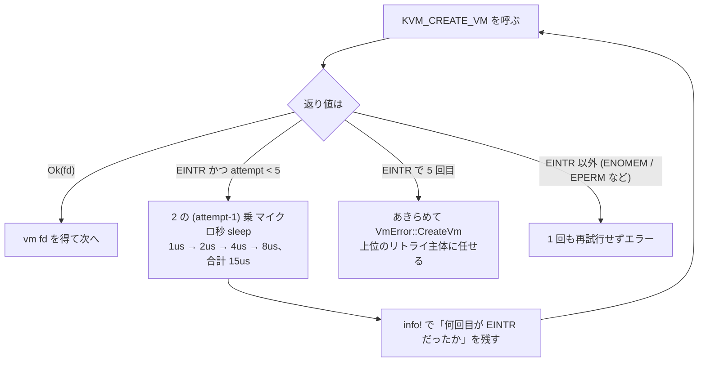

## 何を学んだか

### `ioctl` は「成功」か「失敗」の二値ではない

[KVM の ioctl 3 階層](../kvm-api/)のうち、いちばん外側の `KVM_CREATE_VM` は `/dev/kvm` の fd に対して 1 回だけ呼ぶ、VM 生成の入り口である。素朴に書けばこうなる。

```rust
let vm_fd = kvm_fd.create_vm()?;
```

Firecracker はそう書いていない。**最大 5 回リトライするループになっている。** リトライ条件は `errno == EINTR` のときだけである。



### なぜ EINTR が返るのか

`EINTR` は「シグナルによって中断された」を意味する。ブロックする syscall（`read`、`accept`、`wait`）が返すものだという理解が普通だが、`KVM_CREATE_VM` はブロックしない。にもかかわらず `EINTR` を返す。

理由は、この ioctl のカーネル側の処理が **CPU を長く占有する** ことにある。VM の生成パスには `mm_take_all_locks()` が含まれる。これは呼び出し元プロセスのアドレス空間にぶら下がる VMA のロックを全部取る処理で、アドレス空間が大きいほど時間がかかる。Linux では「CPU を長く食う syscall は、保留中のシグナルを見つけたら即座に `EINTR` を返してユーザランドに制御を返す」という方針があり、`KVM_CREATE_VM` はその方針に従っている。**バグではなく仕様である。**

さらに厄介なのが、Firecracker のコメントが引く 2 番目の事実だ。**保留中のシグナルが無いのに `EINTR` が返るケースが経験的に確認されている。** つまり「シグナルを送らなければ大丈夫」という回避策も成立しない。

### 誰がこれを踏むのか

1 台のマシンで 1 つの VM を作るだけなら、まず遭遇しない。問題になるのは **マルチテナントで多数の microVM が同時多発的に立ち上がる環境** である。Firecracker のコメントは "heavily loaded machines with many VMs" と書いている。VM 作成が輻輳し、ホストのメモリマップが大きくなるほど `mm_take_all_locks()` は長くなり、`EINTR` を引く確率が上がる。

そして Firecracker が置かれているのはまさにその環境だ。[1 プロセス 1 microVM](../architecture/) なので、`KVM_CREATE_VM` の失敗は「microVM 1 台の起動失敗」に直結する。

## ソースコードのどこか

[`src/vmm/src/vstate/vm.rs#L143-L178`](https://github.com/firecracker-microvm/firecracker/blob/cc535f035f3828b2c5bfc85276c5d394022ed220/src/vmm/src/vstate/vm.rs#L143-L178) の `KvmVm::create_common`。関数の本体より、その前に置かれた 20 行のコメントのほうが長い。

まず、なぜ `EINTR` が返るのかを説明する部分。

```rust title="src/vmm/src/vstate/vm.rs"
    pub fn create_common(kvm: Kvm) -> Result<VmCommon, VmError> {
        // It is known that KVM_CREATE_VM occasionally fails with EINTR on heavily loaded machines
        // with many VMs.
        //
        // The behavior itself that KVM_CREATE_VM can return EINTR is intentional. This is because
        // the KVM_CREATE_VM path includes mm_take_all_locks() that is CPU intensive and all CPU
        // intensive syscalls should check for pending signals and return EINTR immediately to allow
        // userland to remain interactive.
        // https://lists.nongnu.org/archive/html/qemu-devel/2014-01/msg01740.html
        //
        // However, it is empirically confirmed that, even though there is no pending signal,
        // KVM_CREATE_VM returns EINTR.
        // https://lore.kernel.org/qemu-devel/8735e0s1zw.wl-maz@kernel.org/
```

「意図的である」ことの根拠として QEMU のメーリングリスト、「シグナルが無くても起きる」ことの根拠として LKML/qemu-devel のスレッドを、それぞれ URL で示している。**このコードを見た人が「リトライは要らないのでは」と削除しようとしたときに、削除を止めるだけの情報が揃っている。**

続く部分が、なぜ 5 回なのかを説明する。

```rust title="src/vmm/src/vstate/vm.rs"
        // To mitigate it, QEMU does an infinite retry on EINTR that greatly improves reliabiliy:
        // - https://github.com/qemu/qemu/commit/94ccff133820552a859c0fb95e33a539e0b90a75
        // - https://github.com/qemu/qemu/commit/bbde13cd14ad4eec18529ce0bf5876058464e124
        //
        // Similarly, we do retries up to 5 times. Although Firecracker clients are also able to
        // retry, they have to start Firecracker from scratch. Doing retries in Firecracker makes
        // recovery faster and improves reliability.
        const MAX_ATTEMPTS: u32 = 5;
```

QEMU は無限リトライ。Firecracker は 5 回。**差が付いた理由が明示されている**のが重要で、「Firecracker のクライアントもリトライできるが、その場合 Firecracker をゼロから起動し直すことになる」。つまり最終的な保険はクライアント（オーケストレータ）側にあり、プロセス内リトライは**回復を速くするための最適化**として位置づけられている。

ループ本体はこうなっている。

```rust title="src/vmm/src/vstate/vm.rs"
        let mut attempt = 1;
        let fd = loop {
            match kvm.fd.create_vm() {
                Ok(fd) => break fd,
                Err(e) if e.errno() == libc::EINTR && attempt < MAX_ATTEMPTS => {
                    info!("Attempt #{attempt} of KVM_CREATE_VM returned EINTR");
                    // Exponential backoff (1us, 2us, 4us, and 8us => 15us in total)
                    std::thread::sleep(std::time::Duration::from_micros(2u64.pow(attempt - 1)));
                }
                Err(e) => return Err(VmError::CreateVm(e)),
            }

            attempt += 1;
        };
```

読み取れる設計判断が 3 つある。

1. **`EINTR` 以外は 1 回も再試行しない。** `Err(e) if e.errno() == libc::EINTR` というガードがあり、それ以外は即 `VmError::CreateVm` になる。ENOMEM や EPERM をリトライしても意味がないからだ。
2. **リトライのたびに `info!` を出す。** 黙って握りつぶさない。何回目で成功したかがログに残るので、「本番でどの程度この現象が起きているか」を後から測れる。
3. **バックオフの合計が 15 マイクロ秒。** ミリ秒ではない。Firecracker は起動時間をミリ秒単位で削っている（[起動シーケンス](../boot-sequence/)）ので、リトライで数ミリ秒の待ちを入れるのは受け入れられない。`mm_take_all_locks()` の再実行を数マイクロ秒ずらすだけで衝突が解ければ十分、という見立てである。

## なぜそうなっているか

### 「リトライを有限にする」意味

無限リトライ（QEMU）と有限リトライ（Firecracker）の違いは、**恒久的な故障をどう扱うか** に帰着する。

`EINTR` が一時的な現象であれば、無限リトライはいつか成功するので最も信頼性が高い。しかし何らかの理由で `EINTR` が返り続ける状況になったとき、無限リトライはハングに化ける。QEMU は長寿命プロセスを人が起動する前提なので、ハングしても人が Ctrl-C を押せる。Firecracker は**オーケストレータが機械的に大量起動する**前提なので、ハングしたプロセスはリソースを掴んだまま誰にも気づかれない。

コメントの「Firecracker clients are also able to retry」という一文がその判断を裏づけている。上位にリトライ主体が居ることが分かっているなら、下位は**速やかに諦めてエラーを返すほうが系全体として健全**である。同じ判断は [vCPU スレッドの終了待ち](../vcpu-thread-drop/)にも出てくる。あちらは待ちがタイムアウトしたら panic する。

なお **5 という数字そのものの根拠はコメントに書かれていない。** 4 回のバックオフで合計 15 マイクロ秒という、起動時間にほとんど影響しない範囲に収めた結果と読めるが、これは推測である。

### コメントが URL を 4 本持っていること

このコメントは、`mm_take_all_locks()` という Linux 内部の関数名、qemu-devel のスレッド 2 本、QEMU のコミット 2 本を参照している。[コードコメントとして書くべきは非自明な WHY だけ](../minimalism-charter/)という基準からすると、これは理想的な例になっている。

- `create_vm()` を呼んでいることは、コードを読めば分かる（書く必要がない）
- **なぜ 1 回では足りないのか**は、コードを何度読んでも分からない（書く必要がある）
- **なぜ 5 回で打ち切るのか**も、コードからは復元できない（書く必要がある）

## どう活かすか

### `EINTR` を「ブロックする呼び出しだけの話」と思わない

自分のコードで最初にやるべきことは、**`EINTR` を返しうる syscall の範囲を狭く見積もっていないか**の点検である。ブロックしない ioctl でも、カーネル側が重ければ `EINTR` は返る。Rust の `std` や `nix` は多くの場合これを隠してくれるが、`ioctl` を直接叩くレイヤ（`kvm-ioctls` のような薄いラッパ）では隠れない。

判断の順序はこうなる。

1. その呼び出しは**冪等か**。`KVM_CREATE_VM` は失敗したら fd が作られないので、リトライしても VM が二重にできることはない。冪等でない呼び出しをリトライすると壊れる。
2. リトライを**どの層に置くか**。上位（オーケストレータ、ジョブキュー、SDK のリトライ）で吸収できるなら、下位で持つのは「速さ」のためだけである。速さが要らないなら持たないほうが単純になる。
3. **上限を有限にするか**。上位にリトライ主体が居るなら有限。居ないなら（そして人が見ているなら）無限も選択肢になる。

### この設計が効く前提条件

Firecracker のこのリトライが効くのは、次の条件が揃っているときである。

- **同じホストで同種のプロセスが大量に、同時に起動する。** 1 日 1 回しか VM を作らないなら、`EINTR` に当たる確率はほぼゼロで、リトライを書く価値がない。
- **起動レイテンシが SLA に入っている。** 上位でのリトライは「Firecracker をゼロから起動し直す」ことを意味し、数十〜数百ミリ秒を失う。15 マイクロ秒で回避できるなら圧倒的に得である。逆に、起動が 1 分かかるプロセスなら、上位に任せてコードを単純にしたほうがよい。
- **その現象が本当に一時的だと確認できている。** Firecracker はコメントに一次情報の URL を貼ることで、この確認を再現可能にしている。根拠を書けないリトライは、単に本当の障害を隠すだけになる。

### 逆に取り込むべきでないケース

上位にリトライ主体が居ない場合、5 回で打ち切る設計はそのままでは危険である。5 回失敗した瞬間にユーザ向けのエラーになる。その場合は、リトライ回数を増やすのではなく、**エラーメッセージに「何回試して何が返ったか」を含める**ほうが効く。Firecracker は `info!("Attempt #{attempt} of KVM_CREATE_VM returned EINTR")` でそれをログ側に出している。
