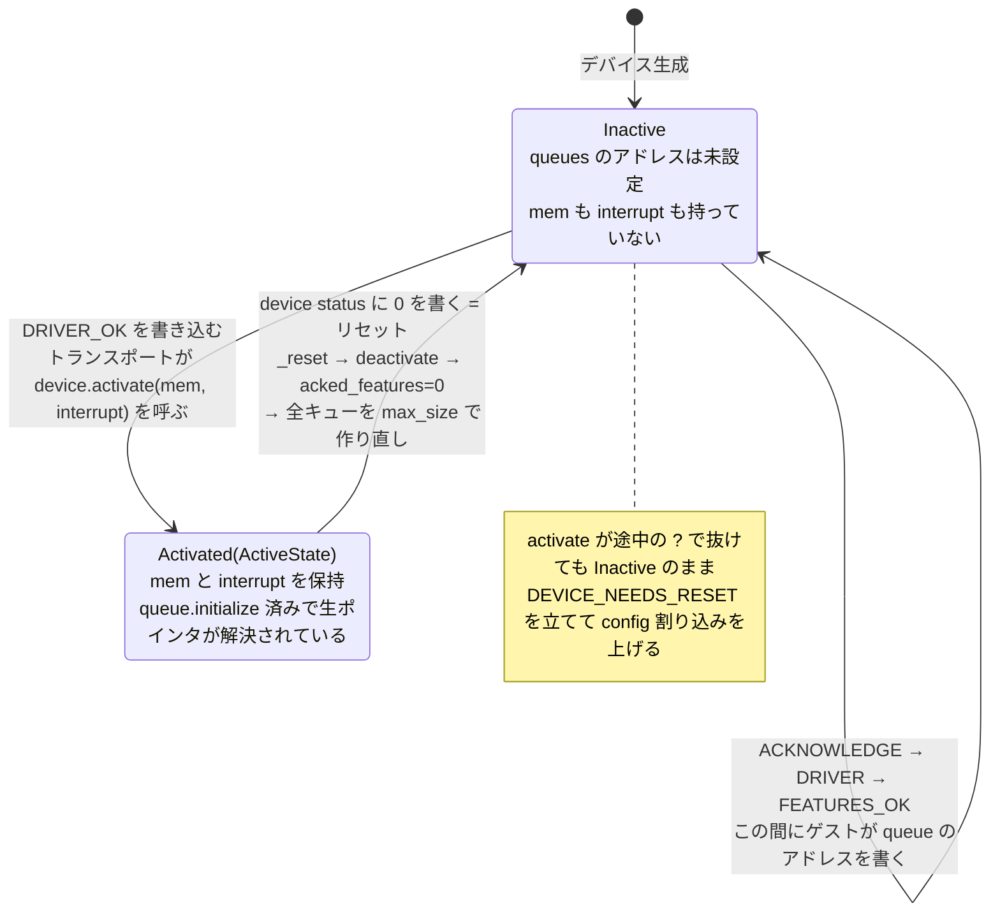
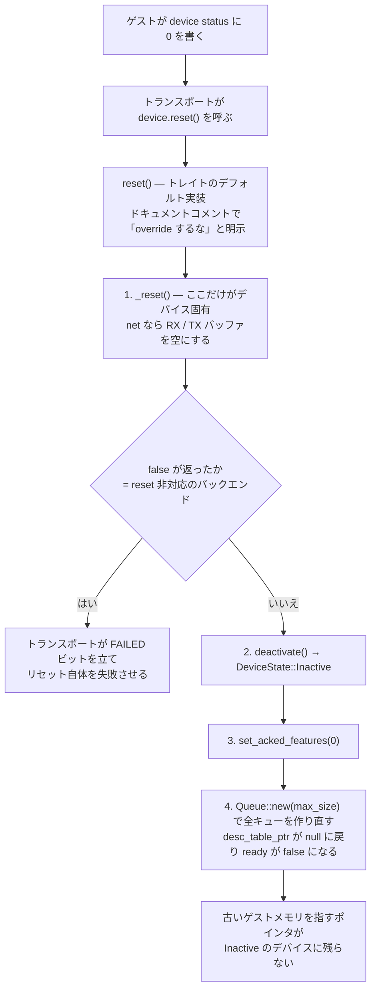

## 何を学んだか

virtio デバイスには「まだ何もしてはいけない期間」がある。[virtio の基礎](../virtio-basics/) で見た device status のステートマシンで言えば、`DRIVER_OK` が立つ前がそれだ。この期間、virtqueue のアドレスはゲストが書き込んでいる途中かもしれず、available ring を読むこと自体が未定義になる。

Firecracker はこの「前」と「後」を、**フィールドの有無ではなく enum の variant で**分けている。

```rust title="src/vmm/src/devices/virtio/device.rs"
/// State of an active VirtIO device
#[derive(Debug, Clone)]
pub struct ActiveState {
    pub mem: GuestMemoryMmap,
    pub interrupt: Arc<dyn VirtioInterrupt>,
}

/// Enum that indicates if a VirtioDevice is inactive or has been activated
/// and memory attached to it.
#[derive(Debug)]
pub enum DeviceState {
    Inactive,
    Activated(ActiveState),
}
```

素直に書けば `Option<GuestMemoryMmap>` と `Option<Arc<dyn VirtioInterrupt>>` を 2 本並べたくなるところだ。そうしなかったことで 2 つのことが起きている。

1. **「メモリはあるが割り込み経路がない」という中間状態が表現できなくなった。** `Option` を 2 本持つと型の上では 4 通りの組み合わせが存在する。うち 2 通りは起こらないが、コンパイラはそれを知らないので、読む側が毎回「こっちが `Some` ならあっちも `Some` のはず」と推論する羽目になる。
2. **ゲストメモリへの参照を得る唯一の経路が `active_state()` になった。** 非アクティブなデバイスがうっかりゲストメモリを触ることは、そもそも書けない。

ライフサイクル全体はこうなる。



もう 1 つの主題が `reset()` だ。これはトレイトの**デフォルト実装として与えられ、ドキュメントコメントで「override するな」と明示されている**。デバイス実装者が書けるのは `_reset()` というデバイス固有の部分だけで、その後の「非アクティブ化 → feature のクリア → キューの作り直し」は必ず同じ順序で実行される。テンプレートメソッドをトレイトのデフォルト実装で表現した形になっている。

## ソースコードのどこか

### enum とその使われ方

`DeviceState` の定義と、そこから唯一取り出せるアクセサ ([`src/vmm/src/devices/virtio/device.rs#L25-L56`](https://github.com/firecracker-microvm/firecracker/blob/cc535f035f3828b2c5bfc85276c5d394022ed220/src/vmm/src/devices/virtio/device.rs#L25-L56))。

```rust title="src/vmm/src/devices/virtio/device.rs"
    /// Gets the memory and interrupt attached to the device if it is activated.
    pub fn active_state(&self) -> Option<&ActiveState> {
        match self {
            DeviceState::Activated(state) => Some(state),
            DeviceState::Inactive => None,
        }
    }
```

各デバイスはこれを 1 フィールドとして持つ。net なら `pub(crate) device_state: DeviceState` ([`src/vmm/src/devices/virtio/net/device.rs#L273`](https://github.com/firecracker-microvm/firecracker/blob/cc535f035f3828b2c5bfc85276c5d394022ed220/src/vmm/src/devices/virtio/net/device.rs#L273))、vsock・balloon・block・pmem・mem・rng も同じだ。ゲストメモリが要るところは必ずここを経由する。

```rust title="src/vmm/src/devices/virtio/block/virtio/device.rs"
    pub fn process_queue(&mut self, queue_index: usize) -> Result<(), InvalidAvailIdx> {
        // This is safe since we checked in the event handler that the device is activated.
        let active_state = self.device_state.active_state().unwrap();
```

([`src/vmm/src/devices/virtio/block/virtio/device.rs#L528-L532`](https://github.com/firecracker-microvm/firecracker/blob/cc535f035f3828b2c5bfc85276c5d394022ed220/src/vmm/src/devices/virtio/block/virtio/device.rs#L528-L532))

`mem` と `interrupt` が 1 つの `active_state` から同時に取れているのがポイントで、後段で `active_state.mem` と `active_state.interrupt` の両方を使うときに `unwrap` は 1 回で済んでいる。

### activate はトランスポートから呼ばれる

`activate()` を呼ぶ場所は 1 箇所しかない。device status が `DRIVER_OK` まで到達した瞬間だ ([`src/vmm/src/devices/virtio/transport/mmio.rs#L189-L217`](https://github.com/firecracker-microvm/firecracker/blob/cc535f035f3828b2c5bfc85276c5d394022ed220/src/vmm/src/devices/virtio/transport/mmio.rs#L189-L217))。

```rust title="src/vmm/src/devices/virtio/transport/mmio.rs"
            // Activate the device when transitioning to DRIVER_OK.
            if status == (ACKNOWLEDGE | DRIVER | FEATURES_OK | DRIVER_OK) {
                let mut locked_device = self.device.lock().expect("Poisoned lock");
                if !locked_device.is_activated() {
                    let activate_result =
                        locked_device.activate(self.mem.clone(), self.interrupt.clone());
                    if let Err(err) = activate_result {
                        self.device_status |= DEVICE_NEEDS_RESET;

                        // Section 2.1.2 of the specification states that we need to send a device
                        // configuration change interrupt
                        let _ = self.interrupt.trigger(VirtioInterruptType::Config);
```

ゲストメモリのハンドルと割り込みハンドルは**トランスポートが持っていて、activate のときに初めてデバイスへ渡される**。デバイス構造体は生成時にこれらを一切持たない。だから「まだ activate されていないデバイスがゲストメモリを触る」というコードは、書こうとしても渡すものがない。失敗時は `DEVICE_NEEDS_RESET` を立てて config 割り込みを上げるだけで、デバイスは `Inactive` のままだ。

デバイス側の `activate` は、`ActiveState` を組み立てるのを**最後**にしている ([`src/vmm/src/devices/virtio/net/device.rs#L1045-L1077`](https://github.com/firecracker-microvm/firecracker/blob/cc535f035f3828b2c5bfc85276c5d394022ed220/src/vmm/src/devices/virtio/net/device.rs#L1045-L1077))。

```rust title="src/vmm/src/devices/virtio/net/device.rs"
    fn activate(
        &mut self,
        mem: GuestMemoryMmap,
        interrupt: Arc<dyn VirtioInterrupt>,
    ) -> Result<(), ActivateError> {
        assert!(!self.is_activated());

        for q in self.queues.iter_mut() {
            q.initialize(&mem)
                .map_err(ActivateError::QueueMemoryError)?;
        }
        // ... feature に応じた設定、tap の offload 設定、activate_evt の write ...
        self.device_state = DeviceState::Activated(ActiveState { mem, interrupt });
        Ok(())
    }
```

途中の `?` で抜けたら `device_state` は `Inactive` のままだ。`mem` は最後の行で move されるので、**「キューの初期化に失敗したのに Activated になっている」という状態は書けない**。`Option` を 2 本持つ設計だと `self.mem = Some(mem)` を先頭に置いてしまい、途中で失敗しても中途半端に残る書き方が自然にできてしまう。

なお `q.initialize(&mem)` がゲスト物理アドレスをホスト仮想アドレスの生ポインタに解決する処理で、[ディスクリプタの検証](../descriptor-chain-validation/) で扱う `desc_table_ptr` などはここで埋まる。

### イベントハンドラ側のゲート

デバイスは epoll のサブスクライバでもある。activate 前に kick の eventfd が発火することは実際に起こりうるので、そこにもゲートがある ([`src/vmm/src/devices/virtio/net/event_handler.rs#L99-L118`](https://github.com/firecracker-microvm/firecracker/blob/cc535f035f3828b2c5bfc85276c5d394022ed220/src/vmm/src/devices/virtio/net/event_handler.rs#L99-L118))。

```rust title="src/vmm/src/devices/virtio/net/event_handler.rs"
        if self.is_activated() {
            match source {
                Self::PROCESS_VIRTQ_RX => self.process_rx_queue_event(),
                // ...
            }
        } else {
            warn!("Net: The device is not yet activated. Spurious event received: {:?}", source);
            match source {
                Self::PROCESS_VIRTQ_RX | Self::PROCESS_VIRTQ_TX => self.drain_queue_events(),
```

この分岐があるからこそ、`process_queue` の中の `active_state().unwrap()` に「event handler で確認済みなので安全」というコメントが付けられる。取りこぼしを防ぐために activate 成功時に `notify_queue_events()` で再通知する仕掛けが入っているが、それは [不要なイベントとの付き合い方](../spurious-events/) の主題だ。

### reset は override させない

```rust title="src/vmm/src/devices/virtio/device.rs"
    /// Reset the device. Returns true on success, false otherwise.
    /// It must not be overridden.
    fn reset(&mut self) -> bool {
        if !self._reset() {
            return false;
        }
        self.deactivate();
        self.set_acked_features(0);
        for queue in self.queues_mut() {
            *queue = Queue::new(queue.max_size);
        }
        true
    }

    /// Backend-specific reset logic. Returns true on success, false if the
    /// backend does not support reset.
    fn _reset(&mut self) -> bool;
```

([`src/vmm/src/devices/virtio/device.rs#L200-L216`](https://github.com/firecracker-microvm/firecracker/blob/cc535f035f3828b2c5bfc85276c5d394022ed220/src/vmm/src/devices/virtio/device.rs#L200-L216))

`_reset()` はデバイス固有で、net なら RX/TX バッファを空にするだけ、reset をサポートしないバックエンドは `false` を返す。`false` が返るとトランスポート側は `FAILED` ビットを立ててリセット自体を失敗させる ([`src/vmm/src/devices/virtio/transport/mmio.rs#L181-L188`](https://github.com/firecracker-microvm/firecracker/blob/cc535f035f3828b2c5bfc85276c5d394022ed220/src/vmm/src/devices/virtio/transport/mmio.rs#L181-L188))。

キューを `Queue::new(queue.max_size)` で作り直しているのが重要で、これで `desc_table_ptr` などの生ポインタが null に戻り、`ready` が `false` に、`next_avail` / `next_used` / `uses_notif_suppression` も初期値に戻る。**古いゲストメモリのアドレスを指したポインタが `Inactive` のデバイスに残らない。**



## なぜそうなっているか

### 順序が仕様上の MUST だから

`set_device_status` のドキュメントコメントは仕様のセクション番号を引いている ([`src/vmm/src/devices/virtio/transport/mmio.rs#L158-L164`](https://github.com/firecracker-microvm/firecracker/blob/cc535f035f3828b2c5bfc85276c5d394022ed220/src/vmm/src/devices/virtio/transport/mmio.rs#L158-L164))。

```rust title="src/vmm/src/devices/virtio/transport/mmio.rs"
    /// Update device status according to the state machine defined by VirtIO Spec 1.0.
    /// Please refer to VirtIO Spec 1.0, section 2.1.1 and 3.1.1.
```

つまり `DeviceState` は Firecracker が勝手に決めた抽象ではなく、**仕様が定めたステートマシンを VMM 側の型に写したもの**だ。同じ姿勢は隣接する `update_queue_field` にも出ていて、キューのアドレス書き込みは `FEATURES_OK` が立っていて `DRIVER_OK` がまだ立っていないときしか受け付けない。この 2 つが合わさって、`Activated` になった後は `desc_table_ptr` が指す先が変わらない、という不変条件が保たれる。

### ゲストは信用できないから

Firecracker の脅威モデルでは、vCPU 上のコードは起動した瞬間から悪意あるものとして扱う。`docs/formal-verification.md` の冒頭がそれをそのまま書いている。

> all vCPUs are considered to be running potentially malicious code from the moment they are started. This means Firecracker can make no assumptions about well-formedness of data passed to it by the guest

悪意あるドライバは、device status を飛ばして `DRIVER_OK` を書く、稼働中に 0 を書いてリセットしてから即座に kick する、といった順序を平気で試す。これらを「そのつど if 文で確認する」やり方で守り切るのは、デバイスが 7 種類あって各々に複数のイベントハンドラがある規模では現実的でない。**状態を型に落として、間違った順序のコードがそもそも書けないようにする**方が、レビューの負荷が下がる。

### reset をトレイトに移した経緯

`reset()` のキュー作り直しは元々トランスポート側にあった。これをトレイトへ移したコミット `87aa153c6` のメッセージが理由を書いている。

> Move the queue reset logic from the MMIO and PCI transport code into the default reset() implementation in the VirtioDevice trait. This is generic virtio state that should be reset for all devices, regardless of transport.

`96c6cd45a` で virtio-PCI トランスポートが入り、リセット処理が MMIO と PCI の 2 箇所に重複したのが直接の引き金だ。「トランスポートはレジスタの置き場所の違いでしかない」という [MMIO と PCI](../mmio-vs-pci/) の話が、コードの配置にも効いている。

## どう活かすか

### 状態遷移のある型では、Option を並べる前に enum を検討する

判断基準は単純で、**「相関する Option が 2 つ以上並んだら enum にまとめられないか疑う」**でよい。`Option<A>` と `Option<B>` が常に同時に `Some` になるなら、それは `Option<(A, B)>` であり、名前を付けるなら enum の variant だ。

この効きが大きいのは、次の条件が揃うときだ。

- **状態ごとに使えるリソースが違う**: 未接続なら接続ハンドルがない、未認証ならユーザ ID がない、といった構造。Firecracker の場合は「非アクティブならゲストメモリのハンドルがない」。
- **状態を進める場所が 1 箇所に限定できる**: `activate` を呼ぶのがトランスポートだけ、というように。ここが分散すると型の恩恵が薄れる。
- **間違った順序が安全性の問題になる**: 単なるバグで済むなら実行時チェックで十分だ。Firecracker の場合は解決済みの生ポインタが絡むのでメモリ安全性の問題になる。

逆に、状態が 5 つも 6 つもあって遷移が密なら、enum の match が全箇所で膨らむので割に合わないことがある。その場合は状態を持つ側を分割する方が先だ。

### 型は実行時チェックを消さない。位置を変えるだけ

正直に見ておくべき点がある。`active_state().unwrap()` は残っている。型で表現しても、**「非アクティブなときにこの関数を呼んではいけない」という条件は消えていない**。消えたのは「非アクティブなのにゲストメモリのポインタを読んでしまう」という結果の方だ。型がない設計なら未初期化の生ポインタを読んで何が起きるかわからないが、ここでは `unwrap` の panic に落ちる。

さらに徹底するなら `&ActiveState` を引数として渡す形にして `unwrap` すら消せる。Firecracker がそうしていないのは、`self.device_state` と `self.queues` の両方を触るコードが多く借用が通らないからだと推測する（`process_queue` が `active_state` を先に不変借用してから `&mut self.queues[..]` を取っている形がそれを示唆する）。**型による表現は借用規則と衝突する地点があり、そこは実行時チェックで妥協する**、という線引きになっている。

### Rust 以外の言語での代替

sum type がない言語でも、狙いは移植できる。

| 言語       | 代替手段                                                                        | 失われるもの                                              |
| ---------- | ------------------------------------------------------------------------------- | --------------------------------------------------------- |
| Go         | `activeState *ActiveState` 1 本 + 先頭で nil チェック                           | コンパイラは nil チェックを強制しない。忘れると nil panic |
| Java/C#    | `ActiveState` を 1 オブジェクトにまとめる。nullable 注釈                        | 静的解析ツール次第。実行時例外に落ちる                    |
| C          | 状態を表す `enum` + `union`、アクセサ関数を 1 本に絞る                          | union の取り違えは検出されない                            |
| TypeScript | 判別可能ユニオン (`{ kind: 'inactive' } \| { kind: 'active', mem, interrupt }`) | Rust とほぼ同等。実行時の値は信用しないなら別途検証が要る |

**持ち帰るべき最小の要素は「相関するフィールドを 1 つの構造体にまとめ、それを取り出す経路を 1 本に絞る」**ことで、これは言語機能を問わずできる。Rust の enum はそこに「経路を経由しないアクセスをコンパイルエラーにする」を上乗せしているにすぎない。

逆に取り込むべきでない場面もある。非初期化状態でメソッドが呼ばれることが構造上ありえないなら、コンストラクタで全部埋めればよく、enum は冗長だ。Firecracker がこの形を取るのは、**デバイスオブジェクトが「ゲストが初期化シーケンスを走らせる前」から epoll に登録されて生きている**という避けがたい事情があるからで、同じ事情がないなら初期化を強制する方が簡単で確実になる。
