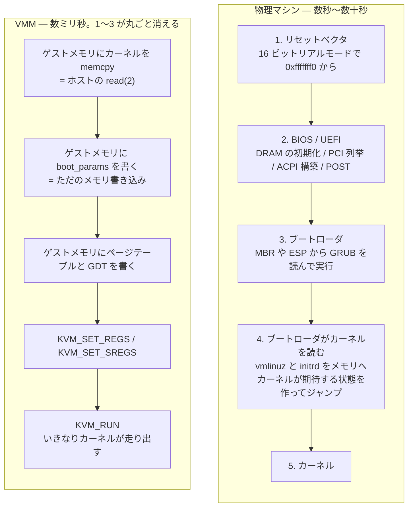
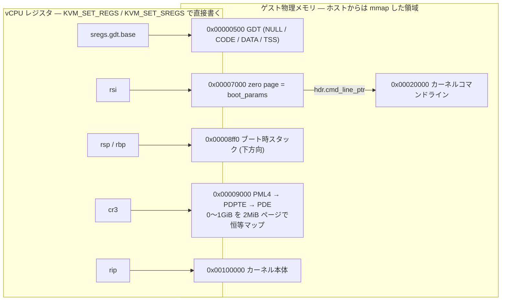
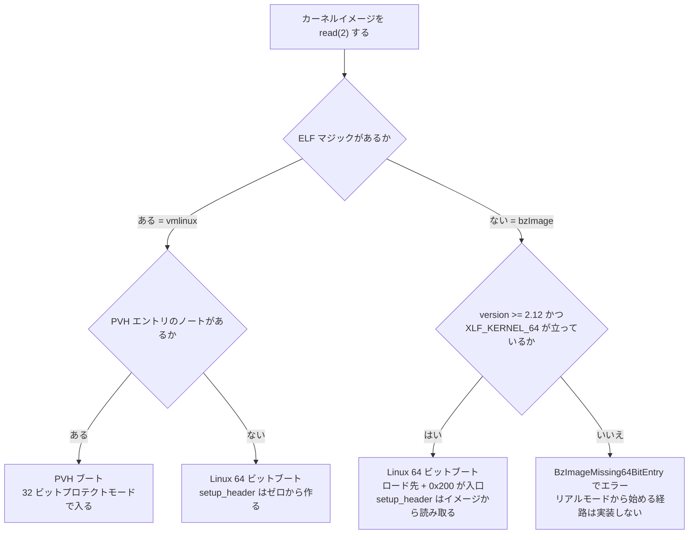

microVM の売りは起動の速さだ。Firecracker の仕様書は「`InstanceStart` API リクエストを受けてからゲストの `/sbin/init` が始まるまで 125 ms 以下」を要件として掲げている ([`SPECIFICATION.md`](https://github.com/firecracker-microvm/firecracker/blob/cc535f035f3828b2c5bfc85276c5d394022ed220/SPECIFICATION.md))。物理マシンの起動が数十秒かかることを思えば桁が 2 つ違う。

からくりの半分は「エミュレートするデバイスをほとんど持たない」ことにあるが、もう半分は**起動の前半を丸ごと飛ばしている**ことにある。このページはそれがどういうことかを見る。

## 物理マシンは何をしているのか

x86 の PC の電源を入れると、こうなる。

1. **リセットベクタ**。CPU は 16 ビットのリアルモードで、`0xfffffff0` (物理アドレス空間の上端付近) から実行を始める。ここにはファームウェアの ROM がマップされている。
2. **BIOS / UEFI**。メモリコントローラの初期化、DRAM の学習と training、PCI バスの列挙とリソース割り当て、ACPI テーブルの構築、そして POST (Power-On Self-Test)。サーバ機だとここだけで 10 秒から数十秒かかる。
3. **ブートローダ**。ファームウェアがブートデバイスの先頭セクタ (MBR) や EFI システムパーティションから、GRUB のようなブートローダを読み込んで実行する。
4. **ブートローダがカーネルを読む**。ディスク上の `vmlinuz` をメモリに読み込み、`initrd` も読み込み、カーネルコマンドラインを組み立て、**カーネルが期待する状態**を用意してカーネルのエントリポイントにジャンプする。
5. **カーネル**。自己展開して、メモリマップを読んで、デバイスを初期化して、`init` を起動する。

VMM から見ると、1〜3 は**全部無駄**だ。ハードウェアの初期化は要らない (仮想のハードウェアは VMM が作るときにもう初期化されている)。ディスクからカーネルを読み込むのも要らない (ホストのファイルシステムにカーネルイメージが置いてあり、VMM はそれを普通に `read(2)` できる)。

そして決定的なのは、**VMM はゲスト物理メモリに直接書き込める**ことだ。ゲスト物理メモリはホスト側の `mmap` した領域だった。カーネルイメージを所定のアドレスに `memcpy` すればいい。さらに **vCPU のレジスタも直接設定できる**。`KVM_SET_REGS` と `KVM_SET_SREGS` で、`rip` も `rsp` も `cr3` も好きな値にできる。

つまり VMM は、**手順 4 の「ブートローダがカーネルにジャンプする直前の状態」を、いきなり作れる**。1〜3 が消え、4 が `read` と `memcpy` と数本の ioctl になる。



## 「カーネルが期待する状態」とは何か

飛ばせるとは言っても、**カーネルが何を前提にしているかは正確に知る必要がある**。ブートローダが暗黙にやっていた仕事を、VMM が代わりにやることになるからだ。

Linux の場合、その契約が **Linux/x86 boot protocol** として文書化されている (カーネルソースの `Documentation/arch/x86/boot.rst`)。エントリポイントは 3 つある。

- **16 ビットのリアルモードエントリ**。最も古い。ブートローダはほぼ何も準備しなくていい代わりに、カーネル側の `setup.bin` がリアルモードから始めて全部やる。
- **32 ビットのプロテクトモードエントリ**。ページングオフ、フラットセグメント。
- **64 ビットのロングモードエントリ** (boot protocol 2.12 以降)。**すでにロングモードで、ページングが有効で、GDT が設定済み**であることを要求する。

VMM が使うのは 3 番目だ。リアルモードから始めさせると、カーネル側の初期化コードがセグメントレジスタをいじりながら段階的にモードを切り替えていく — これは実機のファームウェアがある世界での互換性のための遠回りで、VMM には意味がない。

代わりに、VMM が次を用意することになる。

### 1. ページテーブル

ロングモードはページングなしでは動かない。だから VMM が 4 階層のページテーブルをゲスト物理メモリ上に組み立て、`cr3` にその先頭を入れておく必要がある。

必要なのはカーネルが自前のページテーブルを作るまでの間だけなので、**恒等マッピング (仮想アドレス = 物理アドレス) を最低限の範囲だけ**張れば足りる。

### 2. GDT (Global Descriptor Table)

x86 のセグメントはロングモードではほぼ無効化されるが、それでも「コードセグメント」「データセグメント」の記述子は必要で、CS には `L` ビット (64 ビットコード) が立っていなければならない。VMM はゲストメモリに GDT を書き、`sregs.gdt.base` を指し、各セグメントレジスタに対応する記述子の内容を入れる。

### 3. boot_params (zero page)

カーネルは、ブートローダから引き継ぐ情報を **1 ページの構造体**で受け取る。これが `struct boot_params` で、慣習的に **zero page** と呼ばれる (ゼロ埋めして渡すことに由来する)。64 ビットエントリでは **`rsi` レジスタがこの構造体の物理アドレスを指している**ことが契約になっている。

中身の主なものは次のとおり。

- **`hdr` (`struct setup_header`)**: プロトコルバージョン、ローダの種別 (`type_of_loader`)、カーネルの必要アライメント、そして次の 2 組のポインタ。
  - `cmd_line_ptr` / `cmdline_size`: カーネルコマンドライン文字列の物理アドレスと長さ。`console=ttyS0 reboot=k panic=1` のような文字列を、VMM が別のアドレスに置いてここから指す。
  - `ramdisk_image` / `ramdisk_size`: initrd の物理アドレスと長さ。
- **`e820_table` / `e820_entries`**: **e820 メモリマップ**。実機では BIOS の `INT 15h, AX=E820h` が返していた「物理アドレス空間のどこが使える RAM で、どこが予約か」の一覧だ。VMM はファームウェアを持たないので、これを自分で組み立てて渡す。カーネルはこれを見て自分の物理メモリアロケータを初期化する。
- **`acpi_rsdp_addr`**: ACPI テーブルの起点となる RSDP のアドレス。実機ではカーネルが低位メモリを走査して探すが、直接教えれば探索を省ける。

### bzImage と vmlinux

カーネルイメージには 2 つの形がある。

- **`vmlinux`**: 素の ELF 実行ファイル。圧縮なし。セクションヘッダを見ればどのアドレスに何をロードすればいいかが書いてある。
- **`bzImage`**: 配布されるのはこちら。先頭にリアルモード用の setup コード (`setup.bin`) が付き、その中に **setup_header が埋め込まれている**。本体は圧縮されていて、実行時に自己展開する。

VMM から見た違いは、**setup_header を自分で作るか、イメージから読み取るか**だ。`bzImage` はイメージ自身が「私はプロトコルバージョン 2.15 です、アライメントは 2 MiB です、64 ビットエントリを持っています」と申告しているので、それを尊重して zero page に転記する。`vmlinux` にはその情報がないので、VMM がゼロから最小限のヘッダを作る。

## Firecracker ではどこに出てくるか

### 固定アドレスの一覧

Firecracker は低位メモリのレイアウトを定数で固定している ([`src/vmm/src/arch/x86_64/layout.rs`](https://github.com/firecracker-microvm/firecracker/blob/cc535f035f3828b2c5bfc85276c5d394022ed220/src/vmm/src/arch/x86_64/layout.rs))。

```rust title="src/vmm/src/arch/x86_64/layout.rs"
/// Initial stack for the boot CPU.
pub const BOOT_STACK_POINTER: u64 = 0x8ff0;

/// Kernel command line start address.
pub const CMDLINE_START: u64 = 0x20000;
/// Kernel command line maximum size.
pub const CMDLINE_MAX_SIZE: usize = 2048;

/// Start of the high memory.
pub const HIMEM_START: u64 = 0x0010_0000; // 1 MB.
...
/// The 'zero page', a.k.a linux kernel bootparams.
pub const ZERO_PAGE_START: u64 = 0x7000;
```

これに `regs.rs` 側の定数 ([`src/vmm/src/arch/x86_64/regs.rs#L20-L22`](https://github.com/firecracker-microvm/firecracker/blob/cc535f035f3828b2c5bfc85276c5d394022ed220/src/vmm/src/arch/x86_64/regs.rs#L20-L22), [`#L163-L166`](https://github.com/firecracker-microvm/firecracker/blob/cc535f035f3828b2c5bfc85276c5d394022ed220/src/vmm/src/arch/x86_64/regs.rs#L163-L166)) を合わせると、最初の 1 MiB がこう埋まる。

```
  0x00000500  GDT (4 エントリ = 32 バイト)
  0x00000520  IDT (中身は 0)
  0x00006000  hvm_start_info    ← PVH ブート用。Linux ブートでは未使用
  0x00007000  zero page (boot_params)                     … rsi が指す
  0x00008ff0  ブート時スタックポインタ (下方向に伸びる)     … rsp/rbp
  0x00009000  PML4  (4 階層ページテーブルの最上位)          … cr3 が指す
  0x0000a000  PDPTE
  0x0000b000  PDE (512 エントリ × 2 MiB = 1 GiB を恒等マップ)
  0x00020000  カーネルコマンドライン (最大 2048 バイト)
  0x0009fc00  システムデータ (MPTable, ACPI テーブル)
  0x000e0000  RSDP
  0x00100000  カーネル本体                                … rip が指す (相当)
```

`HIMEM_START = 1 MiB` から上にカーネルを置くのは PC の伝統だ。最初の 1 MiB はリアルモードでアクセスできる範囲で、歴史的に BIOS のデータ領域や VGA バッファが散らばっている。Linux はそこを避ける。

レジスタとこのレイアウトの対応を取ると、VMM が用意する「カーネルが期待する状態」の全体が 1 枚に収まる。



### カーネルを読み込む

`load_kernel` が ELF を試して、失敗したら bzImage にフォールバックする ([`src/vmm/src/arch/x86_64/mod.rs#L496-L566`](https://github.com/firecracker-microvm/firecracker/blob/cc535f035f3828b2c5bfc85276c5d394022ed220/src/vmm/src/arch/x86_64/mod.rs#L496-L566))。

```rust title="src/vmm/src/arch/x86_64/mod.rs"
    // Try to load the image as an ELF (vmlinux); if it has no ELF magic,
    // we try to load it as a bzImage.
    match ElfLoader::load(guest_memory, None, &mut kernel_file, highmem_start) {
        Ok(elf_result) => {
            let mut entry_point_addr: GuestAddress = elf_result.kernel_load;
            let mut boot_prot: BootProtocol = BootProtocol::LinuxBoot;
            if let PvhBootCapability::PvhEntryPresent(pvh_entry_addr) = elf_result.pvh_boot_cap {
                // Use the PVH kernel entry point to boot the guest
                entry_point_addr = pvh_entry_addr;
                boot_prot = BootProtocol::PvhBoot;
            }
```

ローダ自体は `linux-loader` クレート ([rust-vmm](../rust-vmm-dependency/) の一部) の実装で、Firecracker はそれを呼ぶだけだ。ELF の場合は PVH エントリポイントの有無を見て、あれば **もう 1 つの入口**である PVH ブートプロトコルに切り替える。これは [PVH ブート](../pvh-boot/) で扱うので、ここでは「ELF には 2 つ目の入口が埋まっていることがある」とだけ覚えておけばいい。

bzImage 側は明示的に 64 ビットエントリを要求する。

```rust title="src/vmm/src/arch/x86_64/mod.rs"
            // We jump to the 64-bit entry point, which only exists when the
            // image advertises it via XLF_KERNEL_64 (boot protocol >= 2.12).
            let hdr = bzimage_result
                .setup_header
                .expect("bzImage load always yields a setup header");
            if hdr.version < 0x020c || hdr.xloadflags & XLF_KERNEL_64 == 0 {
                return Err(ConfigurationError::BzImageMissing64BitEntry);
            }

            // Enter at the 64-bit entry point (BZIMAGE_64BIT_ENTRY_OFFSET
            // past the load address); the setup header seeds the zero page.
            let entry_addr = bzimage_result
                .kernel_load
                .checked_add(BZIMAGE_64BIT_ENTRY_OFFSET)
```

`BZIMAGE_64BIT_ENTRY_OFFSET` は `0x200` で、「ロード先アドレス + 0x200 が 64 ビットエントリ」というのが boot protocol の定めだ。プロトコル 2.12 未満のカーネルは**そもそも起動できない**として弾く。互換性の裾野を切って、リアルモードから始める経路を実装しないという判断になっている。

入口の選び方をまとめるとこうなる。



### zero page を組み立てる

`configure_64bit_boot` が boot_params を作ってゲストメモリに書く ([`src/vmm/src/arch/x86_64/mod.rs#L397-L470`](https://github.com/firecracker-microvm/firecracker/blob/cc535f035f3828b2c5bfc85276c5d394022ed220/src/vmm/src/arch/x86_64/mod.rs#L397-L470))。

```rust title="src/vmm/src/arch/x86_64/mod.rs"
    // A bzImage carries its own setup header; for ELF there is none, so
    // start from a zeroed header with the minimum required alignment.
    let mut hdr = setup_header.unwrap_or_else(|| setup_header {
        kernel_alignment: KERNEL_MIN_ALIGNMENT_BYTES,
        ..Default::default()
    });
    hdr.type_of_loader = KERNEL_LOADER_OTHER;
    hdr.boot_flag = KERNEL_BOOT_FLAG_MAGIC;
    hdr.header = KERNEL_HDR_MAGIC;
    hdr.cmd_line_ptr = u32::try_from(cmdline_addr.raw_value()).unwrap();
    hdr.cmdline_size = u32::try_from(cmdline_size).unwrap();
    if let Some(initrd_config) = initrd {
        hdr.ramdisk_image = u32::try_from(initrd_config.address.raw_value()).unwrap();
        hdr.ramdisk_size = u32::try_from(initrd_config.size).unwrap();
    }
```

上で説明した契約が 1 対 1 で現れている。`KERNEL_HDR_MAGIC = 0x5372_6448` は ASCII で `"HdrS"`、`KERNEL_BOOT_FLAG_MAGIC = 0xaa55` は MBR の末尾に付く伝統的な署名だ。`KERNEL_LOADER_OTHER = 0xff` は「登録されたブートローダ ID を持たないローダ」を意味する。

initrd の扱いは「ポインタと長さを 2 つ書くだけ」で終わっている。**VMM がやるのはメモリに置いて場所を教えることだけ**で、展開はカーネルの仕事だ。置き場所は低位メモリ領域の末尾から逆算する ([`src/vmm/src/arch/x86_64/mod.rs#L166-L179`](https://github.com/firecracker-microvm/firecracker/blob/cc535f035f3828b2c5bfc85276c5d394022ed220/src/vmm/src/arch/x86_64/mod.rs#L166-L179))。

e820 マップの組み立てはこうなる。

```rust title="src/vmm/src/arch/x86_64/mod.rs"
    // We mark first [0x0, SYSTEM_MEM_START) region as usable RAM and the subsequent
    // [SYSTEM_MEM_START, (SYSTEM_MEM_START + SYSTEM_MEM_SIZE)) as reserved (note
    // SYSTEM_MEM_SIZE + SYSTEM_MEM_SIZE == HIMEM_START).
    add_e820_entry(&mut params, 0, layout::SYSTEM_MEM_START, E820_RAM)?;
    add_e820_entry(
        &mut params,
        layout::SYSTEM_MEM_START,
        layout::SYSTEM_MEM_SIZE,
        E820_RESERVED,
    )?;
    add_e820_entry(
        &mut params,
        PCI_MMCONFIG_START,
        PCI_MMCONFIG_SIZE,
        E820_RESERVED,
    )?;

    for region in guest_mem
        .iter()
        .filter(|region| region.region_type == GuestRegionType::Dram)
    {
        // the first 1MB is reserved for the kernel
        let addr = max(himem_start, region.start_addr());
```

**実機の BIOS が返していた表を、VMM が手で書いている**。`0x9fc00` 以降を予約にするのは、そこに MPTable と ACPI テーブルを置くからだ。PCIe の設定空間も予約にする。そして残りは、実際に登録したメモリスロット (`GuestRegionType::Dram` のリージョン) をそのまま RAM として並べる。

**ゲストが「自分は何 GiB のメモリを持っている」と認識する根拠は、このテーブルだけ**だ。KVM のメモリスロットは KVM 内部の話で、ゲストのカーネルには見えない。前のページで登録したスロットと、ここで書く e820 の内容が食い違えば、ゲストは存在しないメモリを使おうとするか、あるメモリを使わないかのどちらかになる。

書き込み先が zero page だ。

```rust title="src/vmm/src/arch/x86_64/mod.rs"
    LinuxBootConfigurator::write_bootparams(
        &BootParams::new(&params, GuestAddress(layout::ZERO_PAGE_START)),
        guest_mem,
    )
```

### レジスタを「カーネルが期待する状態」にする

vCPU ごとに 4 つの関数が呼ばれる ([`src/vmm/src/arch/x86_64/vcpu.rs#L293-L303`](https://github.com/firecracker-microvm/firecracker/blob/cc535f035f3828b2c5bfc85276c5d394022ed220/src/vmm/src/arch/x86_64/vcpu.rs#L293-L303))。

```rust title="src/vmm/src/arch/x86_64/vcpu.rs"
    pub fn configure_boot_state(
        &self,
        guest_mem: &GuestMemoryMmap,
        kernel_entry_point: EntryPoint,
    ) -> Result<(), KvmVcpuConfigureError> {
        crate::arch::x86_64::regs::setup_regs(&self.fd, kernel_entry_point)?;
        crate::arch::x86_64::regs::setup_fpu(&self.fd)?;
        crate::arch::x86_64::regs::setup_sregs(guest_mem, &self.fd, kernel_entry_point.protocol)?;
        crate::arch::x86_64::interrupts::set_lint(&self.fd)?;
        Ok(())
    }
```

汎用レジスタの設定が boot protocol の契約そのものだ ([`src/vmm/src/arch/x86_64/regs.rs#L86-L113`](https://github.com/firecracker-microvm/firecracker/blob/cc535f035f3828b2c5bfc85276c5d394022ed220/src/vmm/src/arch/x86_64/regs.rs#L86-L113))。

```rust title="src/vmm/src/arch/x86_64/regs.rs"
        BootProtocol::LinuxBoot => kvm_regs {
            // Configure regs as required by Linux 64-bit boot protocol.
            rflags: 0x0000_0000_0000_0002u64,
            rip: entry_point.entry_addr.raw_value(),
            ...
            rsp: super::layout::BOOT_STACK_POINTER,
            // Starting stack pointer.
            rbp: super::layout::BOOT_STACK_POINTER,
            // Must point to zero page address per Linux ABI. This is x86_64 specific.
            rsi: super::layout::ZERO_PAGE_START,
            ..Default::default()
        },
```

`rsi` に zero page のアドレス。コメントが「Linux ABI により必須」と明記している。`rflags` の `0x2` はビット 1 で、x86 では**常に 1 でなければならない予約ビット**だ。

GDT はゲストメモリに書いてから `sregs` に反映する ([`src/vmm/src/arch/x86_64/regs.rs#L196-L256`](https://github.com/firecracker-microvm/firecracker/blob/cc535f035f3828b2c5bfc85276c5d394022ed220/src/vmm/src/arch/x86_64/regs.rs#L196-L256))。

```rust title="src/vmm/src/arch/x86_64/regs.rs"
        BootProtocol::LinuxBoot => {
            // Configure GDT entries as specified by Linux 64bit boot protocol
            [
                gdt_entry(0, 0, 0),            // NULL
                gdt_entry(0xa09b, 0, 0xfffff), // CODE
                gdt_entry(0xc093, 0, 0xfffff), // DATA
                gdt_entry(0x808b, 0, 0xfffff), // TSS
            ]
        }
    ...
    write_gdt_table(&gdt_table[..], mem)?;
    sregs.gdt.base = BOOT_GDT_OFFSET;
    sregs.gdt.limit = u16::try_from(mem::size_of_val(&gdt_table)).unwrap() - 1;
    ...
        BootProtocol::LinuxBoot => {
            // 64-bit protected mode
            sregs.cr0 |= X86_CR0_PE;
            sregs.efer |= EFER_LME | EFER_LMA;
        }
```

`0xa09b` のうち `a` の中の 1 ビットが `L` ビット (64 ビットコードセグメント) で、これがロングモードの CS の条件になる。`EFER_LME` (Long Mode Enable) と `EFER_LMA` (Long Mode Active) を立て、`CR0.PE` (Protected Mode Enable) を立てる — 実機なら CPU が段階を追って遷移する状態を、**KVM の ioctl で一気に作っている**。PVH の分岐が `cr0 = PE | ET` だけで `efer` を触らないのは、PVH が 32 ビットプロテクトモードで入るからだ。

ページテーブルは 3 レベル分を書くだけで済んでいる ([`src/vmm/src/arch/x86_64/regs.rs#L258-L282`](https://github.com/firecracker-microvm/firecracker/blob/cc535f035f3828b2c5bfc85276c5d394022ed220/src/vmm/src/arch/x86_64/regs.rs#L258-L282))。

```rust title="src/vmm/src/arch/x86_64/regs.rs"
    // Entry covering VA [0..512GB)
    mem.write_obj(boot_pdpte_addr.raw_value() | 0x03, boot_pml4_addr)
        .map_err(|_| RegsError::WritePML4Address)?;

    // Entry covering VA [0..1GB)
    mem.write_obj(boot_pde_addr.raw_value() | 0x03, boot_pdpte_addr)
        .map_err(|_| RegsError::WritePDPTEAddress)?;
    // 512 2MB entries together covering VA [0..1GB). Note we are assuming
    // CPU supports 2MB pages (/proc/cpuinfo has 'pse'). All modern CPUs do.
    for i in 0..512 {
        mem.write_obj((i << 21) + 0x83u64, boot_pde_addr.unchecked_add(i * 8))
            .map_err(|_| RegsError::WritePDEAddress)?;
    }

    sregs.cr3 = boot_pml4_addr.raw_value();
    sregs.cr4 |= X86_CR4_PAE;
    sregs.cr0 |= X86_CR0_PG;
```

**PML4 は 1 エントリ、PDPTE も 1 エントリ、PDE が 512 エントリ**。4 階層の最下段 (PTE) は作らず、PDE で `0x80` (Page Size ビット) を立てて 2 MiB ページにしている。これで仮想アドレス 0〜1 GiB が物理アドレス 0〜1 GiB に恒等マップされる。`0x03` / `0x83` の下位ビットは Present と Read/Write だ。

書き込むページは 3 枚 (`0x9000`, `0xa000`, `0xb000`) で、合計 12 KiB。**カーネルが自前のページテーブルを構築するまでの数ミリ秒だけ生きればいい**ので、これで足りる。1 GiB を超える範囲は、カーネルが e820 マップを見て自分でマップし直す。

ゲストのメモリが 1 GiB を超えていても問題ないのは、カーネルの初期コードが恒等マップされた低位アドレスだけで動くからだ。ただし、そういう前提に依存しているという事実自体は覚えておく価値がある。`vcpu_count` が複数でも、この関数は全 vCPU に対して同じ内容を書く ([`src/vmm/src/arch/x86_64/regs.rs#L155-L157`](https://github.com/firecracker-microvm/firecracker/blob/cc535f035f3828b2c5bfc85276c5d394022ed220/src/vmm/src/arch/x86_64/regs.rs#L155-L157) に `TODO(dgreid) - Can this be done once per system instead?` というコメントが残っている)。

### 全体の組み立て順

`configure_system_for_boot` が全部をまとめている ([`src/vmm/src/arch/x86_64/mod.rs#L235-L303`](https://github.com/firecracker-microvm/firecracker/blob/cc535f035f3828b2c5bfc85276c5d394022ed220/src/vmm/src/arch/x86_64/mod.rs#L235-L303))。

```rust title="src/vmm/src/arch/x86_64/mod.rs"
    configure_vcpus_for_boot(...)?;

    // Write the kernel command line to guest memory. This is x86_64 specific, since on
    // aarch64 the command line will be specified through the FDT.
    ...
    load_cmdline(
        vm.guest_memory(),
        GuestAddress(crate::arch::x86_64::layout::CMDLINE_START),
        &boot_cmdline,
    )
    ...
    match entry_point.protocol {
        BootProtocol::PvhBoot => {
            configure_pvh(vm.guest_memory(), GuestAddress(CMDLINE_START), initrd)?;
        }
        BootProtocol::LinuxBoot => {
            configure_64bit_boot(...)?;
        }
    }
```

コマンドラインの渡し方がアーキテクチャによって違うことがコメントで明示されている。x86_64 は「メモリに置いて zero page から指す」、aarch64 は「Device Tree (FDT) に埋める」。x86 に boot protocol という独自の契約があるのは歴史的な事情で、後発の aarch64 は Device Tree という汎用の仕組みに寄せた、と読める。

そして分岐の片方が PVH だ。同じカーネルイメージでも入口が 2 つあり、Firecracker は使える方を選ぶ。なぜ 2 つ目の入口の方が速いのか、そして何を犠牲にしているのかは [PVH ブート](../pvh-boot/) で扱う。

## この先

ゲストは走り出したが、まだ何も見えていない。カーネルは e820 マップからメモリの量を知り、コマンドラインを読んだが、**ディスクもネットワークも「そこにある」ことを知らない**。virtio-MMIO デバイスは PCI バスにいないので、列挙では見つからない。

ゲストにデバイスの存在を教える手段 — カーネルコマンドライン、MPTable、ACPI、Device Tree — の選択が、そのまま起動時間に効いてくる。[ゲストのハードウェア探索](../guest-hardware-discovery/) の主題だ。
