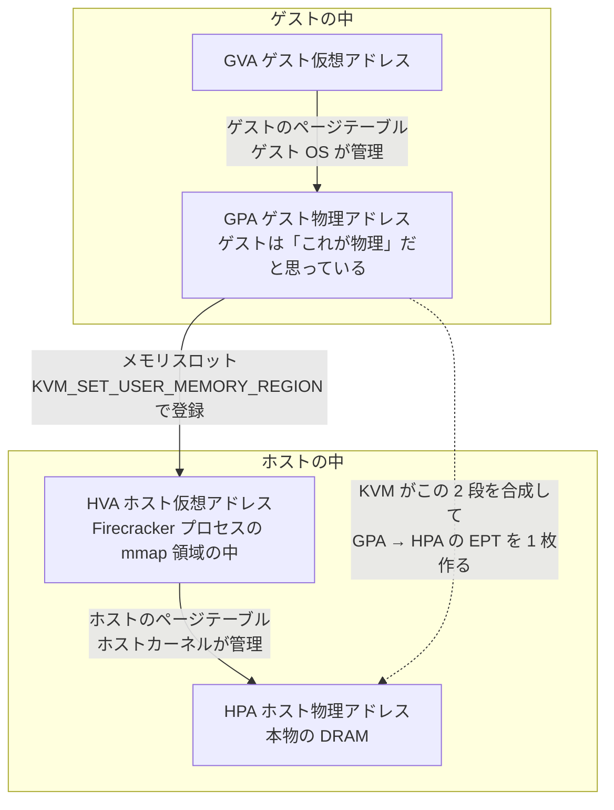
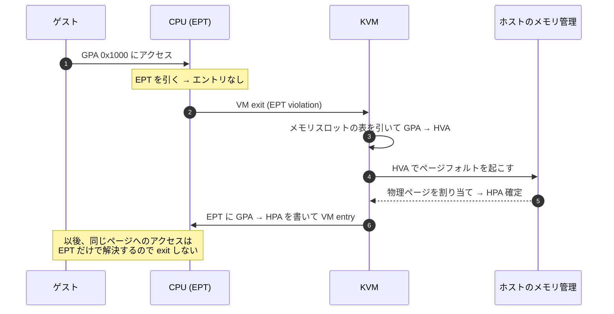

## 「ゲストの物理メモリ」の正体

[前のページ](../kvm-api/)で、KVM は CPU とメモリの仮想化を担当し、ゲストメモリの確保はユーザースペースの仕事だと書いた。その「確保」の実体はこれだけだ。

```c
mmap(NULL, 128 * 1024 * 1024, PROT_READ | PROT_WRITE,
     MAP_PRIVATE | MAP_ANONYMOUS, -1, 0);
```

**ゲストが物理メモリだと思っているものは、ホストでは Firecracker プロセスのただの匿名 mmap 領域だ。** 特別なドライバも特別なフラグも要らない。Firecracker のコードでも、そのまま `libc::mmap` を呼んでいる。

```rust title="src/vmm/src/vstate/memory.rs"
        // SAFETY: anonymous private mapping with no fd; does not alias existing memory.
        // The returned region is PROT_NONE (inaccessible) until the caller re-maps it.
        let ptr = unsafe {
            libc::mmap(
                std::ptr::null_mut(),
                alloc_size,
                libc::PROT_NONE,
                hugetlb_flags | libc::MAP_PRIVATE | libc::MAP_NORESERVE | libc::MAP_ANONYMOUS,
                -1,
                0,
            )
        };
```

[`src/vmm/src/vstate/memory.rs#L179-L190`](https://github.com/firecracker-microvm/firecracker/blob/cc535f035f3828b2c5bfc85276c5d394022ed220/src/vmm/src/vstate/memory.rs#L179-L190)

この帰結が 3 つある。

- **デマンドページングされる。** `MAP_NORESERVE` 付きの匿名マッピングなので、mmap した瞬間には物理ページが 1 枚も割り当てられない。ゲストが実際に触ったページだけが、そのときのページフォルトで割り当てられる。README の「Demand fault paging and CPU oversubscription enabled by default」はこれだ。
- **ホストのメモリ管理がそのまま効く。** swap に出せるし、`madvise` で挙動を変えられるし、`mincore(2)` で常駐ページを問い合わせられる。THP や hugetlbfs もそのまま使える（[hugepages](../hugepages/)）。
- **Firecracker はゲストメモリを普通のポインタとして読み書きできる。** virtio のデータ転送も、カーネルイメージのロードも、スナップショットの書き出しも、全部この領域への通常のメモリアクセスだ。

なお、実際に使うマッピングを作る `memory::anonymous()` は `(GuestAddress, usize)` の**列**を受け取る（[`memory.rs#L886-L898`](https://github.com/firecracker-microvm/firecracker/blob/cc535f035f3828b2c5bfc85276c5d394022ed220/src/vmm/src/vstate/memory.rs#L886-L898)）。ゲスト物理アドレス空間は 1 本の連続領域ではない。

## メモリスロット：GPA と HVA の対応表

mmap しただけではゲストからは何も見えない。「ゲスト物理アドレスのここは、ホスト仮想アドレスのここだ」という対応を KVM に登録する必要がある。それが `KVM_SET_USER_MEMORY_REGION` ioctl（vm fd 階層）で、登録の単位を **メモリスロット (memslot)** と呼ぶ。

渡す構造体はフィールド 5 つだけだ。

```rust title="src/vmm/src/vstate/memory.rs"
impl From<&GuestMemorySlot<'_>> for kvm_userspace_memory_region {
    fn from(mem_slot: &GuestMemorySlot) -> Self {
        let flags = if mem_slot.slice.bitmap().is_some() {
            KVM_MEM_LOG_DIRTY_PAGES
        } else {
            0
        };
        kvm_userspace_memory_region {
            flags,
            slot: mem_slot.slot,
            guest_phys_addr: mem_slot.guest_addr.raw_value(),
            memory_size: mem_slot.slice.len() as u64,
            userspace_addr: mem_slot.slice.ptr_guard().as_ptr() as u64,
        }
    }
}
```

[`src/vmm/src/vstate/memory.rs#L423-L438`](https://github.com/firecracker-microvm/firecracker/blob/cc535f035f3828b2c5bfc85276c5d394022ed220/src/vmm/src/vstate/memory.rs#L423-L438)

`slot` はスロット番号（この番号で後から更新・削除する）、`guest_phys_addr` と `memory_size` がゲスト物理アドレス (GPA) 側の範囲、`userspace_addr` が対応するホスト仮想アドレス (HVA) の開始位置、`flags` はオプションだ。

`userspace_addr` が **ホスト物理アドレスではなくホスト仮想アドレス** である点が肝だ。KVM は Firecracker プロセスのアドレス空間の一部を、ゲストの物理メモリとして採用する。だからホスト側でそのページが swap out されていても、まだ物理ページが割り当てられていなくても構わない。

## GPA → HVA → HPA という 3 段の住所

ここで [VT-x のページ](../hardware-virtualization/)で見た EPT がつながる。



住所は 3 段ある。ところが EPT は GPA → HPA の 1 段だ。この差はどこで埋まるのか。**KVM が GPA → HVA → HPA を合成して、GPA → HPA という 1 枚の EPT を作る。** ゲストが未マップの GPA に触ると EPT violation で VM exit し、KVM はそのハンドラでメモリスロットの表を引いて HVA を求め、ホスト側のページフォルトを起こして HPA を確定させ、EPT にエントリを埋めてからゲストに戻す。以後、同じページへのアクセスは EPT だけで解決するので exit しない。



つまり **メモリスロットは EPT を組み立てるための材料** で、Firecracker が「ここからここまではメモリだ」と宣言し、KVM が実際のページテーブルを構築する。前ページで見た「KVM が CPU とメモリの仮想化を担当する」という線引きそのままだ。

Firecracker 側で ioctl を呼んでいるのはこの 1 箇所だけだ。

```rust title="src/vmm/src/vstate/vm.rs"
    pub(crate) fn set_user_memory_region(
        &self,
        region: kvm_userspace_memory_region,
    ) -> Result<(), VmError> {
        // SAFETY: Safe because the fd is a valid KVM file descriptor.
        unsafe {
            self.fd()
                .set_user_memory_region(region)
                .map_err(VmError::SetUserMemoryRegion)
        }
    }
```

[`src/vmm/src/vstate/vm.rs#L420-L430`](https://github.com/firecracker-microvm/firecracker/blob/cc535f035f3828b2c5bfc85276c5d394022ed220/src/vmm/src/vstate/vm.rs#L420-L430)

`kvm-ioctls` のこのメソッドが `unsafe` なのは、`userspace_addr` に渡したアドレスが本当に有効なマッピングを指しているかをコンパイラが検証できないからだ。ここを間違えると、Firecracker プロセスの無関係なメモリがゲストに物理メモリとして露出しうる。

## スロットには番号と上限がある

同じ番号で `KVM_SET_USER_MEMORY_REGION` を呼び直せば上書き更新になり、`memory_size` を 0 にすれば削除になる。そして **スロット数には上限がある**。`KVM_CAP_NR_MEMSLOTS` で問い合わせる値で、ホストカーネルのバージョンによって変わる。Firecracker は起動時に取得して `VmCommon::max_memslots` に保持し（`Kvm::max_nr_memslots`、[`vstate/kvm.rs#L82-L88`](https://github.com/firecracker-microvm/firecracker/blob/cc535f035f3828b2c5bfc85276c5d394022ed220/src/vmm/src/vstate/kvm.rs#L82-L88)）、番号は `next_kvm_slot` がアトミックカウンタで払い出す。`fetch_add` した結果が `max_memslots` 以上なら `None` を返す、というだけの関数だ（[`vm.rs#L407-L418`](https://github.com/firecracker-microvm/firecracker/blob/cc535f035f3828b2c5bfc85276c5d394022ed220/src/vmm/src/vstate/vm.rs#L407-L418)）。払い出しに失敗すると `VmError::NotEnoughMemorySlots(max)` になり、「スロットは有限資源」という事実がエラー型のレベルで表に出る。

上限を気にする必要があるのは、Firecracker がゲストメモリを 1 スロットで表していないからだ。後述の MMIO の穴で DRAM が複数領域に分かれるうえ、[メモリホットプラグ](../virtio-mem/)では 1 つの mmap 領域を固定サイズのスロットに切り、必要な分だけ KVM に登録する。`GuestRegionMmapExt` が `slot_from` / `slot_size` と「どのスロットが登録済みか」を表す bitvec (`plugged`) を持っているのはそのためだ（[`memory.rs#L396-L410`](https://github.com/firecracker-microvm/firecracker/blob/cc535f035f3828b2c5bfc85276c5d394022ed220/src/vmm/src/vstate/memory.rs#L396-L410)）。

登録の実処理はこう分岐する。

```rust title="src/vmm/src/vstate/vm.rs"
        region
            .slots()
            .try_for_each(|(ref slot, plugged)| match plugged {
                // if the slot is plugged, add it to kvm user memory regions
                true => self.set_user_memory_region(slot.into()),
                // if the slot is not plugged, protect accesses to it
                false => slot.protect(true).map_err(VmError::MemoryError),
            })?;
```

[`src/vmm/src/vstate/vm.rs#L432-L450`](https://github.com/firecracker-microvm/firecracker/blob/cc535f035f3828b2c5bfc85276c5d394022ed220/src/vmm/src/vstate/vm.rs#L432-L450)

未登録のスロットは、ホスト側のマッピングを `PROT_NONE` にして触れなくする。KVM に登録していないのでゲストからはそもそも見えないが、加えてホスト側からも触れなくすることで、Firecracker 自身のバグでゲストに見せていない領域を読み書きする事故を防いでいる。

## MMIO ギャップ：わざと開けた穴

では、なぜゲストの DRAM が複数領域に分かれるのか。**MMIO のためにアドレス空間に穴を開けているから**だ。

[VT-x のページ](../hardware-virtualization/)で見たとおり、MMIO は「EPT にマップしない GPA」として実現される。ゲストがそこに書き込むと VM exit して、Firecracker のデバイスモデルが処理する。つまりデバイスを置くアドレス範囲には**メモリスロットを登録してはいけない**。

x86 の物理アドレス空間には、歴史的に決まった「デバイスがいる場所」がある。LAPIC は `0xfee00000`、IOAPIC は `0xfec00000`、PCI の設定空間や BAR は 4GiB 境界のすぐ下。ゲスト Linux はこれを前提にしているので、その配置に従う必要がある。

```rust title="src/vmm/src/arch/x86_64/layout.rs"
/// First address that cannot be addressed using 32 bit anymore.
pub const FIRST_ADDR_PAST_32BITS: u64 = 1 << 32;

/// The size of the memory area reserved for MMIO 32-bit accesses.
pub const MMIO32_MEM_SIZE: u64 = mib_to_bytes(1024) as u64;
/// The start of the memory area reserved for MMIO 32-bit accesses.
pub const MMIO32_MEM_START: u64 = FIRST_ADDR_PAST_32BITS - MMIO32_MEM_SIZE;
```

[`src/vmm/src/arch/x86_64/layout.rs#L94-L100`](https://github.com/firecracker-microvm/firecracker/blob/cc535f035f3828b2c5bfc85276c5d394022ed220/src/vmm/src/arch/x86_64/layout.rs#L94-L100)

4GiB のすぐ下、`0xC0000000` から `0x100000000` までの 1GiB が 32 ビット MMIO 用の穴になる。同じファイルにはもう 1 つ、`MMIO64_MEM_START = 256 << 30` から `MMIO64_MEM_SIZE = 256 << 30` という 64 ビット側の穴も定義されている（[`layout.rs#L122-L126`](https://github.com/firecracker-microvm/firecracker/blob/cc535f035f3828b2c5bfc85276c5d394022ed220/src/vmm/src/arch/x86_64/layout.rs#L122-L126)）。PCIe デバイスの 64 ビット BAR のための場所だ。

穴を避けて DRAM を配置するロジックは、穴 1 つぶんの処理としてアーキテクチャ非依存の関数に切り出されている。

```rust title="src/vmm/src/arch/mod.rs"
fn arch_memory_regions_with_gap(
    regions: &mut Vec<(GuestAddress, usize)>,
    region_start: usize,
    region_size: usize,
    gap_start: usize,
    gap_size: usize,
) -> Option<(usize, usize)> {
    // 0-sized gaps don't really make sense. We should never receive such a gap.
    assert!(gap_size > 0);

    let first_addr_past_gap = gap_start + gap_size;
    match (region_start + region_size).checked_sub(gap_start) {
        // case0: region fits all before gap
        None | Some(0) => {
            regions.push((GuestAddress(region_start as u64), region_size));
            None
        }
        // case1: region starts before the gap and goes past it
        Some(remaining) if region_start < gap_start => {
            regions.push((GuestAddress(region_start as u64), gap_start - region_start));
            Some((first_addr_past_gap, remaining))
        }
        // case2: region starts past the gap
        Some(_) => Some((first_addr_past_gap.max(region_start), region_size)),
    }
}
```

[`src/vmm/src/arch/mod.rs#L119-L146`](https://github.com/firecracker-microvm/firecracker/blob/cc535f035f3828b2c5bfc85276c5d394022ed220/src/vmm/src/arch/mod.rs#L119-L146)

戻り値が `Option<(次の開始位置, 残りサイズ)>` になっているのがこの関数の設計の要で、「穴の向こうに残った分」を返すことで穴を任意個数チェーンできる。x86_64 の `arch_memory_regions` はこれを 32 ビットの穴と 64 ビットの穴に対して 2 回適用し、最後に残りを push する（[`arch/x86_64/mod.rs#L112-L159`](https://github.com/firecracker-microvm/firecracker/blob/cc535f035f3828b2c5bfc85276c5d394022ed220/src/vmm/src/arch/x86_64/mod.rs#L112-L159)）。3 つ目の穴が必要になっても、同じ関数をもう 1 回呼ぶだけで済む。

結果として、指定メモリサイズごとにゲスト物理アドレス空間はこう配置される。

```
  128MiB   0 +- DRAM -+ 128MiB                                領域 1 個

  4GiB     0 +- 3GiB -+ MMIO32 +- 1GiB -+                     領域 2 個
                    3GiB     4GiB     5GiB
                      ^ ここにスロットを登録しない = MMIO

  300GiB   0 +- 3GiB -+MMIO32+- 253GiB -+ MMIO64 +- 44GiB -+  領域 3 個
                    3GiB   4GiB      256GiB    512GiB
```

穴を跨ぐたびに DRAM 領域が 1 つ増え、メモリスロットも 1 つ増える。冒頭の `anonymous()` が領域の**列**を受け取っていた理由がこれだ。

穴の中の配置も `layout.rs` に定数として並んでいる。`BOOT_DEVICE_MEM_START`、`MEM_32BIT_DEVICES_START`、`PCI_MMCONFIG_START`、`IOAPIC_ADDR`、`APIC_ADDR`。MMIO デバイス 1 台あたりの大きさは `MMIO_LEN = 0x1000`（1 ページ）で、[mmio-vs-pci](../mmio-vs-pci/) で見るように、Firecracker は PCI バスの列挙を避けるために virtio デバイスをこの空間に直接並べる。aarch64 には x86 のようなレガシーな物理アドレス制約がないため、レイアウトはまったく別になる。

## KVM_MEM_LOG_DIRTY_PAGES：スナップショットへの伏線

最後に、スロットの `flags` に戻る。冒頭の `From` 実装で、`slice.bitmap()` が存在するときだけ `KVM_MEM_LOG_DIRTY_PAGES` が立っていた。

このフラグを立てると、KVM はそのスロットについて **どのページが書き込まれたかのビットマップを維持する**。仕組みとしては EPT のエントリを書き込み不可にしておき、ゲストが書き込んだ瞬間に exit させてビットを立ててから書き込みを許す。ユーザースペースは `KVM_GET_DIRTY_LOG`（vm fd 階層）で取り出せて、取り出すとビットマップはクリアされる。有効化するかどうかは machine config の `track_dirty_pages`（デフォルト false）で決まる。

取得側はこうなっている。

```rust title="src/vmm/src/vstate/vm.rs"
    pub fn get_dirty_bitmap(&self) -> Result<DirtyBitmap, VmError> {
        self.guest_memory()
            .iter()
            .flat_map(|region| region.plugged_slots())
            .map(|mem_slot| {
                let bitmap = match mem_slot.slice.bitmap() {
                    Some(_) => self
                        .fd()
                        .get_dirty_log(mem_slot.slot, mem_slot.slice.len())
                        .map_err(VmError::GetDirtyLog)?,
                    None => mincore_bitmap(
                        mem_slot.slice.ptr_guard_mut().as_ptr(),
                        mem_slot.slice.len(),
                    )?,
                };
                Ok((mem_slot.slot, bitmap))
            })
            .collect()
    }
```

[`src/vmm/src/vstate/vm.rs#L547-L566`](https://github.com/firecracker-microvm/firecracker/blob/cc535f035f3828b2c5bfc85276c5d394022ed220/src/vmm/src/vstate/vm.rs#L547-L566)

ビットマップを引く単位がスロット番号 (`mem_slot.slot`) であることに注目したい。ここまで見てきたスロットの概念が、そのまま差分スナップショットの粒度になる。前回以降に書き換わったページだけを書き出せば、サイズも作成時間も減る。詳しくは [diff-snapshot](../diff-snapshot/) で扱う。

興味深いのは `None` 側の分岐で、ダーティページ追跡を有効にしていないのに差分スナップショットを要求された場合のフォールバックがある。コメントによれば「`mincore(2)` を使ってダーティビットマップを過大近似する (overapproximate)」ためのものだ（[`vm.rs#L741-L743`](https://github.com/firecracker-microvm/firecracker/blob/cc535f035f3828b2c5bfc85276c5d394022ed220/src/vmm/src/vstate/vm.rs#L741-L743)）。`mincore(2)` は「このページはホストの物理メモリ上に存在するか」を答えるシステムコールで、ゲストが一度も触っていないページはデマンドページングによって未割り当てのままだから、「常駐している」=「ゲストが触った可能性がある」という近似になる。読んだだけのページも含まれてしまうが、書き込まれたページを取りこぼすことはない。

**ゲストメモリがただの匿名 mmap だから、ホストのメモリ管理の道具がそのまま代用品として使える。** このページの冒頭で書いたことが、実装上の選択肢として効いている例だ。

次のページ（[kvm-run-loop](../kvm-run-loop/)）では、ここまでで組み上げた VM とメモリの上で、vCPU スレッドが実際に何をループしているのかを見る。
