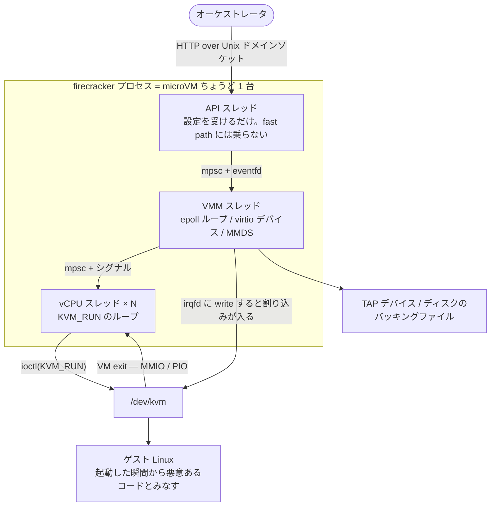
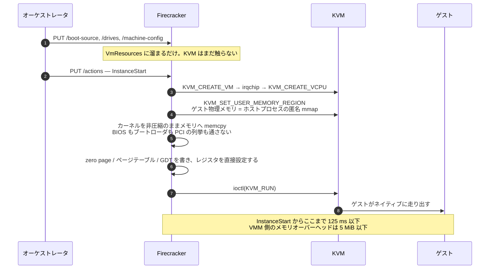

Firecracker は、AWS が Lambda と Fargate のために書いた VMM (Virtual Machine Monitor) だ。1 プロセスが 1 つの microVM を持ち、ゲストは本物の仮想マシンとして動く。にもかかわらず、起動してゲストの `/sbin/init` が走り出すまで 125 ms、VMM 側のメモリオーバーヘッドは 5 MiB に収まる。

この数字は「速いこともある」という話ではなく、**リポジトリの `SPECIFICATION.md` に書かれた契約** であり、統合テストが PR ごとに検証している。コンテナの起動速度と VM の分離境界を同時に取るために、この VMM が何を捨てたのかが、この章の主題になる。

この章には 2 つの目的がある。

1 つは、**Linux KVM を何も知らない状態から理解できるようにすること**。最初の群「仮想化と KVM をゼロから」の 8 ページがそれにあたる。ハードウェアが何をして、`/dev/kvm` が何を提供し、ユーザースペースのプロセスが「VM を動かす」とは具体的にどのシステムコールを何回叩くことなのか。ここを読めば、残りが読める。

もう 1 つは、**Firecracker 固有の設計を読むこと**。VMM の実装は QEMU をはじめいくつもあるが、これほど機能を削ることに執着したものは他にない。その削り方と、削らずに自分で書いた部分の対比が、残り 55 ページの中身になる。

## 30 秒で見る Firecracker

細かい話に入る前に、動いているところの形だけ見ておく。1 プロセスがちょうど 1 台の microVM を抱え、その中に 3 種類のスレッドしかいない。

そして起動は、実機が数十秒かけてやることのほとんどを飛ばす。

この 2 枚の細部を詰めていくのが、この章の内容になる。

## この OSS について

- Apache 2.0。Rust で約 12 万行、うち `src/vmm` が 10.2 万行。残りは `jailer`、`seccompiler`、`snapshot-editor` といった周辺ツール。
- **「作らない」が憲章に書いてある。** `CHARTER.md` の 4 つの信条のうち 1 つが _Minimalist in Features_ で、「ミッションに明確に必要でなければ作らない」「1 つの機能につき実装は 1 つだけ維持し、古いものは廃止する」と明記されている。多くの OSS が機能追加を正義とする中で、削減指向を組織原則として掲げている。
- **ゲストに見せるデバイスが極端に少ない。** virtio の net / block / vsock / balloon / rng / pmem / mem と、レガシー側はシリアルと i8042 だけ。しかもその i8042 はキーボードコントローラとして実装されておらず、「ゲストが再起動を要求したことを検出する」ためだけに存在する。
- **PCI を持たない VMM として 8 年近くやってきた。** virtio のトランスポートは MMIO のみで、PCI バスの列挙そのものを起動パスから消していた。PCI 対応が入ったのは v1.13.0 で、いまもオプトインのフラグの向こう側にある。
- **KVM の ioctl はほぼ全部 rust-vmm のクレート経由で、直接 `ioctl()` を叩いている箇所はコード全体で 1 つしかない。** その 1 箇所にも「上流にパッチが取り込まれ次第置き換える」というコメントが付いている。
- **脅威モデルが「vCPU スレッドは起動した瞬間から悪意あるコードを実行している」から始まる。** そのうえで jailer による chroot / cgroup / 権限降格、スレッドごとに異なる seccomp フィルタ、そして Kani による形式検証が積み重なる。
- **メタデータサービスのために、自前の TCP/IP スタックを書いている。** ゲストが送信した Ethernet フレームを TAP に渡す前に横取りし、VMM プロセス内で HTTP を喋る。ホストのソケットもカーネルのネットワークスタックも一切通らない。
- **スナップショットが機能の中心にある。** microVM の全状態を 1 ファイルに落とし、そこから何台でも起動できる。ただしそれは「同じ乱数から始まる VM が何台もできる」ことでもあり、その帰結への対処がコードとドキュメントの随所に現れる。

## 読む順番

KVM や仮想化に馴染みがない場合は、**「仮想化と KVM をゼロから」の 8 ページを 1 から順に読んでほしい**。前のページの語彙を後のページが使う。KVM を知っている場合は、7 ページ目の virtio だけ眺めて次の群へ進んでよい。

「Firecracker のかたち」は全体像の導入なので、ここも前から読むのがよい。それ以降の群は互いに独立していて、どこからでも読める。ただし「virtio を実装する」は前提群の 7 ページ目を、「スナップショット」は「メモリを伸縮させる」を先に読んでおくと速い。

この章は x86_64 を前提に書く。aarch64 固有の実装 (GIC、FDT、ARM レジスタ ID) は対象外とする。

仮想化と KVM をゼロから (前提):

- [なぜ microVM が必要になったのか](./why-microvm/)
- [ハードウェアがやるのは「特権命令を止める」ことだけ](./hardware-virtualization/)
- [/dev/kvm の ioctl は 3 階層になっている](./kvm-api/)
- [ゲスト物理メモリは、ホストプロセスの mmap にすぎない](./guest-memory/)
- [KVM_RUN から抜けてきた理由を読む](./kvm-run-loop/)
- [割り込みをゲストに届ける](./interrupt-delivery/)
- [virtio: ゲストとホストが共有リングで会話する](./virtio-basics/)
- [ブートローダを飛ばして、カーネルをメモリに直接置く](./direct-kernel-boot/)

Firecracker のかたち (全体像):

- [アーキテクチャを一枚で読む](./architecture/)
- [「作らない」を憲章に書く](./minimalism-charter/)
- [起動 125 ms とオーバーヘッド 5 MiB を、テストで守る契約にする](./specification-as-contract/)
- [起動シーケンスを 1 本追う](./boot-sequence/)
- [rust-vmm に寄せて、直接 ioctl を 1 箇所に留める](./rust-vmm-dependency/)

KVM をどう叩くか:

- [KVM_CREATE_VM は EINTR で失敗しうる。しかもバグではない](./create-vm-eintr/)
- [IRQCHIP と vCPU の作成順序に、逆らえない制約がある](./irqchip-ordering/)
- [KVM_RUN 中の vCPU を止めるのに、共有メモリとシグナルを両方使う](./vcpu-kick/)
- [vCPU スレッドの終了を join() では待たない](./vcpu-thread-drop/)
- [CPUID を先に確定させないと、正しい MSR が取れない](./cpuid-before-msr/)
- [MMIO と PIO のアドレス空間を、誰がどう割り当てるか](./resource-allocator/)

CPU をゲストにどう見せるか:

- [異機種のホストフリートを、1 つの CPU に見せる](./cpu-templates/)
- [3 値ビットマップ 1 つで CPUID・MSR を部分書き換えする](./register-value-filter/)
- [Turbo Boost とパフォーマンスカウンタを、常時オフにする](./cpuid-normalization/)
- [機能を隠すことは、守ることではない](./template-not-a-boundary/)

起動を速くする:

- [bzImage をやめて、ELF と PVH で直接起動する](./pvh-boot/)
- [e820・MPTable・ACPI — ゲストにデバイスの在り処を教える](./guest-hardware-discovery/)
- [PCI を長年持たなかった VMM が、それを持つと決めるまで](./mmio-vs-pci/)

virtio を実装する:

- [activate の前と後を、型で分ける](./device-state-typing/)
- [ゲストが書いたディスクリプタを、信用せずに辿る](./descriptor-chain-validation/)
- [used リングの更新をまとめて、kick を減らす](./used-ring-batching/)
- [リングのラップアラウンド判定を、Kani で証明する](./notification-suppression/)
- [memfd を二重にマップして、リングバッファのコピーを消す](./iov-deque/)
- [activate 前に来たイベントは読み捨てる](./spurious-events/)
- [トークンバケットで「1 発の巨大リクエスト」をどう罰するか](./rate-limiter/)
- [データパスを丸ごと別プロセスへ出すと、何を失うか](./vhost-user/)

ストレージとネットワーク:

- [block の I/O エンジンを、同期と io_uring で差し替える](./block-io-engine/)
- [受信バッファをゲストから預かって束ねる](./net-rx-buffers/)
- [メタデータサービスのために、自前の TCP/IP スタックを書く](./mmds-dumbo/)

メモリを伸縮させる:

- [balloon が回収したページは、必ずゼロが返る](./balloon-zeroing/)
- [virtio-mem は KVM スロットごとメモリを外す](./virtio-mem/)
- [hugepages と dirty page tracking は両立しない](./hugepages/)

スナップショット:

- [microVM の状態を 1 ファイルに落とす](./snapshot-format/)
- [デバイス状態を、KVM 状態より先に保存する](./save-ordering/)
- [Versionize をやめて、バージョンを丸ごと上げる方式にした](./snapshot-versioning/)
- [復元を、ファイルの MAP_PRIVATE mmap で済ませる](./restore-from-file/)
- [ページフォルトの処理を、別プロセスに委ねる](./uffd-handler/)
- [差分スナップショットと、dirty tracking がないときの妥協](./diff-snapshot/)
- [差分レイヤーを sendfile でスパースに合成する](./snapshot-rebase/)
- [復元した VM の時計を、どう合わせるか](./clock-restore/)
- [同じスナップショットから何台も起動すると、乱数が揃う](./vmgenid/)
- [vsock の接続は、あえて壊す](./vsock-reset/)

隔離とセキュリティ:

- [vCPU スレッドは、起動した瞬間から悪意あるコードを実行している](./threat-model/)
- [jailer が chroot に至るまでにやること](./jailer/)
- [バイナリをハードリンクではなく、コピーする](./jailer-binary-copy/)
- [seccomp フィルタを JSON から作り、バイナリに埋め込む](./seccompiler/)
- [フィルタは、各スレッドが自分自身に課す](./per-thread-seccomp/)
- [拒否された syscall の番号を、死ぬ前にログへ残す](./sigsys-handler/)

API と可観測性:

- [match の網羅性で「起動前後に何ができるか」を強制する](./api-state-machine/)
- [メトリクスを、2 値保持と差分計算でロックフリーにする](./metrics-design/)
- [ロガーを RwLock にして、シグナルハンドラからの再入を許す](./logger-reentrancy/)
- [SIGPIPE だけは殺さない](./signal-handling/)

正しさをどう担保するか:

- [Kani を、ゲスト由来の入力を扱う箇所に絞って使う](./kani-verification/)
- [性能テストを、絶対値ではなく A/B で回す](./ab-testing/)
- [トレーシングを、本番バイナリから機械的に剥がす](./clippy-tracing/)

## この章で扱わないこと

- **aarch64 固有の実装** — GIC (v2/v3/ITS)、FDT の生成、ARM レジスタ ID によるテンプレート、ホストの sysfs からキャッシュ情報を組み直す CLIDR_EL1 の上書き。アーキ差が設計を規定した箇所だけ、本文中で対比として触れる。
- **gdb デバッグサーバ** — `gdb` feature 有効時のみコンパイルされるゲストカーネルのデバッグ機構。
- **`cpu-template-helper` の CLI としての使い方** — テンプレートの生成・検証ツール。テンプレートの仕組み自体は本文で扱う。
- **KVM の内部実装** — EPT/NPT のページテーブル操作、VMCS の構造、ハードウェア仮想化拡張の命令セット。前提群ではゲスト側から見える外形だけを扱う。
- **Firecracker を使う側のエコシステム** — `firecracker-containerd`、Kata Containers、各種オーケストレータとの統合。
