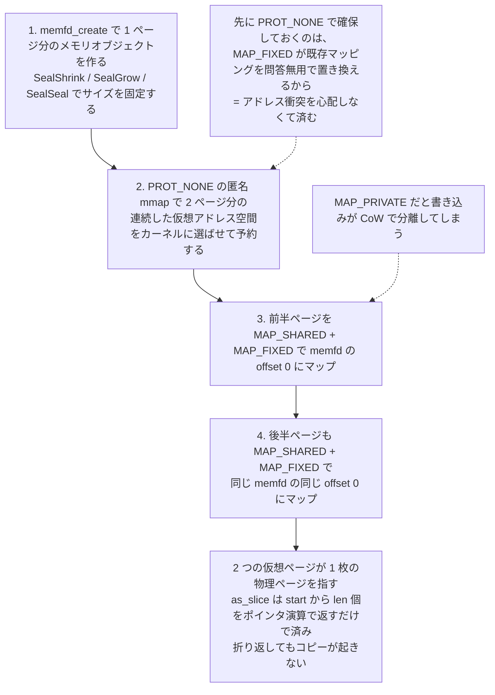

## 何を学んだか

### readv に渡すには「連続したスライス」が要る

virtio-net の RX パスは、ゲストが available ring に積んだ descriptor chain を `struct iovec` の配列に変換し、TAP デバイスから `readv(2)` で一気に読み込む。`readv` のシグネチャは `readv(fd, const struct iovec *iov, int iovcnt)` なので、渡せるのは**メモリ上で連続した `iovec` の配列**だけである。

一方 RX バッファの管理はリングバッファが自然だ。ゲストは前から descriptor chain を追加し、フレームを受け取った分だけ前から消費していく。ところが普通のリングバッファは末尾で折り返す。容量 10 の buffer に A, B, C, D の 4 要素が入っているとき、物理的な並びはこうなりうる。

```
                     tail                        head
                      |                           |
                      v                           v
                +---+---+---+---+---+---+---+---+---+---+
ring buffer:    | C | D |   |   |   |   |   |   | A | B |
                +---+---+---+---+---+---+---+---+---+---+
```

論理的な中身は `[A, B, C, D]` だが、この配列をそのまま `readv` に渡すことはできない。連続スライスを作るには別バッファへのコピーが要る。RX は 1 フレームごとに走るホットパスなので、ここでコピーを入れたくない。

### 同じ物理ページを 2 回マップする

`IovDeque` の解決策は、要素を動かすのではなく**アドレス空間の側を細工する**ことだ。`memfd_create(2)` で 1 ページ分のメモリオブジェクトを作り、それを連続する 2 つの仮想アドレス範囲に `MAP_FIXED` でマップする。

```
                                   head   |    tail
                                    |     |     |
                                    v     |     v
  +---+---+---+---+---+---+---+---+---+---+---+---+---+---+---+---+---+---+---+---+
  | C | D |   |   |   |   |   |   | A | B | C | D |   |   |   |   |   |   | A | B |
  +---+---+---+---+---+---+---+---+---+---+---+---+---+---+---+---+---+---+---+---+
           First virtual page             |       Second virtual page

                                    Virtual memory
---------------------------------------------------------------------------------------
                                   Physical memory

                     +---+---+---+---+---+---+---+---+---+---+
                     | C | D |   |   |   |   |   |   | A | B |
                     +---+---+---+---+---+---+---+---+---+---+
```

物理ページは 1 枚しかない。第 1 ページに書いた内容は、同じ物理ページを見ている第 2 ページにそのまま映る。だから `start = 8`, `len = 4` のとき、第 1 ページのオフセット 8 から 4 要素分を読めば `[A, B, C, D]` が連続して並んでいる。後半 2 つは第 2 ページ側にはみ出しているが、そこは第 1 ページの先頭と同じ物理メモリなので中身は `C, D` である。コピーは 1 回も発生しない。

この技法は magic ring buffer / virtual ring buffer と呼ばれ、Wikipedia の "Circular buffer" の Optimization 節で紹介されている手法だ(コード中のコメントもそこを参照している)。Firecracker が固有に持ち込んだのは、**容量を virtqueue のサイズに固定できる**という前提である。virtqueue のエントリ数は最大 256 と決まっており、descriptor chain 全体でも `iovec` は 256 個を超えない。だから「あふれたらリサイズする」という一般的なリングバッファの厄介ごとが消え、確保するのは最初の 1 回だけになる。

## ソースコードのどこか

構造体は 4 フィールドしかない。生ポインタと、start / len / capacity である。

```rust title="src/vmm/src/devices/virtio/iov_deque.rs"
pub struct IovDeque<const L: u16> {
    pub iov: *mut libc::iovec,
    pub start: u16,
    pub len: u16,
    pub capacity: u16,
}
```

[`src/vmm/src/devices/virtio/iov_deque.rs#L83-L92`](https://github.com/firecracker-microvm/firecracker/blob/cc535f035f3828b2c5bfc85276c5d394022ed220/src/vmm/src/devices/virtio/iov_deque.rs#L83-L92)。折り返しの説明図と設計意図は同ファイルの [`#L29-L74`](https://github.com/firecracker-microvm/firecracker/blob/cc535f035f3828b2c5bfc85276c5d394022ed220/src/vmm/src/devices/virtio/iov_deque.rs#L29-L74) のコメントブロックにそのまま書かれている。

確保は 3 段構えだ。まず 2 ページ分の仮想アドレス空間を `PROT_NONE` の匿名マッピングで予約し、その先頭と後半をそれぞれ memfd で上書きする。

```rust title="src/vmm/src/devices/virtio/iov_deque.rs"
    fn allocate_ring_buffer_memory(pages_bytes: usize) -> Result<*mut c_void, IovDequeError> {
        // SAFETY: We are calling the system call with valid arguments
        unsafe {
            Self::mmap(
                std::ptr::null_mut(),
                pages_bytes * 2,
                libc::PROT_NONE,
                libc::MAP_PRIVATE | libc::MAP_ANONYMOUS,
                -1,
                0,
            )
        }
    }
```

[`#L135-L150`](https://github.com/firecracker-microvm/firecracker/blob/cc535f035f3828b2c5bfc85276c5d394022ed220/src/vmm/src/devices/virtio/iov_deque.rs#L135-L150)。`MAP_FIXED` は指定アドレスの既存マッピングを問答無用で置き換えるため、他人が使っているアドレスに撃ち込むと壊す。先に `PROT_NONE` でカーネルに 2 ページ分の連続領域を選ばせておけば、その範囲は自分のものだと確定する。あとはその中を `MAP_FIXED` で 2 回上書きするだけで、アドレス衝突を心配しなくて済む。

```rust title="src/vmm/src/devices/virtio/iov_deque.rs"
        let memfd = Self::create_memfd(pages_bytes)?;
        let raw_memfd = memfd.as_file().as_raw_fd();
        let buffer = Self::allocate_ring_buffer_memory(pages_bytes)?;

        // Map the first page of virtual memory to the physical page described by the memfd object
        // SAFETY: We are calling the system call with valid arguments
        let _ = unsafe {
            Self::mmap(
                buffer,
                pages_bytes,
                libc::PROT_READ | libc::PROT_WRITE,
                libc::MAP_SHARED | libc::MAP_FIXED,
                raw_memfd,
                0,
            )
        }?;
```

[`#L161-L217`](https://github.com/firecracker-microvm/firecracker/blob/cc535f035f3828b2c5bfc85276c5d394022ed220/src/vmm/src/devices/virtio/iov_deque.rs#L161-L217)。2 回目の `mmap` は `buffer.add(pages_bytes)` を宛先に、**同じ `offset: 0`** で同じ memfd をマップする。これで 2 つの仮想範囲が同じ物理ページを指す。`MAP_SHARED` でなければ書き込みが CoW で分離してしまうので、ここは `MAP_PRIVATE` ではいけない。



memfd 側には seal をかけている。

```rust title="src/vmm/src/devices/virtio/iov_deque.rs"
        // Add seals to prevent further resizing.
        mfd.add_seals(&[memfd::FileSeal::SealShrink, memfd::FileSeal::SealGrow])?;

        // Prevent further sealing changes.
        mfd.add_seal(memfd::FileSeal::SealSeal)?;
```

[`#L94-L113`](https://github.com/firecracker-microvm/firecracker/blob/cc535f035f3828b2c5bfc85276c5d394022ed220/src/vmm/src/devices/virtio/iov_deque.rs#L94-L113)。`SealShrink` / `SealGrow` でサイズ変更を禁じ、`SealSeal` でシールの追加自体を封じる。マッピングの大きさと memfd の大きさが食い違うと、切り詰められた領域にアクセスした瞬間 `SIGBUS` になる。二重マッピングという不変条件をファイル側からも固定している。

サイズはホストのページサイズに切り上げる。

```rust title="src/vmm/src/devices/virtio/iov_deque.rs"
    fn pages_bytes() -> usize {
        let host_page_size = host_page_size();
        let bytes = L as usize * std::mem::size_of::<iovec>();
        let num_host_pages = bytes.div_ceil(host_page_size);
        num_host_pages * host_page_size
    }
```

[`#L152-L159`](https://github.com/firecracker-microvm/firecracker/blob/cc535f035f3828b2c5bfc85276c5d394022ed220/src/vmm/src/devices/virtio/iov_deque.rs#L152-L159)。`host_page_size()` は `sysconf(_SC_PAGESIZE)` を `LazyLock` でキャッシュしている([`src/vmm/src/arch/mod.rs#L63-L76`](https://github.com/firecracker-microvm/firecracker/blob/cc535f035f3828b2c5bfc85276c5d394022ed220/src/vmm/src/arch/mod.rs#L63-L76))。`iovec` は 16 バイトなので `L = 256` なら 4096 バイト。4K ページのホストではちょうど 1 ページだが、16K ページのホストでは 1 ページ = 16384 バイトとなり、実容量 `capacity` は 1024 で `L` の 256 より大きくなる。そのため `start` の折り返しは `L` ではなく `capacity` で行う。

```rust title="src/vmm/src/devices/virtio/iov_deque.rs"
        self.start += nr_iovecs;
        self.len -= nr_iovecs;
        if self.capacity <= self.start {
            self.start -= self.capacity;
        }
```

[`#L265-L276`](https://github.com/firecracker-microvm/firecracker/blob/cc535f035f3828b2c5bfc85276c5d394022ed220/src/vmm/src/devices/virtio/iov_deque.rs#L265-L276)。この `capacity` と `L` の分離は後から入った修正で、CHANGELOG に「`IovDeque` implementation to work with any host page size. This fixes virtio-net device on non 4K host kernels」(PR #4916) と記録されている。`test_size_less_than_capacity` は `L = 16` にして折り返し点をまたぐ挙動を検証している([`#L548-L588`](https://github.com/firecracker-microvm/firecracker/blob/cc535f035f3828b2c5bfc85276c5d394022ed220/src/vmm/src/devices/virtio/iov_deque.rs#L548-L588))。

肝心の `as_slice` は、ポインタ演算 2 行で済む。

```rust title="src/vmm/src/devices/virtio/iov_deque.rs"
        unsafe {
            let slice_start = self.iov.add(self.start.into());
            std::slice::from_raw_parts(slice_start, self.len.into())
        }
```

[`#L291-L308`](https://github.com/firecracker-microvm/firecracker/blob/cc535f035f3828b2c5bfc85276c5d394022ed220/src/vmm/src/devices/virtio/iov_deque.rs#L291-L308)。`start < capacity` かつ `len <= L <= capacity` なので、`start + len < 2 * capacity` が常に成り立ち、読む範囲は必ず 2 ページの中に収まる。

### 呼び出し側

書き込み方向(ゲストへ渡すバッファ)を扱う `IoVecBufferMut` だけが `IovDeque` を使う。

```rust title="src/vmm/src/devices/virtio/iovec.rs"
pub struct IoVecBufferMut<const L: u16 = FIRECRACKER_MAX_QUEUE_SIZE> {
    // container of the memory regions included in this IO vector
    pub vecs: IovDeque<L>,
    ...
}
```

[`src/vmm/src/devices/virtio/iovec.rs#L228-L243`](https://github.com/firecracker-microvm/firecracker/blob/cc535f035f3828b2c5bfc85276c5d394022ed220/src/vmm/src/devices/virtio/iovec.rs#L228-L243)。読み出し方向の `IoVecBuffer` のほうは、単なる `Vec<iovec>` である([`#L40-L46`](https://github.com/firecracker-microvm/firecracker/blob/cc535f035f3828b2c5bfc85276c5d394022ed220/src/vmm/src/devices/virtio/iovec.rs#L40-L46))。TX パスは 1 つの descriptor chain を丸ごと `writev` に渡して終わりで、複数チェーンを跨いだ先頭からの部分消費が起きないためリングは要らない。

複数チェーンを跨ぐのは RX 側だ。virtio-net の `RxBuffers` はゲストが積んだ RX 用チェーンを片端から `append_descriptor_chain` で足しこみ、フレームを 1 本受け取るたびに使った分だけ `drop_chain_front` で前から捨てる([`src/vmm/src/devices/virtio/net/device.rs#L110-L164`](https://github.com/firecracker-microvm/firecracker/blob/cc535f035f3828b2c5bfc85276c5d394022ed220/src/vmm/src/devices/virtio/net/device.rs#L110-L164))。まさに両端キューであり、しかもその全体を `readv` に渡す。

```rust title="src/vmm/src/devices/virtio/net/tap.rs"
    pub(crate) fn read_iovec(&mut self, buffer: &mut [libc::iovec]) -> Result<usize, IoError> {
        let iov = buffer.as_mut_ptr();
        let iovcnt = buffer.len().try_into().unwrap();
```

[`src/vmm/src/devices/virtio/net/tap.rs#L197-L209`](https://github.com/firecracker-microvm/firecracker/blob/cc535f035f3828b2c5bfc85276c5d394022ed220/src/vmm/src/devices/virtio/net/tap.rs#L197-L209)。`&mut [libc::iovec]` をそのまま `as_mut_ptr()` して `readv` に渡している。ここが「連続スライスであること」を要求している当の場所である。

## なぜそうなっているか

コメントが理由を明示している。「A typical implementation of a ring buffer allows for entries to wrap around the end of the underlying buffer. (中略) When getting a slice for this data we should get something like that: &[A, B, C, D], which would require copies in order to make the elements continuous in memory」([`#L29-L44`](https://github.com/firecracker-microvm/firecracker/blob/cc535f035f3828b2c5bfc85276c5d394022ed220/src/vmm/src/devices/virtio/iov_deque.rs#L29-L44))。コピーを消すことが目的であり、二重マッピングはその手段である。

なぜここまでするのかは、virtio-net の RX が microVM のスループットを直接決めるパスだからだ。1 フレームごとに最大 256 個の `iovec`(4KB)をコピーして `readv` に渡す実装と、ポインタを 1 つ足すだけの実装では、パケットレートが上がるほど差が開く。

容量を固定できる根拠もコメントにある。「It is tailored to store `struct iovec` objects that described memory that was passed to us from the guest via a VirtIO queue. This allows us to assume the maximum size of a ring buffer (the negotiated size of the queue)」([`#L26-L28`](https://github.com/firecracker-microvm/firecracker/blob/cc535f035f3828b2c5bfc85276c5d394022ed220/src/vmm/src/devices/virtio/iov_deque.rs#L26-L28))。だから `push_back` は満杯なら `assert!` で落ちる。

```rust title="src/vmm/src/devices/virtio/iov_deque.rs"
        // This should NEVER happen, since our ring buffer is as big as the maximum queue size.
        // We also check for the sanity of the VirtIO queues, in queue.rs, which means that if we
        // ever try to add something in a full ring buffer, there is an internal bug in the device
        // emulation logic. Panic here because the device is hopelessly broken.
```

[`#L241-L249`](https://github.com/firecracker-microvm/firecracker/blob/cc535f035f3828b2c5bfc85276c5d394022ed220/src/vmm/src/devices/virtio/iov_deque.rs#L241-L249)。ゲストが不正な値を書いても `queue.rs` 側の [descriptor chain 検証](../descriptor-chain-validation/)で弾かれているはずで、ここに到達したら Firecracker 自身のバグだ、という切り分けである。ゲスト起因のエラーはエラー値で返し、自分のバグは panic させる、という使い分けになっている。

もうひとつ、この実装は形式検証の邪魔になった。Kani は `memfd_create` や `mmap` の FFI を追えないので、`iovec.rs` の検証モジュールでは `push_back` をスタブに差し替え、「2 ページ分を普通に確保して両方に書く」ことでミラーリングを模倣している。

```rust title="src/vmm/src/devices/virtio/iovec.rs"
        /// To build this particular memory layout we create a new `memfd` object, allocate memory
        /// with `mmap` and call `mmap` again to make sure both pages point to the page allocated
        /// via the `memfd` object. These ffi calls make kani complain, so here we mock the
        /// `IovDeque` object memory with a normal memory allocation of two pages worth of data.
```

[`src/vmm/src/devices/virtio/iovec.rs#L849-L891`](https://github.com/firecracker-microvm/firecracker/blob/cc535f035f3828b2c5bfc85276c5d394022ed220/src/vmm/src/devices/virtio/iovec.rs#L849-L891)。カーネルの仮想メモリ機構に依存した最適化は、モデル検査器から見えないところに逃げるということでもある。検証対象は `IoVecBuffer` / `IoVecBufferMut` の読み書きロジックであって、二重マッピングそのものは検証されていない。そこはユニットテスト(`test_size_less_than_capacity` など)が担保している。

## どう活かすか

この技法が効くのは、次の条件が揃ったときだ。

1. **バッファの中身を連続スライスとして外部 API に渡す必要がある**。`readv` / `writev` / `sendmsg` / `io_uring` の SQE 配列などが典型。単に自前のループで舐めるだけなら、折り返しを `chunks` 2 回に分けて処理すればよく、二重マッピングの出番はない。
2. **要素が固定サイズで、容量の上限が事前に分かる**。Firecracker では virtqueue のサイズが上限を与えた。上限が不明ならリサイズが必要になり、その都度 `mmap` をやり直すことになって旨味が消える。
3. **その経路が本当にホットパス**。ページ単位の確保と 3 回の `mmap` は初期化としては重い。1 秒に数回しか通らない経路なら `Vec` にコピーしたほうが総合的に速い。

代償も正直に見ておく。

- **粒度がページ単位になる**。最小でもホストの 1 ページを消費する。`iovec` を 16 個しか持たないバッファでも 4KB(16K ページのホストなら 16KB)取られる。上の `pages_bytes()` はこれを切り上げているので、小さい `L` ほど無駄が大きい。こういうバッファを何千個も持つ設計には向かない。
- **仮想アドレス空間を 2 倍消費する**。64bit なら実害はほぼないが、32bit や、アドレス空間を大量に使う他の仕組み(巨大な mmap を多用する DB など)と同居する場合は勘定に入れる。
- **fd を 1 つ消費する**。`IovDeque` インスタンスごとに memfd が 1 つ開く。デバイス数 × キュー数だけ fd が増えるので、`RLIMIT_NOFILE` や jailer のリソース制限と衝突しうる。Firecracker はデバイス数が高々十数個なので問題にならないが、コネクションごとにリングを持つようなサーバでは fd 枯渇に直結する。
- **`unsafe` と生ポインタから逃げられない**。`Send` の手動実装、`Drop` での `munmap`、`as_slice` の安全性議論(コメントで 6 項目に分けて論証している)が必要になる。Firecracker はこれを 1 ファイル 340 行に閉じ込め、外には `push_back` / `pop_front` / `as_slice` という安全な API しか出していない。取り込むならこの「危険を 1 ファイルに封じ込める」構えごと真似したほうがよい。
- **形式検証やサニタイザと相性が悪い**。上で見たように Kani ではスタブに差し替える必要があった。Valgrind や ASan も同一物理ページの二重マッピングを素直には扱わない。検証ツールに強く依存しているプロジェクトでは、その分の逃げ道を用意するコストも見込む。

逆に言えば、上の 3 条件が揃い、代償を払う覚悟があるなら、これは「アルゴリズムを変えずにコピーだけを消す」数少ない手段である。データ構造の側ではなくアドレス空間の側を曲げる、という発想は他にも応用が利く。
