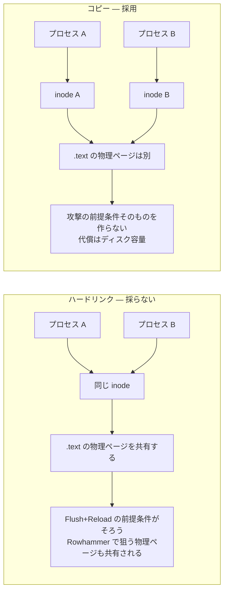
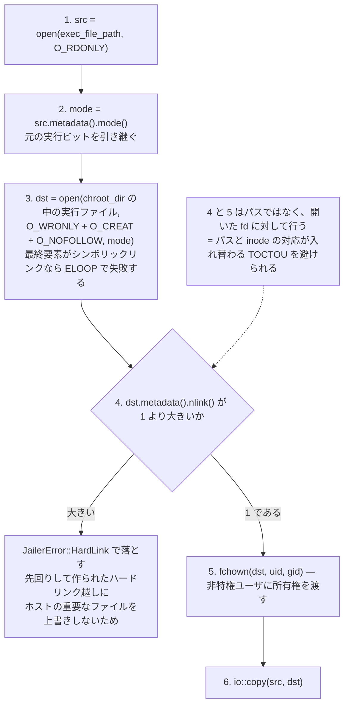

## 何を学んだか

jailer は `--exec-file` で渡された Firecracker バイナリを `<chroot_dir>/<exec_file_name>` に持ち込む。ハードリンク（`link(2)`）でも bind mount でもなく、中身をコピーする。ディスク容量では最も損な選択で、microVM を 1000 個立てれば同じ数のバイナリのコピーがディスクに並ぶ。それでもコピーを選ぶ理由が、関数のコメントに書いてある。

```rust title="src/jailer/src/env.rs"
        // We do a copy instead of a hard-link for 2 reasons
        // 1. hard-linking is not possible if the file is in another device
        // 2. while hardlinking would save up disk space and also memory by sharing parts of the
        //    Firecracker binary (like the executable .text section), this latter part is not
        //    desirable in Firecracker's threat model. Copying prevents 2 Firecracker processes from
        //    sharing memory.
```

理由 1 は実務的なもの（`link(2)` はファイルシステムをまたげない）だが、理由 2 が本題である。ハードリンクは**ディスク容量を節約するだけでなく、メモリも節約する**。同じ inode を `mmap` した実行ファイルは、ページキャッシュを共有する。2 つの Firecracker プロセスの `.text` セクションは、物理的に同じページフレームに載る。この「メモリの節約」のほうが、Firecracker の脅威モデルでは望ましくない、と言っている。

### なぜ物理ページの共有が攻撃面になるのか

前提は[脅威モデル](../threat-model/)にある。1 台のホストで複数の microVM が動き、それぞれが別テナントのワークロードを実行する。プロセス A のゲストは悪意があるとみなす。プロセス B は別テナントのものである。

同じ物理ページを共有していると、A から B に対して次のような影響経路が生まれうる。

- **キャッシュ由来のサイドチャネル。** 共有ページは、A と B から同じ物理アドレスとして見える。A が `.text` の特定の行をキャッシュから追い出し、時間を測って B がそこを実行したかを推定する、いわゆる Flush+Reload の前提条件がそろう。この手法は「攻撃者と被害者が同じ物理ページを共有していること」を必要とする。ホスト上の他プロセスに対して同じ状況を作らないために、prod-host-setup.md は KSM（Kernel Samepage Merging）の無効化を推奨している。バイナリのハードリンクは、KSM を切っていても同じ状況を作ってしまう。
- **Rowhammer 系のビット反転。** 隣接行への反復アクセスで物理メモリのビットを反転させる攻撃も、狙う物理ページが共有されているほど成立しやすい。prod-host-setup.md が TRR + ECC 付きメモリを推奨しているのと同じ理由である。

どちらも Firecracker 自身では防げないハードウェア寄りの問題である。だから「防ぐ」のではなく「前提条件を作らない」。プロセスごとに別の inode を持たせれば、`.text` の物理ページは共有されない。



`docs/jailer.md` の手順説明も同じことを書いている。「`--exec-file` で指定されたファイルを `<chroot_dir>/<exec_file_name>` にコピーする。これにより、新しいプロセスが他のどの Firecracker プロセスともメモリを共有しないことが保証される」。

### コピー処理そのものにも防御が入っている

`copy_exec_to_chroot` は単なる `fs::copy` ではない。2 つの追加チェックがある。

**`O_NOFOLLOW` でシンボリックリンクを拒否する。** コピー先 `<chroot_dir>/<exec_file_name>` を開くとき、`custom_flags(libc::O_NOFOLLOW)` を付ける。最終要素がシンボリックリンクなら `open` は `ELOOP` で失敗する。この時点で jailer はまだ root なので、コピー先がホストの任意のパス（`/etc/shadow` など）を指すシンボリックリンクだったら、root 権限でそこへ Firecracker バイナリの中身を書き込んでしまう。

**コピー先の `nlink > 1` を拒否する。** `open` に成功したあと、開いた fd の `metadata()` からリンク数を確認し、1 より大きければ `JailerError::HardLink` で落とす。

```rust title="src/jailer/src/env.rs"
        let dst_file_metadata = dst_file
            .metadata()
            .map_err(|err| JailerError::Metadata(jailer_exec_file_path.clone(), err))?;
        if 1 < dst_file_metadata.nlink() {
            return Err(JailerError::HardLink(jailer_exec_file_path.clone()));
        }
```

これは TOCTOU（time-of-check to time-of-use）を避ける形になっている。「パスを `stat` してリンク数を調べてから開く」のではなく、「開いてから、その fd 越しにリンク数を調べる」。パスと inode の対応は `stat` と `open` の間で入れ替わりうるが、fd はすでに特定の inode に固定されているので入れ替わらない。`fchown` も同じくパスではなく fd に対して呼んでいる。

`nlink > 1` を弾く意味は、シンボリックリンクの場合と同じである。誰かが先回りして `<chroot_dir>/<exec_file_name>` をホスト上の重要なファイルへのハードリンクとして作っておくと、`O_NOFOLLOW` はハードリンクを検出できないので `open` は通ってしまう。そこにコピーすれば、リンク先のファイルが Firecracker のバイナリで上書きされる。リンク数のチェックがこれを止める。

### コピー全体の流れ



## ソースコードのどこか

[`src/jailer/src/env.rs#L490-L540`](https://github.com/firecracker-microvm/firecracker/blob/cc535f035f3828b2c5bfc85276c5d394022ed220/src/jailer/src/env.rs#L490-L540) の `copy_exec_to_chroot` が全部である。方針を宣言するコメントは [`#L497-L502`](https://github.com/firecracker-microvm/firecracker/blob/cc535f035f3828b2c5bfc85276c5d394022ed220/src/jailer/src/env.rs#L497-L502)、`O_NOFOLLOW` と mode の引き継ぎは [`#L503-L521`](https://github.com/firecracker-microvm/firecracker/blob/cc535f035f3828b2c5bfc85276c5d394022ed220/src/jailer/src/env.rs#L503-L521)。

```rust title="src/jailer/src/env.rs"
        let src_file_mode = src_file_metadata.mode();
        let mut dst_file = OpenOptions::new()
            .write(true)
            .create(true)
            // Don't allow symlinks
            .custom_flags(libc::O_NOFOLLOW)
            .mode(src_file_mode)
            .open(&jailer_exec_file_path)
            .map_err(|err| JailerError::Open(jailer_exec_file_path.clone(), err))?;
```

`nlink` チェックは [`#L519-L524`](https://github.com/firecracker-microvm/firecracker/blob/cc535f035f3828b2c5bfc85276c5d394022ed220/src/jailer/src/env.rs#L519-L524)、`fchown` と実際のコピーは [`#L526-L537`](https://github.com/firecracker-microvm/firecracker/blob/cc535f035f3828b2c5bfc85276c5d394022ed220/src/jailer/src/env.rs#L526-L537)。

エラー型は [`src/jailer/src/main.rs#L93-L94`](https://github.com/firecracker-microvm/firecracker/blob/cc535f035f3828b2c5bfc85276c5d394022ed220/src/jailer/src/main.rs#L93-L94) に定義されている。

```rust title="src/jailer/src/main.rs"
    #[error("Detected hard link at: {0}")]
    HardLink(PathBuf),
```

`copy_exec_to_chroot` は [`Env::run` の 1 行目](https://github.com/firecracker-microvm/firecracker/blob/cc535f035f3828b2c5bfc85276c5d394022ed220/src/jailer/src/env.rs#L646-L648)、つまり cgroup の設定より前、chroot より前に呼ばれる。コピー先のディレクトリは `main_exec` が `fs::create_dir_all` で作ってある（[`src/jailer/src/main.rs#L353-L358`](https://github.com/firecracker-microvm/firecracker/blob/cc535f035f3828b2c5bfc85276c5d394022ed220/src/jailer/src/main.rs#L353-L358)）。同じ設計判断は [`docs/jailer.md`](https://github.com/firecracker-microvm/firecracker/blob/cc535f035f3828b2c5bfc85276c5d394022ed220/docs/jailer.md) の Jailer Operation 節にも書かれている。

## なぜそうなっているか

**ディスクとメモリのトレードオフを、脅威モデルが決めている。** 通常のシステム設計なら、同一バイナリの `.text` 共有は明確な利得である。ページキャッシュが 1 部で済み、TLB / L2 の利用効率も上がる。それを捨てているのは、「同じホストで相互に信頼しない複数のテナントが動く」という前提が、共有の利得より共有のリスクを大きくしているからである。逆に言えば、この前提がない環境ではコピーは純粋な損になる。

**Firecracker のバイナリは小さい**ので、コストが払える範囲に収まっている。静的リンクの musl ビルドで数 MB のオーダーであり、microVM の起動あたり数 MB のコピーは、ゲストメモリの割り当て（128 MiB〜）と比べれば小さい。「1 プロセス = 1 microVM」でプロセス数が多いという設計と、「バイナリが小さい」という[ミニマリズム](../minimalism-charter/)が、この判断を成立させている。もし VMM が数百 MB のバイナリだったら、同じ判断は下せなかっただろう。

**`O_NOFOLLOW` と `nlink` チェックは、脅威モデルと少しずれた層の防御である。** `docs/jailer.md` は「jailer への入力はすべて信頼される」「chroot ディレクトリに置かれたリソースも信頼される」と明言している。その前提に立てば、コピー先に細工がされている状況は起こらないはずである。それでもチェックが入っているのは、root で書き込む操作の破壊力が大きく、かつチェックのコストがほぼゼロだからだと読める。

**bind mount ではなくコピーである理由**はコメントに書かれていない。推測だが、bind mount はハードリンクと同じく同一 inode を指すのでメモリ共有の問題が残る上に、mount エントリが増えて[jail 作成が遅くなる](../jailer/)方向に効く。

## どう活かすか

**「共有」がリソース効率の話なのか信頼境界の話なのかを分けて考える。** キャッシュ、コネクションプール、共有ライブラリ、メモ化テーブル。どれも普通は「共有できるものは共有する」が正解だが、共有する主体が相互に信頼しないなら、共有そのものが観測経路になる。マルチテナントのサービスで、テナント A とテナント B のリクエストが同じキャッシュエントリに当たるかどうかを A が観測できる、という形の情報漏洩は同じ構造である。

**判断の理由をコードコメントに残す。** `copy_exec_to_chroot` のコメントがなければ、このコピーは「ハードリンクにすればディスクが節約できるのに」と見えて、善意のリファクタリングで消される。「なぜハードリンクではないか」はコードから復元できない情報なので、コメントに書く価値がある。逆に「ファイルを開いてコピーする」といった WHAT は書かれていない。

**チェックはパスではなく fd に対して行う。** `open` してから `fstat` / `fchown` する形にすれば、チェックと使用の間で対象が入れ替わる余地がなくなる。パスで `stat` → パスで `chown` という書き方は、特権プロセスでは常に TOCTOU の候補になる。

**適用条件。** バイナリのコピーが正当化されるのは、(1) 同一ホストで相互に信頼しないプロセスが並走する、(2) バイナリが十分小さい、(3) プロセスの起動が頻繁である、という条件が揃うときである。単一テナントの環境やバイナリが巨大な場合には利得がない。また、KSM の無効化といったホスト側の対策とセットで初めて意味を持つ。バイナリだけコピーしても、KSM が有効ならページ重複排除で結局共有されてしまう。
