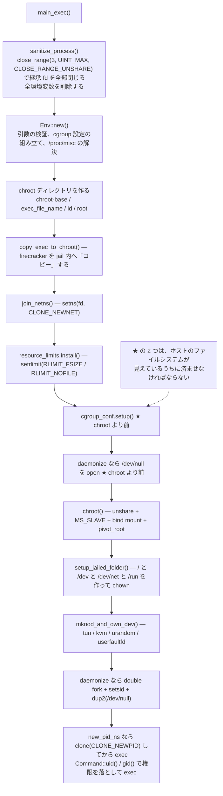
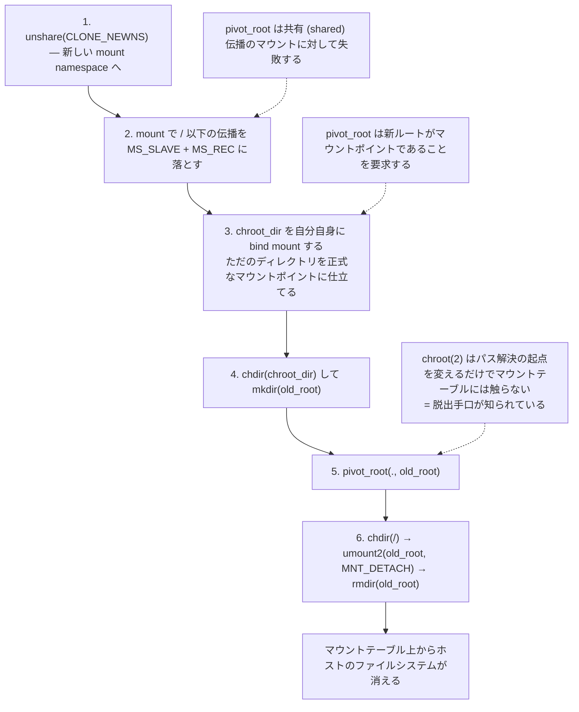
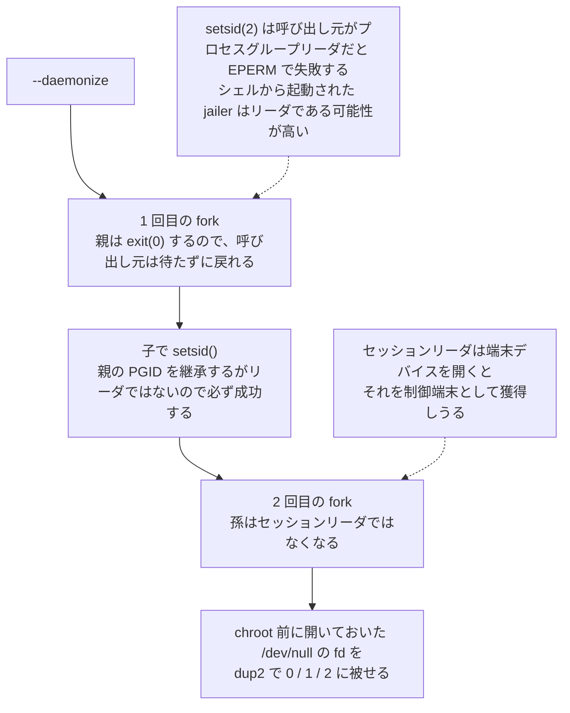

## 何を学んだか

jailer は root で起動し、chroot / namespace / cgroup / 権限降格を設定してから Firecracker に `exec` する、使い捨ての特権プロセスである。`docs/jailer.md` は冒頭で「Firecracker 専用であり、他のバイナリで動くことを意図していない」と断っている。汎用のサンドボックスランチャではない。

### 実行順

何をどの順でやるかが、そのまま設計の中身である。



jail 内へ実行ファイルを持ち込むのに**ハードリンクではなくコピー**を使う点は独立した論点なので、[別ページ](../jailer-binary-copy/)に譲る。

### 最初にやるのは、継承したものを捨てること

`main_exec` の 1 行目が `sanitize_process()` である。引数のパースより先に来る。fd 3 以降を全部閉じ、環境変数を全部消す。`close_range` に渡している `CLOSE_RANGE_UNSHARE` は、閉じる前に fd テーブルを unshare させるフラグで、fd テーブルを共有している他プロセスへの波及を防ぐ。

なぜこれが最初かというと、jail の「外」への参照は、パス名だけでなく **fd** でも持ち込めるからである。`pivot_root` はパス解決を封じるが、すでに開かれている fd は封じない。呼び出し元が意図せず開いたままにしていた fd が Firecracker まで継承されれば、jail の意味が薄れる。

### cgroup は chroot より前に作る

`Env::run` のコメントが理由をそのまま書いている。

> We have to setup cgroups at this point, because we can't do it anymore after chrooting.

cgroup の操作は `/sys/fs/cgroup/...` へのファイル書き込みで行う。jail の中に入ったあとでは、そのパスに到達できない。同じ理由で、`--daemonize` のときの `/dev/null` も chroot 前に `open` して fd として持ち越す。「ホストのファイルシステムを必要とする作業は、それが見えているうちに済ませる」という順序制約である。

cgroup 側は v1 と v2 の両対応で、`CgroupHierarchies::new` が `/proc/mounts` を正規表現でパースする。v2 なら `cgroup2` 型のマウントが 1 つ（統一階層）なので見つけ次第打ち切る。v1 はコントローラごとに階層がありうるので、マウントポイントと mount option 文字列を溜めておき、`cpuset.mems` のような指定が来た時点で option に `cpuset` を含むものを探す。

`<cgroup_base>/<parent_cgroup>/<id>` を作り、プロパティを書き、最後に自分の PID を `tasks`（v2 では `cgroup.procs`）に書く。この書き込みが 2 巡に分かれている。

```rust title="src/jailer/src/cgroup.rs"
    // cgroups are iterated two times as some cgroups may require others (e.g cpuset requires
    // cpuset.mems and cpuset.cpus) to be set before attaching any pid.
    for cgroup in conf.values() {
        cgroup.write_values()?;
    }
    for cgroup in conf.values() {
        cgroup.attach_pid()?;
    }
```

`cpuset` は `cpuset.cpus` と `cpuset.mems` の両方が埋まっていないと PID を受け付けない。全部書いてから全部 attach する順序でこれを回避している。

### 単純な chroot ではなく pivot_root

`src/jailer/src/chroot.rs` の `chroot()` は、名前に反して `libc::chroot` を呼ばない。実際にやるのは次の 6 手である。



`chroot(2)` は「パス解決の起点を変える」だけで、マウントテーブルには触らない。プロセスはホストの全マウントを見たままであり、脱出手口も知られている。`pivot_root(2)` は mount namespace のルートマウント自体を差し替える。手順 6 で古いルートを `MNT_DETACH` で外して `rmdir` してしまえば、そのプロセスからホストのファイルシステムはマウントテーブル上に存在しなくなる。

手順 2 と 3 は `pivot_root` の制約を回避するための下ごしらえである。

- `pivot_root` は共有（shared）伝播のマウントに対して失敗するので、まず `MS_SLAVE | MS_REC` で `/` 以下の伝播タイプを落とす。slave にするとホスト側のマウント変化は受け取るが、こちらの操作はホストに伝播しない。
- `pivot_root` は「新しいルートと古いルートが同じファイルシステム上にあってはならない」、すなわち新ルートがマウントポイントであることを要求する。`<chroot_dir>` は普通ホストのルートファイルシステム上のただのディレクトリなので、そのままでは条件を満たさない。そこで `<chroot_dir>` を自分自身の上に bind mount して、正式なマウントポイントに仕立てる。

`docs/jailer.md` はこの手順を `MS_PRIVATE` と説明し、最後に `chroot(".")` を「for good measure」で呼ぶと書いているが、現在のコードは `MS_SLAVE` を使い、`libc::chroot` の呼び出しは存在しない。

### デバイスノードは自分で mknod する

jail の中には `/dev` が無いので、必要なキャラクタデバイスを自分で作る。

| デバイス           | major | minor | 用途                            |
| ------------------ | ----- | ----- | ------------------------------- |
| `/dev/net/tun`     | 10    | 200   | TAP デバイス                    |
| `/dev/kvm`         | 10    | 232   | KVM                             |
| `/dev/urandom`     | 1     | 9     | MMDS v2 のトークン生成          |
| `/dev/userfaultfd` | 10    | 動的  | UFFD によるスナップショット復元 |

major / minor はカーネルのドキュメントから取った定数がハードコードされている。`/dev/userfaultfd` だけは `MISC_DYNAMIC_MINOR` を使う misc デバイスで minor が起動時に決まるので、`Env::new` の時点で `/proc/misc` を読んでパースする。`/dev/urandom` の作成だけはエラーを握り潰して警告を出し、続行する（無ければ MMDS v2 が使えないだけ）。

作ったノードと `["/", "/dev", "/dev/net", "/run"]` の 4 ディレクトリ（パーミッション `0o700`）には `chown(uid, gid)` を掛ける。`exec` 後の Firecracker は非特権ユーザなので、所有権を先に渡しておかないと開けない。

### ダブルフォークと新 PID namespace

`--daemonize` のとき `fork` を 2 回する。理由が 1 回ずつ違う。

**1 回目は `setsid()` を通すため。** `setsid(2)` は呼び出し元がプロセスグループリーダだと `EPERM` で失敗する。シェルから起動された jailer はリーダである可能性が高い。fork した子は親の PGID を継承するがリーダではないので、子で呼べば必ず成功する。親はここで `exit(0)` するので、呼び出し元は待たずに戻れる。

**2 回目は制御端末を再取得できなくするため。** `setsid()` の直後、その子はセッションリーダになっており、端末デバイスを開くとそれを制御端末として獲得しうる。もう一度 fork すれば孫はセッションリーダではなくなる（コメントいわく `The second fork() ensures that grandchild is not a session, leader and thus cannot reacquire a controlling terminal.`）。最後に、chroot 前に開いておいた `/dev/null` の fd を `dup2` で 0 / 1 / 2 に被せる。



`--new-pid-ns` があると `clone(NULL, CLONE_NEWPID)` する。libc の `clone()` ラッパは NULL スタックを受け付けないので生 syscall を呼ぶ。子は新しい PID namespace の PID 1、すなわち init になる。ここにも配慮がある。PID namespace の init には、祖先 namespace からのシグナルがハンドラを登録している場合しか届かない。Firecracker は `SIGHUP` にハンドラを持つので、jailer がセッションリーダのまま終了すると、そのセッションに飛ぶ `SIGHUP` を init である Firecracker が受けてしまう。そこで jailer がセッションリーダだった場合は子側で `setsid()` を呼び、Firecracker を新セッションのリーダにしてから `exec` する。

`exec` は `std::process::Command` の `uid()` / `gid()` で権限を落としてから行う。ここで初めて root を手放す。戻り値の型が `io::Error` なのが目を引く。`exec()` は成功したら戻ってこないので、戻ってきたということは必ず失敗である。

## ソースコードのどこか

継承の切断は [`src/jailer/src/main.rs#L257-L299`](https://github.com/firecracker-microvm/firecracker/blob/cc535f035f3828b2c5bfc85276c5d394022ed220/src/jailer/src/main.rs#L257-L299)。

```rust title="src/jailer/src/main.rs"
    // First try using the close_range syscall to close all open FDs in the range of 3..UINT_MAX
    // SAFETY: if the syscall is not available then ENOSYS will be returned
    SyscallReturnCode(unsafe {
        libc::syscall(libc::SYS_close_range, 3, libc::c_uint::MAX, libc::CLOSE_RANGE_UNSHARE)
    })
```

`sanitize_process()` は `main_exec()` の先頭で呼ばれ、失敗したら `panic!` する（[`#L325-L327`](https://github.com/firecracker-microvm/firecracker/blob/cc535f035f3828b2c5bfc85276c5d394022ed220/src/jailer/src/main.rs#L325-L327)）。`docs/jailer.md` は fd のクローズを「`/proc/<jailer-pid>/fd` を見て」と説明しているが、現在の実装は `close_range` 一本である。

引数の検証と設定の組み立ては [`src/jailer/src/env.rs#L159-L296`](https://github.com/firecracker-microvm/firecracker/blob/cc535f035f3828b2c5bfc85276c5d394022ed220/src/jailer/src/env.rs#L159-L296) の `Env::new`。`--parent-cgroup` は `Component::CurDir` / `ParentDir` / `RootDir` を含むと拒否される。`..` でホスト側の任意の cgroup 階層に手を出させないためのパストラバーサル対策である。`/proc/misc` のパースは [`#L427-L442`](https://github.com/firecracker-microvm/firecracker/blob/cc535f035f3828b2c5bfc85276c5d394022ed220/src/jailer/src/env.rs#L427-L442)、その理由は定数側のコメント [`#L49-L58`](https://github.com/firecracker-microvm/firecracker/blob/cc535f035f3828b2c5bfc85276c5d394022ed220/src/jailer/src/env.rs#L49-L58) にある。

本体は [`src/jailer/src/env.rs#L646-L777`](https://github.com/firecracker-microvm/firecracker/blob/cc535f035f3828b2c5bfc85276c5d394022ed220/src/jailer/src/env.rs#L646-L777) の `Env::run`。順序制約のコメントは [`#L655-L671`](https://github.com/firecracker-microvm/firecracker/blob/cc535f035f3828b2c5bfc85276c5d394022ed220/src/jailer/src/env.rs#L655-L671) にある。

`setrlimit` の既定値は [`resource_limits.rs#L11-L12`](https://github.com/firecracker-microvm/firecracker/blob/cc535f035f3828b2c5bfc85276c5d394022ed220/src/jailer/src/resource_limits.rs#L11-L12) で `no-file = 2048`。`set_limit` は `rlim_cur` と `rlim_max` の両方に同じ値を入れるので（[`#L104-L115`](https://github.com/firecracker-microvm/firecracker/blob/cc535f035f3828b2c5bfc85276c5d394022ed220/src/jailer/src/resource_limits.rs#L104-L115)）、あとから自分で緩められない。

jail 化は [`src/jailer/src/chroot.rs#L19-L101`](https://github.com/firecracker-microvm/firecracker/blob/cc535f035f3828b2c5bfc85276c5d394022ed220/src/jailer/src/chroot.rs#L19-L101)。cgroup は [`src/jailer/src/cgroup.rs#L35-L124`](https://github.com/firecracker-microvm/firecracker/blob/cc535f035f3828b2c5bfc85276c5d394022ed220/src/jailer/src/cgroup.rs#L35-L124) が `/proc/mounts` の走査、[`#L488-L498`](https://github.com/firecracker-microvm/firecracker/blob/cc535f035f3828b2c5bfc85276c5d394022ed220/src/jailer/src/cgroup.rs#L488-L498) が 2 巡の書き込み。デバイスノードの作成は [`env.rs#L444-L474`](https://github.com/firecracker-microvm/firecracker/blob/cc535f035f3828b2c5bfc85276c5d394022ed220/src/jailer/src/env.rs#L444-L474)、ダブルフォークは [`#L718-L768`](https://github.com/firecracker-microvm/firecracker/blob/cc535f035f3828b2c5bfc85276c5d394022ed220/src/jailer/src/env.rs#L718-L768)、新 PID namespace は [`#L350-L405`](https://github.com/firecracker-microvm/firecracker/blob/cc535f035f3828b2c5bfc85276c5d394022ed220/src/jailer/src/env.rs#L350-L405)、`exec` は [`#L553-L570`](https://github.com/firecracker-microvm/firecracker/blob/cc535f035f3828b2c5bfc85276c5d394022ed220/src/jailer/src/env.rs#L553-L570)。

## なぜそうなっているか

**jailer が別バイナリなのは、特権を持つコードを最小にするためである。** chroot、mknod、cgroup、setns はどれも root が要る。これらを Firecracker 本体に入れると Firecracker が root で動くか capability を持つことになる。分ければ特権コードは 3000 行弱に収まり、しかも `exec` した瞬間にプロセスごと消える。

**`--cgroup` を jailer が受け取るのも同じ理由である。** `docs/jailer.md` が意図を書いている。

> This is useful to avoid providing privileged permissions to another process for setting the cgroups before or after the jailer is executed.

cgroup を外で設定するなら別の特権プロセスが要る。しかも「jailer 起動前」には PID がまだ分からず、「起動後」には VM がすでに動き出しているかもしれない。jailer が自分でやれば特権プロセスは 1 つで済み、VM が動く前に確実に効く。

**入力はすべて信頼される、と明言されている。** `docs/jailer.md` の Observations 節に「`--exec-file` / `--chroot-base-dir` / `--netns` を含む jailer へのすべての入力は信頼される。jailer を起動する運用者は TCB の一部である」とある。つまり jailer は「悪意ある呼び出し元」を防ぐ道具ではない。防ぐ相手は `exec` した先の Firecracker と、その中のゲストである。パス検証が入っているのは設定ミスを早く落とすためであって、攻撃者を止めるためではない。

**`pivot_root` にはコストもある。** `docs/jailer.md` は、マウントポイント数に比例して jail 作成が遅くなることを既知の制約として挙げている（10 個並列で作るとき、マウントポイント 0 個なら 2 倍、500 個なら 10 倍）。`MS_SLAVE | MS_REC` が `/` 以下の全マウントを再帰的に走るためで、起動速度を売りにしている Firecracker としては無視できない。「ホストのマウントポイント数を最小限にすること」が推奨事項として書かれている。

## どう活かすか

**「外側のファイルシステムを必要とする作業」を隔離の前に集める。** 隔離を強める操作は一方通行なので、その後に必要になるリソースは fd かメモリの形で先に確保するしかない。サンドボックスを作る側のコードでは、この一方通行の境界がどこかを明示し、その前後で必要なものを整理するだけで手戻りが減る。

**継承したものを最初に捨てる。** fd と環境変数は、意図せず外部の情報や能力を持ち込む経路になる。`close_range(3, UINT_MAX, CLOSE_RANGE_UNSHARE)` は 1 回の syscall で済むので、特権を落とす前段では常に実行してよい。`CLOEXEC` の付け忘れを個別に確認するより確実である。

**設定を書く順序と、それを有効化する順序を分ける。** cgroup の 2 巡構造は、「複数の値が揃わないと受け付けない」コントローラの依存関係を、依存の中身を知らずに解決している。設定項目間に順序依存がある API を扱うときの一般的な逃げ道になる。
**取り込むべきでない条件。** jailer が正当化されるのは、(1) プロセスが untrusted なコードをホストする、(2) 起動が使い捨てで jail のセットアップコストを 1 回だけ払えばよい、(3) 起動を行う運用者が信頼できる、という前提が揃うときである。長寿命のサーバプロセスに毎回この手順を通す意味は薄く、逆に呼び出し元自体が信頼できない環境では jailer のモデルは成立しない。`pivot_root` は mount namespace を作れる特権が要るので、コンテナの中でさらに jailer を動かすには追加の設定が要る。

**ドキュメントと実装のずれを疑う。** `docs/jailer.md` には `MS_PRIVATE`・`chroot(".")`・`/proc/<pid>/fd` 走査という、現在のコードに存在しない記述が残っている。手順の説明としては有用だが、正確な挙動は `chroot.rs` と `main.rs` を読むしかない。セキュリティ機構については、ドキュメントより実装が正である。
