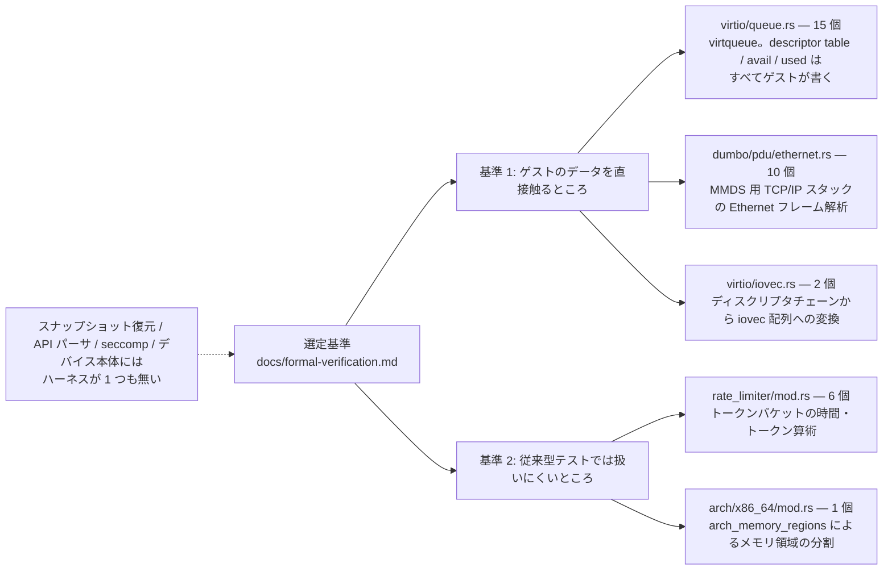
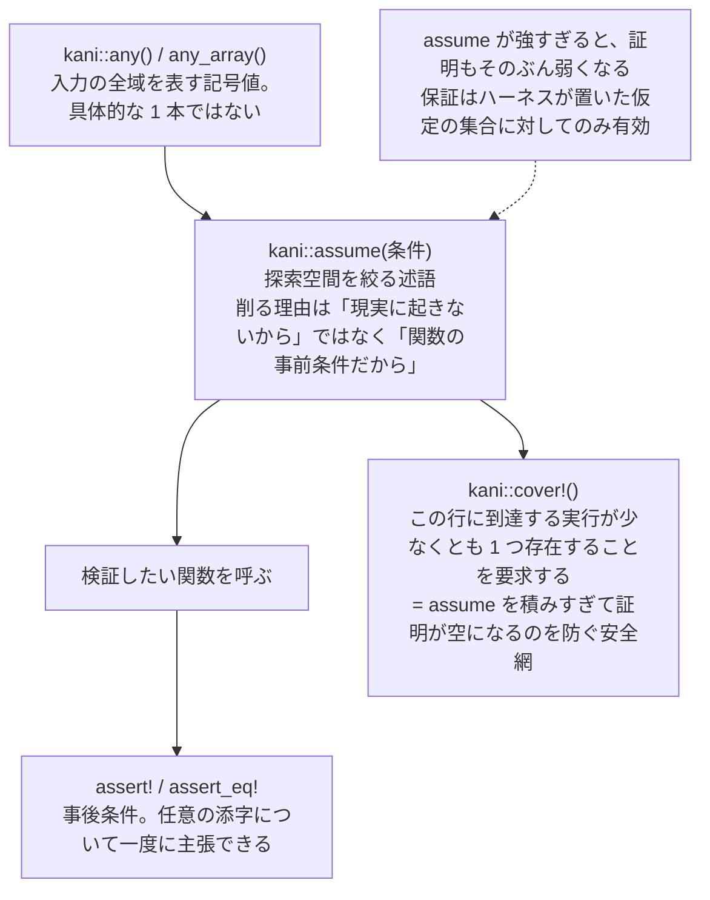

## 何を学んだか

### モデル検査を、テストの置き換えではなく補完として置く

Firecracker は [Kani Rust Verifier](https://github.com/model-checking/kani) によるモデル検査を CI に組み込んでいる。Kani はビット精度のモデル検査器で、テストと違って**コードを実行しない**。ユニットテストなら具体値を書く箇所を `kani::any()` に置き換え、その関数がどの入力でも panic せず、書いた表明を破らないことを静的に証明する。

[`docs/formal-verification.md`](https://github.com/firecracker-microvm/firecracker/blob/cc535f035f3828b2c5bfc85276c5d394022ed220/docs/formal-verification.md) は動機を脅威モデルから直接導いている。ゲストは起動の瞬間から悪意あるコードを走らせている前提なので、ゲストが渡すデータの形について何も仮定できない。そして「Traditional testing methods alone cannot guarantee about the general absence of safety issues, as for this we would need to write and run every possible unit test, exercising every possible code path - a prohibitively large task.」——あらゆるユニットテストを書くのは現実的でないから、入力の全域を一度に扱える道具を持ち込む、という筋である（[`../threat-model/`](../threat-model/)）。

ユニットテストとの差はハーネスの見た目にほぼ集約される。`#[test]` が `#[kani::proof]` になり、具体値が `kani::any()` になり、実行の代わりに検査が走る。ドキュメントの言い方では「**This is the key difference to a unit test**, where we would be using concrete values instead」。

### 全域を狙わず、範囲を明示して絞る

Firecracker は「証明カバレッジの目標は持たない」と明言し、貢献者にハーネスの追加を要求しないことまで書いている。

> **A:** No. Kani is complementary to unit testing, and we do not have target for "proof coverage". We employ formal verification in especially critical code areas.

その「especially critical」の基準は 2 つ挙げられている。ゲストのデータを直接触るところ（MMDS の TCP/IP スタックが例に挙がる）と、従来型テストでは扱いにくいところ（I/O レートリミッタが例に挙がる）。

### 宣言した基準と実際の分布は一致している

方針が実装に反映されているかは数えれば分かる。`#[kani::proof]` と `#[kani::proof_for_contract]` をソースツリー全体から拾うと、次の 6 ファイルに集中する（x86_64 / aarch64 はいずれかしかビルドされないので、x86_64 での実効値は 34 個）。

| ファイル                              | ハーネス数 | 検証対象                                                                         |
| ------------------------------------- | ---------- | -------------------------------------------------------------------------------- |
| `src/vmm/src/devices/virtio/queue.rs` | 15         | virtqueue。ディスクリプタテーブル・avail リング・used リングはすべてゲストが書く |
| `src/vmm/src/dumbo/pdu/ethernet.rs`   | 10         | MMDS 用 TCP/IP スタックの Ethernet フレーム解析                                  |
| `src/vmm/src/rate_limiter/mod.rs`     | 6          | トークンバケットの時間・トークン算術                                             |
| `src/vmm/src/devices/virtio/iovec.rs` | 2          | ディスクリプタチェーンから `iovec` 配列への変換                                  |
| `src/vmm/src/arch/x86_64/mod.rs`      | 1          | `arch_memory_regions` によるゲストメモリ領域の分割                               |
| `src/vmm/src/arch/aarch64/mod.rs`     | 1          | 同上（aarch64 版）                                                               |

上位 3 ファイルの 27 個は、すべて「ゲストが書いたバイト列を最初に解釈する場所」である。virtqueue はゲストが自由に書けるメモリ上の構造（[`../descriptor-chain-validation/`](../descriptor-chain-validation/)）、Ethernet フレームは MMDS の TCP/IP スタックがゲストから受け取る生バイト列（[`../mmds-dumbo/`](../mmds-dumbo/)）、`iovec` はディスクリプタチェーンをホストのシステムコールに渡す形へ変換する境界（[`../iov-deque/`](../iov-deque/)）。基準 1 にそのまま対応する。

rate limiter の 6 個は基準 2 に対応する。[`../rate-limiter/`](../rate-limiter/) のトークンバケットは `Instant::now()` の差分に依存するので、ユニットテストで書けるのは「sleep して測る」ような不安定なものになりやすく、ミリ秒からナノ秒への変換で起きるオーバーフローのような境界はテストで踏み抜きにくい。`arch_memory_regions` も、MMIO ギャップを避けながらメモリ長を分割する整数演算で、性質としては同じ側にある。

逆に言うと、スナップショット復元・API パーサ・seccomp フィルタ・デバイス実装本体といった、コード量としてはるかに大きい部分にはハーネスが 1 つも無い。「クリティカルな領域に絞る」は修辞ではなく、本当に絞られている。



## ソースコードのどこか

### ハーネスの組み立て方

ハーネスは `#[cfg(kani)]` を付けたモジュール（`verification` または `kani_proofs`）に置かれる。Rust のユニットテストが `#[cfg(test)] mod tests` に置かれるのと同じ構造だ。Ethernet フレームのハーネスが、`kani::any()` / `kani::assume()` / `assert!` の組み立てをいちばん素直に見せている。

```rust title="src/vmm/src/dumbo/pdu/ethernet.rs"
#[kani::proof]
fn verify_dst_mac() {
    // Create non-deterministic stream of bytes up to MAX_FRAME_SIZE
    let mut bytes: [u8; MAX_FRAME_SIZE] = kani::Arbitrary::any_array::<MAX_FRAME_SIZE>();

    // Create valid non-deterministic ethernet
    let ethernet = EthernetFrame::from_bytes(bytes.as_mut());
    kani::assume(ethernet.is_ok());
    let mut ethernet = ethernet.unwrap();

    let mac_bytes: [u8; MAC_ADDR_LEN as usize] = kani::any();
    let dst_mac = MacAddr::from(mac_bytes);
    ethernet.set_dst_mac(dst_mac);
    let dst_addr = EthernetFrame::dst_mac(&ethernet);
    // （MAC アドレスが常に 48 ビットであることの表明は省略）

    // Check duality between set_dst_mac and dst_mac operations
    let i: usize = kani::any();
    kani::assume(i < mac_bytes.len());
    assert_eq!(mac_bytes[i], dst_addr.get_bytes()[i]);
}
```

[`src/vmm/src/dumbo/pdu/ethernet.rs#L294-L321`](https://github.com/firecracker-microvm/firecracker/blob/cc535f035f3828b2c5bfc85276c5d394022ed220/src/vmm/src/dumbo/pdu/ethernet.rs#L294-L321)

3 つの道具は役割が分かれている。`kani::any()` / `any_array()` は入力の全域で、`bytes` は 1514 バイトのあらゆるビットパターンを同時に表す記号値であって具体的な 1 本のフレームではない。`kani::assume()` は探索空間を絞る述語で、ここでは「パースに成功したフレームだけ考える」。以降の証明はこの仮定が成り立つ実行にしか適用されない。`assert_eq!` は事後条件で、最後の 2 行は「`set_dst_mac` した後に `dst_mac` で読み戻すと同じバイト列になる」を任意の添字 `i` について一度に主張している。ループも 6 回の展開も要らない。



ハーネスの上には、何を仕様と見なしているかがコメントで置かれる。Ethernet 側はモジュール冒頭に「We consider the MMDS Network Stack spec for all postconditions in the harnesses.」があり、virtqueue 側では VirtIO 仕様の節番号がそのまま関数名になる（`verify_spec_2_6_7_2`。個別の証明の中身は [`../notification-suppression/`](../notification-suppression/) を参照）。FAQ の「Don't forget to mention the specification in your proof harness!」に対応している。

### 何を仮定として置いているか

証明の強さは `assume` の強さで決まる。virtqueue のハーネスは、任意の `Queue` を作ってから初期化に成功したものだけを残す。

```rust title="src/vmm/src/devices/virtio/queue.rs"
impl kani::Arbitrary for ProofContext {
    fn any() -> Self {
        let mem = setup_kani_guest_memory();
        let mut queue: Queue = kani::any();

        kani::assume(queue.initialize(&mem).is_ok());

        ProofContext(queue, mem)
    }
}
```

[`src/vmm/src/devices/virtio/queue.rs#L880-L889`](https://github.com/firecracker-microvm/firecracker/blob/cc535f035f3828b2c5bfc85276c5d394022ed220/src/vmm/src/devices/virtio/queue.rs#L880-L889)

`Queue` のアドレス 3 種は `kani::any()` なので、ゲストメモリの外を指す値も含む。ゲストメモリ自体もわざとオフセット 512 から始めてあり、コメントが「harnesses using `Queue::any()` will be exposed to queue segments both before and after valid guest memory」と意図を書いている。この `assume` は「初期化を通ったキュー」に絞るだけで、レイアウトを都合よく固定してはいない。ドキュメントが求める _over-approximate_（現実にはあり得ない状況まで含めるほうがまし）の方向に振られている。

> **Harnesses are only as strong as the assumptions they make, so all guarantees from the harness are only valid based on the set of assumptions we have in our Kani harnesses.**

一方、性能のために現実側を削っている箇所もある。rate limiter の補充ハーネスは `MAX_BUCKET_SIZE = 15` / `MAX_REFILL_TIME = 15` で入力を絞り（[`src/vmm/src/rate_limiter/mod.rs#L681-L699`](https://github.com/firecracker-microvm/firecracker/blob/cc535f035f3828b2c5bfc85276c5d394022ed220/src/vmm/src/rate_limiter/mod.rs#L681-L699)）、`iovec` のハーネスはディスクリプタチェーン長を `MAX_DESC_LENGTH = 4` 未満に制限している（実運用の最大は 256）。

### 証明が空になることへの防御

`assume` を積み上げると、条件を満たす実行が 1 つも無くなる。そうなると「すべての実行で assert が成り立つ」は真になり、検証は成功するが何も言っていない。Firecracker はこれを `kani::cover!()` で潰す。`verify_token_bucket_reduce` は失敗分岐の中にこれを置き、コメントで「kani::cover makes verification fail if no possible execution path reaches this line.」と説明している（[`src/vmm/src/rate_limiter/mod.rs#L703-L736`](https://github.com/firecracker-microvm/firecracker/blob/cc535f035f3828b2c5bfc85276c5d394022ed220/src/vmm/src/rate_limiter/mod.rs#L703-L736)）。「この行に到達する実行が少なくとも 1 つ存在する」ことを要求する表明であり、`assume` の副作用に対する安全網になっている。virtqueue の `verify_spec_2_6_7_2` でも、通知が必須になる分岐の中に同じものが置かれている。

### スタブによる差し替え

いくつかのハーネスは、実装の一部を検証用モデルに置き換える。

| 差し替え対象                  | 置き換え先                           | 理由（コメントより）                                      |
| ----------------------------- | ------------------------------------ | --------------------------------------------------------- |
| `std::time::Instant::now`     | `stubs::instant_now`                 | 非減少な非決定的時刻。初回を 0 に固定して探索を軽くする   |
| `TokenBucket::auto_replenish` | `stubs::token_bucket_auto_replenish` | 補充量を任意値にして、補充ロジックの再検証を避ける        |
| `IovDeque::push_back`         | `stubs::push_back`                   | `IovDeque` の mmap 二重写像を回避                         |
| `GuestMemoryMmap`             | `ProofGuestMemory`                   | 領域リストの二分探索を消して `kani::unwind(0)` にするため |

最後のものはコメントが明快で、「Eliminating this binary search significantly speeds up all queue proofs, because it eliminates the only loop contained herein」（[`src/vmm/src/devices/virtio/queue.rs#L700-L708`](https://github.com/firecracker-microvm/firecracker/blob/cc535f035f3828b2c5bfc85276c5d394022ed220/src/vmm/src/devices/virtio/queue.rs#L700-L708)）。

さらに `MmapRegion` と `Instant` の生成には `std::mem::transmute` を使う。`repr(Rust)` の構造体をフィールド順の同じ別型から作る、通常なら未定義動作の操作である。許されている根拠もコメントに書かれていて、「kani will never run any transformations on the code ... transpiles unoptimized rust MIR to goto-programs, which are then fed to CMBC」。Kani がコンパイラではなく MIR のトランスパイラだから成立している、という理屈だ。

### CI での回り方とコスト

Kani は PR ごとに全ハーネスを回す。パイプライン生成側の条件は「`.rs` / `.toml` / `.lock` が変わったか、devctr が変わったか、`test_kani.py` が変わったか」で、実質すべてのコード変更で発火する（[`.buildkite/pipeline_pr.py#L70-L84`](https://github.com/firecracker-microvm/firecracker/blob/cc535f035f3828b2c5bfc85276c5d394022ed220/.buildkite/pipeline_pr.py#L70-L84)）。実体は `cargo kani --workspace` を 1 回叩くだけの pytest だが、ジョブのタイムアウトが 300 分、ハーネス個別が 40 分、専有ベアメタル（`ag: 1`）指定である。ローカル実行は `os.environ.get("BUILDKITE") != "true"` で既定スキップされ、その理由は "Kani's memory requirements likely cannot be satisfied locally"（[`tests/integration_tests/test_kani.py#L22-L40`](https://github.com/firecracker-microvm/firecracker/blob/cc535f035f3828b2c5bfc85276c5d394022ed220/tests/integration_tests/test_kani.py#L22-L40)）。

### ファジングは別レイヤに置かれている

Kani が「入力の全域を静的に」なら、ファジングは「具体入力を大量に動かす」側だ。[`docs/fuzzing.md`](https://github.com/firecracker-microvm/firecracker/blob/cc535f035f3828b2c5bfc85276c5d394022ed220/docs/fuzzing.md) は `--features fuzzing` の変更点を 2 つだけ挙げる。TCP の初期シーケンス番号をランダムから固定値にすること（再現性のため）と、バルーンの統計キューをタイマー駆動でなくインラインで処理すること（ファジング中はタイマー経路が使えないため）。

```rust title="src/vmm/src/dumbo/tcp/connection.rs"
// Let's pick the initial sequence number.
// when fuzzing use a constant value to make it deterministic
#[cfg(feature = "fuzzing")]
let isn = Wrapping(0x12345678u32);
#[cfg(not(feature = "fuzzing"))]
let isn = Wrapping(xor_pseudo_rng_u32());
```

[`src/vmm/src/dumbo/tcp/connection.rs#L251-L257`](https://github.com/firecracker-microvm/firecracker/blob/cc535f035f3828b2c5bfc85276c5d394022ed220/src/vmm/src/dumbo/tcp/connection.rs#L251-L257)

これは「セキュリティ上重要なランダム性を無効化する」変更なので、本番バイナリに紛れ込ませてはならない。Firecracker はコンパイルエラーで止める。

```rust title="src/firecracker/src/main.rs"
#[cfg(all(feature = "fuzzing", not(debug_assertions)))]
compile_error!(
    "The `fuzzing` feature must not be used in release builds. \
     Build with the dev profile instead: `cargo build --features fuzzing`"
);
```

[`src/firecracker/src/main.rs#L4-L8`](https://github.com/firecracker-microvm/firecracker/blob/cc535f035f3828b2c5bfc85276c5d394022ed220/src/firecracker/src/main.rs#L4-L8)

条件は「`fuzzing` が有効かつ `debug_assertions` が無効」、つまりリリースプロファイルでのビルドである。防御はこれだけではなく、バージョン文字列に `+fuzzing` が付き（[`src/firecracker/src/main.rs#L52-L56`](https://github.com/firecracker-microvm/firecracker/blob/cc535f035f3828b2c5bfc85276c5d394022ed220/src/firecracker/src/main.rs#L52-L56)）、起動時に「DO NOT use in production.」の警告が出る（[`src/firecracker/src/main.rs#L335-L339`](https://github.com/firecracker-microvm/firecracker/blob/cc535f035f3828b2c5bfc85276c5d394022ed220/src/firecracker/src/main.rs#L335-L339)）。ビルド時に落とし、通り抜けたらバージョンで区別でき、動いてもログで分かる、の 3 段構えだ。

## なぜそうなっているか

### 絞る理由はコストである

Kani を全域に広げない理由は、ドキュメントが「we do not have target for proof coverage」と書く以上には説明されていない。ただしコストは CI の設定から読める。34 個のハーネスに対してジョブ 300 分、ハーネス単体 40 分、専有ベアメタル、ローカルでは OOM のためスキップ。ハーネス 1 つごとに CI の実時間と占有マシンが増える構造になっている。

ハーネス側のコメントも、その圧力の記録として読める。「二分探索を消すと大幅に速くなる」「バケットサイズを 15 未満に制限する」「秒とナノ秒を別々に持つのは、除算と剰余が SAT ソルバにとって非常に難しいから」。どれも証明を通すための性能上の妥協である。こういう妥協が要るなら対象を選ぶしかない。選定基準を「ゲスト由来の未検証入力」と「テストで扱いにくい算術」に置いたのは、脅威モデルから見て手を抜けない場所と、テストの手が届かない場所を優先したということだ。

### ドキュメントが限界を先に書いている

`docs/formal-verification.md` は Kani の宣伝ではなく、失敗する例から始まる。`verify_token_bucket_new` の最初の版が乗算オーバーフローを見つけ、修正すると今度はハーネス側の表明が破れ、条件を足して初めて通る、という流れを検証出力ごと載せている。そのうえで「この発見は benign（599730287.457 年の補充時間を設定する人はいない）」とまで書く。

宣伝としては弱いが、道具の性質の説明としては正確である。モデル検査は現実的でない入力も含めて全部見るので、現実的でない入力でしか起きない問題も報告する。それに対して入力を除外するのではなく `TokenBucket::new` 側にチェックを足し、ハーネスの条件も更新した。仕様のほうを明確にする方向に倒したわけだ。

### 保証されないもの

**1. 仮定の強さがそのまま証明の弱さになる。** rate limiter の補充ハーネスはバケットサイズ 15 未満・補充時間 15 ms 未満、`iovec` のハーネスはチェーン長 4 未満（実運用は最大 256）でしか検証していない。「小さいケースで成り立つなら大きいケースでも」という帰納的な期待に依存していて、証明ではない。ドキュメント自身が bounded approach と呼び、保証は仮定の集合に対してのみ有効だと明記している。`kani::cover!()` は「仮定が矛盾していないこと」を保証するが、「仮定が現実を覆っていること」は保証しない。

**2. 並行性は対象外である。** 34 個のハーネスはすべて単一スレッドの関数呼び出しを検証している。Kani のドキュメントが挙げる検証対象（メモリ安全性・利用者定義の表明・panic の不在・算術オーバーフロー）にもメモリ順序は入っていない。virtqueue のハーネスではゲストメモリが `kani::vec::exact_vec::<u8, GUEST_MEMORY_SIZE>()` の記号バイト列として固定されるので、同じアドレスを 2 回読めば 2 回とも同じ値が返る。ゲストが 2 回の読み出しの間にリングを書き換える double-fetch は、このモデルに現れない。不正な入力を弾くことは証明されているが、「検証と使用の間に値が変わらない」ことは証明されていない。後者は [`../descriptor-chain-validation/`](../descriptor-chain-validation/) の「一度読んだらローカルにコピーする」という実装規約で守られている。

**3. スタブは証明の対象から抜ける。** 置き換え先が本物の振る舞いを正しく近似していなければ、証明は本物について何も言わない。`auto_replenish` は別ハーネスで単独検証されているが、`IovDeque::push_back` の mmap 二重写像はハーネスから抜けている。`MmapRegionStub` / `InstantStub` の `transmute` に至っては、標準ライブラリの内部表現が変わったら黙って壊れる（コメントも "currently this seems to work" と書いている）。ただし `gcd` だけは扱いが違い、`#[kani::proof_for_contract(gcd)]` で契約を証明したうえで、他のハーネスが `#[kani::stub_verified(gcd)]` で「検証済みのスタブ」として使う。穴を開けずにスタブ化する仕組みも用意されている。

## どう活かすか

### 「入力の全域」が問題になる境界だけを探す

モデル検査を持ち込む価値があるのは、次の 2 条件が重なる場所だ。入力が自分の管理下にない（攻撃者・別テナント・外部プロトコルから来る）こと。そして入力空間が広く構造があり、全パターンを列挙できないが性質としては書けること。Firecracker がハーネスを置いた 3 箇所はすべてこれに当たり、自分たちが書いた設定ファイルのパースや内部からしか呼ばれない関数には置かれていない。

自分のコードで探すなら「ここに来る値は、誰が最後に書いたか」を辿るのが早い。書いたのが自分たちのコードなら普通のテストで足りる。外部が書いていて、しかも `usize` へのキャストや加算やスライス切り出しが並んでいるなら候補になる。

### 導入コストは CI 時間として現れる

34 個のハーネスに 300 分の枠と専有ベアメタルが要る、という数字は素直に受け取るべきだ。増やすほど PR のフィードバックが遅くなるので、「全関数に証明を付ける」を目標に置くと CI が先に破綻する。「proof coverage の目標を持たない」と最初に宣言してしまうのは、この意味で運用上の選択である。数値目標を置くと価値の低いハーネスが増えて時間だけ食う。代わりに基準を文章で書いておけば、増やすかどうかをレビューで判断できる。CI 時間の制約が緩い（マージ頻度が低い、nightly に回せる）なら話は変わるので、PR ブロッカーにするかは実行時間とマージ頻度の掛け算で決めればよい。

### ハーネスを書くときの型

1. 検証したい性質の出所を名前かコメントに明示する（`verify_spec_2_6_7_2` のように）。
2. 入力は `kani::any()` から始めて、必要な分だけ `assume` で削る。削る理由は「現実に起きないから」ではなく「関数の事前条件だから」にする。過剰に含めるほうが安全。
3. `assume` を置いたら、対応する場所に `kani::cover!()` を置き、証明が空でないことを機械に確認させる。
4. 性能のために境界を狭めたら、その値と理由をコメントに残す。後から読む人が「証明されている範囲」を誤解しないため。
5. スタブを入れたら、何を近似しているかを書く。可能なら `stub_verified` のようにスタブ自体を別途検証する。

### 取り込むべきでない条件

- **入力を自分で生成している場合。** 内部 API しか呼ばないコードにモデル検査を掛けても、探索空間が広いぶんコストだけ払う。proptest や Hypothesis のようなプロパティベーステストで足りることが多い。
- **並行性のバグを疑っている場合。** Kani は逐次実行のモデル検査で、メモリ順序やデータ競合は対象外である。そちらは Loom や TSan、あるいは設計上の隔離（[`../vcpu-thread-drop/`](../vcpu-thread-drop/) のようなスレッド所有権の整理）で扱うべき問題だ。
- **仕様が定まっていない場合。** ハーネスは「証明したい性質」を書く場所なので、性質が言語化できていないと `assert!` に書くことがない。実装をそのまま写した表明を書いてしまい、何も検証しないハーネスができる。

### `--features fuzzing` の作り方は真似しやすい

「テスト用に安全性を落とす feature」はどんなプロジェクトでもいずれ必要になる。Firecracker のやり方はそのまま持っていける。変更点を 1 つのドキュメントに列挙し（`docs/fuzzing.md` は 2 項目しかない）、リリースプロファイルとの組み合わせを `compile_error!` で禁止し、バージョン文字列に印を付け、起動時に警告を出す。とくに最初の 2 つは費用がほぼゼロで効く。`#[cfg(feature = "...")]` が増えるほど「本番で何が有効なのか」が分からなくなるので、危険な feature には機械的な柵を付けておくのが安い。
