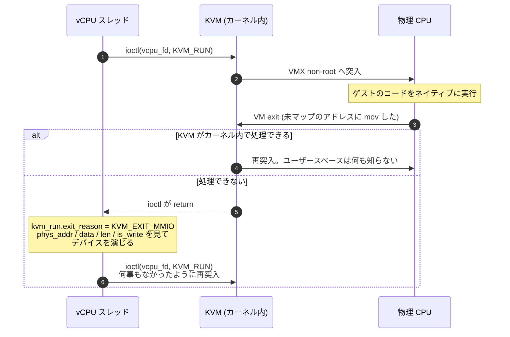
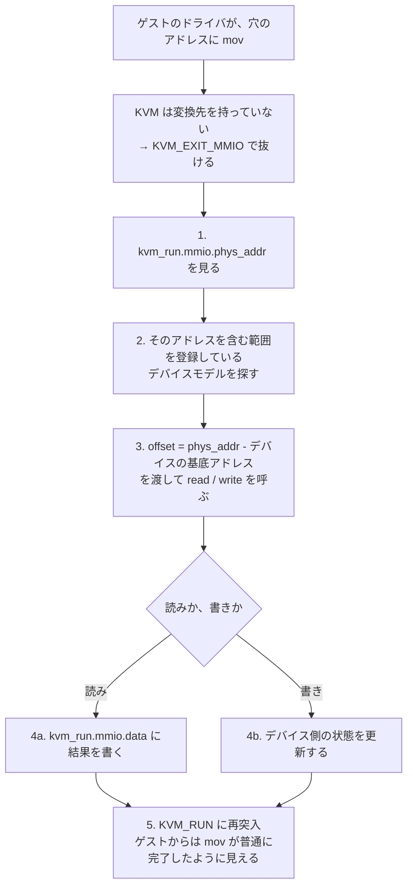
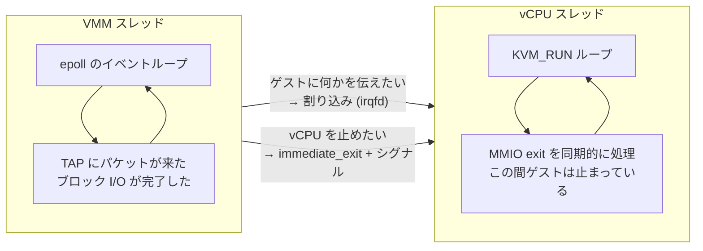

前のページまでで、道具は揃った。`/dev/kvm` を開いて system fd を得て、`KVM_CREATE_VM` で vm fd を得て、`KVM_CREATE_VCPU` で vcpu fd を得た。ゲスト物理メモリはホスト側の `mmap` した領域で、メモリスロットとして vm fd に登録した。

残っているのは 1 つだけだ。**走らせること**。そしてそれは、vcpu fd に対する 1 本の ioctl でしかない。

## KVM_RUN は「ゲストを実行して、困ったら戻ってくる」ブロッキング呼び出し

```c
ioctl(vcpu_fd, KVM_RUN, 0);
```

この ioctl を呼んだスレッドは、CPU を VMX non-root モードに切り替え、ゲストのコードを実行し始める。ゲストは自分のコードを、ホストの介在なしに、物理 CPU 上でネイティブに走る。これが仮想化ハードウェアの本体だった。

そして、ゲストが VM exit を起こしたとき、KVM は 2 通りの処理をする。

1. **カーネル内で処理できるもの**は、そのまま処理してゲストに戻す。ページテーブルの都合、割り込みの注入、`cpuid` 命令、カーネル内でエミュレートしているタイマ (PIT) や割り込みコントローラへのアクセスなど。ユーザースペースは何も知らないまま、ゲストの実行が続く。
2. **カーネル内で処理できないもの**は、`KVM_RUN` ioctl そのものを return させる。ここで初めて VMM の出番になる。

つまり `KVM_RUN` から抜けてくるのは、**ゲストが「ユーザースペースの助けが必要なこと」をしたとき**だけだ。VM exit のうちごく一部しかここまで上がってこない。



## 戻ってきた理由の受け渡し場所は、mmap した構造体

ここで問題になるのが、「どうやって理由と付随データを受け取るか」だ。ioctl の戻り値は `int` ひとつしかない。MMIO なら「どのアドレスに」「何バイト」「読みか書きか」「書きならそのデータは何か」を渡さなければならない。

KVM の答えは **vcpu fd を `mmap` する** ことだった。

```c
mmap_size = ioctl(kvm_fd, KVM_GET_VCPU_MMAP_SIZE, 0);   // system fd に聞く
run = mmap(NULL, mmap_size, PROT_READ | PROT_WRITE, MAP_SHARED, vcpu_fd, 0);
```

得られるのが `struct kvm_run` だ。ホストのユーザースペースとカーネルが共有する 1 ページ程度の領域で、ここが `KVM_RUN` の入出力パラメータ置き場になる。

```c
struct kvm_run {
    __u8 request_interrupt_window;
    __u8 immediate_exit;          /* 1 を書くと次の KVM_RUN が即座に抜ける */
    ...
    __u32 exit_reason;            /* 戻ってきた理由 */
    ...
    union {
        struct { __u64 hardware_exit_reason; } hw;
        struct {                              /* KVM_EXIT_IO */
            __u8 direction; __u8 size; __u16 port; __u32 count;
            __u64 data_offset;
        } io;
        struct {                              /* KVM_EXIT_MMIO */
            __u64 phys_addr; __u8 data[8]; __u32 len; __u8 is_write;
        } mmio;
        struct { __u32 type; __u64 flags[16]; } system_event;
        ...
    };
};
```

ゲスト物理メモリがホストの `mmap` だったのと同じ発想だ。**頻繁にやりとりするデータは、ioctl の引数ではなく共有メモリに置く**。`KVM_RUN` は 1 秒に何万回も呼ばれうるので、そのたびにデータをコピーしていられない。

ちなみに `immediate_exit` は入力側のフィールドで、別スレッドからここに 1 を書いておくと `KVM_RUN` が実行せずに即 return する。これは後で効いてくる。

## 主な exit reason

すべてを覚える必要はない。VMM が実際に扱うのは数個だ。

| exit_reason               | 意味                                                                | VMM がやること                                             |
| ------------------------- | ------------------------------------------------------------------- | ---------------------------------------------------------- |
| `KVM_EXIT_MMIO`           | ゲストがメモリスロットに登録されていない物理アドレスにアクセスした  | アドレスからデバイスを引き当て、レジスタの読み書きを演じる |
| `KVM_EXIT_IO`             | ゲストが `in` / `out` 命令を実行した (x86 のポート I/O)             | 同上。ただしアドレス空間はポート番号 (16bit)               |
| `KVM_EXIT_SHUTDOWN`       | x86 では triple fault。ゲストが致命的に壊れた                       | 普通は VM を落とす                                         |
| `KVM_EXIT_SYSTEM_EVENT`   | ゲストがアーキテクチャ固有の手段でリセット/シャットダウンを要求した | VM を落とす                                                |
| `KVM_EXIT_FAIL_ENTRY`     | VMX/SVM への突入自体に失敗した                                      | ハードウェアかホストカーネル側の問題。エラー               |
| `KVM_EXIT_INTERNAL_ERROR` | KVM 自身が続行できなくなった                                        | エラー                                                     |
| `KVM_EXIT_HLT`            | ゲストが `hlt` を実行した (irqchip をカーネル内に持たない構成のみ)  | 割り込みが来るまで待つ                                     |

そして `KVM_RUN` が `EINTR` で失敗して返ることもある。シグナルが届いた場合だ。これは「exit reason がある」のではなく、単に中断されただけで、ゲストの状態は保たれている。

## 「デバイスをエミュレートする」の実体

ここが VMM の中心にある考え方なので、丁寧に見ておく。

前のページで、ゲスト物理メモリはメモリスロットとして KVM に登録した領域だけだと書いた。ゲストから見た物理アドレス空間には、**どのメモリスロットにも属さない穴**がある。x86_64 なら 3 GiB あたりから 4 GiB までがそういう穴で、実機ではここに PCI デバイスのレジスタや割り込みコントローラが並んでいる。

ゲストのドライバがその穴に `mov` すると、KVM は変換先を持っていないので `KVM_EXIT_MMIO` で抜けてくる。VMM は次をやる。

1. `kvm_run.mmio.phys_addr` を見る。
2. そのアドレスを含む範囲を登録しているデバイスモデルを探す。
3. 見つけたデバイスの `read` / `write` を、`phys_addr - デバイスの基底アドレス` をオフセットとして呼ぶ。
4. 読みなら `kvm_run.mmio.data` に結果を書き込む。書きならデバイス側の状態を更新する。
5. `KVM_RUN` に再突入する。ゲストから見ると `mov` が普通に完了したように見える。



**「デバイスをエミュレートする」とは、要するにこの 5 ステップのことだ**。実在のハードウェアが持っているレジスタの意味を、ソフトウェアで演じる。ゲストのドライバは自分がエミュレートされたデバイスを触っていることを (少なくとも原理上は) 知らなくていい。

x86 にはもう 1 つ、`in` / `out` 命令で触るポート I/O 空間がある。仕組みは同じで、アドレス空間が 16bit のポート番号になるだけだ。シリアルポート (`0x3f8`)、PS/2 コントローラ (`0x60`, `0x64`) といった枯れたデバイスがここにいる。

## Firecracker ではどこに出てくるか

Firecracker は 1 プロセスが 1 台の microVM に対応し、その中で API スレッド・VMM スレッド・vCPU スレッド (ゲストの vCPU 数だけ) が動く。設計ドキュメントに明記されている ([`docs/design.md`](https://github.com/firecracker-microvm/firecracker/blob/cc535f035f3828b2c5bfc85276c5d394022ed220/docs/design.md))。

> In addition to them, there are one or more vCPU threads (one per guest CPU core). They are created via KVM and run the `KVM_RUN` main loop. They execute synchronous I/O and memory-mapped I/O operations on devices models.

vCPU スレッドは `Vcpu::start_threaded` で立つ ([`src/vmm/src/vstate/vcpu.rs#L180-L210`](https://github.com/firecracker-microvm/firecracker/blob/cc535f035f3828b2c5bfc85276c5d394022ed220/src/vmm/src/vstate/vcpu.rs#L180-L210))。名前は `fc_vcpu 0`, `fc_vcpu 1`, ... で、`ps -T` で見える。

### KVM_RUN を呼ぶところ

`run_emulation` が `KVM_RUN` の 1 回分に対応する ([`src/vmm/src/vstate/vcpu.rs#L404-L432`](https://github.com/firecracker-microvm/firecracker/blob/cc535f035f3828b2c5bfc85276c5d394022ed220/src/vmm/src/vstate/vcpu.rs#L404-L432))。

```rust title="src/vmm/src/vstate/vcpu.rs"
    pub fn run_emulation(&mut self) -> Result<VcpuEmulation, VcpuError> {
        if self.kvm_vcpu.fd.get_kvm_run().immediate_exit == 1u8 {
            warn!("Requested a vCPU run with immediate_exit enabled. The operation was skipped");
            self.kvm_vcpu.fd.set_kvm_immediate_exit(0);
            return Ok(VcpuEmulation::Interrupted);
        }

        match self.kvm_vcpu.fd.run() {
            Err(ref err) if err.errno() == libc::EINTR => {
                self.kvm_vcpu.fd.set_kvm_immediate_exit(0);
                // Notify that this KVM_RUN was interrupted.
                Ok(VcpuEmulation::Interrupted)
            }
            ...
            emulation_result => handle_kvm_exit(&mut self.kvm_vcpu.peripherals, emulation_result),
        }
    }
```

`get_kvm_run()` が、まさに `mmap` した `struct kvm_run` へのアクセスだ。`immediate_exit` の読み書きと `EINTR` の扱いがここに集中している。これは他スレッドから vCPU を止める仕組みで、[vCPU を止める](../vcpu-kick/) で扱う。

呼び出し側はただのループになっている ([`src/vmm/src/vstate/vcpu.rs#L239-L263`](https://github.com/firecracker-microvm/firecracker/blob/cc535f035f3828b2c5bfc85276c5d394022ed220/src/vmm/src/vstate/vcpu.rs#L239-L263))。

```rust title="src/vmm/src/vstate/vcpu.rs"
    fn running(&mut self) -> VcpuRunState {
        // This loop is here just for optimizing the emulation path.
        // No point in ticking the state machine if there are no external events.
        loop {
            match self.run_emulation() {
                // Emulation ran successfully, continue.
                Ok(VcpuEmulation::Handled) => (),
                // Emulation was interrupted, check external events.
                Ok(VcpuEmulation::Interrupted) => break,
                ...
            }
        }
```

`Handled` が返る限り、外側の状態機械には戻らずに `KVM_RUN` に再突入する。MMIO の 1 回ごとにチャネルを覗いていたら遅いからだ、とコメントが説明している。

### 戻ってきた理由を捌くところ

`handle_kvm_exit` が exit reason ごとの分岐だ ([`src/vmm/src/vstate/vcpu.rs#L436-L462`](https://github.com/firecracker-microvm/firecracker/blob/cc535f035f3828b2c5bfc85276c5d394022ed220/src/vmm/src/vstate/vcpu.rs#L436-L462))。

```rust title="src/vmm/src/vstate/vcpu.rs"
        Ok(run) => match run {
            VcpuExit::MmioRead(addr, data) => {
                data.fill(0);
                if let Some(mmio_bus) = &peripherals.mmio_bus {
                    let _metric = METRICS.vcpu.exit_mmio_read_agg.record_latency_metrics();
                    if let Err(err) = mmio_bus.read(addr, data) {
                        warn!("Invalid MMIO read @ {addr:#x}:{:#x}: {err}", data.len());
                    }
                    METRICS.vcpu.exit_mmio_read.inc();
                }
                Ok(VcpuEmulation::Handled)
            }
```

`data` は `kvm_run.mmio.data` を指すスライスで、ここに書いた内容がそのままゲストのレジスタに入る。デバイスが見つからなかった場合 (`Err`) はゼロを返して先に進む — 読みの先頭で `data.fill(0)` しているのはそのためだ。存在しないデバイスを読んだゲストは全ビット 0 を得る。これは実機の挙動 (全ビット 1 が返ることが多い) とは違うが、ゲストを落とさずに続行するという選択になっている。

x86 固有のポート I/O は、アーキテクチャ別の関数に落ちる ([`src/vmm/src/arch/x86_64/vcpu.rs#L753-L789`](https://github.com/firecracker-microvm/firecracker/blob/cc535f035f3828b2c5bfc85276c5d394022ed220/src/vmm/src/arch/x86_64/vcpu.rs#L753-L789))。

```rust title="src/vmm/src/arch/x86_64/vcpu.rs"
    pub fn run_arch_emulation(&self, exit: VcpuExit) -> Result<VcpuEmulation, VcpuError> {
        match exit {
            VcpuExit::IoIn(addr, data) => {
                data.fill(0);
                if let Some(pio_bus) = &self.pio_bus {
                    ...
                    if let Err(err) = pio_bus.read(u64::from(addr), data) {
```

MMIO と構造がまったく同じで、参照するバスが `mmio_bus` から `pio_bus` に変わるだけだ。ポート I/O は x86 にしかないので、aarch64 側の同名関数はこの分岐を持たない。

そして `KVM_EXIT_HLT` と `KVM_EXIT_SHUTDOWN` は **意図的に扱われていない**。どちらの分岐にも一致せず `run_arch_emulation` の `unexpected_exit` に落ちてエラーになる。テストがこれを固定している ([`src/vmm/src/vstate/vcpu.rs#L720-L733`](https://github.com/firecracker-microvm/firecracker/blob/cc535f035f3828b2c5bfc85276c5d394022ed220/src/vmm/src/vstate/vcpu.rs#L720-L733))。

```rust title="src/vmm/src/vstate/vcpu.rs"
        let res = handle_kvm_exit(&mut vcpu.kvm_vcpu.peripherals, Ok(VcpuExit::Hlt));
        assert!(matches!(
            res,
            Err(EmulationError::UnhandledKvmExit(s)) if s == "Hlt",
        ));
```

`Hlt` が上がってこないのは、Firecracker が割り込みコントローラをカーネル内に持たせているからだ (次のページで扱う)。`Shutdown` は triple fault、つまりゲストが直しようもなく壊れた状態なので、エラーとして vCPU を終わらせるのが正しい。

ゲストからのシャットダウン要求は `VcpuExit::SystemEvent` として来る ([`src/vmm/src/vstate/vcpu.rs#L486-L493`](https://github.com/firecracker-microvm/firecracker/blob/cc535f035f3828b2c5bfc85276c5d394022ed220/src/vmm/src/vstate/vcpu.rs#L486-L493))。ただし x86 ではこの経路は使われず、i8042 コントローラのエミュレーションがポート I/O を受けて VMM スレッドに直接伝える。コード中のコメントがそう書いている。

```rust title="src/vmm/src/vstate/vcpu.rs"
                // The guest requested a SHUTDOWN or RESET. This is ARM
                // specific. On x86 the i8042 emulation signals the main thread
                // directly without calling Vcpu::exit().
                Ok(VcpuEmulation::Stopped) => return self.exit(FcExitCode::Ok),
```

`reboot` したゲストが本当に「PS/2 キーボードコントローラのリセット線を叩いて」止まっているというのは、エミュレーションの現実味がよく出ている箇所だ。

### アドレスからデバイスを引き当てるところ

`mmio_bus.read(addr, data)` の中身が `Bus` だ ([`src/vmm/src/vstate/bus.rs#L115-L129`](https://github.com/firecracker-microvm/firecracker/blob/cc535f035f3828b2c5bfc85276c5d394022ed220/src/vmm/src/vstate/bus.rs#L115-L129))。

```rust title="src/vmm/src/vstate/bus.rs"
pub struct Bus {
    /// Device handles keyed by an opaque slot. ...
    devices: RwLock<Slab<Weak<Mutex<dyn BusDevice>>>>,

    /// Maps each occupied address range to the slot in `devices` holding the
    /// owning device.
    ranges: RwLock<BTreeMap<BusRange, usize>>,
}
```

デバイスは `BusRange { base, end }` をキーとする `BTreeMap` に入っている。`BusRange` の `Ord` は `base` の比較だけで実装されていて ([`src/vmm/src/vstate/bus.rs#L87-L91`](https://github.com/firecracker-microvm/firecracker/blob/cc535f035f3828b2c5bfc85276c5d394022ed220/src/vmm/src/vstate/bus.rs#L87-L91))、範囲が重ならないことは `insert` 時に保証されている。だから「アドレスを含む範囲」は範囲クエリ 1 回で求まる ([`src/vmm/src/vstate/bus.rs#L185-L210`](https://github.com/firecracker-microvm/firecracker/blob/cc535f035f3828b2c5bfc85276c5d394022ed220/src/vmm/src/vstate/bus.rs#L185-L210))。

```rust title="src/vmm/src/vstate/bus.rs"
        let (base, slot) = {
            let ranges = self.ranges.read().unwrap();
            match ranges.range(..=BusRange::new(addr, 1).unwrap()).next_back() {
                Some((range, &slot)) if addr <= range.end() => (range.base(), slot),
                _ => return Err(BusError::MissingAddressRange),
            }
        };
        ...
        let mut locked = device.lock().unwrap();
        let offset = addr - base;
        Ok(f(&mut *locked, base, offset))
```

`range(..=addr).next_back()` は「`addr` 以下で最大の base を持つエントリ」を返す。それが見つかったうえで `addr <= range.end()` なら、そのデバイスの担当範囲内だ。`O(log n)`、線形走査なし。そして `offset = addr - base` を渡すので、**デバイス側は自分がゲスト物理アドレス空間のどこに置かれたかを知らなくてよい**。トレイトのドキュメントコメントがその意図を明言している。

```rust title="src/vmm/src/vstate/bus.rs"
/// Trait for devices that respond to reads or writes in an arbitrary address space.
///
/// The device does not care where it exists in address space as each method is only given an offset
/// into its allocated portion of address space.
pub trait BusDevice: Send {
```

このおかげで、同じ `Bus` の実装が MMIO 空間にもポート I/O 空間にも使い回せている。`Peripherals` が `mmio_bus` と `pio_bus` を 2 本持っているのはそれだけの話だ。

## vCPU スレッドと VMM スレッドは別物である

ここまでの流れはすべて **vCPU スレッドの中で同期的に**起きている。MMIO exit を受けてデバイスの `write` を呼び、その中でホストの `write(2)` を呼び、返ってきてから `KVM_RUN` に戻る。その間、そのゲスト vCPU は止まっている。

一方、ホスト側の I/O 完了 (TAP デバイスにパケットが来た、ブロックデバイスの読み出しが終わった) を待ち受けているのは VMM スレッドのイベントループだ。こちらは vCPU とは無関係に回っている。



2 つのスレッドが別々に走ることから、次の 2 つの問いが出てくる。

- **VMM スレッド側からゲストに何かを伝えたいときはどうするか。** これが割り込みで、[割り込みをゲストに届ける](../interrupt-delivery/) で扱う。
- **VMM スレッド側から vCPU スレッドを止めたいときはどうするか。** `KVM_RUN` は無期限にブロックしうるので、スナップショットを取るにも VM を落とすにも、走っている vCPU を確実に抜けさせる手段が要る。上で見た `immediate_exit` とシグナルの組み合わせがそれで、[vCPU を止める](../vcpu-kick/) で詳しく読む。

また、デバイスの `write` の中で重い処理をすればそのぶんゲストが止まるという性質は、Firecracker のデバイス実装の随所に影響している。「MMIO exit を減らす」ことが性能設計の主題になる理由でもあり、次々ページの [virtio](../virtio-basics/) はまさにその答えだ。
