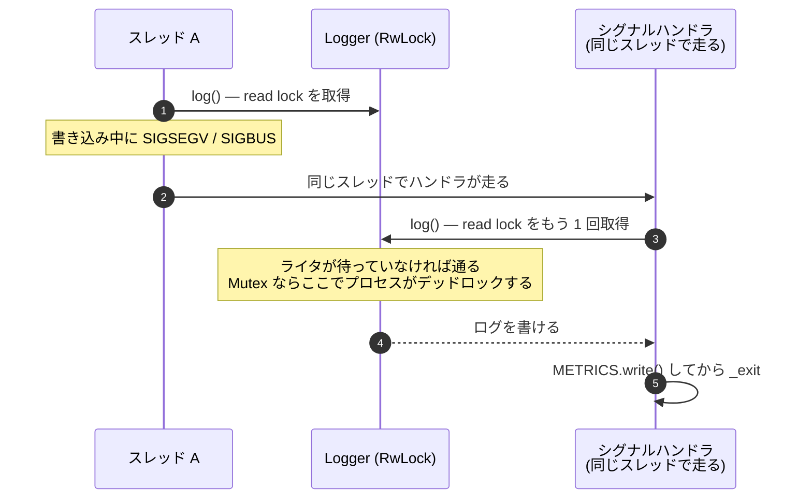

## 何を学んだか

### ロックの種類は、呼び出し文脈の制約から決まる

グローバルなロガーを守るロックを選ぶとき、普通は `Mutex` を選ぶ。書き込み先のファイルハンドルは共有可変資源だし、複数スレッドが同時に書いたら行が混ざる。読み書きの比率で `RwLock` を選ぶ、というのが一般的な判断基準だ。

Firecracker は `RwLock` を選んでいる。理由は性能ではない。

```rust
pub struct Logger(pub RwLock<LoggerConfiguration>);
```

`log()` は **読み取りロック** を取る。設定を変える `update()` だけが書き込みロックを取る。そして `update()` は [API の状態機械](../api-state-machine/)によって **起動前にしか呼べない**（`ConfigureLogger` は post-boot の match で `OperationNotSupportedPostBoot` に落ちる）。

この 2 つが揃うと、実行中のプロセスで書き込みロックが取られることがなくなる。すると次が言える。



**同じスレッドが読み取りロックを入れ子で取れる。** ライタが待っていなければ、`RwLock::read()` は既に読み取りロックが取られていても成功する。`Mutex` だったら、この瞬間にプロセスがデッドロックする。ログも出せず、メトリクスも書けず、SIGSEGV の原因も分からないまま固まる。

Firecracker の[シグナルハンドラ](../signal-handling/)は `error_unrestricted!` でログを出してから `_exit` する。ハンドラがログを出す以上、ロガーは再入可能でなければならない。**「シグナルハンドラからログを書く」という要求が、ロックの種類を決めている。**

コメントは残る危険も正直に書いている。「pre-boot の `update()` 中にシグナルが来たらブロックしうる」。起動前の一瞬だけは危険が残る。消せない部分を消したふりをしていない。

### ログの出力は JSON ではない

メトリクスは JSON だが、ログは人が読む 1 行だ。

```
2026-08-29T12:34:56.789012345 [my-instance:fc_vcpu 0:ERROR:src/vmm/src/devices/virtio/net/device.rs:412] Failed to write to tap
└──────── タイムスタンプ ────────┘ └ id ┘ └ スレッド名 ┘ └lvl┘ └──── file:line ────┘ └── メッセージ ──┘
```

角括弧の中身は 4 つで、うち 2 つはオプション。

| 要素            | 制御                                  | 既定                 |
| --------------- | ------------------------------------- | -------------------- |
| インスタンス ID | `--id`（`INSTANCE_ID` の `OnceLock`） | `anonymous-instance` |
| スレッド名      | 常時                                  | `-`（無名スレッド）  |
| ログレベル      | `show_level`                          | 出さない             |
| `file:line`     | `show_log_origin`                     | 出さない             |

**スレッド名が常に出る**のが Firecracker らしい。`fc_api` / `fc_vmm` / `fc_vcpu N` という[3 種類のスレッド](../architecture/)があるので、どのスレッドが吐いたかがそのまま「API 処理中か、デバイスエミュレーション中か、vCPU 実行中か」を意味する。

書き込みは **1 行を 1 回の `write_all` で** 出す。コメントに `One write_all per line keeps output atomic` とある。複数スレッドが同時に書いても行が混ざらないことを、ロックではなく「1 回のシステムコールに収める」ことで担保している。

### 書けなかったときにログを出さない

出力先が名前付きパイプで、読み手が居なくなった／詰まった場合、`write_all` は失敗する。ここで Firecracker は **エラーを stderr に出さない。** コメントは `No reason to log the error to stderr here, just increment the metric.` と書いている。

理由は書かれていないが、`log()` の中でログを出そうとすれば、それ自体が同じ経路を通って同じ理由で失敗し、また `log()` を呼ぶ。**無限再帰になる。** 出力先が壊れているときに「出力先が壊れています」と出力先に書こうとするのは筋が悪い。

代わりに [`missed_log_count` というメトリクス](../metrics-design/)を増やす。ログが届かなかったという事実は、メトリクスの側に記録される。**観測経路が 2 本あって、片方が死んだらもう片方に記録が残る。**

さらにこの経路には別の側面がある。パイプが詰まった状態で書くと SIGPIPE が上がる。だから[SIGPIPE のハンドラ](../signal-handling/)も、同じ理由でログを出さない。ロガーとシグナルハンドラが同じ制約を共有している。

なお出力先ファイルは `O_NONBLOCK` 付きで開かれる。パイプが詰まったときにロガーが VMM スレッドごとブロックすることを避けている。

### ログのレート制限は、呼び出し箇所ごとに独立している

ゲストの挙動でログが出る経路（不正なディスクリプタを受け取った、など）は、ゲストが意図的に叩けばログを無限に生成できる。ホストのディスクを埋められる。

Firecracker は `error!` / `warn!` / `info!` マクロを **レート制限付きに置き換えた。** 制限を受けない版は `error_unrestricted!` などと明示的な名前になっている。

```
error!(...)              → 10 メッセージ / 5 秒（呼び出し箇所ごと）
error_unrestricted!(...) → 無制限（ホスト起因の経路のみ）
```

肝は **「呼び出し箇所ごと」** であることだ。マクロが展開されるとその場所に `static LIMITER` が生成される。ある `error!` が叩かれ続けても、別の場所の `error!` は影響を受けない。ゲストが 1 つの経路を叩き続けても、他の重要なログが埋もれない。

アルゴリズムは GCRA（Generic Cell Rate Algorithm）で、状態は `AtomicU64` 1 つに詰められている。上位 24 ビットが「抑制した件数」、下位 40 ビットが「理論到達時刻（プロセス起動からのミリ秒）」。CAS ループで両方を同時に更新するのでロックが要らない。ここでも[メトリクスと同じ発想](../metrics-design/)——ホットパスから叩かれるものはロックレスにする——が出ている。

抑制が解けたとき、`N messages were suppressed due to rate limiting` という 1 行が出る。**何件捨てたかが分かる。** ここでも「観測機構の失敗を観測する」パターンだ。

## ソースコードのどこか

### RwLock を選んだ理由

[`src/vmm/src/logger/logging.rs#L108-L114`](https://github.com/firecracker-microvm/firecracker/blob/cc535f035f3828b2c5bfc85276c5d394022ed220/src/vmm/src/logger/logging.rs#L108-L114)。型定義の直前に、選択の根拠が 4 行で書かれている。

```rust title="src/vmm/src/logger/logging.rs"
/// An RwLock lets log() take a read lock, which a signal handler that logs can
/// re-acquire as a nested read. Only update() takes the write lock, and it runs
/// pre-boot (the API rejects ConfigureLogger once the VM starts), so at runtime
/// no writer blocks a read and a running VM cannot hang. A signal during a
/// pre-boot update() can still block.
#[derive(Debug)]
pub struct Logger(pub RwLock<LoggerConfiguration>);
```

このコメントは 3 つのことを言っている。(1) 何をしたいか（シグナルハンドラからの再入）、(2) なぜ成立するか（ライタが実行時に居ない）、(3) それでも残る穴（pre-boot の `update()` 中）。

グローバルインスタンスは [`L29-L36`](https://github.com/firecracker-microvm/firecracker/blob/cc535f035f3828b2c5bfc85276c5d394022ed220/src/vmm/src/logger/logging.rs#L29-L36) で `static LOGGER: Logger = Logger(RwLock::new(...))` として `const` 初期化される。遅延初期化を通らないので、「まだロガーが初期化されていない」タイミングが存在しない。

### 設定変更も再入を意識している

[`L54-L90`](https://github.com/firecracker-microvm/firecracker/blob/cc535f035f3828b2c5bfc85276c5d394022ed220/src/vmm/src/logger/logging.rs#L54-L90) の `update()` は、ロックを取る前にファイルを開いている。

```rust title="src/vmm/src/logger/logging.rs"
    pub fn update(&self, config: LoggerConfig) -> Result<(), LoggerUpdateError> {
        // Open the file before acquiring the lock so that instrumented callees
        // (e.g. open_file_nonblock with tracing enabled) can log without
        // re-entering the locked Logger.
        let file = config
            .log_path
            .map(|p| open_file_nonblock(&p))
            .transpose()
            .map_err(LoggerUpdateError)?;

        let mut guard = self.0.write().unwrap();
```

`open_file_nonblock` は [clippy-tracing](../clippy-tracing/) で計装されうる関数で、計装が有効なら中でログを出す。書き込みロックを持ったままそれを呼べば、`log()` の読み取りロックが待たされてデッドロックする。**「ロックの外で副作用のある処理を済ませてから、ロックを取る」**を明示的にやっている。

### 1 行の組み立て

[`L116-L186`](https://github.com/firecracker-microvm/firecracker/blob/cc535f035f3828b2c5bfc85276c5d394022ed220/src/vmm/src/logger/logging.rs#L116-L186) が `impl Log for Logger`。`enabled()` は常に `true` を返し、レベルによるフィルタは `log` クレートの `max_level` に任せている。モジュールによるフィルタだけがここにある。

```rust title="src/vmm/src/logger/logging.rs"
            let message = format!(
                "{} [{}:{thread}{level}{origin}] {}\n",
                LocalTime::now(),
                INSTANCE_ID
                    .get()
                    .map(|s| s.as_str())
                    .unwrap_or(DEFAULT_INSTANCE_ID),
                record.args()
            );

            // Write through a shared &File so a read lock suffices; write_all
            // needs &mut on the reference, not the File. One write_all per line
            // keeps output atomic.
            let result = if let Some(mut file) = guard.target.as_ref() {
                file.write_all(message.as_bytes())
            } else {
                std::io::stdout().write_all(message.as_bytes())
            };
```

`let Some(mut file) = guard.target.as_ref()` の書き方が要点だ。`&File` は `Write` を実装している（`impl Write for &File`）ので、`&mut &File` があれば `write_all` が呼べる。**`File` 自体への可変参照は要らない。** これがあるから読み取りロックのままで書ける。ここを `guard.target.as_mut()` にしたら書き込みロックが必要になり、`RwLock` にした意味が消える。

出力先が未設定なら stdout に出る。設定するまでログが消えることはない。

エラー処理は [`L177-L181`](https://github.com/firecracker-microvm/firecracker/blob/cc535f035f3828b2c5bfc85276c5d394022ed220/src/vmm/src/logger/logging.rs#L177-L181)。

```rust title="src/vmm/src/logger/logging.rs"
            // If the write returns an error, increment missed log count.
            // No reason to log the error to stderr here, just increment the metric.
            if result.is_err() {
                METRICS.logger.missed_log_count.inc();
            }
```

テストは [`L356-L411`](https://github.com/firecracker-microvm/firecracker/blob/cc535f035f3828b2c5bfc85276c5d394022ed220/src/vmm/src/logger/logging.rs#L356-L411) で、出力形式を文字列比較で固定している。

```rust title="src/vmm/src/logger/logging.rs"
        assert_eq!(
            rest,
            format!("[{DEFAULT_INSTANCE_ID}:{thread}:ERROR:dir/app.rs:200] Error!\n")
        );
```

ログ形式は事実上の外部インタフェースなので、テストで固定されている。

### レート制限

[`src/vmm/src/logger/rate_limited.rs#L1-L38`](https://github.com/firecracker-microvm/firecracker/blob/cc535f035f3828b2c5bfc85276c5d394022ed220/src/vmm/src/logger/rate_limited.rs#L1-L38) のモジュールコメントに、状態のビットレイアウトと運用ルールが書かれている。

````rust title="src/vmm/src/logger/rate_limited.rs"
//! ```text
//! bit 63                                                    bit 0
//!  ┌───────────────────┬────────────────────────────────────────┐
//!  │  suppressed (24)  │              tat_ms (40)               │
//!  └───────────────────┴────────────────────────────────────────┘
//! ```
...
//! Guest-triggerable log paths **must** use the rate-limited macros
//! (`error!`, `warn!`, `info!`) to prevent log flooding. Reserve
//! `*_unrestricted!` for host-only paths (startup, snapshot save/
//! restore).
````

判定は [`L150-L184`](https://github.com/firecracker-microvm/firecracker/blob/cc535f035f3828b2c5bfc85276c5d394022ed220/src/vmm/src/logger/rate_limited.rs#L150-L184) の CAS ループ。

```rust title="src/vmm/src/logger/rate_limited.rs"
            if self
                .state
                .compare_exchange_weak(state, new_state, Ordering::Relaxed, Ordering::Relaxed)
                .is_ok()
            {
                if denied {
                    METRICS.logger.rate_limited_log_count.inc();
                } else if suppressed > 0 {
                    crate::logger::warn_unrestricted!(
                        "{suppressed} messages were suppressed due to rate limiting"
                    );
                }
                return !denied;
            }
```

CAS のリトライ回数は 16 回で頭打ちにしてあり、超えたら「拒否」として扱う。コメントは `Bounds pathological scheduler-induced livelock` と説明している。**ログの出力可否のために無限にスピンしない。**

「呼び出し箇所ごとに独立」を実現しているのは [`src/vmm/src/logger/mod.rs#L99-L113`](https://github.com/firecracker-microvm/firecracker/blob/cc535f035f3828b2c5bfc85276c5d394022ed220/src/vmm/src/logger/mod.rs#L99-L113) のマクロだ。

```rust title="src/vmm/src/logger/mod.rs"
macro_rules! __log_rate_limited_impl {
    ($level:expr, $level_macro:path, $($arg:tt)+) => {{
        #[allow(clippy::disallowed_macros)]
        if $crate::logger::log_enabled!($level) {
            static LIMITER: $crate::logger::rate_limited::DefaultLogRateLimiter =
                $crate::logger::rate_limited::DefaultLogRateLimiter::new();
            if LIMITER.check_maybe_suppressed() {
                $level_macro!($($arg)+);
            }
        }
    }};
}
```

マクロ本体の中の `static` なので、展開されるたびに別のインスタンスができる。**`static` をマクロの中に置くことで、呼び出し箇所ごとの状態を得ている。** さらに `log_enabled!` を先にチェックしているので、そのレベルが無効ならレートリミッタの CAS すら走らない。

`clippy::disallowed_macros` が随所に付いているのは、[`src/vmm/clippy.toml`](https://github.com/firecracker-microvm/firecracker/blob/cc535f035f3828b2c5bfc85276c5d394022ed220/src/vmm/clippy.toml) が `log::error` / `log::warn` / `log::info` / `log::debug` の 4 つを `use crate::logger::error or error_unrestricted instead` という理由付きで禁止しているからだ。ラッパを通さない呼び出しは lint で弾かれ、抜け道はラッパ自身が付けている `#[allow]` だけになる。

### ドキュメント

[`docs/logger.md`](https://github.com/firecracker-microvm/firecracker/blob/cc535f035f3828b2c5bfc85276c5d394022ed220/docs/logger.md) の冒頭が制約を明言している。

> You can configure the Logger only once (by using one of these options) and once configured, you can not update it.

設定手段は `PUT /logger` と CLI（`--log-path` / `--level` / `--show-level` / `--show-log-origin`）の 2 つで、**どちらも起動前。** これが `RwLock` のライタが実行時に現れないことの保証になっている。API 側の実装（`ConfigureLogger` が post-boot の match で拒否される）と、ドキュメントの記述と、ロガーのコメントが同じ 1 つの事実を指している。

出力先には名前付きパイプが想定されている。`mkfifo logs.fifo` してそこに書かせる、という運用が書かれている。パイプなら、読み手が居なくなったときに書き込みが失敗する（そして SIGPIPE が上がる）という状況が現実に起きる。`missed_log_count` と SIGPIPE ハンドラは、この運用を前提にしている。

## なぜそうなっているか

### 「誰がいつ呼ぶか」を先に固定した

この設計の順序は、おそらく次のようになっている（推測だが、コメントの書き方からそう読める）。

1. シグナルハンドラからログを出したい（死因を記録するため）
2. すると `log()` は再入可能でなければならない
3. 再入可能にするには、読み取りロックの入れ子が成立すればよい
4. それが成立するのは、実行時にライタが居ないときだけ
5. だから設定変更を起動前に限定する

つまり **「API 仕様上の制約（ロガーは起動前にしか設定できない）」が、実装の同期戦略を成立させている。** 逆に、実行時にログレベルを変えられるようにしたいという要望が通れば、この構造は成立しなくなる。ライタが現れれば読み取りロックの入れ子は待たされうる（多くの `RwLock` 実装はライタ飢餓を避けるためにライタ待ちの間は新規リーダをブロックする）。

Rust の `std::sync::RwLock` は、そもそも再帰的な読み取りロックを保証していない。ドキュメントは「ライタが待っている場合の挙動は実装依存」としている。Firecracker が依存しているのは「ライタが存在しないなら入れ子の read は通る」という、より弱い性質だ。ライタを排除することで、この弱い前提だけで済ませている。

### 「出力できなかった」を数える

`LoggerSystemMetrics` には 4 つのカウンタがある。`missed_log_count`（ログの書き込み失敗）、`missed_metrics_count`（メトリクス flush 失敗）、`metrics_fails`（シリアライズ失敗）、`rate_limited_log_count`（レート制限で捨てた件数）。

いずれも「出力できなかった」ことの記録だ。**出力が失敗したことは、出力を見ているだけでは分からない。** 次に成功したときに数値として現れるようにしてある。

## どう活かすか

### 使いどころ

**ロックの種類を、性能ではなく呼び出し文脈から決める**という判断は、シグナルハンドラに限らず効く。パニックハンドラや `Drop` から呼ばれうるロガー、`atexit` からアクセスされるグローバル、再帰的に呼ばれうる計装コード——どれも同じ形になる。

移植するときのチェックリストはこうなる。

1. **再入しうる経路を列挙する。** シグナル、パニック、`Drop`、計装、コールバック。
2. **その経路で取られるロックが、外側で既に取られていないか。** 取られていれば `Mutex` は使えない。
3. **`RwLock` にするなら、ライタが現れる時間帯を限定できるか。** 限定できないなら、入れ子の read も保証されない。
4. **限定できないなら、ロック自体を諦める。** アトミック 1 つ、スレッドローカルバッファ、リングバッファへの lock-free push などに逃がす。

もう 1 つ再利用しやすいのは **「エラーを、失敗した経路とは別の経路に記録する」**こと。ログが書けないならメトリクスに、メトリクスが書けないならログに（`PeriodicMetrics::write_metrics` がそうしている）。**同じ経路にエラーを流し込まない。**

### 取り込むべきでない条件

- **実行時にログ設定を変えたいシステム。** SIGHUP で再読み込み、管理 API でレベル変更、といった運用があるなら、この設計は前提が崩れる。その場合はロガーの「設定」と「出力先」を分離し、設定は `ArcSwap` や `AtomicU8` のようなロックフリーなもので保持し、出力先だけを別に管理するほうがよい。
- **1 ログ 1 syscall のコストを払えないシステム。** Firecracker は `write_all` を直接呼ぶ（`LineWriter` を挟んでいるのはメトリクス側だけ）。毎秒数十万行を出すアプリケーションなら、バッファリングと非同期フラッシュが必要になり、そうすると「バッファ」という新しい共有可変状態が生まれてロックの議論がやり直しになる。
- **ライブラリとして配布するロガー。** 「設定は起動前だけ」という制約は、アプリケーション全体を掌握しているからこそ課せる。ライブラリ利用者に強制できない。

### レート制限の設計で真似できる部分

- **マクロ本体に `static` を置いて、呼び出し箇所ごとの状態を得る。** 呼び出し箇所を識別するためにファイル名や行番号を文字列キーにしてマップを引く実装をよく見るが、`static` なら 0 コストで同じことができる。
- **制限版と無制限版を、名前の長さで非対称にする。** `error!` が制限付きで、`error_unrestricted!` が無制限。短くて打ちやすいほうが安全側になっている。さらに `clippy.toml` の `disallowed-macros` で生の `log::error!` を禁止して、抜け道を塞いでいる。
- **捨てた件数を出す。** 抑制が解けたときに `N messages were suppressed` を 1 行出す。制限があること自体を隠さない。
- **CAS のリトライに上限を置く。** 上限を超えたら「拒否」に倒す。ログを出すためのループが、ログより重要な処理を止めるのは本末転倒だという判断だ。
