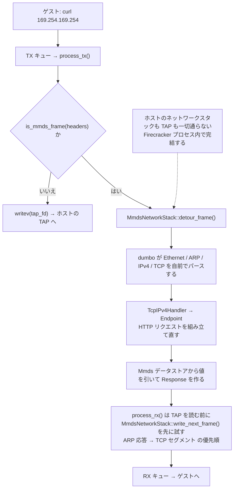

## 何を学んだか

### ゲストの中だけで完結する 169.254.169.254

EC2 の IMDS（インスタンスメタデータサービス）は、インスタンスの中から `http://169.254.169.254/latest/meta-data/...` を叩くとそのインスタンスの情報が返る、というリンクローカルアドレス上の HTTP サービスだ。Firecracker はこれと互換の機能を MMDS（microVM Metadata Service）として提供している。

驚くのは実装方法である。Firecracker はこの HTTP サービスを、**ホストのネットワークスタックを一切通さずに**提供する。TAP デバイスにも流さない。ゲストが送ったフレームを virtio-net デバイスモデルの中で横取りし、Firecracker プロセス内の自前 TCP/IP スタックで処理し、応答フレームを RX キューに直接載せて返す。



この横取りを行うコンポーネントが `MmdsNetworkStack`（`src/vmm/src/mmds/ns.rs`）で、その下で Ethernet / ARP / IPv4 / TCP / HTTP を実際に処理するのが **dumbo**（`src/vmm/src/dumbo/`）である。

### dumbo の規模

dumbo は 11 ファイル・約 6,500 行ある。内訳は次のとおり（テストコードを含む行数）。

| ファイル                             | 行数  | 中身                                                |
| ------------------------------------ | ----- | --------------------------------------------------- |
| `tcp/connection.rs`                  | 1,771 | TCP コネクション（実装は L1001 まで、以降はテスト） |
| `pdu/tcp.rs`                         | 902   | TCP セグメントの読み書き                            |
| `tcp/handler.rs`                     | 866   | 4-tuple の多重分離、コネクション管理                |
| `pdu/ipv4.rs`                        | 693   | IPv4 パケット                                       |
| `tcp/endpoint.rs`                    | 652   | HTTP リクエスト境界の検出と応答生成                 |
| `pdu/ethernet.rs`                    | 545   | Ethernet フレーム                                   |
| `pdu/arp.rs`                         | 495   | ARP                                                 |
| `pdu/bytes.rs`                       | 246   | バイト列アクセスの共通トレイト                      |
| `tcp/mod.rs`, `pdu/mod.rs`, `mod.rs` | 344   | 定数・シーケンス番号比較など                        |

これに MMDS 固有のコード（`src/vmm/src/mmds/`、約 2,800 行）が乗る。[最小主義を憲章に掲げる](../minimalism-charter/)プロジェクトが、TCP スタックを丸ごと書いたわけだ。当然、その判断には根拠がある。

### 何を作らないかを先に決めた

`docs/mmds/mmds-design.md` は、既存のライブラリや実装を使わず自前で書いた理由を明示している（特定のクレート名は挙げられていない）。要点は「MMDS という文脈が、広範囲の単純化を許すから」だ。

- **HTTP**: 扱う必要があるのは `GET` と `PUT` だけ。ヘッダの大半も chunked のような高度な機能も要らない。応答をどの HTTP のサブセットで組むかもこちらが決められる。
- **TCP**: 本質的にポイントツーポイントのリンク上の通信で、パケットはめったに失われず、並び替えも起きない。したがって輻輳制御は不要（フロー制御だけ使う）。受信ロジックも TCP オプションもほとんど要らない。
- **Ethernet / IPv4**: フレームとパケットの妥当性検査以上のことはほとんどない。

そのうえで、**意図的に非対応にしたもの**がある。802.1Q タグ付き Ethernet フレームと IP フラグメントだ。タグ付きフレームは横取り判定のヒューリスティックがタグを考慮しないので、まずデバイスモデル側（= TAP 行き）に流れる。フラグメントは再構成されず、独立したパケットとして扱われる。実装しなければ、そこに脆弱性は生まれない。

### 「フィルタは責務ではない」という非目標

同じドキュメントの Security Considerations 節は、これも明示している。

> Operators should not rely on the MMDS network stack to filter packets with the MMDS IP as the destination from the guest's outbound traffic.

MMDS ネットワークスタックは、ゲストの outbound トラフィックから MMDS 宛パケットを取り除くフィルタではない。ゲストのトラフィックは untrusted として扱われ、ホスト側のファイアウォールで制限すべきものだ、と[脅威モデル](../threat-model/)を参照させる。この非目標が、[virtio-net の TX パス](../net-rx-buffers/)に既知の TOCTOU レースを残したままにしている判断とつながっている。

## ソースコードのどこか

横取りの入口は 2 つある。TX 側は `is_mmds_frame` で宛先を見て分岐する（[`src/vmm/src/mmds/ns.rs#L120-L134`](https://github.com/firecracker-microvm/firecracker/blob/cc535f035f3828b2c5bfc85276c5d394022ed220/src/vmm/src/mmds/ns.rs#L120-L134)）。

```rust title="src/vmm/src/mmds/ns.rs"
pub fn is_mmds_frame(&self, src: &[u8]) -> bool {
    if let Ok(eth) = EthernetFrame::from_bytes(src) {
        match eth.ethertype() {
            ETHERTYPE_ARP => test_speculative_tpa(src, self.ipv4_addr),
            ETHERTYPE_IPV4 => test_speculative_dst_addr(src, self.ipv4_addr),
            _ => false,
        }
    } else {
        false
    }
}
```

`test_speculative_dst_addr` は「偽陰性を出さない」ことを契約にしたヒューリスティックである（[`dumbo/pdu/ipv4.rs#L457-L469`](https://github.com/firecracker-microvm/firecracker/blob/cc535f035f3828b2c5bfc85276c5d394022ed220/src/vmm/src/dumbo/pdu/ipv4.rs#L457-L469)）。長さだけ確認してから未検証のまま宛先アドレスを覗く。偽陽性は許容され、その場合は後段の厳密なパースで弾かれてデバイスモデルに戻される。この設計は `mmds-design.md` の「There can be no false negatives」という記述と対応している。

デフォルト値は [`ns.rs#L31-L35`](https://github.com/firecracker-microvm/firecracker/blob/cc535f035f3828b2c5bfc85276c5d394022ed220/src/vmm/src/mmds/ns.rs#L31-L35) にまとまっている。MAC は `06:01:23:45:67:01`、IP は `169.254.169.254`、ポート 80、同時接続数の上限 30、保留 RST の上限 100。

実際の処理は `detour_frame` → `detour_ipv4` と進む（[`ns.rs#L168-L209`](https://github.com/firecracker-microvm/firecracker/blob/cc535f035f3828b2c5bfc85276c5d394022ed220/src/vmm/src/mmds/ns.rs#L168-L209)）。TCP セグメントなら `TcpIPv4Handler::receive_packet` に、HTTP リクエストを MMDS の応答に変換するクロージャを添えて渡す。

```rust title="src/vmm/src/mmds/ns.rs"
let mmds_instance = self.mmds.clone();
match &mut self.tcp_handler.receive_packet(&ip, move |request| {
    super::convert_to_response(mmds_instance, request)
}) {
```

TCP 以外の IPv4 パケットは `rx_accepted_unusual` メトリクスを増やして捨てる（デバイスモデルには戻さない）。

RX 側の入口は `write_next_frame`（[`ns.rs#L215-L250`](https://github.com/firecracker-microvm/firecracker/blob/cc535f035f3828b2c5bfc85276c5d394022ed220/src/vmm/src/mmds/ns.rs#L215-L250)）。ARP 応答が保留されていればそれを最優先で書き、なければ TCP ハンドラに送るべきセグメントがあるかを聞く。呼び出し側の virtio-net は、TAP から読む前に必ずこれを先に試す（[`net/device.rs#L624-L665`](https://github.com/firecracker-microvm/firecracker/blob/cc535f035f3828b2c5bfc85276c5d394022ed220/src/vmm/src/devices/virtio/net/device.rs#L624-L665)、関数名は `read_from_mmds_or_tap`、コメントは "We currently prioritize packets from the MMDS over regular network packets."）。

TCP コネクションの単純化は、`Connection` のドキュメントコメントが自分で宣言している（[`dumbo/tcp/connection.rs#L154-L161`](https://github.com/firecracker-microvm/firecracker/blob/cc535f035f3828b2c5bfc85276c5d394022ed220/src/vmm/src/dumbo/tcp/connection.rs#L154-L161)）。

```rust title="src/vmm/src/dumbo/tcp/connection.rs"
/// The current implementation does not do any kind of congestion control, expects segments to
/// arrive in order, triggers a retransmission after the first duplicate `ACK`, and relies on the
/// user to supply an opaque `u64` timestamp value when invoking send or receive functionality.
/// ...
/// See [mmds-design](...) for why we are able to make these simplifications. Specifically, we want
/// to stress that no traffic handled by dumbo ever leaves a microVM.
```

同じコメント群に「`TIME_WAIT` 相当の状態は存在しない」とも書かれている。状態遷移も列挙型の状態機械ではなく `ConnStatusFlags` というビットフラグで表現されている（[`connection.rs#L24-L41`](https://github.com/firecracker-microvm/firecracker/blob/cc535f035f3828b2c5bfc85276c5d394022ed220/src/vmm/src/dumbo/tcp/connection.rs#L24-L41)）。

メモリ上限も固定だ。1 コネクションあたりの受信バッファは 2500 バイトで、そこに収まらないリクエストが来たらコネクションをリセットする（[`dumbo/tcp/endpoint.rs#L35-L42`](https://github.com/firecracker-microvm/firecracker/blob/cc535f035f3828b2c5bfc85276c5d394022ed220/src/vmm/src/dumbo/tcp/endpoint.rs#L35-L42)）。送出する IPv4 パケットの TTL は既定で 1（[`dumbo/pdu/ipv4.rs#L34`](https://github.com/firecracker-microvm/firecracker/blob/cc535f035f3828b2c5bfc85276c5d394022ed220/src/vmm/src/dumbo/pdu/ipv4.rs#L34)）。ゲストの外に出ることを想定していないので、ルータを 1 つでも越えたら破棄される値になっている。

`endpoint.rs` の冒頭コメントは、この設計の分割方針を説明している（[`endpoint.rs#L4-L12`](https://github.com/firecracker-microvm/firecracker/blob/cc535f035f3828b2c5bfc85276c5d394022ed220/src/vmm/src/dumbo/tcp/endpoint.rs#L4-L12)）。`Connection` と `TcpHandler` は汎用部品として将来ライブラリに切り出せるよう、ログもメトリクスも持たず戻り値だけで状態を表す。Firecracker 固有の HTTP 対話は `Endpoint` に閉じ込める、という線引きだ。

### IMDSv2 互換のトークン

MMDS には V1 と V2 があり、V2 では GET の前にトークンを取得する必要がある（[`src/vmm/src/mmds/mod.rs#L165-L197`](https://github.com/firecracker-microvm/firecracker/blob/cc535f035f3828b2c5bfc85276c5d394022ed220/src/vmm/src/mmds/mod.rs#L165-L197)）。トークンがなければ 401、無効でも 401 を返す。V1 ではトークンの有無をメトリクスに記録するだけで通す。

トークンの実体は暗号化された有効期限だ（`src/vmm/src/mmds/token.rs`）。`PUT /latest/api/token` に TTL を指定すると、AES-256-GCM で暗号化した期限値を base64 エンコードした文字列が返る。定数を見るとこの設計がよく分かる（[`token.rs#L13-L37`](https://github.com/firecracker-microvm/firecracker/blob/cc535f035f3828b2c5bfc85276c5d394022ed220/src/vmm/src/mmds/token.rs#L13-L37)）。

- TTL の範囲は 1 秒〜21600 秒（6 時間）
- 追加認証データ (AAD) は `microvmid=<instance_id>`
- 同一鍵で暗号化するトークン数が 2^32 に達したら暗号器を作り直す
- トークン文字列の長さ上限は 70 バイト。「巨大な文字列の復号にわざわざ手間をかけないため」とコメントにある

サーバ側にセッションの表を持たない。トークンそのものが期限を運ぶので、検証は復号して現在時刻と比べるだけで済む。

### dumbo と Kani

Firecracker はモデル検査器 Kani を使った形式検証を一部のモジュールに入れている（[Kani による検証](../kani-verification/)）。`#[kani::proof]` が付いたハーネスの数を数えると、`devices/virtio/queue.rs` の 15 に次いで多いのが `dumbo/pdu/ethernet.rs` の 10 で、dumbo は検証対象の中核の 1 つになっている。ハーネスの冒頭コメントが根拠を書いている（[`dumbo/pdu/ethernet.rs#L237-L256`](https://github.com/firecracker-microvm/firecracker/blob/cc535f035f3828b2c5bfc85276c5d394022ed220/src/vmm/src/dumbo/pdu/ethernet.rs#L237-L256)）。

```rust title="src/vmm/src/dumbo/pdu/ethernet.rs"
// See the Virtual I/O Device (VIRTIO) specification, Sec. 5.1.6.2.
pub const MAX_FRAME_SIZE: usize = 1514;
...
// We consider the MMDS Network Stack spec for all postconditions in the harnesses.
// See https://github.com/.../docs/mmds/mmds-design.md#mmds-network-stack
```

事後条件の根拠を設計ドキュメントに置き、非決定的なバイト列（`kani::Arbitrary::any_array`）に対してパーサが破綻しないことを証明する形になっている。

## なぜそうなっているか

### 汎用スタックを持ち込むと攻撃面が増える

MMDS のパーサが処理するバイト列は、すべてゲストが自由に作れる。つまりここは信頼境界そのものだ。汎用の TCP/IP 実装を持ち込めば、802.1Q、IP フラグメント再構成、TCP オプション、輻輳制御の状態機械、といった MMDS には要らない機能がまるごと攻撃面になる。dumbo が「これらは非対応」と決められるのは、通信相手がゲスト 1 台だけで、経路が Firecracker プロセス内で完結すると分かっているからだ。

`Connection` のコメントの最後の一文がこの前提を凝縮している。「no traffic handled by dumbo ever leaves a microVM（dumbo が扱うトラフィックは microVM の外に出ない）」。輻輳制御を省けるのも、TTL を 1 にできるのも、`TIME_WAIT` を持たなくてよいのも、すべてこの一文から導かれる。

### 依存を増やさないという方針とも整合する

[rust-vmm への依存の切り方](../rust-vmm-dependency/)で見たとおり、Firecracker は外部クレートの採用に慎重だ。ゲストが直接叩けるパーサに外部依存を入れれば、その CVE がそのまま自分の脆弱性になる。約 6,500 行を自前で持つコストと、汎用スタックの脆弱性を追い続けるコストを比較したうえでの判断だと読める。実際 dumbo が扱うプロトコルの範囲は、20 年変わっていない Ethernet / ARP / IPv4 / TCP のごく一部でしかない。

### なぜ TAP に出さないのか

素朴には、ホスト側に IMDS プロキシを立てて TAP 経由で見せる構成も考えられる。それをしないのは、MMDS の内容が microVM ごとに異なるからだ。ホスト側にサービスを立てると、どの microVM からの要求かをソース IP か何かで識別し、テナントごとに分離する仕組みが要る。VMM プロセスの中で完結させれば、その分離は「プロセスが別である」ことによって自動的に保証される。`MmdsNetworkStack` はネットワークデバイスごとに 1 つインスタンス化され、既定では無効で、API で明示的に有効化したインターフェースにだけ付く。

その代わり、ホスト自身の IMDS（EC2 上でホストを動かしている場合）へゲストが到達しないようにするのは、あくまでホスト側ファイアウォールの仕事になる。`docs/prod-host-setup.md` に具体的なルール例が置かれている。この責務分担が明示されているからこそ、[TX パスの TOCTOU](../net-rx-buffers/) を直さないという判断が成立する。

## どう活かすか

**「汎用実装を使わない」判断は、要件を削れたときだけ正当化できる。** dumbo の教訓は「TCP を自分で書け」ではない。Firecracker が自前実装を選べたのは、その前に GET/PUT だけ・ポイントツーポイント・輻輳なし・順序保証あり、と要件を削り切ったからだ。削った結果として実装が 6,500 行に収まり、Kani で検証できる規模になり、非対応にした機能の分だけ攻撃面が消えた。順序が逆（先に自前実装を決めてから要件を考える）だと、汎用実装の劣化コピーができるだけである。

**信頼境界に置くパーサでは、非対応を明文化する。** 802.1Q と IP フラグメントを「対応しない」と設計ドキュメントに書いておくことには 2 つの効果がある。将来の実装者が善意で追加してしまうのを防ぐことと、監査する側が検証範囲を確定できることだ。dumbo の Kani ハーネスが「事後条件は MMDS Network Stack の仕様に照らす」と書けるのは、その仕様が文書として存在するからである。

**ヒューリスティックには方向を持たせる。** `test_speculative_dst_addr` は「偽陰性なし・偽陽性あり」と契約を定めている。高速な事前判定と厳密な後段検証を組み合わせるとき、どちら向きに間違えてよいかを決めておくと、後段の責務が明確になる。ここでは偽陽性は「デバイスモデルに戻す」だけで済み、偽陰性は「MMDS 宛のパケットが TAP に漏れる」という実害になる。だから偽陰性側をゼロに固定した。

**この設計が向かない場面。** 通信相手が複数いる、経路にルータやロスのあるリンクが挟まる、扱うプロトコルが増える見込みがある——このいずれかに当てはまるなら、自前スタックは早晩「輻輳制御がなくて詰まる」「再送が効かない」といった形で破綻する。dumbo の前提はあくまで「1 対 1・ロスなし・プロセス内完結」であり、そこから外れた瞬間に単純化の根拠は全部失われる。自前実装を検討するときは、まずこの 3 条件が自分の環境でも成り立つかを確認するのが早い。
