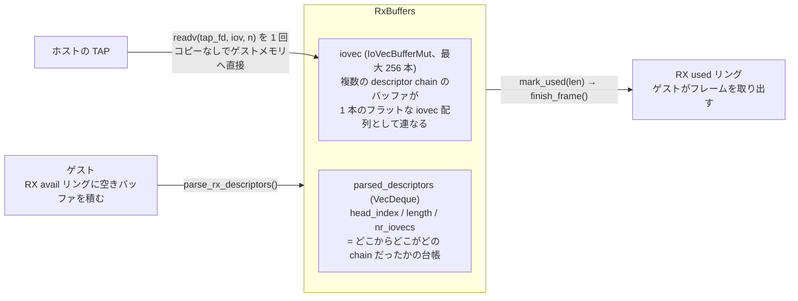
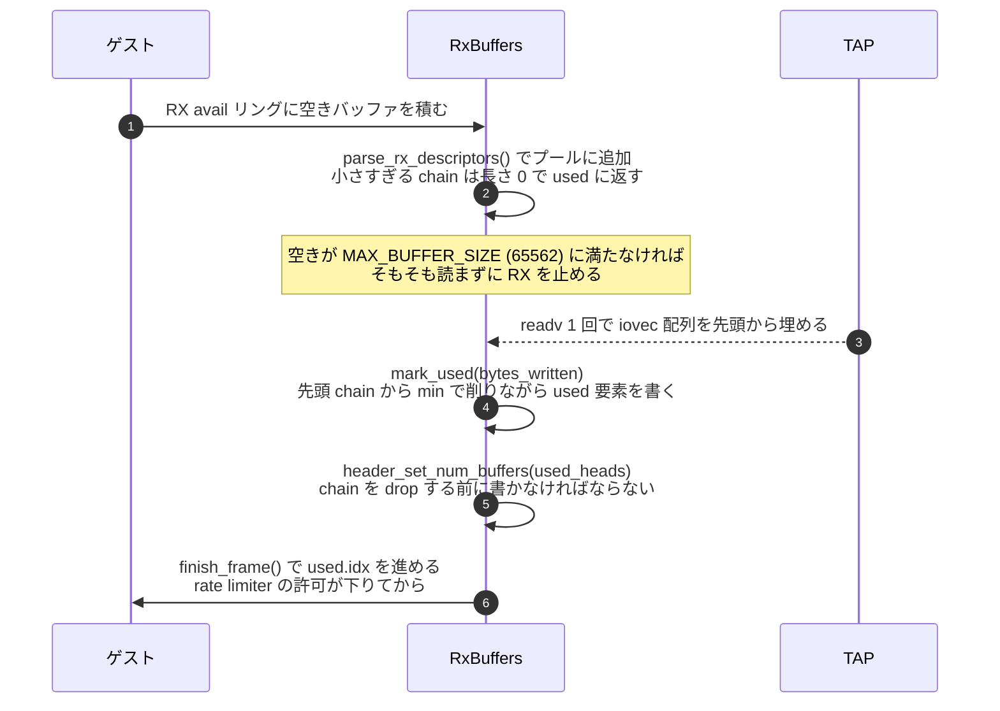

## 何を学んだか

### 「1 リクエスト 1 descriptor chain」ではない

[block デバイス](../block-io-engine/)の RX 相当の処理は単純だった。avail リングから descriptor chain を 1 本取り、それを 1 つの I/O リクエストとして処理し、used リングに返す。1 対 1 である。

virtio-net の RX はこの形にならない。理由は、フレームがいつ来るかを Firecracker が決められないからだ。ゲストは「空いているバッファ」を先に RX キューへ積む。Firecracker はそれを預かっておき、TAP からフレームが読めたときに初めて、どのバッファに何バイト入ったかが決まる。

そこで Firecracker は `RxBuffers` という構造体に、ゲストから預かった空きメモリを**プールとして**まとめて保持する。



`iovec` は `libc::iovec` の並びで、複数の descriptor chain のバッファが 1 本のフラットな配列として連なっている。`parsed_descriptors` は「この iovec 配列のどこからどこまでがどの chain だったか」を覚えている台帳で、中身は 3 つのフィールドしかない。

```rust
pub struct ParsedDescriptorChain {
    pub head_index: u16,   // used リングに返すときの ID
    pub length: u32,       // この chain 全体のバイト数
    pub nr_iovecs: u16,    // この chain が占める iovec の本数
}
```

この 2 つを分けたおかげで、`readv(2)` に渡す引数（`&mut [iovec]`）をコピーなしでそのまま取り出せる。裏側のリングバッファ実装は [`IovDeque`](../iov-deque/) で、前からも後ろからも O(1) で出し入れできる。



### 1 フレームが複数の chain にまたがる場合

virtio-net には `VIRTIO_NET_F_MRG_RXBUF`（merged RX buffers）という機能ビットがある。これがネゴシエートされると、デバイスは 1 つのフレームを複数の descriptor chain に分割して書き込んでよく、何本使ったかを vnet ヘッダの `num_buffers` フィールドでドライバに伝える。

Firecracker は `readv` に渡す iovec の範囲をこのビットで切り替えるだけで対応している。

|                                | 渡す iovec                                    | ゲストに要求する最小バッファ長 |
| ------------------------------ | --------------------------------------------- | ------------------------------ |
| MRG_RXBUF あり                 | `all_chains_slice_mut()`（プール全体）        | vnet ヘッダ長のみ（12 バイト） |
| MRG_RXBUF なし・オフロードあり | `single_chain_slice_mut()`（先頭 chain のみ） | `MAX_BUFFER_SIZE` = 65562      |
| MRG_RXBUF なし・オフロードなし | 同上                                          | 1526                           |

`readv` は先頭の iovec から順に埋めていくので、MRG ありのときは自然に「chain をまたいだ書き込み」になる。書き込んだ後、`mark_used` が `parsed_descriptors` を先頭から舐めながらバイト数を割り振り、使った chain の本数を `num_buffers` に書き戻す。

### TAP は vnet ヘッダ付きで開く

ホスト側のバックエンドは TAP デバイスで、`IFF_TAP | IFF_NO_PI | IFF_VNET_HDR` の 3 フラグで開かれる。

- `IFF_TAP`: L3 ではなく L2（Ethernet フレーム）を扱う
- `IFF_NO_PI`: Linux 独自の 4 バイト packet information ヘッダを付けない
- `IFF_VNET_HDR`: 代わりに virtio-net の vnet ヘッダを先頭に付ける

つまり TAP の fd から読めるバイト列は、そのまま virtio-net がゲストに渡すべき「vnet ヘッダ + Ethernet フレーム」になっている。Firecracker 側でヘッダを付け替える処理は存在せず、`readv` / `writev` でゲストメモリと TAP を直結できる。TSO / UFO などのオフロードも `TUNSETOFFLOAD` で TAP に伝えるだけで、ゲストが受け付けた機能ビットからそのまま導出している。

### TX 側には既知の TOCTOU レースがある

送信方向では、TAP に書く前に「このフレームは MMDS 宛か」を判定して横取りする分岐がある。判定はゲストメモリ上のヘッダを読んで行うが、その後 TAP へ渡すときにも同じゲストメモリを参照する。この 2 回の間にゲストが宛先 IP を書き換えられる、という TOCTOU レースがコード中のコメントで明示されている。しかも「直す予定はない」と書いてある。理由は後述する。

## ソースコードのどこか

`RxBuffers` の定義は [`src/vmm/src/devices/virtio/net/device.rs#L110-L123`](https://github.com/firecracker-microvm/firecracker/blob/cc535f035f3828b2c5bfc85276c5d394022ed220/src/vmm/src/devices/virtio/net/device.rs#L110-L123) にある。

```rust title="src/vmm/src/devices/virtio/net/device.rs"
/// A map of all the memory the guest has provided us with for performing RX
#[derive(Debug)]
pub struct RxBuffers {
    // minimum size of a usable buffer for doing RX
    pub min_buffer_size: u32,
    // An [`IoVecBufferMut`] covering all the memory we have available for receiving network
    // frames.
    pub iovec: IoVecBufferMut<NET_QUEUE_MAX_SIZE>,
    // A map of which part of the memory belongs to which `DescriptorChain` object
    pub parsed_descriptors: VecDeque<ParsedDescriptorChain>,
    // Buffers that we have used and they are ready to be given back to the guest.
    pub used_descriptors: u16,
    pub used_bytes: u32,
}
```

`NET_QUEUE_MAX_SIZE` は 256、`MAX_BUFFER_SIZE` は 65562（[`net/mod.rs#L8-L11`](https://github.com/firecracker-microvm/firecracker/blob/cc535f035f3828b2c5bfc85276c5d394022ed220/src/vmm/src/devices/virtio/net/mod.rs#L8-L11)）。`ParsedDescriptorChain` は [`iovec.rs#L222-L226`](https://github.com/firecracker-microvm/firecracker/blob/cc535f035f3828b2c5bfc85276c5d394022ed220/src/vmm/src/devices/virtio/iovec.rs#L222-L226) の 3 フィールド構造体だ。

avail リングからプールへ移す処理は [`device.rs#L493-L525`](https://github.com/firecracker-microvm/firecracker/blob/cc535f035f3828b2c5bfc85276c5d394022ed220/src/vmm/src/devices/virtio/net/device.rs#L493-L525) の `parse_rx_descriptors`。ここで小さすぎる chain（`min_buffer_size` 未満）は `add_buffer` に弾かれ、長さ 0 で used リングに返される。ただし `IovDeque` が溢れた場合だけは `undo_pop()` してループを抜ける。コメントが理由を書いている。

```rust title="src/vmm/src/devices/virtio/net/device.rs"
// If guest uses dirty tricks to make us add more descriptors than
// we can hold, just stop processing.
if matches!(err, AddRxBufferError::Parsing(IoVecError::IovDequeOverflow)) {
    error!("net: Could not add an RX descriptor: {err}");
    queue.undo_pop();
    break;
}
```

TAP からの読み出しは [`device.rs#L869-L881`](https://github.com/firecracker-microvm/firecracker/blob/cc535f035f3828b2c5bfc85276c5d394022ed220/src/vmm/src/devices/virtio/net/device.rs#L869-L881) の `read_tap` で、MRG_RXBUF の有無で渡す iovec 範囲だけを切り替える。

```rust title="src/vmm/src/devices/virtio/net/device.rs"
pub unsafe fn read_tap(&mut self) -> std::io::Result<usize> {
    let slice = if self.has_feature(VIRTIO_NET_F_MRG_RXBUF as u64) {
        self.rx_buffer.all_chains_slice_mut()
    } else {
        self.rx_buffer.single_chain_slice_mut()
    };
    self.tap.read_iovec(slice)
}
```

その先は `libc::readv` を 1 回呼ぶだけだ（[`tap.rs#L197-L209`](https://github.com/firecracker-microvm/firecracker/blob/cc535f035f3828b2c5bfc85276c5d394022ed220/src/vmm/src/devices/virtio/net/tap.rs#L197-L209)）。送信側の `write_iovec` も同様に `libc::writev` 1 回である（[`tap.rs#L183-L195`](https://github.com/firecracker-microvm/firecracker/blob/cc535f035f3828b2c5bfc85276c5d394022ed220/src/vmm/src/devices/virtio/net/tap.rs#L183-L195)）。

読めたバイト数を chain に割り振るのが [`device.rs#L179-L209`](https://github.com/firecracker-microvm/firecracker/blob/cc535f035f3828b2c5bfc85276c5d394022ed220/src/vmm/src/devices/virtio/net/device.rs#L179-L209) の `mark_used`。`bytes_written` を先頭 chain から `min` で削りながら used 要素を書き、使い切ったところで止める。ここで注意深いのは処理の順序で、コメントがはっきり書いている。

```rust title="src/vmm/src/devices/virtio/net/device.rs"
// We need to set num_buffers before dropping chains from `self.iovec`. Otherwise
// when we set headers, we will iterate over new, yet unused chains instead of the ones
// we need.
self.header_set_num_buffers(used_heads);
for _ in 0..used_heads {
    let parsed_dc = self.parsed_descriptors.pop_front().expect(...);
    self.iovec.drop_chain_front(&parsed_dc);
}
```

`header_set_num_buffers` は `virtio_net_hdr_v1` の `num_buffers` フィールドのオフセットを `offset_of!` で求め、iovec プールの先頭（= 今書いたフレームの vnet ヘッダ）に書き戻す（[`device.rs#L211-L223`](https://github.com/firecracker-microvm/firecracker/blob/cc535f035f3828b2c5bfc85276c5d394022ed220/src/vmm/src/devices/virtio/net/device.rs#L211-L223)）。ゲストへの通知（used リングの `idx` 前進）は `finish_frame` まで遅延され、そこは rate limiter の許可が下りてから呼ばれる（[`device.rs#L464-L473`](https://github.com/firecracker-microvm/firecracker/blob/cc535f035f3828b2c5bfc85276c5d394022ed220/src/vmm/src/devices/virtio/net/device.rs#L464-L473)）。

TAP は [`tap.rs#L120-L151`](https://github.com/firecracker-microvm/firecracker/blob/cc535f035f3828b2c5bfc85276c5d394022ed220/src/vmm/src/devices/virtio/net/tap.rs#L120-L151) で開かれる。

```rust title="src/vmm/src/devices/virtio/net/tap.rs"
.flags(
    i16::try_from(generated::IFF_TAP | generated::IFF_NO_PI | generated::IFF_VNET_HDR)
        .unwrap(),
)
.execute(&tuntap, TUNSETIFF())
```

vnet ヘッダのサイズはデバイス生成時に `TUNSETVNETHDRSZ` で `size_of::<virtio_net_hdr_v1>()` に設定され（[`device.rs#L362-L364`](https://github.com/firecracker-microvm/firecracker/blob/cc535f035f3828b2c5bfc85276c5d394022ed220/src/vmm/src/devices/virtio/net/device.rs#L362-L364)）、オフロード機能はゲストとの機能ネゴシエーション完了後、activate 時に `TUNSETOFFLOAD` で反映される（[`device.rs#L1064-L1069`](https://github.com/firecracker-microvm/firecracker/blob/cc535f035f3828b2c5bfc85276c5d394022ed220/src/vmm/src/devices/virtio/net/device.rs#L1064-L1069)）。同じ場所で `min_buffer_size` も確定する。ネゴシエーション結果が確定するまで TAP 側の設定を触らない、という順序が守られている。

TX の MMDS 横取りは [`device.rs#L530-L622`](https://github.com/firecracker-microvm/firecracker/blob/cc535f035f3828b2c5bfc85276c5d394022ed220/src/vmm/src/devices/virtio/net/device.rs#L530-L622) の `write_to_mmds_or_tap`。関数の冒頭に、コードより長いコメントで TOCTOU レースが説明されている（[`device.rs#L539-L561`](https://github.com/firecracker-microvm/firecracker/blob/cc535f035f3828b2c5bfc85276c5d394022ed220/src/vmm/src/devices/virtio/net/device.rs#L539-L561)）。

```rust title="src/vmm/src/devices/virtio/net/device.rs"
// There is a potential for a TOCTOU race condition here where,
// when MMDS is enabled, the guest can rewrite packet headers between
// the time that we check that a packet should be detoured to MMDS,
// and the time that we forward it to the TAP.
```

RX / TX それぞれに独立した rate limiter があり（`rx_rate_limiter` / `tx_rate_limiter`、[`device.rs#L263-L264`](https://github.com/firecracker-microvm/firecracker/blob/cc535f035f3828b2c5bfc85276c5d394022ed220/src/vmm/src/devices/virtio/net/device.rs#L263-L264)）、epoll に登録されるイベントも RX / TX で別々の 6 種類に分かれている（[`event_handler.rs#L13-L18`](https://github.com/firecracker-microvm/firecracker/blob/cc535f035f3828b2c5bfc85276c5d394022ed220/src/vmm/src/devices/virtio/net/event_handler.rs#L13-L18)）。TAP の fd だけは `EventSet::IN | EventSet::EDGE_TRIGGERED` で登録される（[`event_handler.rs#L49-L55`](https://github.com/firecracker-microvm/firecracker/blob/cc535f035f3828b2c5bfc85276c5d394022ed220/src/vmm/src/devices/virtio/net/event_handler.rs#L49-L55)）。

## なぜそうなっているか

### バッファをプールにする理由

`readv` を 1 回呼ぶだけでフレームをゲストメモリに直接書き込むには、その時点で「書き込み可能な iovec の配列」が手元にできあがっている必要がある。chain を 1 本ずつ都度パースしていては、`readv` のたびに iovec を組み直すことになる。`RxBuffers` は avail リングから取れるだけ取ってプールに積んでおき、`readv` にはその配列のポインタを渡すだけにした。

実際 `read_from_mmds_or_tap` は、プールの空き容量が `MAX_BUFFER_SIZE` に満たないときだけ `parse_rx_descriptors` を呼び直し、それでも足りなければ RX の処理自体を止める（[`device.rs#L625-L639`](https://github.com/firecracker-microvm/firecracker/blob/cc535f035f3828b2c5bfc85276c5d394022ed220/src/vmm/src/devices/virtio/net/device.rs#L625-L639)）。コメントは「1 パケットの最大サイズが 64K なので、それ以上の空きがあるときだけ読む」と説明している。読んでから入りきらないことが分かる事態を、事前チェックで排除している。

### TOCTOU を直さない理由

コメントは 3 つの根拠を挙げている。

1. **MMDS を無効にしていれば、宛先 IP が `169.254.169.254` のパケットはフィルタされずそのまま TAP に流れる。** つまり MMDS の有無にかかわらず、この経路は元からアクセス制御の手段ではない。オペレータは IMDS へのアクセス制御を MMDS に依存すべきではない。
2. **ゲスト発のトラフィックは untrusted として扱われ、Firecracker は IPv4 パケットのフィルタリングを行わない。** Firecracker 上にサービスを構築するオペレータは、ホスト側のファイアウォールでゲストの egress を制限すべきである。
3. **ルーティング判断の前にパケットをホスト側バッファへコピーすれば TOCTOU は防げるが、ゲスト → ホストの TCP スループットが大幅に落ちる。** ホストレベルで緩和策が使える以上、そのコストは正当化できない。

要するに、このレースは Firecracker の[脅威モデル](../threat-model/)の外にある。「ゲストの outbound トラフィックをフィルタリングすることは Firecracker の責務ではない」という線引きが先にあり、その線の外側にあるものは（性能を犠牲にしてまで）実装しない、という判断だ。`docs/mmds/mmds-design.md` の Security Considerations 節も同じことを述べ、`docs/prod-host-setup.md` のホスト側ルール例を参照させている。MMDS 自体の設計は[別のページ](../mmds-dumbo/)で扱う。

なお、MAC アドレスのなりすましについても同じ姿勢が見える。TX 時にゲストの MAC が設定値と異なれば `tx_spoofed_mac_count` メトリクスを増やすが、フレームは通す（[`device.rs#L599-L606`](https://github.com/firecracker-microvm/firecracker/blob/cc535f035f3828b2c5bfc85276c5d394022ed220/src/vmm/src/devices/virtio/net/device.rs#L599-L606)）。遮断ではなく可観測性の提供に留めている。

### MMDS フレームだけ rate limiter を払い戻す

`write_to_mmds_or_tap` が MMDS でフレームを消費したとき、いったん消費した rate limiter のトークンを `rate_limiter_replenish_op` で戻している。コメントは "MMDS frames are not accounted by the rate limiter." と書く。MMDS への通信は物理 NIC を通らずプロセス内で完結するので、ネットワーク帯域の制限対象にする理由がない。ただし判定はフレームを読んでからでないとできないので、「先に消費して、MMDS だったら戻す」という順序になっている。

### TAP だけエッジトリガにする理由（推測）

TAP の epoll 登録だけが `EDGE_TRIGGERED` になっている点について、コード中に明示の説明は見当たらない。推測だが、TAP に受信データが残っている限りレベルトリガでは毎回イベントが上がり続けるため、rate limiter で RX を止めている間に epoll が空回りするのを避ける狙いだと思われる。実際 `process_tap_rx_event` は rate limiter がブロック中なら即 return する（[`device.rs#L912-L920`](https://github.com/firecracker-microvm/firecracker/blob/cc535f035f3828b2c5bfc85276c5d394022ed220/src/vmm/src/devices/virtio/net/device.rs#L912-L920)）。

## どう活かすか

**「入力の単位」と「バッファの単位」が一致しないなら、間に台帳を置く。** `RxBuffers` の本質は、フラットな iovec 配列（カーネルに渡す形）と、chain 単位の返却情報（プロトコルに返す形）を別々のデータ構造に分け、`nr_iovecs` で対応づけたことにある。片方だけで済ませようとすると、`readv` のたびに配列を組み直すか、used リングに返すときに chain 境界を再計算するかのどちらかになる。この分離は、scatter-gather I/O を扱うコード全般に効く。

前提条件もはっきりしている。バッファの提供者（ゲスト）と消費者（TAP）が非同期で、かつゼロコピーが要件であることだ。コピーを許容できるなら、単一の連続バッファに読んでから分配するほうがずっと簡単で、TOCTOU も同時に消える。Firecracker はスループット要件のためにその簡単な道を選ばなかった。

**セキュリティ上の穴を「直さない」と決めたら、理由をコードに書く。** `write_to_mmds_or_tap` のコメントは、レースの存在・攻撃シナリオ・直さない 3 つの理由・代替の緩和策を全部書いている。これがないと、後から読んだ人が「バグだ」と判断して修正を試み、スループットを落とすか、あるいは黙って放置されて誰も存在を知らなくなる。既知の欠陥を意図的に残す判断は、その判断の根拠と一緒でなければ引き継げない。

ただしこれが成立するのは、脅威モデルが文書として存在し、その外側だと言い切れる場合だけである。「ホスト側のファイアウォールで対処せよ」という緩和策が現実に実行可能で、しかもドキュメントに手順が書いてあるから、この判断は責任放棄にならずに済んでいる。自分のプロダクトで同じことをするなら、緩和策の提示までがセットだと考えたほうがよい。
